# 模組依賴關係分析 (Module Dependency Analysis) - OpenCode Platform

---

**文件版本 (Document Version):** `v1.1`

**最後更新 (Last Updated):** `2026-02-05`

**主要作者 (Lead Author):** `OpenCode 架構團隊`

**審核者 (Reviewers):** `核心開發團隊, 技術領導`

**狀態 (Status):** `已批准 (Approved)`

---

## 目錄 (Table of Contents)

1.  [概述 (Overview)](#1-概述-overview)
2.  [核心依賴原則 (Core Dependency Principles)](#2-核心依賴原則-core-dependency-principles)
3.  [高層級模組依賴 (High-Level Module Dependencies)](#3-高層級模組依賴-high-level-module-dependencies)
4.  [模組/層級職責定義 (Module/Layer Responsibility Definition)](#4-模組層級職責定義-modulelayer-responsibility-definition)
5.  [關鍵依賴路徑分析 (Key Dependency Path Analysis)](#5-關鍵依賴路徑分析-key-dependency-path-analysis)
6.  [依賴風險與管理 (Dependency Risks and Management)](#6-依賴風險與管理-dependency-risks-and-management)
7.  [外部依賴管理 (External Dependency Management)](#7-外部依賴管理-external-dependency-management)

---

## 1. 概述 (Overview)

### 1.1 文檔目的 (Document Purpose)
*   本文檔旨在分析和定義 **OpenCode Platform** 的內部模組與外部套件之間的依賴關係。
*   其目的不僅是記錄現狀，更是為了指導開發，確保專案遵循健康的依賴結構，以提升代碼的可維護性、可測試性和可擴展性。
*   本文檔是程式碼審查 (Code Review) 和架構決策的重要參考依據。

### 1.2 分析範圍 (Analysis Scope)
*   **分析層級**: 模組級 (Module-level) 和服務級 (Service-level)
*   **包含範圍**: OpenCode 核心模組、服務層、控制平面、插件系統
*   **排除項目**: 標準庫、純開發工具（pytest, black 等）

---

## 2. 核心依賴原則 (Core Dependency Principles)

本專案遵循以下核心原則來管理依賴關係：

*   **協議驅動原則 (Protocol-Driven Principle):**
    *   **定義:** 所有模組間的交互都通過明確定義的協議（Protocol）進行，而非直接依賴具體實現。
    *   **實踐:** `core.protocols` 定義所有介面，服務層實現這些介面，確保可替換性。

*   **Actor 隔離原則 (Actor Isolation Principle):**
    *   **定義:** Actor 之間只通過消息傳遞進行通信，不直接調用彼此的方法。
    *   **實踐:** Orchestrator 中的各個 Actor（Planner、Router、Executor）透過事件系統通信。

*   **服務自治原則 (Service Autonomy Principle):**
    *   **定義:** 每個服務（Knowledge Base、Sandbox、MCP 等）都是自包含的，具有清晰的邊界。
    *   **實踐:** 服務間不直接引用，通過 Engine 或 Orchestrator 協調。

*   **插件沙箱原則 (Plugin Sandbox Principle):**
    *   **定義:** 插件在隔離的環境中執行，不能直接訪問核心系統資源。
    *   **實踐:** 所有插件通過 PluginManager 載入，在受控環境中運行。

---

## 3. 高層級模組依賴 (High-Level Module Dependencies)

### 3.1 架構分層依賴圖 (Layered Architecture Dependency Diagram)

```mermaid
graph TD
    subgraph "外部系統 (External Systems)"
        direction LR
        OpenAI[OpenAI API]
        Cohere[Cohere API]
        Qdrant[(Qdrant Vector DB)]
        Docker{Docker Engine}
        Redis[(Redis Cache)]
    end

    subgraph "OpenCode Platform"
        direction BT

        subgraph "API 層 (API Layer)"
            FastAPI[FastAPI Application]
            Middleware[Audit Middleware]
            Routes[API Routes]
        end

        subgraph "核心層 (Core Layer)"
            Engine[OpenCode Engine]
            Protocols[Protocols & Interfaces]
            Events[Event System]
            Context[User Context]
        end

        subgraph "編排層 (Orchestration Layer)"
            Orchestrator[Main Orchestrator]
            Planner[Planner Actor]
            Router[Router Actor]
            Executor[Executor Actor]
            Memory[Memory System]
        end

        subgraph "服務層 (Service Layer)"
            KB[Knowledge Base Service]
            Sandbox[Sandbox Service]
            WebSearch[Web Search Service]
            MCP[MCP Service]
            DataSvc[Data Services]
        end

        subgraph "控制平面 (Control Plane)"
            Audit[Audit System]
            Cost[Cost Tracking]
            Policy[Policy Engine]
            Ops[Operations]
        end

        subgraph "插件系統 (Plugin System)"
            PluginMgr[Plugin Manager]
            Plugins[Loaded Plugins]
        end
    end

    %% API 層依賴
    FastAPI --> Engine
    Routes --> Engine
    Middleware --> Audit

    %% 核心層依賴
    Engine --> Protocols
    Engine --> Events
    Engine --> Context
    Engine --> Orchestrator

    %% 編排層內部依賴
    Orchestrator --> Planner
    Orchestrator --> Router
    Orchestrator --> Executor
    Orchestrator --> Memory
    Planner --> Events
    Router --> Events
    Executor --> Events

    %% 服務層依賴
    KB --> Qdrant
    KB --> OpenAI
    KB --> Cohere
    Sandbox --> Docker
    WebSearch --> OpenAI
    DataSvc --> Redis

    %% 控制平面依賴
    Audit --> Events
    Cost --> OpenAI
    Policy --> Context

    %% 插件系統依賴
    PluginMgr --> Sandbox
    Plugins --> Events

    %% 編排器使用服務
    Executor --> KB
    Executor --> Sandbox
    Executor --> WebSearch
    Executor --> MCP
    Executor --> DataSvc

    classDef api fill:#e3f2fd,stroke:#1976d2
    classDef core fill:#fff3e0,stroke:#f57c00
    classDef orchestration fill:#f3e5f5,stroke:#7b1fa2
    classDef service fill:#e8f5e9,stroke:#388e3c
    classDef control fill:#fce4ec,stroke:#c2185b
    classDef plugin fill:#e0f2f1,stroke:#00796b
    classDef external fill:#f5f5f5,stroke:#616161

    class FastAPI,Middleware,Routes api
    class Engine,Protocols,Events,Context core
    class Orchestrator,Planner,Router,Executor,Memory orchestration
    class KB,Sandbox,WebSearch,MCP,DataSvc service
    class Audit,Cost,Policy,Ops control
    class PluginMgr,Plugins plugin
    class OpenAI,Cohere,Qdrant,Docker,Redis external
```

### 3.2 依賴規則說明 (Dependency Rule Explanation)

*   **單向依賴**: API 層 → 核心層 → 編排層 → 服務層
*   **協議隔離**: 所有跨層調用都通過 Protocols 定義的介面
*   **事件驅動**: 組件間主要通過 Event System 進行異步通信
*   **外部隔離**: 外部服務依賴被封裝在服務層內

---

## 4. 模組/層級職責定義 (Module/Layer Responsibility Definition)

| 層級/模組 | 主要職責 | 關鍵依賴 | 對外介面 |
| :--- | :--- | :--- | :--- |
| **API 層** | HTTP 請求處理、路由、中介軟體 | FastAPI, Pydantic | REST API, WebSocket |
| **核心引擎** | 系統初始化、組件協調、生命週期管理 | asyncio, structlog | Engine.start(), Engine.stop() |
| **協議層** | 定義所有組件間的介面契約 | typing, abc | Protocol classes |
| **事件系統** | 異步消息傳遞、事件發佈訂閱 | asyncio | EventBus.publish(), subscribe() |
| **編排器** | 任務分解、路由決策、執行協調 | Actor model | process_request() |
| **知識庫服務** | 文檔解析、向量化、語義檢索 | Qdrant, OpenAI, Cohere | search(), index_document() |
| **沙箱服務** | 安全代碼執行、資源隔離 | Docker SDK | execute_code() |
| **MCP 服務** | 模型上下文協議實現 | mcp library | register_service(), call_tool() |
| **控制平面** | 審計、成本控制、策略執行 | - | check_permission(), track_cost() |
| **插件系統** | 插件載入、生命週期、沙箱執行 | importlib, sandbox | load_plugin(), reload_plugins() |

---

## 5. 關鍵依賴路徑分析 (Key Dependency Path Analysis)

### 5.1 典型請求流程 (Chat with RAG)

*   **場景:** 用戶發送聊天請求，需要從知識庫檢索相關資訊
*   **路徑:**
    1.  `api.routes.chat.chat_endpoint` 接收 HTTP 請求
    2.  調用 `core.engine.OpenCodeEngine.process_message`
    3.  Engine 通過 `events.EventBus` 發送消息給 Orchestrator
    4.  `orchestrator.actors.orchestrator.OrchestratorActor` 接收消息
    5.  Orchestrator 調用 `planner.PlannerActor` 制定執行計劃
    6.  `router.RouterActor` 決定使用 Knowledge Base 服務
    7.  `executor.ExecutorActor` 調用 `services.knowledge_base.retriever.search`
    8.  Knowledge Base 查詢 Qdrant 獲取相關文檔
    9.  結果通過事件系統返回給 Engine
    10. Engine 返回響應給 API 層
*   **結論:** 依賴路徑清晰，各層職責明確，符合單向依賴原則

### 5.2 插件執行流程

*   **場景:** 執行一個翻譯插件
*   **路徑:**
    1.  `plugins.manager.PluginManager.execute_plugin` 被調用
    2.  PluginManager 檢查插件狀態和權限
    3.  創建隔離的執行環境 (`plugins.sandbox`)
    4.  在沙箱中載入並執行插件代碼
    5.  插件通過受限的 API 訪問系統功能
    6.  執行結果通過事件系統返回
*   **結論:** 插件完全隔離，無法直接訪問核心系統

---

## 6. 依賴風險與管理 (Dependency Risks and Management)

### 6.1 循環依賴 (Circular Dependencies)

*   **檢測工具:** 使用 `import-linter` 和自定義腳本定期檢查
*   **當前狀態:** ✅ 無循環依賴
*   **預防措施:**
    *   嚴格遵循分層架構
    *   所有跨層調用必須通過 Protocols
    *   Code Review 時重點檢查 import 語句

### 6.2 外部服務依賴風險

| 外部服務 | 風險等級 | 影響範圍 | 緩解策略 |
| :--- | :--- | :--- | :--- |
| **OpenAI API** | 高 | 核心功能（聊天、生成） | 實現多模型支持（Gemini、本地模型） |
| **Qdrant** | 中 | RAG 功能 | 支援其他向量資料庫（Chroma、Weaviate） |
| **Docker** | 低 | 沙箱執行 | 可選功能，提供替代執行方式 |
| **Cohere** | 低 | 嵌入生成 | 可退化到 OpenAI embeddings |

### 6.3 版本兼容性管理

*   **Python 版本:** 嚴格要求 >= 3.11（使用新特性如 TaskGroup）
*   **依賴鎖定:** 使用 `requirements.txt` 鎖定生產版本
*   **測試矩陣:** CI/CD 中測試 Python 3.11 和 3.12

---

## 7. 外部依賴管理 (External Dependency Management)

### 7.1 核心依賴清單 (Core Dependencies)

| 外部依賴 | 版本 | 用途說明 | 風險評估 | 替代方案 |
| :--- | :--- | :--- | :--- | :--- |
| `fastapi` | `>=0.108.0` | Web 框架 | 低（成熟穩定） | - |
| `pydantic` | `>=2.0.0` | 數據驗證 | 低（廣泛使用） | - |
| `openai` | `>=1.0.0` | LLM API 客戶端 | 中（API 變更風險） | 自行實現客戶端 |
| `qdrant-client` | `>=1.7.0` | 向量資料庫 | 低（穩定） | ChromaDB, Weaviate |
| `docker` | `>=7.0.0` | 容器管理 | 低（標準 API） | Podman |
| `structlog` | `>=23.0.0` | 結構化日誌 | 低（穩定） | Python logging |
| `httpx` | `>=0.25.0` | 異步 HTTP | 低（現代庫） | aiohttp |
| `pymupdf` | `>=1.23.0` | PDF 解析 | 中（二進制依賴） | PyPDF2 |

### 7.2 可選依賴 (Optional Dependencies)

| 依賴類別 | 套件 | 用途 | 啟用條件 |
| :--- | :--- | :--- | :--- |
| **快取** | `redis>=5.0.0` | 分散式快取 | 設定 REDIS_HOST |
| **進階 RAG** | `llama-index>=0.11.0` | 進階文檔處理 | 安裝 [rag] extra |
| **OCR** | `pytesseract>=0.3.10` | 圖片文字識別 | 安裝 Tesseract |
| **TUI** | `textual>=0.40.0` | 終端 UI | 安裝 [tui] extra |

### 7.3 依賴更新策略 (Dependency Update Strategy)

*   **安全更新:** 每週掃描安全漏洞（使用 `pip-audit`）
*   **功能更新:** 每月評估新版本，在測試環境驗證
*   **主要版本升級:** 季度評估，需要完整測試套件通過
*   **自動化工具:**
    - Dependabot 自動創建 PR
    - CI/CD 執行兼容性測試

### 7.4 依賴隔離最佳實踐

1. **服務抽象層:** 所有外部服務都有對應的抽象介面
2. **配置驅動:** 通過環境變數控制使用哪個實現
3. **優雅降級:** 外部服務不可用時提供降級方案
4. **監控告警:** 追蹤外部服務的可用性和性能

---

## 📝 使用指南 (Usage Guide)

### 開發者檢查清單

- [ ] 新增依賴前評估必要性和風險
- [ ] 實現新服務時必須定義 Protocol
- [ ] 跨層調用只能通過已定義的介面
- [ ] 外部服務調用必須有錯誤處理
- [ ] 插件開發不能直接導入核心模組

### 架構審查要點

1. **依賴方向:** 確保依賴箭頭指向穩定的方向
2. **介面穩定性:** Protocol 變更需要評估影響範圍
3. **服務邊界:** 新功能應該放在哪一層？
4. **插件 vs 核心:** 是否應該作為插件實現？

### 持續維護

*   本文檔應與代碼同步更新
*   每個 Sprint 結束時審查依賴變化
*   重大架構變更需要更新依賴圖