# 模組依賴關係分析 (Module Dependency Analysis) - OpenCode Platform

---

**文件版本 (Document Version):** `v1.2`

**最後更新 (Last Updated):** `2026-02-10`

**主要作者 (Lead Author):** `Gemini AI Architect`

**審核者 (Reviewers):** `核心開發團隊, 技術領導`

**狀態 (Status):** `修訂中 (Revising)`

---

## 目錄 (Table of Contents)

1.  [概述 (Overview)](#1-概述-overview)
2.  [核心依賴原則 (Core Dependency Principles)](#2-核心依賴原則-core-dependency-principles)
3.  [實際高層級模組依賴圖 (Actual High-Level Module Dependency Diagram)](#3-實際高層級模組依賴圖-actual-high-level-module-dependency-diagram)
4.  [模組/層級職責定義 (Module/Layer Responsibility Definition)](#4-模組層級職責定義-modulelayer-responsibility-definition)
5.  [關鍵依賴路徑分析 (Key Dependency Path Analysis)](#5-關鍵依賴路徑分析-key-dependency-path-analysis)
6.  [依賴風險與管理 (Dependency Risks and Management)](#6-依賴風險與管理-dependency-risks-and-management)

---

## 1. 概述 (Overview)

### 1.1 文檔目的 (Document Purpose)
*   本文檔旨在分析和定義 **OpenCode Platform** 的內部模組依賴關係。
*   目標是確保專案遵循健康的單向依賴結構（API -> Core -> Services），以提升可維護性、可測試性和可擴展性。
*   此文檔是程式碼審查 (Code Review) 和架構決策的重要參考。

### 1.2 分析範圍 (Analysis Scope)
*   **分析層級**: `src` 目錄下的模組級 (Module-level) 和服務級 (Service-level)。
*   **包含範圍**: `api`, `core`, `services` 層。

---

## 2. 核心依賴原則 (Core Dependency Principles)

*   **單向依賴原則 (Acyclic Dependencies Principle):**
    *   **定義:** 依賴關係必須是單向的，形成一個有向無環圖 (DAG)。`services` 層不能導入 `core` 或 `api`。`core` 層不能導入 `api`。
    *   **實踐:** `api` -> `core` -> `services`。

*   **依賴倒置原則 (Dependency Inversion Principle):**
    *   **定義:** 高層模組（`core`）不應依賴於低層模組（`services`）的具體實現。兩者都應依賴於抽象。
    *   **實踐:** `core.protocols` 定義了服務應遵循的接口 (`Protocol`)，`core` 依賴這些接口，而 `services` 則實現它們。

*   **服務自治原則 (Service Autonomy Principle):**
    *   **定義:** 每個 `services` 子目錄（如 `knowledge`, `sandbox`）都是自包含的，不應相互導入。
    *   **實踐:** 服務間的協調由 `core.engine` 或更高層級的邏輯完成。

---

## 3. 實際高層級模組依賴圖 (Actual High-Level Module Dependency Diagram)

此圖反映了 `src` 目錄下各模組的 **實際** 依賴關係。

```mermaid
%%{init: {'theme':'base', 'themeVariables': {'primaryColor':'#ffffff', 'primaryTextColor':'#000000', 'primaryBorderColor':'#333333', 'lineColor':'#333333', 'secondaryColor':'#f5f5f5', 'tertiaryColor':'#ffffff'}}}%%
graph TD
    subgraph "外部世界 (External World)"
        direction LR
        User[User via HTTP]
        LLM_API[LLM APIs]
        VectorDB[Vector DB]
        Web[Public Web]
        DockerDaemon[Docker Daemon]
    end

    subgraph "OpenCode Platform (`src` directory)"
        direction TB

        subgraph "API 層 (API Layer)"
            A[api.routes]
            M[api.middleware]
        end

        subgraph "核心層 (Core Layer)"
            C_Engine[core.engine]
            C_Processor[core.processor]
            C_Models[core.models]
            C_Prompts[core.prompts]
            C_Protocols[core.protocols]
            C_Logger[core.logger]
        end
        
        subgraph "服務層 (Service Layer)"
            S_LLM[services.llm.openai_client]
            S_Knowledge[services.knowledge.service]
            S_Search[services.search.service]
            S_Sandbox[services.sandbox.service]
            S_Browser[services.browser.service]
            S_Repo[services.repo.service]
        end
    end

    %% External to API
    User --> A

    %% API Layer Dependencies
    A --> C_Engine
    A --> C_Models
    M --> C_Logger

    %% Core Layer Internal Dependencies
    C_Engine --> C_Processor
    C_Engine --> C_Models
    C_Processor --> C_Prompts
    C_Processor --> C_Protocols
    C_Processor --> C_Models
    
    %% Core Layer to Service Layer (Dependency Inversion via Protocols)
    C_Processor --> S_LLM
    C_Processor --> S_Knowledge
    C_Processor --> S_Search
    C_Processor --> S_Sandbox
    C_Processor --> S_Browser
    C_Processor --> S_Repo

    %% Service Layer to External World
    S_LLM --> LLM_API
    S_Knowledge --> VectorDB
    S_Search --> Web
    S_Sandbox --> DockerDaemon
    S_Browser --> Web
    
    %% Style Definitions
    classDef api fill:#E8F4FD,stroke:#1565C0,stroke-width:2px,color:#000000
    classDef core fill:#FFF8E1,stroke:#F57C00,stroke-width:2px,color:#000000
    classDef service fill:#E8F5E9,stroke:#2E7D32,stroke-width:2px,color:#000000
    classDef external fill:#FAFAFA,stroke:#424242,stroke-width:2px,color:#000000

    class A,M api
    class C_Engine,C_Processor,C_Models,C_Prompts,C_Protocols,C_Logger core
    class S_LLM,S_Knowledge,S_Search,S_Sandbox,S_Browser,S_Repo service
    class User,LLM_API,VectorDB,Web,DockerDaemon external
```

### 依賴規則說明 (Dependency Rule Explanation)

*   **綠色箭頭 (API -> Core)**: `api.routes` 調用 `core.engine` 來處理業務邏輯，這是正確的流程。
*   **黃色箭頭 (Core -> Services)**: `core.processor` 調用 `services` 中的具體實現。這是通過 `core.protocols` 中的抽象接口實現的，符合依賴倒置原則。
*   **藍色箭頭 (Services -> External)**: `services` 層是唯一與外部世界（如 LLM API、資料庫）通信的層，將外部複雜性與核心業務邏輯隔離。
*   **紅色交叉 (禁止的依賴)**: 圖中不應存在從 `services` 到 `core` 或 `api`，或從 `core` 到 `api` 的反向箭頭。

---

## 4. 模組/層級職責定義 (Module/Layer Responsibility Definition)

| 層級/模組 | 主要職責 | 關鍵依賴 | 禁止依賴 |
| :--- | :--- | :--- | :--- |
| **`src/api`** | 處理 HTTP 請求、驗證、序列化 | `fastapi`, `pydantic`, `src.core.engine` | `src.services` |
| **`src/core`** | 編排業務流程、實現核心邏輯、管理處理器和上下文 | `src.core.models`, `src.core.protocols`, `src.services` | `src.api` |
| **`src/services`**| 實現具體功能、封裝外部 API/DB 調用 | `httpx`, `openai`, `qdrant-client`, `docker` | `src.core`, `src.api` |

---

## 5. 關鍵依賴路徑分析 (Key Dependency Path Analysis)

### 5.1 請求流程：知識庫問答 (RAG)

*   **場景:** 用戶發送一個需要從知識庫檢索資訊的問題。
*   **路徑:**
    1.  `api.routes` 接收請求，將其轉換為 `core.models.Request`。
    2.  `api.routes` 調用 `core.engine.process(request)`。
    3.  `core.engine` 創建 `ProcessingContext`，並調用 `core.processor.ProcessorFactory` 獲取 `KnowledgeProcessor`。
    4.  `KnowledgeProcessor.process(context)` 被執行。
    5.  `KnowledgeProcessor` 調用 `services.knowledge.retriever.search(query)` 來查詢向量資料庫。
    6.  `KnowledgeProcessor` 使用檢索到的內容和 `core.prompts` 來構建 prompt。
    7.  `KnowledgeProcessor` 調用 `services.llm.openai_client.generate(prompt)` 與 LLM 通信。
    8.  結果沿著調用鏈返回給用戶。
*   **結論:** 該路徑嚴格遵循 `API -> Core -> Services` 的單向流動，且 `Core` 層通過抽象與 `Services` 層解耦。

### 5.2 請求流程：執行程式碼

*   **場景:** 用戶請求在沙箱中執行一段 Python 程式碼。
*   **路徑:**
    1.  `api.routes` 調用 `core.engine`，指定模式為程式碼執行。
    2.  `core.engine` 獲取 `CodeProcessor`。
    3.  `CodeProcessor.process(context)` 被執行。
    4.  `CodeProcessor` 調用 `services.sandbox.service.execute(code)`。
    5.  `services.sandbox.service` 使用 `docker` Python 客戶端與 Docker Daemon 通信，創建、執行並銷毀一個隔離的容器。
    6.  執行結果（`stdout`, `stderr`, `exit_code`）返回。
*   **結論:** 依賴路徑清晰，`core` 層不關心 Docker 的具體實現，只調用一個 `execute` 接口，職責劃分明確。

---

## 6. 依賴風險與管理 (Dependency Risks and Management)

### 6.1 循環依賴 (Circular Dependencies)

*   **風險:** 循環依賴會導致模組緊密耦合，難以測試、維護和理解。
*   **當前狀態:** ✅ **無循環依賴**。目前的結構是健康的。
*   **預防措施:**
    1.  **Code Review:** 在合併請求中，嚴格審查 `import` 語句，特別是跨層級的導入。
    2.  **靜態分析:** 考慮引入 `import-linter` 或類似工具到 CI 流程中，自動檢測不合規的依賴。
    3.  **堅持原則:** 開發新功能時，始終思考“這個邏輯應該放在 `core` 還是 `services`？”，並遵循依賴倒置原則。

### 6.2 外部服務依賴風險

| 外部服務 | 風險等級 | 影響範圍 | 緩解策略 |
| :--- | :--- | :--- | :--- |
| **LLM APIs** | 高 | 所有核心 AI 功能 | 抽象 `LLMClientProtocol`，實現多模型支持（如 Gemini, Claude） |
| **Qdrant DB** | 中 | RAG / 知識庫功能 | 抽象 `VectorStoreProtocol`，支持替換為其他向量資料庫 |
| **Docker Daemon**| 低 | 程式碼沙箱功能 | 沙箱是可選功能，核心系統不依賴它也能運行 |

### 6.3 版本兼容性管理

*   **Python 版本:** `pyproject.toml` 中已指定 `requires-python = ">=3.11"`。
*   **依賴鎖定:** 使用 `requirements.txt` 來鎖定生產環境的依賴版本，以確保一致性。考慮在 CI/CD 中使用 `pip-tools` 來同步 `pyproject.toml` 和 `requirements.txt`。
*   **自動化:** 啟用 Dependabot 或類似工具來自動處理依賴更新，並由 CI/CD 進行驗證。
