# Module Dependency Analysis - OpenCode Platform

---

**Document Version:** `v2.2`
**Last Updated:** `2026-02-16`
**Status:** `Current (v3.0 + Context Engineering)`

---

## 1. Overview

This document defines the internal module dependency relationships of OpenCode Platform. The architecture strictly follows a unidirectional dependency structure: **API -> Core -> Services**.

---

## 2. Core Dependency Principles

- **Acyclic Dependencies**: Dependencies form a DAG. `services` never imports `core` or `api`. `core` never imports `api`.
- **Dependency Inversion**: `core` depends on abstractions (`protocols.py`, `LLMProvider` ABC), not concrete implementations.
- **Service Autonomy**: Each `services` subdirectory is self-contained. Cross-service coordination happens in `core`.

---

## 3. High-Level Module Dependency Diagram

```mermaid
graph TD
    subgraph "External"
        User[User via HTTP/CLI]
        LLM_API[LLM APIs<br/>OpenAI / Anthropic / Gemini]
        VectorDB[Qdrant]
        Web[Public Web]
        DockerD[Docker Daemon]
    end

    subgraph "API Layer"
        Routes[api.routes]
        Schemas[api.schemas]
        Streaming[api.streaming]
        APIErrors[api.errors]
        Middleware[api.middleware]
        Auth[auth.jwt + auth.dependencies]
    end

    subgraph "Core Layer"
        Engine[core.engine<br/>RefactoredEngine]
        Router[core.router<br/>DefaultRouter]
        BaseRT[core.runtime.base<br/>BaseRuntime]
        ModelRT[core.runtime.model_runtime<br/>ModelRuntime]
        AgentRT[core.runtime.agent_runtime<br/>AgentRuntime]
        Factory[core.processors.factory<br/>ProcessorFactory]
        Models[core.models_v2<br/>ProcessingMode + Modes]
        Flags[core.feature_flags]
        Cache[core.cache]
        Metrics[core.metrics]
        Errors[core.errors<br/>ErrorClassifier]
        ErrHandler[core.error_handler<br/>enhanced_error_handler]
        Protocols[core.protocols]
        Logger[core.logger]
        Prompts[core.prompts]
        Utils[core.utils]
    end

    subgraph "Context Engineering Layer"
        CtxMgr[core.context.context_manager<br/>ContextManager]
        TodoRec[core.context.todo_recitation<br/>TodoRecitation]
        ErrPres[core.context.error_preservation<br/>ErrorPreservation]
        TplRand[core.context.template_randomizer<br/>TemplateRandomizer]
        FileMem[core.context.file_memory<br/>FileBasedMemory]
        CtxEntry[core.context.models<br/>ContextEntry]
        ToolMask[core.routing.tool_mask<br/>ToolAvailabilityMask]
    end

    subgraph "Service Layer"
        LLMMulti[services.llm<br/>MultiProviderLLMClient]
        LLMOpenAI[services.llm.openai_client]
        LLMAnthropic[services.llm.anthropic_client]
        LLMGemini[services.llm.gemini_client]
        Knowledge[services.knowledge]
        Search[services.search]
        Sandbox[services.sandbox]
        Browser[services.browser]
        Research[services.research]
        Repo[services.repo]
    end

    %% External -> API
    User --> Routes
    User --> Auth

    %% API -> Core
    Routes --> Engine
    Routes --> Models
    Routes --> Auth
    Streaming --> Engine
    Middleware --> Logger

    %% Core internal
    Engine --> Router
    Engine --> ModelRT
    Engine --> AgentRT
    Engine --> Flags
    Engine --> Metrics
    Engine --> Logger
    ModelRT --> BaseRT
    AgentRT --> BaseRT
    BaseRT --> Protocols
    ModelRT --> Factory
    ModelRT --> Cache
    AgentRT --> Factory
    AgentRT --> Errors
    Factory --> Models
    Factory --> Protocols
    Factory --> Prompts
    Factory --> ErrHandler
    ErrHandler --> Errors

    %% Context Engineering (Feature Flag controlled)
    Engine --> CtxMgr
    Engine --> TodoRec
    Engine --> ErrPres
    Engine --> TplRand
    Engine --> FileMem
    CtxMgr --> CtxEntry
    CtxMgr --> Flags
    TodoRec --> Flags
    TplRand --> Flags
    FileMem --> Flags
    Router --> ToolMask
    ToolMask --> Flags

    %% Core -> Services (via DI)
    Factory --> LLMMulti
    Factory --> Knowledge
    Factory --> Search
    Factory --> Sandbox
    Factory --> Browser
    Factory --> Research

    %% LLM Multi-provider internal
    LLMMulti --> LLMOpenAI
    LLMMulti --> LLMAnthropic
    LLMMulti --> LLMGemini

    %% Services -> External
    LLMOpenAI --> LLM_API
    LLMAnthropic --> LLM_API
    LLMGemini --> LLM_API
    Knowledge --> VectorDB
    Search --> Web
    Sandbox --> DockerD
    Browser --> Web

    classDef api fill:#E8F4FD,stroke:#1565C0,stroke-width:2px,color:#000
    classDef core fill:#FFF8E1,stroke:#F57C00,stroke-width:2px,color:#000
    classDef service fill:#E8F5E9,stroke:#2E7D32,stroke-width:2px,color:#000
    classDef external fill:#FAFAFA,stroke:#424242,stroke-width:2px,color:#000

    classDef ce fill:#F3E5F5,stroke:#6A1B9A,stroke-width:2px,color:#000

    class Routes,Schemas,Streaming,APIErrors,Middleware,Auth api
    class Engine,Router,BaseRT,ModelRT,AgentRT,Factory,Models,Flags,Cache,Metrics,Errors,ErrHandler,Protocols,Logger,Prompts,Utils core
    class CtxMgr,TodoRec,ErrPres,TplRand,FileMem,CtxEntry,ToolMask ce
    class LLMMulti,LLMOpenAI,LLMAnthropic,LLMGemini,Knowledge,Search,Sandbox,Browser,Research,Repo service
    class User,LLM_API,VectorDB,Web,DockerD external
```



---

## 4. Layer Responsibility Matrix

| Layer | Responsibility | Key Dependencies | Forbidden Imports |
|:---|:---|:---|:---|
| **`src/api`** | HTTP handling, validation, SSE streaming | `fastapi`, `pydantic`, `core.engine` | `src.services` |
| **`src/auth`** | JWT encode/decode, user extraction | `python-jose`, `fastapi` | `src.core`, `src.services` |
| **`src/core`** | Engine orchestration, routing, caching, metrics, error classification, context engineering | `core.models_v2`, `core.protocols` | `src.api` |
| **`src/services`** | External API/DB integration, LLM providers | `openai`, `anthropic`, `qdrant-client`, `docker` | `src.core`, `src.api` |

---

## 5. Key Dependency Paths

### 5.1 Chat Request (System 1 - Cached)

```
api.routes -> core.engine.process(Request)
  -> [CE: ContextManager.reset() + append_user(query)]
  -> [CE: TodoRecitation.create_initial_plan()]
  -> core.router -> classify as SYSTEM1
  -> core.runtime.model_runtime.execute()
    -> [cache check: HIT?] -> return cached response
    -> [cache MISS] -> core.processors.chat.ChatProcessor.process()
      -> [CE: TemplateRandomizer.wrap_instruction()]
      -> services.llm.MultiProviderLLMClient.generate()
        -> [OpenAI success] -> return
        -> [OpenAI fail] -> [Anthropic success] -> return
      -> [cache PUT]
  -> [CE: ContextManager.append_assistant(result)]
  -> [CE: TodoRecitation.update_from_output(result)]
  -> core.metrics.record_request()
  -> return Response
```

Note: CE steps only execute when `context_engineering.enabled` and individual flags are ON.

### 5.2 Deep Research (Agent - Stateful with Retry)

```
api.routes -> core.engine.process(Request)
  -> [CE: ContextManager.reset() + append_user(query)]
  -> core.router -> classify as AGENT
  -> core.runtime.agent_runtime.execute()
    -> core.processors.research.DeepResearchProcessor.process()
      -> [wrapped in retry_with_backoff(max_retries=2)]
      -> services.research -> services.search -> services.llm
    -> [on failure: ErrorClassifier -> record error_category]
    -> [CE: ErrorPreservation.build_retry_prompt() if retry needed]
  -> [CE: ContextManager.append_assistant(result)]
  -> core.metrics.record_request()
  -> return Response
```

---

## 6. Dependency Risk Management

| External Service | Risk | Impact | Mitigation |
|:---|:---|:---|:---|
| **LLM APIs** | High | All AI features | Multi-provider fallback chain (OpenAI -> Anthropic -> Gemini) |
| **Qdrant DB** | Medium | RAG/Knowledge features | Abstract `VectorStoreProtocol`, local fallback possible |
| **Docker Daemon** | Low | Code sandbox only | Sandbox is optional; core system runs without it |
| **Web Search APIs** | Low | Search mode only | Multi-engine fallback (Tavily -> Serper -> DuckDuckGo) |
