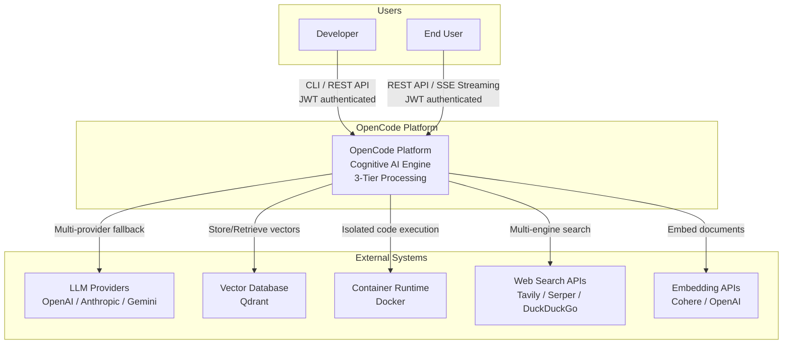
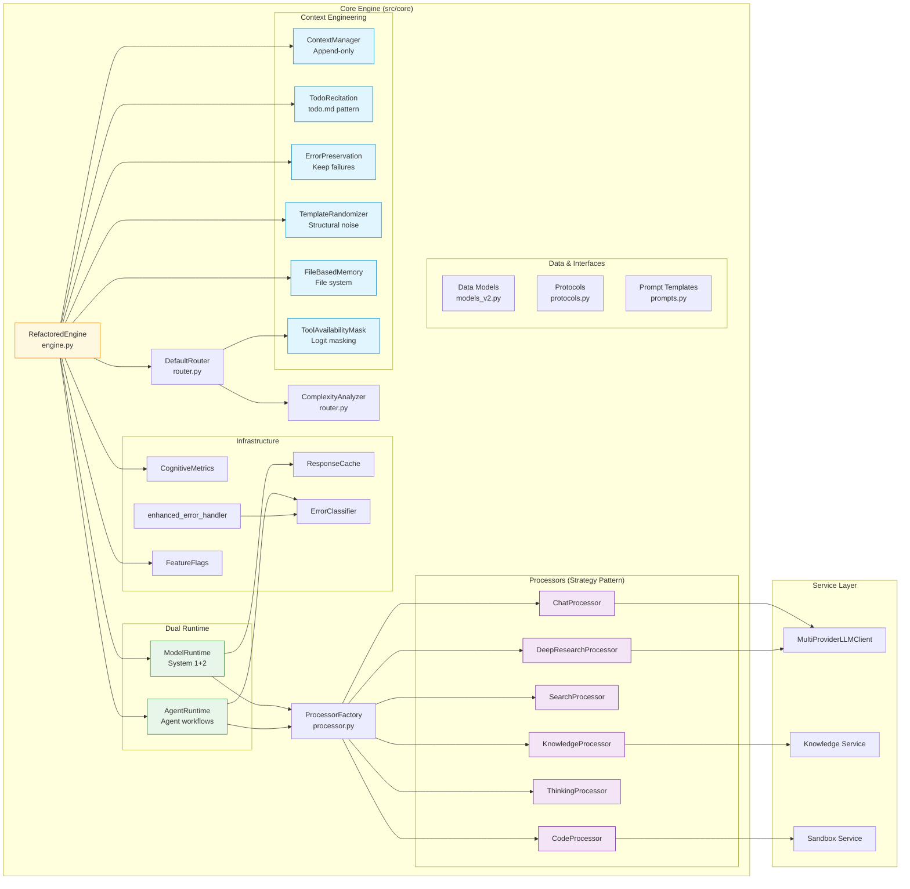
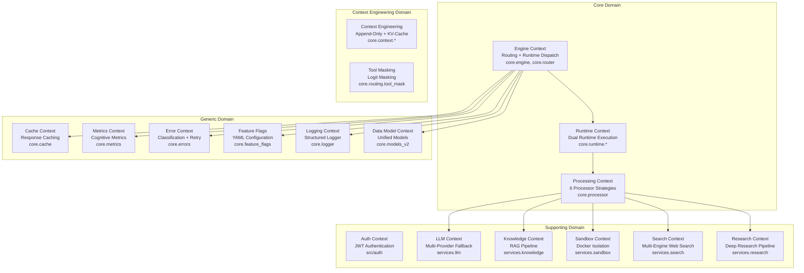
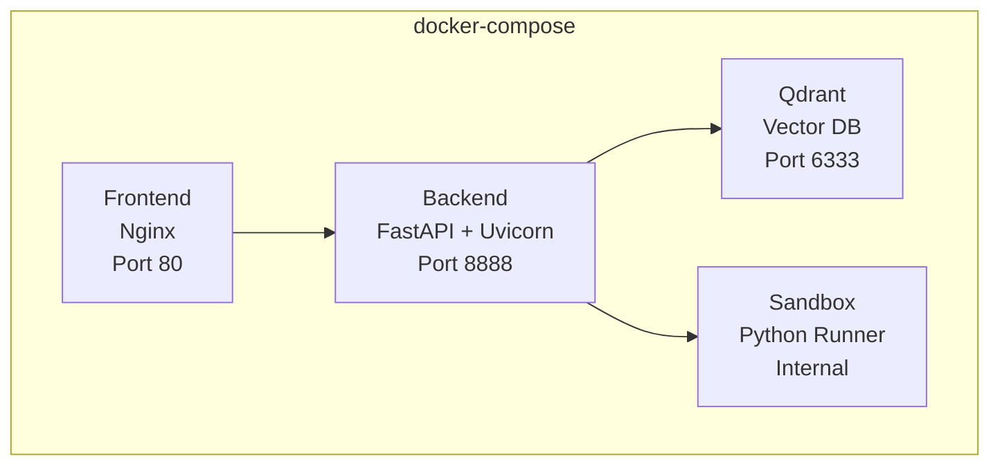

# Architecture & Design Document - OpenCode Platform

---

**Document Version:** `v2.3`
**Last Updated:** `2026-02-23`
**Status:** `Current (v3.0 Linus Refactored + v3.1 Context Engineering + v3.2 Persistent Sandbox & Report Quality + v3.3 Pipeline Reengineering)`

---

## Table of Contents

- [Part 1: Architecture Overview](#part-1-architecture-overview)
  - [1.1 C4 Model](#11-c4-model)
  - [1.2 Strategic DDD](#12-strategic-ddd)
  - [1.3 Clean Architecture Layers](#13-clean-architecture-layers)
- [Part 2: Detailed Design](#part-2-detailed-design)
  - [2.1 Core Module Design](#21-core-module-design)
  - [2.2 Non-Functional Requirements](#22-non-functional-requirements)
- [Part 3: Deployment & Operations](#part-3-deployment--operations)

---

**Purpose**: This document translates the OpenCode Platform's architecture into a technical blueprint reflecting the **currently implemented** system: Cognitive 3-Tier processing, Dual Runtime dispatch, Multi-Provider LLM fallback, JWT authentication, feature-flagged capabilities, and Manus-aligned Context Engineering (v3.1).

---

## Part 1: Architecture Overview

### 1.1 C4 Model

#### L1 - System Context Diagram



#### L2 - Container Diagram

```mermaid
graph TB
    subgraph "Clients"
        CLI["CLI<br/>Interactive Chat<br/>main.py"]
        API["REST API<br/>FastAPI + SSE<br/>src/api"]
    end

    subgraph "Authentication"
        Auth["JWT Auth<br/>python-jose<br/>src/auth"]
    end

    subgraph "Core Engine"
        Engine["RefactoredEngine<br/>Router + Runtime Dispatch + CE<br/>src/core/engine.py"]
        Router["DefaultRouter<br/>Mode + Cognitive Level<br/>src/core/router.py"]
        ModelRT["ModelRuntime<br/>System 1+2 (stateless, cached)<br/>src/core/runtime/model_runtime.py"]
        AgentRT["AgentRuntime<br/>Agent (stateful, retry)<br/>src/core/runtime/agent_runtime.py"]
        Factory["ProcessorFactory<br/>Strategy Pattern<br/>src/core/processors/factory.py"]
        Cache["ResponseCache<br/>SHA-256, TTL, LRU<br/>src/core/cache.py"]
        Metrics["CognitiveMetrics<br/>Per-level tracking<br/>src/core/metrics.py"]
        Errors["ErrorClassifier<br/>5 categories, retry<br/>src/core/errors.py"]
        ErrHandler["enhanced_error_handler<br/>Decorator-based retry<br/>src/core/error_handler.py"]
        Flags["FeatureFlags<br/>YAML-driven<br/>src/core/feature_flags.py"]
    end

    subgraph "Context Engineering (Manus-aligned, feature-flag controlled)"
        CtxMgr["ContextManager<br/>Append-only context<br/>src/core/context/context_manager.py"]
        TodoRec["TodoRecitation<br/>todo.md recitation<br/>src/core/context/todo_recitation.py"]
        ErrPres["ErrorPreservation<br/>Keep failed attempts<br/>src/core/context/error_preservation.py"]
        TplRand["TemplateRandomizer<br/>Structural noise<br/>src/core/context/template_randomizer.py"]
        FileMem["FileBasedMemory<br/>File system memory<br/>src/core/context/file_memory.py"]
        ToolMask["ToolAvailabilityMask<br/>Logit masking<br/>src/core/routing/tool_mask.py"]
    end

    subgraph "Service Layer"
        LLMSvc["Multi-Provider LLM<br/>OpenAI → Anthropic → Gemini<br/>src/services/llm"]
        KnowledgeSvc["Knowledge Service<br/>RAG pipeline<br/>src/services/knowledge"]
        SearchSvc["Search Service<br/>Multi-engine<br/>src/services/search"]
        SandboxSvc["Sandbox Service<br/>Persistent REPL + Ephemeral Fallback<br/>src/services/sandbox"]
        BrowserSvc["Browser Service<br/>Web extraction<br/>src/services/browser"]
        ResearchSvc["Research Service<br/>Deep research pipeline<br/>src/services/research"]
        RepoSvc["Repo Service<br/>Git operations<br/>src/services/repo"]
    end

    subgraph "Data Stores"
        QdrantDB[("Qdrant DB")]
        LocalFS[("Local Filesystem<br/>logs/, data/")]
    end

    CLI --> Engine
    API --> Auth
    Auth --> Engine

    Engine --> Router
    Engine --> ModelRT
    Engine --> AgentRT
    Engine --> Metrics
    Engine --> Flags
    Engine --> CtxMgr
    Engine --> TodoRec
    Engine --> ErrPres
    Engine --> TplRand
    Engine --> FileMem
    Router --> ToolMask
    ModelRT --> Cache
    ModelRT --> Factory
    AgentRT --> Factory
    AgentRT --> Errors
    AgentRT --> ErrHandler

    Factory --> LLMSvc
    Factory --> KnowledgeSvc
    Factory --> SearchSvc
    Factory --> SandboxSvc
    Factory --> BrowserSvc
    Factory --> ResearchSvc

    KnowledgeSvc --> QdrantDB
    ResearchSvc --> SearchSvc
    ResearchSvc --> LLMSvc
    SandboxSvc --> LocalFS
    RepoSvc --> LocalFS

    style Engine fill:#FFF8E1,stroke:#F57C00
    style Router fill:#FFF8E1,stroke:#F57C00
    style ModelRT fill:#FFF8E1,stroke:#F57C00
    style AgentRT fill:#FFF8E1,stroke:#F57C00
    style CLI fill:#E8F4FD,stroke:#1565C0
    style API fill:#E8F4FD,stroke:#1565C0
```



#### L3 - Component Diagram: Core Engine



### 1.2 Strategic DDD

#### Ubiquitous Language

| Term | Definition | Code Mapping |
|:---|:---|:---|
| **Request** | Encapsulated user request with mode, trace_id, metadata | `core.models.Request` |
| **Response** | Unified response with result, tokens, events | `core.models.Response` |
| **ProcessingMode** | Frozen dataclass. 7 modes: auto, chat, knowledge, search, code, thinking, deep_research. Data self-contained (no dict mappings) | `core.models_v2.ProcessingMode` |
| **Modes** | Predefined mode constants: `Modes.CHAT`, `Modes.SEARCH`, etc. Use `Modes.from_name("chat")` for lookup | `core.models_v2.Modes` |
| **CognitiveLevel** | Embedded in ProcessingMode.cognitive_level: "system1", "system2", "agent" | `ProcessingMode.cognitive_level` field |
| **RuntimeType** | ModelRuntime (stateless) or AgentRuntime (stateful) | `core.models_v2.RuntimeType` |
| **ContextEntry** | Frozen dataclass for append-only context entries (KV-Cache friendly) | `core.context.models.ContextEntry` |
| **ContextManager** | Append-only context manager (never modify, never delete) | `core.context.context_manager.ContextManager` |
| **TodoRecitation** | todo.md recitation pattern (replaces MetacognitiveGovernor) | `core.context.todo_recitation.TodoRecitation` |
| **ToolAvailabilityMask** | Logit masking for tool selection (mask, don't remove) | `core.routing.tool_mask.ToolAvailabilityMask` |
| **Engine** | Central orchestrator: route → dispatch → execute → respond | `core.engine.RefactoredEngine` |
| **Router** | Classifies requests by mode, cognitive level, and runtime | `core.router.DefaultRouter` |
| **Processor** | Strategy object for a specific mode | `core.processor.*Processor` |
| **Context** | Shared state across the processing pipeline | `core.models.ProcessingContext` |
| **RoutingDecision** | Result of router analysis (mode, level, runtime, confidence) | `core.models.RoutingDecision` |
| **LLMProvider** | Abstract interface for LLM clients | `services.llm.base.LLMProvider` |

#### Bounded Contexts



### 1.3 Clean Architecture Layers

The project strictly follows a unidirectional dependency structure: **API → Core → Services**.

| Layer | Clean Architecture Role | Implementation | Forbidden Imports |
|:---|:---|:---|:---|
| **Entities** | Domain models | `core/models_v2.py` — Request, Response, ProcessingMode (frozen dataclass), Modes, RuntimeType, Event; `core/context/models.py` — ContextEntry | — |
| **Use Cases** | Application logic | `core/engine.py` — RefactoredEngine orchestration + CE integration; `core/processors/` — 6 concrete processors (modular); `core/router.py` — DefaultRouter; `core/runtime/` — Dual runtime dispatch; `core/context/` — Context Engineering; `core/routing/` — Tool masking | `src.api` |
| **Interface Adapters** | HTTP/CLI boundary | `src/api/routes.py` — 11 FastAPI endpoints; `src/api/streaming.py` — SSE bridge; `src/auth/` — JWT auth; `main.py` — CLI | — |
| **Frameworks & Drivers** | Infrastructure | `src/services/` — LLM providers, Qdrant, Docker, web search, browser | `src.core`, `src.api` |

---

## Part 2: Detailed Design

### 2.1 Core Module Design

#### Module: Router (`core.router`)

- **Responsibility**: Classify incoming requests by mode, cognitive level, and runtime type. Integrates ToolAvailabilityMask for KV-Cache-friendly tool selection.
- **Components**:
  - `DefaultRouter`: 4-step routing pipeline — resolve mode → classify cognitive level → select runtime → optional complexity analysis.
  - `ComplexityAnalyzer`: Rule-based query complexity scoring (length, multi-step indicators, tool keywords, question count). Gated by feature flag `routing.complexity_analysis`.
  - `ToolAvailabilityMask` (`core.routing.tool_mask`): Logit masking — all tools always defined in system prompt (stable KV-Cache prefix), mode determines which tools are allowed via mask. Replaces the original OODA Router dynamic switching design.
- **Flow**:
  ```
  Request(mode=AUTO) → DefaultRouter.route()
    → Step 1: _select_mode(query) → Modes.CHAT (frozen dataclass, not enum)
    → Step 2: mode.cognitive_level → "system1" (data field, no dict lookup)
    → Step 3: _select_runtime(level) → RuntimeType.MODEL
    → Step 4: ComplexityAnalyzer.analyze(query) → ComplexityScore (optional)
    → Step 5: ToolAvailabilityMask.get_allowed_tools(mode.name) (CE, optional)
    → return RoutingDecision
  ```

#### Module: Dual Runtime (`core.runtime`)

- **Responsibility**: Execute processors with cognitive-level-appropriate strategies.
- **Components**:
  - `ModelRuntime` (System 1 + System 2): Stateless execution. System 1 modes (CHAT, KNOWLEDGE) can use ResponseCache (SHA-256 key, TTL eviction). Feature-flagged via `system1.enable_cache`.
  - `AgentRuntime` (Agent level): Stateful workflow execution with WorkflowState tracking. Wraps processor calls in `retry_with_backoff(max_retries=2)`. Failed steps are classified by ErrorClassifier.
- **Feature Flag Gating**: When `routing.smart_routing` is OFF, engine falls back to direct ProcessorFactory dispatch (legacy path). When ON, routes to the appropriate runtime.

#### Module: Engine & Processors (`core.engine`, `core.processors`)

- **Responsibility**: Engine orchestrates the full request lifecycle with Context Engineering integration. ProcessorFactory creates mode-specific strategy objects.
- **Components**:
  - `RefactoredEngine`: Route → CE context setup → dispatch to runtime → CE context update → collect metrics → return response. Supports both sync `process()` and SSE `process_stream()`. Integrates all 6 Context Engineering components via feature flags.
  - `ProcessorFactory` (`processors/factory.py`): Strategy pattern — maps `Modes.*` (frozen dataclass) to Processor instances. No dictionary mappings — uses mode data directly.
  - `BaseProcessor` (`processors/base.py`): Abstract base class defining `async process(context) -> str`.
  - 6 concrete processors (modular, each in own file): `ChatProcessor`, `KnowledgeProcessor`, `SearchProcessor`, `CodeProcessor`, `ThinkingProcessor`, `DeepResearchProcessor`.

- **Sequence Diagram**:
  ```mermaid
  sequenceDiagram
      participant Client as CLI/API
      participant Engine as RefactoredEngine
      participant Router as DefaultRouter
      participant Runtime as ModelRuntime/AgentRuntime
      participant Factory as ProcessorFactory
      participant Proc as Processor
      participant LLM as MultiProviderLLMClient

      Client->>Engine: process(Request)
      Note over Engine: CE: ContextManager.reset() + append_user()
      Note over Engine: CE: TodoRecitation.create_initial_plan()
      Engine->>Router: route(Request)
      Router-->>Engine: RoutingDecision(mode, level, runtime)
      Engine->>Runtime: execute(Context)
      Runtime->>Factory: get_processor(mode)
      Factory-->>Runtime: Processor instance
      Runtime->>Proc: process(Context)
      Proc->>LLM: generate(prompt)
      LLM-->>Proc: response (with fallback)
      Proc-->>Runtime: result string
      Runtime-->>Engine: result
      Note over Engine: CE: ContextManager.append_assistant(result)
      Note over Engine: CE: TodoRecitation.update_from_output()
      Note over Engine: CE: ErrorPreservation.should_retry() if needed
      Engine->>Engine: record metrics
      Engine-->>Client: Response
  ```

#### Module: Multi-Provider LLM (`services.llm`)

- **Responsibility**: Provide a unified LLM interface with automatic provider failover.
- **Components**:
  - `LLMProvider` (ABC): Abstract base with `generate()`, `stream()`, `provider_name`, `is_available`.
  - `OpenAILLMClient`: GPT-4o / GPT-4o-mini via `openai.AsyncOpenAI`.
  - `AnthropicLLMClient`: Claude via `anthropic.AsyncAnthropic`.
  - `GeminiLLMClient`: Gemini via `google-genai` SDK.
  - `MultiProviderLLMClient`: Fallback chain orchestrator. Tries providers in order; on retryable error (network/LLM), falls back to next. Non-retryable errors (business/resource) propagate immediately.
  - `create_llm_client()`: Factory function. Auto-detects providers from env vars. Single provider → returns directly. Multiple → wraps in `MultiProviderLLMClient`.
- **Soft Error Detection**: OpenAI returns `[OpenAI Error] ...` strings instead of raising. `MultiProviderLLMClient` detects these and triggers fallback.

#### Module: Error Handling (`core.errors` + `core.error_handler`)

- **Responsibility**: Classify errors and provide retry/fallback infrastructure.
- **Components**:
  - `ErrorClassifier` (`errors.py`): 5 categories — NETWORK, LLM, RESOURCE_LIMIT, BUSINESS, UNKNOWN. Only NETWORK and LLM are retryable.
  - `retry_with_backoff()` (`errors.py`): Exponential backoff retry (2^n delay). Only retries retryable errors.
  - `llm_fallback()` (`errors.py`): Primary/secondary function fallback utility.
  - `enhanced_error_handler()` (`error_handler.py`): Decorator-based retry for processor methods. Supports configurable `max_retries`, `retryable_categories`, and `base_delay`. Used directly on processor `process()` methods (e.g., `SearchProcessor`).
  - `robust_processor` (`error_handler.py`): Alias for `enhanced_error_handler` (backward compatibility).

#### Module: Context Engineering (`core.context` + `core.routing`)

- **Responsibility**: Manus-aligned context management for KV-Cache optimization, attention management, and error learning. All components are feature-flag controlled (`context_engineering.*` in `config/cognitive_features.yaml`).
- **Design Principles** (from [Manus Context Engineering](https://manus.im/blog/Context-Engineering-for-AI-Agents)):
  1. **KV-Cache friendly**: Context is append-only — never modify or delete history
  2. **Mask, don't remove**: All tools always defined; mode constrains via logit masking
  3. **File system as memory**: Unlimited, persistent, agent-manipulable
  4. **Attention via recitation**: Push goals into recent context position
  5. **Keep erroneous turns**: Model learns implicitly from seeing own mistakes
  6. **Avoid few-shot traps**: Structural noise prevents pattern lock-in
- **Components**:
  - `ContextManager` (~102 lines): Append-only context with reversible compression. Only `append()` and `reset()` operations — no modify/delete.
  - `TodoRecitation` (~60 lines): Replaces MetacognitiveGovernor. Pushes current plan into recent context position to combat "lost in the middle".
  - `ErrorPreservation` (~39 lines): Stateless utility. Builds retry prompts that include failed attempts (never hide errors).
  - `TemplateRandomizer` (~40 lines): Randomizes prompt templates to prevent few-shot lock-in. Replaces Neuromodulation RL.
  - `FileBasedMemory` (~51 lines): File system as agent memory. Replaces Vector DB + Knowledge Graph for context persistence.
  - `ToolAvailabilityMask` (~47 lines): Logit masking for tool selection. All tools always in prompt (stable prefix). Replaces OODA Router dynamic switching.
- **Integration**: All 6 components are initialized in `RefactoredEngine.__init__()` when their respective feature flags are enabled. Processing flow: reset → append user → execute → append result → update plan → retry if needed.
- **Total**: ~392 lines production code, ~746 lines tests, 63 test cases, 0 regressions.

#### Module: Knowledge Base (`services.knowledge`)

- **Responsibility**: Document parsing, chunking, embedding, indexing, and RAG retrieval.
- **Components**:
  - `multimodal_parser.py`: PDF/DOCX/image parsing.
  - `indexer.py`: Text chunking → embedding → Qdrant indexing.
  - `retriever.py`: Vector similarity search via Qdrant.
  - `service.py`: Unified service entry point.

#### Module: Sandbox (`services.sandbox`)

- **Responsibility**: Isolated code execution in Docker containers with persistent REPL support.
- **Components**:
  - `SandboxService`: Main entry point. Dispatches to persistent or ephemeral sandbox based on availability.
  - `_PersistentSandbox`: Long-running Docker container with persistent Python REPL process. Eliminates cold start overhead by keeping the container alive with libraries pre-imported. Communicates via stdin/stdout JSON lines through Docker's `attach_socket` (multiplexed stream, `tty=False`). Thread-safe via lock-serialized `execute()` with a background daemon thread reading stdout into a `Queue`. Auto-restarts on container crash with fallback to ephemeral containers.
  - `CodeSecurityFilter`: Blocks dangerous operations (file writes, subprocess, network) before code reaches the sandbox.
  - `runner.py` (inside container): Supports `--persistent` flag for long-running REPL mode. Pre-imports numpy, pandas, matplotlib, seaborn. CJK font support via `fonts-noto-cjk` (Noto Sans CJK JP primary).
- **Execution flow**: `_PersistentSandbox.execute()` → write JSON request to stdin → read JSON response from stdout → parse Docker multiplexed frame headers → extract result with stdout/stderr/figures.
- **Configuration**: `SANDBOX_COMPUTE_TIMEOUT` env var (default 60s). Resource limits: 512MB memory, 50% CPU quota.

### 2.2 Non-Functional Requirements

#### Performance

| Metric | Target | Implementation |
|:---|:---|:---|
| **System 1 Response (cached)** | < 50ms | `ResponseCache` with SHA-256 key, TTL eviction |
| **System 1 Response (uncached)** | < 2s | Direct LLM call, async IO |
| **System 2 Response** | < 10s | Multi-step processing, async IO |
| **Agent Response** | < 60s | Multi-step research with retry |
| **Sandbox Computation** | < 60s (configurable) | `SANDBOX_COMPUTE_TIMEOUT` env var, persistent REPL eliminates cold start |
| **API P95 Latency** | < 300ms (excluding LLM) | FastAPI async, no blocking IO |
| **Vector Retrieval** | < 150ms | Qdrant indexed search |

#### Scalability

- **Stateless Core**: Engine and Processors are stateless (except AgentRuntime workflow state). Horizontally scalable behind a load balancer.
- **Service Decoupling**: Each service subdirectory is self-contained and could be extracted to a microservice.
- **Feature Flags**: New capabilities can be enabled incrementally via `config/cognitive_features.yaml`.

#### Security

| Layer | Measure | Implementation |
|:---|:---|:---|
| **Authentication** | JWT Bearer tokens, role-based access | `src/auth/jwt.py`, `src/auth/dependencies.py` |
| **Input Validation** | Pydantic models with strict type checking | `src/api/schemas.py` |
| **Sandbox Isolation** | Docker containers with resource limits, persistent REPL | `services.sandbox.service` (`_PersistentSandbox`) |
| **Secret Management** | Environment variables, `.env` file | `python-dotenv`, `.env.example` |
| **Error Masking** | Unified error responses, no stack trace leak | `src/api/errors.py` |

#### Report Quality (Deep Research)

| Aspect | Implementation | Details |
|:---|:---|:---|
| **Markdown Tables** | Pipe-table enforcement in report prompt | All tables must use `\| col \| col \|` syntax; prose/bullet substitutes forbidden |
| **CJK Font Rendering** | `fonts-noto-cjk` in sandbox Docker image | Font chain: `Noto Sans CJK JP → Noto Sans CJK TC → Noto Sans CJK SC → DejaVu Sans` |
| ~~**Figure Inline Placement**~~ | ~~"Figure N" reference search + paragraph-end insertion~~ | ~~Removed in v3.3 — chart pipeline no longer active~~ |
| ~~**Chart Early Abort**~~ | ~~`SANDBOX_MAX_CHART_FAILURES` (default 2)~~ | ~~Removed in v3.3 — chart pipeline no longer active~~ |
| **Per-Session Research Data** | `research_data/{trace_id}_{timestamp}/` | Search results saved in isolated per-session directories |

#### Resilience

| Component | Strategy | Implementation |
|:---|:---|:---|
| **LLM Providers** | Multi-provider fallback chain (OpenAI → Anthropic → Gemini) | `services.llm.multi_provider` |
| **Retryable Errors** | Exponential backoff (2^n, max 3 retries) | `core.errors.retry_with_backoff` |
| **Error Classification** | 5 categories, only NETWORK+LLM retried | `core.errors.ErrorClassifier` |
| **Cache Degradation** | Graceful — cache miss falls through to LLM | `core.cache.ResponseCache` |
| **Feature Degradation** | All cognitive features default OFF, system works without them | `core.feature_flags` |

---

## Part 3: Deployment & Operations

### 3.1 Deployment Architecture

**Current**: `docker-compose.yml` for local development and deployment, with `backend`, `qdrant`, `frontend`, `sandbox` services.



### 3.2 CI/CD Pipeline

**Current**: Manual execution.

```bash
# Test
python3 -m pytest tests/ -o "addopts=" \
  --ignore=tests/unit/test_engine.py \
  --ignore=tests/unit/test_refactored_engine.py

# Run
cd src && python -c "
import uvicorn
from api.routes import create_app
uvicorn.run(create_app(), host='0.0.0.0', port=8000)
"
```

### 3.3 Monitoring & Observability

- **Structured Logging**: `core/logger.py` — console (colored) + JSON file output, trace_id correlation, surrogate-safe encoding for WSL2.
- **Cognitive Metrics**: `core/metrics.py` — per-level (System 1/2/Agent) latency, success rate, token usage. Exposed via `GET /api/v1/metrics`.
- **Feature Flag Dashboard**: All flags accessible via `config/cognitive_features.yaml`, default OFF.

---

## Architecture Evolution Roadmap

### Phase 0-4: Core Architecture (Completed)

- [x] Engine-Processor strategy pattern
- [x] 6 processing modes (Chat, Knowledge, Search, Code, Thinking, Deep Research)
- [x] Full FastAPI with 11 endpoints, JWT auth, SSE streaming
- [x] Router + Dual Runtime dispatch (ModelRuntime / AgentRuntime)
- [x] ResponseCache for System 1, CognitiveMetrics
- [x] ErrorClassifier, retry_with_backoff, llm_fallback
- [x] Feature flags (YAML-driven, default OFF)
- [x] Multi-Provider LLM fallback chain (OpenAI -> Anthropic -> Gemini)
- [x] Structured logging with surrogate sanitization
- [x] Comprehensive test suite (17+ unit tests for multi-provider alone)

### v3.0: Linus-Style Refactoring (Completed)

- [x] ProcessingMode refactored to frozen dataclass (data self-contained, no dict mappings)
- [x] Processors modularized (`src/core/processors/` directory, one file per processor)
- [x] ProcessorFactory uses `Modes.*` directly (no COGNITIVE_MAPPING dict)
- [x] Unified Event model (replaces SSEEvent)
- [x] ServiceInitializer for graceful service startup

### v3.1: Context Engineering (Completed - Manus-aligned)

- [x] ContextManager — append-only context (KV-Cache friendly, ~102 lines)
- [x] TodoRecitation — todo.md recitation pattern (replaces MetacognitiveGovernor, ~60 lines)
- [x] ErrorPreservation — keep failed attempts in context (~39 lines)
- [x] TemplateRandomizer — structural noise injection (~40 lines)
- [x] FileBasedMemory — file system as agent memory (~51 lines)
- [x] ToolAvailabilityMask — logit masking for tool selection (~47 lines)
- [x] Engine integration with feature flag gating (63 new tests, 0 regressions)
- [x] Performance verified: <1ms/request overhead

### v3.2: Persistent Sandbox & Report Quality (Completed)

- [x] `_PersistentSandbox` — thread-safe Docker REPL, multiplexed stream, auto-restart + ephemeral fallback
- [x] Chart planning pipeline — LLM generates chart specs from research synthesis (max 5 charts)
- [x] Computational analysis — individual chart execution with configurable timeout (`SANDBOX_COMPUTE_TIMEOUT`)
- [x] Early abort — consecutive failures tracked (`SANDBOX_MAX_CHART_FAILURES`), skip remaining on threshold
- [x] CJK font support — `fonts-noto-cjk` in sandbox image, font chain in prompts
- [x] Markdown table enforcement — pipe-table syntax mandated in report generation prompt
- [x] Figure inline placement — "Figure N" reference search, paragraph-end insertion
- [x] Per-session research data — `research_data/{trace_id}_{timestamp}/` directories
- [x] Search budget model — configurable query limits via env vars (`DEEP_RESEARCH_QUERIES_*`)

### v3.3: Pipeline Reengineering — 去制式化 (Completed)

- [x] Removed Domain Identification stage (1 LLM call saved, merged into SERP prompt)
- [x] Removed Critical Analysis stage (1 LLM call saved, trust LLM reasoning)
- [x] Removed Chart Planning + Execution stages (1-3 LLM calls saved, chart pipeline removed from processor)
- [x] Added Section-Aware Hierarchical Synthesis (`section_synthesizer.py` ~230 lines)
- [x] Report prompt de-formalization — 23 McKinsey-grade rules → 10 flexible guidelines
- [x] Removed MECE/Pyramid/CEI/So-What template constraints
- [x] Total LLM calls reduced from ~12-22 to ~9-16
- [x] Net reduction: ~100 lines of production code
- [x] Tests: 323 passed, 0 regressions

> **Note**: v3.2 sandbox infrastructure (`_PersistentSandbox`, `CodeSecurityFilter`) remains in codebase but is no longer invoked by the Deep Research processor. It may be used by other features in the future.

### Phase 6+: Future Enhancements

- [ ] Redis distributed cache (replacing in-memory ResponseCache)
- [x] Plugin system scaffold (3 example plugins: translator, stock-analyst, weather-tool; `PLUGIN_DEV_GUIDE.md`; plugin.json manifest spec)
- [ ] Plugin system integration with main engine (hot-reload, plugin loader, plugin API endpoints)
- [ ] Kubernetes deployment with auto-scaling
- [ ] CI/CD pipeline (GitHub Actions)
- [ ] Prometheus metrics + Grafana dashboards
- [ ] Multi-tenant support and resource isolation
- [ ] [Conditional] EnhancedRouter (if DefaultRouter accuracy <70%)
- [ ] [Conditional] Lightweight ConfidenceEstimator (if todo.md insufficient for quality gating)
