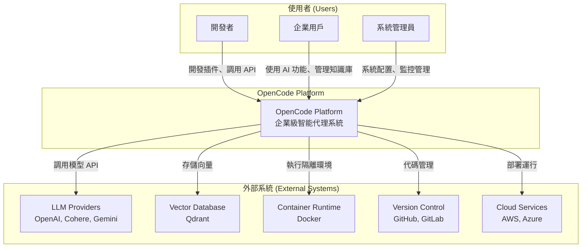
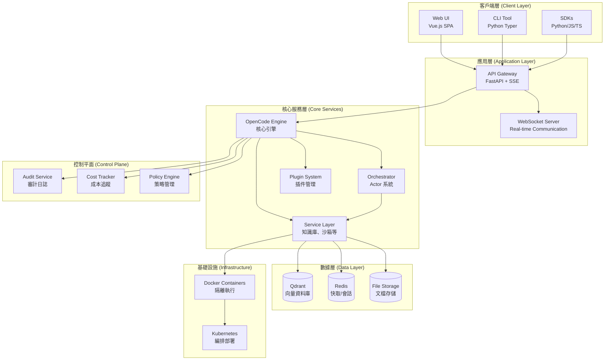
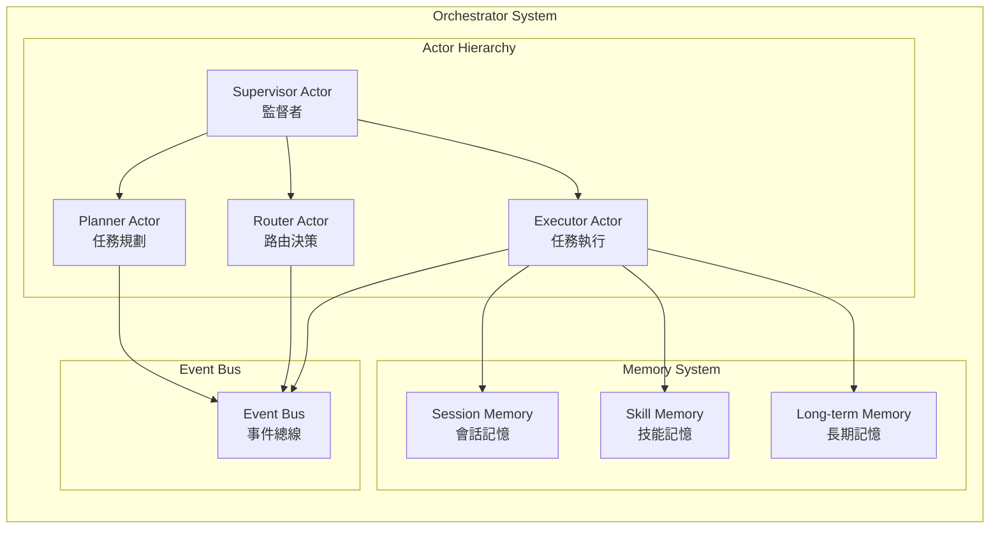
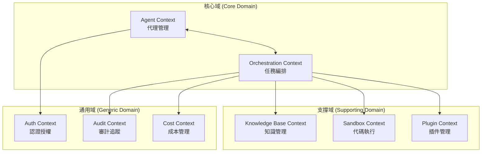
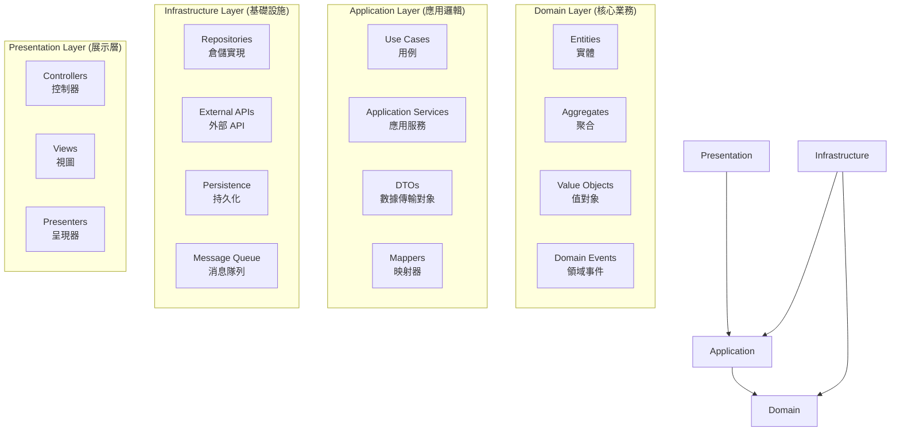
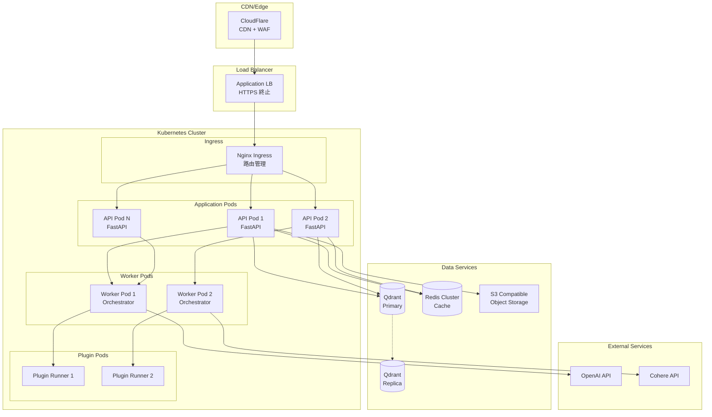
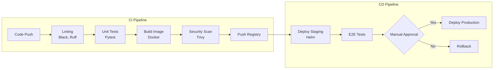

# 整合性架構與設計文件 (Unified Architecture & Design Document) - OpenCode Platform

---

**文件版本 (Document Version):** `v1.0`
**最後更新 (Last Updated):** `2026-02-05`
**主要作者 (Lead Author):** `OpenCode 技術架構團隊`
**審核者 (Reviewers):** `架構委員會, 核心開發團隊`
**狀態 (Status):** `已批准 (Approved)`

---

## 目錄 (Table of Contents)

- [第 1 部分：架構總覽 (Architecture Overview)](#第-1-部分架構總覽-architecture-overview)
  - [1.1 C4 模型：視覺化架構](#11-c4-模型視覺化架構)
  - [1.2 DDD 戰略設計 (Strategic DDD)](#12-ddd-戰略設計-strategic-ddd)
  - [1.3 Clean Architecture 分層](#13-clean-architecture-分層)
  - [1.4 技術選型與決策](#14-技術選型與決策)
- [第 2 部分：詳細設計 (Detailed Design)](#第-2-部分詳細設計-detailed-design)
  - [2.1 MVP 與模組優先級 (MVP & Module Priority)](#21-mvp-與模組優先級-mvp--module-priority)
  - [2.2 核心功能：模組設計](#22-核心功能模組設計)
  - [2.3 非功能性需求設計 (NFRs Design)](#23-非功能性需求設計-nfrs-design)
- [第 3 部分：部署與運維 (Deployment & Operations)](#第-3-部分部署與運維-deployment--operations)

---

**目的**: 本文件將 OpenCode Platform 的業務需求轉化為完整的技術藍圖。從高層次的系統架構開始，逐步深入到具體的模組級實現細節，確保系統的穩固性與可維護性。

---

## 第 1 部分：架構總覽 (Architecture Overview)

### 1.1 C4 模型：視覺化架構

#### L1 - 系統情境圖 (System Context Diagram)



#### L2 - 容器圖 (Container Diagram)



#### L3 - 元件圖 (Component Diagram) - Orchestrator 詳細架構



### 1.2 DDD 戰略設計 (Strategic DDD)

#### 通用語言 (Ubiquitous Language)

| 術語 | 定義 | 範例 |
| :--- | :--- | :--- |
| **Agent (代理)** | 能夠自主執行任務的智能實體 | 翻譯代理、股票分析代理 |
| **Orchestrator (編排器)** | 協調多個代理和服務的中央控制器 | 任務分解、執行協調 |
| **Knowledge Base (知識庫)** | 向量化存儲的文檔集合 | 產品手冊、技術文檔 |
| **Sandbox (沙箱)** | 隔離的代碼執行環境 | Docker 容器執行 Python |
| **Plugin (插件)** | 可熱插拔的功能擴展模組 | 天氣查詢插件 |
| **Context (上下文)** | 用戶會話和狀態信息 | 對話歷史、用戶偏好 |
| **MCP (Model Context Protocol)** | 模型上下文協議標準 | 工具調用、服務發現 |

#### 限界上下文 (Bounded Contexts)



### 1.3 Clean Architecture 分層



#### 各層職責說明

- **Domain Layer**: 包含核心業務規則，不依賴任何外部框架
- **Application Layer**: 編排領域對象，實現業務用例
- **Infrastructure Layer**: 技術細節實現，如資料庫、外部 API
- **Presentation Layer**: 用戶介面和 API 端點

### 1.4 技術選型與決策

#### 技術棧總覽 (Tech Stack Overview)

| 分類 | 選用技術 | 版本 | 選擇理由 |
| :--- | :--- | :--- | :--- |
| **程式語言** | Python | 3.11+ | 豐富的 AI 生態系統、異步支援 |
| **Web 框架** | FastAPI | 0.108+ | 高性能、自動文檔、類型安全 |
| **異步框架** | asyncio, aiohttp | 最新穩定版 | 原生異步、高並發 |
| **Actor 模型** | 自實現 | - | 精確控制、輕量級 |
| **LLM 整合** | OpenAI, Cohere | 最新 API | 業界領先、多模態支援 |
| **向量資料庫** | Qdrant | 1.7+ | 高性能、豐富查詢功能 |
| **容器化** | Docker | 24.0+ | 標準化部署、沙箱隔離 |
| **編排** | Kubernetes | 1.28+ | 生產級編排、自動擴展 |
| **前端框架** | Vue.js 3 | 3.3+ | 響應式、組件化、生態豐富 |
| **CLI 框架** | Typer | 0.9+ | 現代 CLI、自動補全 |
| **日誌** | structlog | 23.0+ | 結構化、高性能 |
| **監控** | Prometheus + Grafana | 最新版 | 開源標準、豐富圖表 |

---

## 第 2 部分：詳細設計 (Detailed Design)

### 2.1 MVP 與模組優先級 (MVP & Module Priority)

#### Phase 1: MVP 核心功能（0-3 個月）

| 優先級 | 模組 | 功能範圍 | 成功指標 |
| :--- | :--- | :--- | :--- |
| P0 | 核心引擎 | 系統初始化、生命週期管理 | 穩定運行 24 小時 |
| P0 | 基礎 Chat API | 簡單對話、模型調用 | 響應時間 < 2s |
| P0 | 知識庫基礎 | 文檔上傳、基本檢索 | 準確率 > 80% |
| P1 | 用戶認證 | JWT 認證、基本權限 | 安全測試通過 |
| P1 | 審計日誌 | 請求追蹤、基本審計 | 100% 覆蓋率 |

#### Phase 2: 進階功能（3-6 個月）

| 優先級 | 模組 | 功能範圍 | 成功指標 |
| :--- | :--- | :--- | :--- |
| P0 | Orchestrator | Actor 模型、任務編排 | 並發處理 100+ 任務 |
| P0 | 插件系統 | 插件載入、生命週期 | 支援 10+ 插件類型 |
| P1 | 代碼沙箱 | Docker 隔離執行 | 安全執行不可信代碼 |
| P1 | MCP 整合 | 標準協議實現 | 兼容性測試通過 |
| P2 | 成本追蹤 | Token 計算、預算管理 | 誤差 < 1% |

#### Phase 3: 企業特性（6-12 個月）

| 優先級 | 模組 | 功能範圍 | 成功指標 |
| :--- | :--- | :--- | :--- |
| P1 | 多租戶 | 租戶隔離、資源配額 | 支援 100+ 租戶 |
| P1 | 高可用 | 集群部署、故障轉移 | 99.9% SLA |
| P2 | 監控儀表板 | 實時監控、告警 | 5 分鐘內發現問題 |
| P2 | 插件市場 | 發布、安裝、評價 | 100+ 插件上架 |

### 2.2 核心功能：模組設計

#### 模組: OpenCode Engine (核心引擎)

*   **職責 (Responsibility)**: 系統初始化、組件生命週期管理、請求協調
*   **核心介面**:
    ```python
    class IOpenCodeEngine(Protocol):
        async def start(self) -> None:
            """啟動引擎和所有子系統"""

        async def stop(self) -> None:
            """優雅關閉所有組件"""

        async def process_message(
            self,
            message: str,
            context: UserContext,
            options: ProcessOptions
        ) -> Response:
            """處理用戶消息"""

        async def register_service(
            self,
            service: IService
        ) -> None:
            """註冊新服務"""
    ```

*   **關鍵設計模式**:
    - **單例模式**: 確保全局唯一引擎實例
    - **觀察者模式**: 事件驅動的組件通信
    - **策略模式**: 可替換的處理策略

#### 模組: Knowledge Base Service (知識庫服務)

*   **職責**: 文檔解析、向量化、語義檢索、答案生成
*   **數據模型**:
    ```python
    class Document:
        id: str
        name: str
        content: str
        chunks: List[Chunk]
        metadata: Dict[str, Any]
        created_at: datetime
        indexed: bool

    class Chunk:
        id: str
        document_id: str
        content: str
        embedding: List[float]
        metadata: Dict[str, Any]
        position: int
    ```

*   **核心演算法**:
    1. **文檔分塊**: 語義分割 + 滑動窗口
    2. **向量化**: Cohere multilingual-22-12 或 OpenAI text-embedding-3
    3. **檢索策略**:
        - Semantic Search (餘弦相似度)
        - Hybrid Search (關鍵詞 + 語義)
        - Re-ranking (交叉編碼器)
    4. **答案生成**: RAG with GPT-4o

#### 模組: Orchestrator (編排器)

*   **Actor 層級結構**:
    ```
    Supervisor (根 Actor)
    ├── Planner (規劃 Actor)
    ├── Router (路由 Actor)
    └── Executor (執行 Actor)
        ├── Service Executors
        └── Plugin Executors
    ```

*   **消息流程**:
    ```mermaid
    sequenceDiagram
        participant U as User
        participant S as Supervisor
        participant P as Planner
        participant R as Router
        participant E as Executor
        participant Svc as Service

        U->>S: Request
        S->>P: Plan Task
        P->>S: Task Plan
        S->>R: Route Tasks
        R->>S: Routing Decision
        S->>E: Execute Task
        E->>Svc: Call Service
        Svc->>E: Result
        E->>S: Task Result
        S->>U: Response
    ```

#### 模組: Plugin System (插件系統)

*   **插件生命週期**:
    ```mermaid
    stateDiagram-v2
        [*] --> Discovered: 發現插件
        Discovered --> Validated: 驗證清單
        Validated --> Installed: 安裝依賴
        Installed --> Loaded: 載入代碼
        Loaded --> Enabled: 啟用插件
        Enabled --> Running: 執行中
        Running --> Disabled: 停用
        Disabled --> Enabled: 重新啟用
        Disabled --> Uninstalled: 卸載
        Uninstalled --> [*]
    ```

*   **插件清單結構** (plugin.json):
    ```json
    {
      "id": "example-plugin",
      "name": "Example Plugin",
      "version": "1.0.0",
      "type": "tool",
      "author": "Developer Name",
      "description": "Plugin description",
      "entry": "main.py",
      "dependencies": ["requests>=2.0.0"],
      "permissions": ["network", "filesystem:read"],
      "config_schema": {
        "type": "object",
        "properties": {
          "api_key": {"type": "string"}
        }
      }
    }
    ```

### 2.3 非功能性需求設計 (NFRs Design)

#### 性能需求 (Performance Requirements)

| 指標 | 目標 | 實現策略 |
| :--- | :--- | :--- |
| **API 延遲 (P95)** | < 200ms | 異步處理、連接池、快取 |
| **吞吐量** | 10,000 TPS | 水平擴展、負載均衡 |
| **並發用戶** | 5,000 | Actor 模型、異步 IO |
| **檢索速度** | < 100ms | 向量索引優化、快取熱點 |
| **文檔處理** | 100 頁/分鐘 | 並行處理、批量操作 |

#### 可擴展性設計 (Scalability Design)

*   **水平擴展點**:
    - API 服務器（無狀態）
    - Orchestrator Workers
    - 向量資料庫分片
    - 插件執行器池

*   **垂直擴展優化**:
    - 異步並發處理
    - 內存池化
    - 連接復用

#### 安全性設計 (Security Design)

| 層面 | 措施 | 實現 |
| :--- | :--- | :--- |
| **認證** | JWT + API Key | python-jose |
| **授權** | RBAC + 資源級權限 | 自定義策略引擎 |
| **加密** | TLS 1.3 + AES-256 | SSL 證書、加密存儲 |
| **沙箱** | Docker 隔離 | 資源限制、網路隔離 |
| **審計** | 全量請求日誌 | 結構化日誌、不可篡改 |
| **輸入驗證** | 嚴格類型檢查 | Pydantic 模型驗證 |

#### 可靠性設計 (Reliability Design)

*   **故障處理**:
    - 熔斷器模式（Circuit Breaker）
    - 重試機制（指數退避）
    - 降級策略（功能降級）

*   **數據保護**:
    - 自動備份（每日）
    - 事務一致性
    - 冪等性設計

*   **監控告警**:
    - 健康檢查端點
    - 指標收集（Prometheus）
    - 分散式追蹤（Jaeger）
    - 日誌聚合（ELK Stack）

---

## 第 3 部分：部署與運維 (Deployment & Operations)

### 3.1 部署架構 (Deployment Architecture)

#### 生產環境部署圖



### 3.2 環境策略 (Environment Strategy)

| 環境 | 用途 | 配置 | 數據 |
| :--- | :--- | :--- | :--- |
| **Development** | 本地開發 | Docker Compose | 測試數據 |
| **Testing** | 自動化測試 | K8s (小規模) | Mock 數據 |
| **Staging** | 預發布驗證 | K8s (生產配置) | 脫敏生產數據 |
| **Production** | 生產服務 | K8s (HA 配置) | 生產數據 |

### 3.3 CI/CD Pipeline



### 3.4 監控與可觀測性 (Monitoring & Observability)

#### 關鍵指標 (Key Metrics)

| 類別 | 指標 | 告警閾值 | 響應措施 |
| :--- | :--- | :--- | :--- |
| **系統** | CPU 使用率 | > 80% | 自動擴容 |
| **系統** | 記憶體使用率 | > 85% | 檢查內存泄漏 |
| **應用** | 請求延遲 P99 | > 1s | 性能分析 |
| **應用** | 錯誤率 | > 1% | 查看錯誤日誌 |
| **業務** | Token 使用量 | > 預算 90% | 成本告警 |
| **業務** | 活躍用戶數 | < 預期 50% | 業務分析 |

#### 日誌策略 (Logging Strategy)

```python
# 結構化日誌範例
{
    "timestamp": "2024-01-15T10:30:00Z",
    "level": "INFO",
    "service": "opencode-api",
    "trace_id": "abc123xyz",
    "user_id": "user_456",
    "event": "chat_request",
    "latency_ms": 234,
    "tokens_used": 150,
    "model": "gpt-4o",
    "status": "success"
}
```

### 3.5 災難恢復計劃 (Disaster Recovery Plan)

| 場景 | RTO | RPO | 恢復策略 |
| :--- | :--- | :--- | :--- |
| **服務器故障** | 5 分鐘 | 0 | K8s 自動重啟 |
| **區域故障** | 30 分鐘 | 5 分鐘 | 跨區域故障轉移 |
| **數據損壞** | 2 小時 | 1 小時 | 從備份恢復 |
| **完全災難** | 4 小時 | 24 小時 | 冷備份恢復 |

### 3.6 成本優化策略 (Cost Optimization)

1. **計算資源**:
   - 使用 Spot 實例（非關鍵工作負載）
   - 自動擴縮容（基於負載）
   - 預留實例（穩定工作負載）

2. **存儲優化**:
   - 數據分層（熱/溫/冷）
   - 壓縮和去重
   - 生命週期管理

3. **API 成本**:
   - 請求批處理
   - 響應快取
   - 模型選擇優化（成本 vs 質量）

---

## 架構演進路線圖 (Architecture Evolution Roadmap)

### 短期目標（3 個月）
- [x] 完成 MVP 核心功能
- [ ] 基礎插件系統上線
- [ ] 達到 1000 日活用戶

### 中期目標（6 個月）
- [ ] 完整 Orchestrator 實現
- [ ] 插件市場 Beta 版
- [ ] 多模型支援（Gemini、Claude）
- [ ] 達到 10,000 日活用戶

### 長期目標（12 個月）
- [ ] 多區域部署
- [ ] 聯邦學習支援
- [ ] 本地模型整合
- [ ] 企業私有化部署方案
- [ ] 達到 100,000 日活用戶

---

## 風險與緩解 (Risks and Mitigation)

| 風險類別 | 風險描述 | 可能性 | 影響 | 緩解策略 |
| :--- | :--- | :--- | :--- | :--- |
| **技術** | Actor 模型複雜度高 | 中 | 高 | 充分測試、漸進式實施 |
| **依賴** | OpenAI API 不穩定 | 中 | 高 | 多模型支援、降級策略 |
| **安全** | 插件系統安全風險 | 高 | 高 | 嚴格沙箱、權限控制 |
| **性能** | 向量檢索瓶頸 | 中 | 中 | 索引優化、分片策略 |
| **成本** | LLM API 成本失控 | 中 | 高 | 預算控制、使用配額 |

---

## 附錄：架構決策記錄 (ADRs)

| ADR ID | 標題 | 狀態 | 決策日期 |
| :--- | :--- | :--- | :--- |
| ADR-001 | 採用 Actor 模型進行任務編排 | Accepted | 2024-01-01 |
| ADR-002 | 使用 Qdrant 作為向量資料庫 | Accepted | 2024-01-05 |
| ADR-003 | 插件系統使用 Python 動態載入 | Accepted | 2024-01-10 |
| ADR-004 | 選擇 FastAPI 作為 Web 框架 | Accepted | 2024-01-15 |
| ADR-005 | 實現自定義策略引擎而非使用 OPA | Proposed | 2024-02-01 |

---

## 文件審核記錄 (Review History)

| 日期 | 審核人 | 版本 | 變更摘要 |
| :--- | :--- | :--- | :--- |
| 2026-02-05 | 架構團隊 | v1.0 | 初始版本發布 |