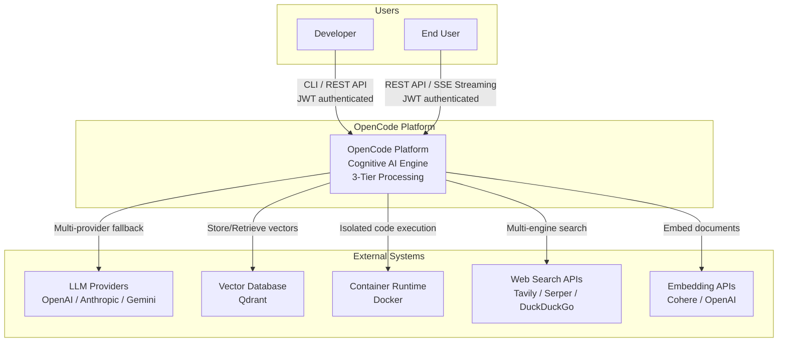
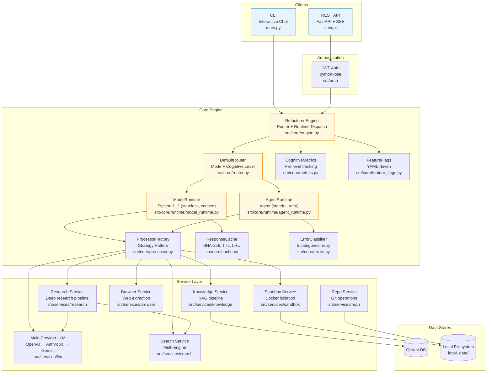
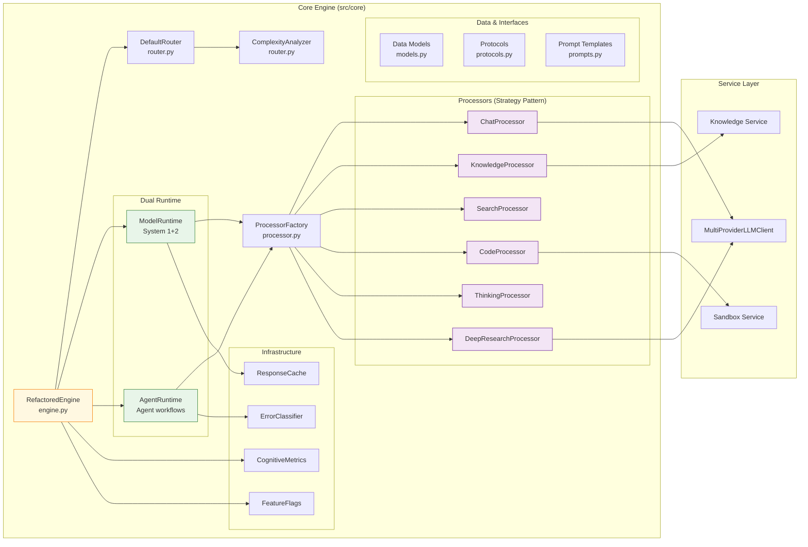
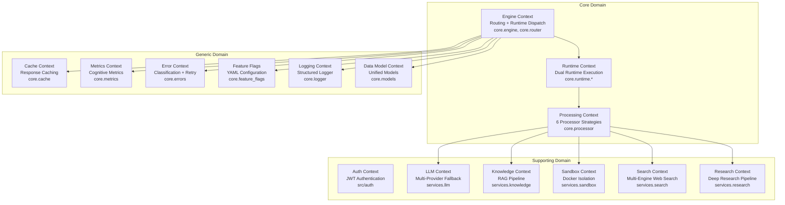
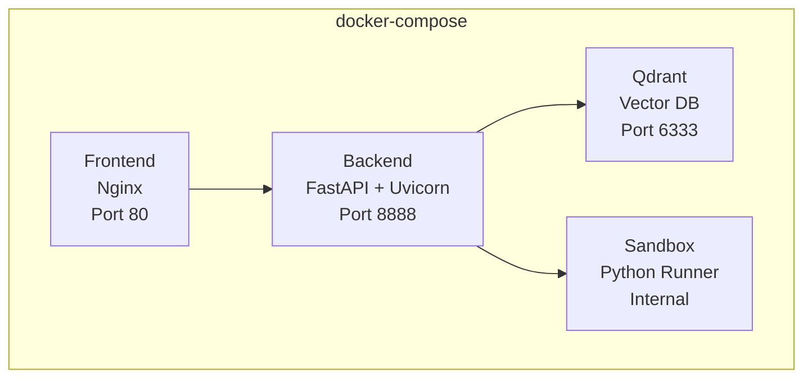

# Architecture & Design Document - OpenCode Platform

---

**Document Version:** `v2.0`
**Last Updated:** `2026-02-12`
**Status:** `Current (Implemented)`

---

## Table of Contents

- [Part 1: Architecture Overview](#part-1-architecture-overview)
  - [1.1 C4 Model](#11-c4-model)
  - [1.2 Strategic DDD](#12-strategic-ddd)
  - [1.3 Clean Architecture Layers](#13-clean-architecture-layers)
- [Part 2: Detailed Design](#part-2-detailed-design)
  - [2.1 Core Module Design](#21-core-module-design)
  - [2.2 Non-Functional Requirements](#22-non-functional-requirements)
- [Part 3: Deployment & Operations](#part-3-deployment--operations)

---

**Purpose**: This document translates the OpenCode Platform's architecture into a technical blueprint reflecting the **currently implemented** system: Cognitive 3-Tier processing, Dual Runtime dispatch, Multi-Provider LLM fallback, JWT authentication, and feature-flagged capabilities.

---

## Part 1: Architecture Overview

### 1.1 C4 Model

#### L1 - System Context Diagram



#### L2 - Container Diagram



#### L3 - Component Diagram: Core Engine



### 1.2 Strategic DDD

#### Ubiquitous Language

| Term | Definition | Code Mapping |
|:---|:---|:---|
| **Request** | Encapsulated user request with mode, trace_id, metadata | `core.models.Request` |
| **Response** | Unified response with result, tokens, events | `core.models.Response` |
| **ProcessingMode** | 7 modes: auto, chat, knowledge, search, code, thinking, deep_research | `core.models.ProcessingMode` |
| **CognitiveLevel** | System 1 (fast), System 2 (analytical), Agent (stateful) | `core.models.CognitiveLevel` |
| **RuntimeType** | ModelRuntime (stateless) or AgentRuntime (stateful) | `core.models.RuntimeType` |
| **Engine** | Central orchestrator: route → dispatch → execute → respond | `core.engine.RefactoredEngine` |
| **Router** | Classifies requests by mode, cognitive level, and runtime | `core.router.DefaultRouter` |
| **Processor** | Strategy object for a specific mode | `core.processor.*Processor` |
| **Context** | Shared state across the processing pipeline | `core.models.ProcessingContext` |
| **RoutingDecision** | Result of router analysis (mode, level, runtime, confidence) | `core.models.RoutingDecision` |
| **LLMProvider** | Abstract interface for LLM clients | `services.llm.base.LLMProvider` |

#### Bounded Contexts



### 1.3 Clean Architecture Layers

The project strictly follows a unidirectional dependency structure: **API → Core → Services**.

| Layer | Clean Architecture Role | Implementation | Forbidden Imports |
|:---|:---|:---|:---|
| **Entities** | Domain models | `core/models.py` — Request, Response, ProcessingMode, CognitiveLevel, RuntimeType, RoutingDecision | — |
| **Use Cases** | Application logic | `core/engine.py` — RefactoredEngine orchestration; `core/processor.py` — 6 concrete processors; `core/router.py` — DefaultRouter; `core/runtime/` — Dual runtime dispatch | `src.api` |
| **Interface Adapters** | HTTP/CLI boundary | `src/api/routes.py` — 11 FastAPI endpoints; `src/api/streaming.py` — SSE bridge; `src/auth/` — JWT auth; `main.py` — CLI | — |
| **Frameworks & Drivers** | Infrastructure | `src/services/` — LLM providers, Qdrant, Docker, web search, browser | `src.core`, `src.api` |

---

## Part 2: Detailed Design

### 2.1 Core Module Design

#### Module: Router (`core.router`)

- **Responsibility**: Classify incoming requests by mode, cognitive level, and runtime type.
- **Components**:
  - `DefaultRouter`: 4-step routing pipeline — resolve mode → classify cognitive level → select runtime → optional complexity analysis.
  - `ComplexityAnalyzer`: Rule-based query complexity scoring (length, multi-step indicators, tool keywords, question count). Gated by feature flag `routing.complexity_analysis`.
- **Flow**:
  ```
  Request(mode=AUTO) → DefaultRouter.route()
    → Step 1: _select_mode(query) → ProcessingMode.CHAT
    → Step 2: mode.cognitive_level → CognitiveLevel.SYSTEM1
    → Step 3: _select_runtime(level) → RuntimeType.MODEL_RUNTIME
    → Step 4: ComplexityAnalyzer.analyze(query) → ComplexityScore (optional)
    → return RoutingDecision
  ```

#### Module: Dual Runtime (`core.runtime`)

- **Responsibility**: Execute processors with cognitive-level-appropriate strategies.
- **Components**:
  - `ModelRuntime` (System 1 + System 2): Stateless execution. System 1 modes (CHAT, KNOWLEDGE) can use ResponseCache (SHA-256 key, TTL eviction). Feature-flagged via `system1.enable_cache`.
  - `AgentRuntime` (Agent level): Stateful workflow execution with WorkflowState tracking. Wraps processor calls in `retry_with_backoff(max_retries=2)`. Failed steps are classified by ErrorClassifier.
- **Feature Flag Gating**: When `routing.smart_routing` is OFF, engine falls back to direct ProcessorFactory dispatch (legacy path). When ON, routes to the appropriate runtime.

#### Module: Engine & Processors (`core.engine`, `core.processor`)

- **Responsibility**: Engine orchestrates the full request lifecycle. ProcessorFactory creates mode-specific strategy objects.
- **Components**:
  - `RefactoredEngine`: Route → dispatch to runtime → collect metrics → return response. Supports both sync `process()` and SSE `process_stream()`.
  - `ProcessorFactory`: Strategy pattern — maps ProcessingMode to Processor instances.
  - `BaseProcessor`: Abstract base class defining `async process(context) -> str`.
  - 6 concrete processors: `ChatProcessor`, `KnowledgeProcessor`, `SearchProcessor`, `CodeProcessor`, `ThinkingProcessor`, `DeepResearchProcessor`.

- **Sequence Diagram**:
  ```mermaid
  sequenceDiagram
      participant Client as CLI/API
      participant Engine as RefactoredEngine
      participant Router as DefaultRouter
      participant Runtime as ModelRuntime/AgentRuntime
      participant Factory as ProcessorFactory
      participant Proc as Processor
      participant LLM as MultiProviderLLMClient

      Client->>Engine: process(Request)
      Engine->>Router: route(Request)
      Router-->>Engine: RoutingDecision(mode, level, runtime)
      Engine->>Runtime: execute(Context)
      Runtime->>Factory: get_processor(mode)
      Factory-->>Runtime: Processor instance
      Runtime->>Proc: process(Context)
      Proc->>LLM: generate(prompt)
      LLM-->>Proc: response (with fallback)
      Proc-->>Runtime: result string
      Runtime-->>Engine: result
      Engine->>Engine: record metrics
      Engine-->>Client: Response
  ```

#### Module: Multi-Provider LLM (`services.llm`)

- **Responsibility**: Provide a unified LLM interface with automatic provider failover.
- **Components**:
  - `LLMProvider` (ABC): Abstract base with `generate()`, `stream()`, `provider_name`, `is_available`.
  - `OpenAILLMClient`: GPT-4o / GPT-4o-mini via `openai.AsyncOpenAI`.
  - `AnthropicLLMClient`: Claude via `anthropic.AsyncAnthropic`.
  - `GeminiLLMClient`: Gemini via `google.generativeai`.
  - `MultiProviderLLMClient`: Fallback chain orchestrator. Tries providers in order; on retryable error (network/LLM), falls back to next. Non-retryable errors (business/resource) propagate immediately.
  - `create_llm_client()`: Factory function. Auto-detects providers from env vars. Single provider → returns directly. Multiple → wraps in `MultiProviderLLMClient`.
- **Soft Error Detection**: OpenAI returns `[OpenAI Error] ...` strings instead of raising. `MultiProviderLLMClient` detects these and triggers fallback.

#### Module: Error Handling (`core.errors`)

- **Responsibility**: Classify errors and provide retry/fallback infrastructure.
- **Components**:
  - `ErrorClassifier`: 5 categories — NETWORK, LLM, RESOURCE_LIMIT, BUSINESS, UNKNOWN. Only NETWORK and LLM are retryable.
  - `retry_with_backoff()`: Exponential backoff retry (2^n delay). Only retries retryable errors.
  - `llm_fallback()`: Primary/secondary function fallback utility.

#### Module: Knowledge Base (`services.knowledge`)

- **Responsibility**: Document parsing, chunking, embedding, indexing, and RAG retrieval.
- **Components**:
  - `multimodal_parser.py`: PDF/DOCX/image parsing.
  - `indexer.py`: Text chunking → embedding → Qdrant indexing.
  - `retriever.py`: Vector similarity search via Qdrant.
  - `service.py`: Unified service entry point.

#### Module: Sandbox (`services.sandbox`)

- **Responsibility**: Isolated code execution in Docker containers.
- **Implementation**: Create container → execute code → capture stdout/stderr → destroy container. Resource limits (CPU, memory) and timeout enforced.

### 2.2 Non-Functional Requirements

#### Performance

| Metric | Target | Implementation |
|:---|:---|:---|
| **System 1 Response (cached)** | < 50ms | `ResponseCache` with SHA-256 key, TTL eviction |
| **System 1 Response (uncached)** | < 2s | Direct LLM call, async IO |
| **System 2 Response** | < 10s | Multi-step processing, async IO |
| **Agent Response** | < 60s | Multi-step research with retry |
| **API P95 Latency** | < 300ms (excluding LLM) | FastAPI async, no blocking IO |
| **Vector Retrieval** | < 150ms | Qdrant indexed search |

#### Scalability

- **Stateless Core**: Engine and Processors are stateless (except AgentRuntime workflow state). Horizontally scalable behind a load balancer.
- **Service Decoupling**: Each service subdirectory is self-contained and could be extracted to a microservice.
- **Feature Flags**: New capabilities can be enabled incrementally via `config/cognitive_features.yaml`.

#### Security

| Layer | Measure | Implementation |
|:---|:---|:---|
| **Authentication** | JWT Bearer tokens, role-based access | `src/auth/jwt.py`, `src/auth/dependencies.py` |
| **Input Validation** | Pydantic models with strict type checking | `src/api/schemas.py` |
| **Sandbox Isolation** | Docker containers with resource limits | `services.sandbox.service` |
| **Secret Management** | Environment variables, `.env` file | `python-dotenv`, `.env.example` |
| **Error Masking** | Unified error responses, no stack trace leak | `src/api/errors.py` |

#### Resilience

| Component | Strategy | Implementation |
|:---|:---|:---|
| **LLM Providers** | Multi-provider fallback chain (OpenAI → Anthropic → Gemini) | `services.llm.multi_provider` |
| **Retryable Errors** | Exponential backoff (2^n, max 3 retries) | `core.errors.retry_with_backoff` |
| **Error Classification** | 5 categories, only NETWORK+LLM retried | `core.errors.ErrorClassifier` |
| **Cache Degradation** | Graceful — cache miss falls through to LLM | `core.cache.ResponseCache` |
| **Feature Degradation** | All cognitive features default OFF, system works without them | `core.feature_flags` |

---

## Part 3: Deployment & Operations

### 3.1 Deployment Architecture

**Current**: `docker-compose.yml` for local development and deployment, with `backend`, `qdrant`, `frontend`, `sandbox` services.



### 3.2 CI/CD Pipeline

**Current**: Manual execution.

```bash
# Test
python3 -m pytest tests/ -o "addopts=" \
  --ignore=tests/unit/test_engine.py \
  --ignore=tests/unit/test_refactored_engine.py

# Run
cd src && python -c "
import uvicorn
from api.routes import create_app
uvicorn.run(create_app(), host='0.0.0.0', port=8000)
"
```

### 3.3 Monitoring & Observability

- **Structured Logging**: `core/logger.py` — console (colored) + JSON file output, trace_id correlation, surrogate-safe encoding for WSL2.
- **Cognitive Metrics**: `core/metrics.py` — per-level (System 1/2/Agent) latency, success rate, token usage. Exposed via `GET /api/v1/metrics`.
- **Feature Flag Dashboard**: All flags accessible via `config/cognitive_features.yaml`, default OFF.

---

## Architecture Evolution Roadmap

### Phase 0-4: Core Architecture (Completed)

- [x] Engine-Processor strategy pattern
- [x] 6 processing modes (Chat, Knowledge, Search, Code, Thinking, Deep Research)
- [x] Full FastAPI with 11 endpoints, JWT auth, SSE streaming
- [x] Router + Dual Runtime dispatch (ModelRuntime / AgentRuntime)
- [x] ResponseCache for System 1, CognitiveMetrics
- [x] ErrorClassifier, retry_with_backoff, llm_fallback
- [x] Feature flags (YAML-driven, default OFF)
- [x] Multi-Provider LLM fallback chain (OpenAI → Anthropic → Gemini)
- [x] Structured logging with surrogate sanitization
- [x] Comprehensive test suite (17+ unit tests for multi-provider alone)

### Phase 5+: Future Enhancements

- [ ] Redis distributed cache (replacing in-memory ResponseCache)
- [ ] Plugin system with hot-reload
- [ ] Kubernetes deployment with auto-scaling
- [ ] CI/CD pipeline (GitHub Actions)
- [ ] Prometheus metrics + Grafana dashboards
- [ ] Multi-tenant support and resource isolation
