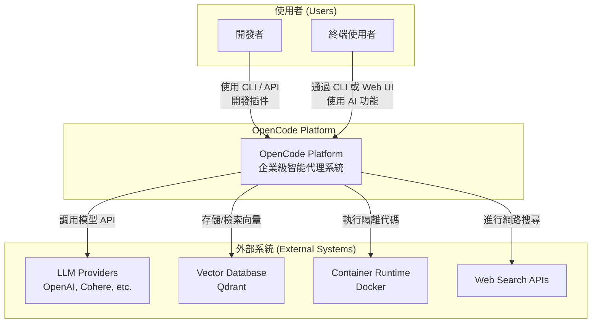
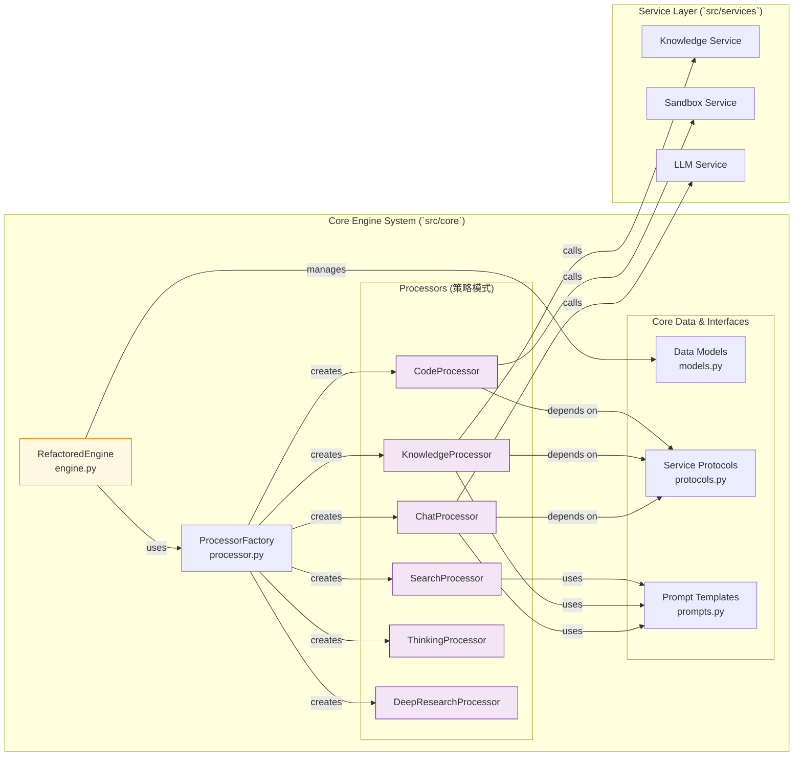
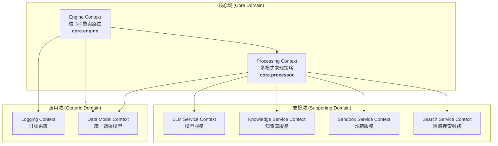
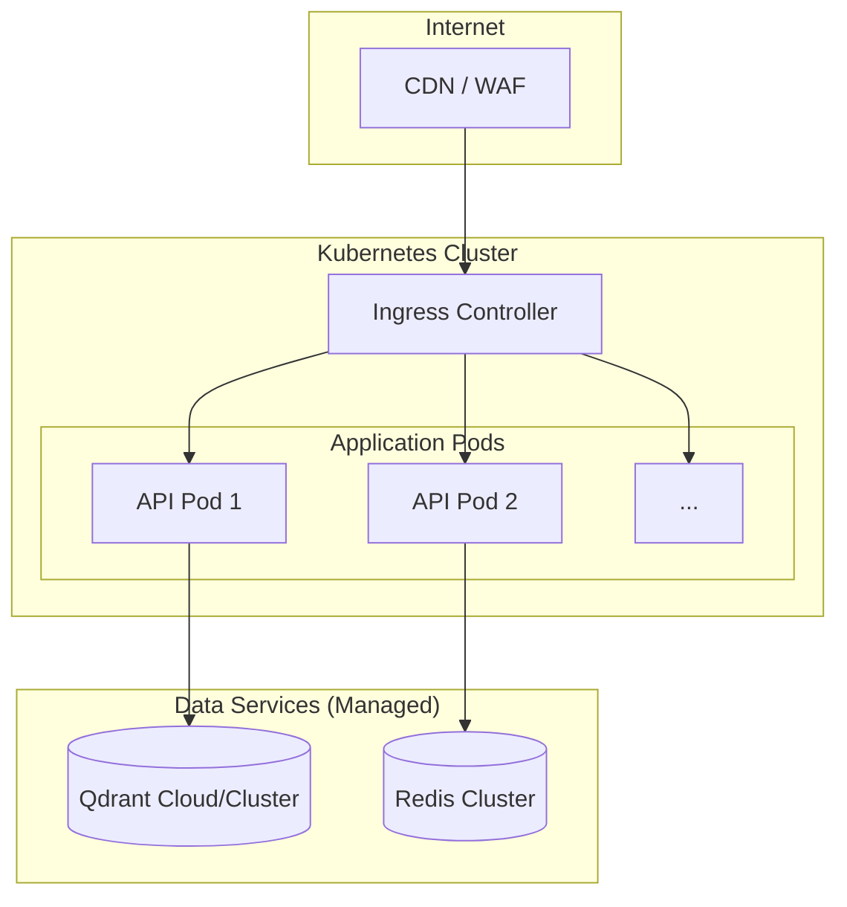

# 整合性架構與設計文件 (Unified Architecture & Design Document) - OpenCode Platform

---

**文件版本 (Document Version):** `v1.2`
**最後更新 (Last Updated):** `2026-02-10`
**主要作者 (Lead Author):** `Gemini AI Architect`
**審核者 (Reviewers):** `架構委員會, 核心開發團隊`
**狀態 (Status):** `修訂中 (Revising)`

---

## 目錄 (Table of Contents)

- [第 1 部分：架構總覽 (Architecture Overview)](#第-1-部分架構總覽-architecture-overview)
  - [1.1 C4 模型：視覺化架構](#11-c4-模型視覺化架構)
  - [1.2 DDD 戰略設計 (Strategic DDD)](#12-ddd-戰略設計-strategic-ddd)
  - [1.3 Clean Architecture 分層](#13-clean-architecture-分層)
- [第 2 部分：詳細設計 (Detailed Design)](#第-2-部分詳細設計-detailed-design)
  - [2.1 核心功能：模組設計](#21-核心功能模組設計)
  - [2.2 非功能性需求設計 (NFRs Design)](#22-非功能性需求設計-nfrs-design)
- [第 3 部分：部署與運維 (Deployment & Operations)](#第-3-部分部署與運維-deployment--operations)

---

**目的**: 本文件將 OpenCode Platform 的業務需求轉化為一個反映 **當前已實現** 和 **未來目標** 的技術藍圖，確保系統的穩固性與可維護性。

---

## 第 1 部分：架構總覽 (Architecture Overview)

### 1.1 C4 模型：視覺化架構

#### L1 - 系統情境圖 (System Context Diagram)
*描述系統與外部使用者和系統的交互。*



#### L2 - 容器圖 (Container Diagram)
*描述系統內部的服務劃分。當前主要交互是 CLI，API Gateway 是輕量級的。*

```mermaid
graph TB
    subgraph "客戶端 (Clients)"
        CLI[CLI<br/><b>(主要交互方式)</b><br>main]
        WebUI[Web UI (未來)<br/>Vue.js SPA]
    end

    subgraph "應用服務 (Application Services)"
        APIGateway[API Gateway<br/>(FastAPI - 基礎存根)<br>src/api]
        CoreEngine[Core Engine<br/><b>(核心業務邏輯)</b><br>src/core]
    end

    subgraph "後端服務 (Backend Services)"
        direction LR
        KnowledgeSvc[Knowledge Service<br>src/services/knowledge]
        SandboxSvc[Sandbox Service<br>src/services/sandbox]
        SearchSvc[Search Service<br>src/services/search]
        OtherSvcs[...]
    end

    subgraph "數據存儲 (Data Stores)"
        QdrantDB[(Qdrant DB)]
        LocalFS[(Local Filesystem<br>logs/, data/)]
    end

    CLI --> CoreEngine
    WebUI -.-> APIGateway

    APIGateway --> CoreEngine
    
    CoreEngine --> KnowledgeSvc
    CoreEngine --> SandboxSvc
    CoreEngine --> SearchSvc
    CoreEngine --> OtherSvcs
    
    KnowledgeSvc --> QdrantDB
    
    style CoreEngine fill:#FFF8E1,stroke:#F57C00
    style CLI fill:#E8F4FD,stroke:#1565C0
```

#### L3 - 元件圖 (Component Diagram) - Core Engine **實際架構**
*描述核心引擎內部的真實組件關係。*



### 1.2 DDD 戰略設計 (Strategic DDD)

#### 通用語言 (Ubiquitous Language)
| 術語 | 定義 | 程式碼對應 |
| :--- | :--- | :--- |
| **Request** | 一個用戶請求的封裝 | `core.models.Request` |
| **Mode** | 請求的處理模式 | `core.models.ProcessingMode` |
| **Engine** | 接收請求並協調處理流程的引擎 | `core.engine.RefactoredEngine` |
| **Processor** | 處理特定模式請求的策略對象 | `core.processor.*Processor` |
| **Context** | 在處理鏈中傳遞的上下文對象 | `core.models.ProcessingContext` |
| **Service** | 封裝外部交互的具體實現 | `src/services/*` |

#### 限界上下文 (Bounded Contexts) - **基於當前實現**


### 1.3 Clean Architecture 分層
專案結構清晰地遵循了分層架構思想，與 Clean Architecture 的理念一致。

- **Entities (Domain Layer)**: `core/models.py` 定義了核心業務對象。
- **Use Cases (Application Layer)**: `core/processor.py` 中的各個 `Processor` 實現了具體的業務用例。`core/engine.py` 則是應用層的協調者。
- **Interface Adapters (Presentation Layer)**: `main.py` (CLI) 和 `src/api/routes.py` (Web API) 是與用戶交互的接口。
- **Frameworks & Drivers (Infrastructure Layer)**: `src/services` 目錄下的所有模組，它們封裝了外部依賴，如資料庫、LLM 客戶端等。

---

## 第 2 部分：詳細設計 (Detailed Design)

### 2.1 核心功能：模組設計

#### 模組: Core Engine & Processors (`core.engine`, `core.processor`)

*   **職責 (Responsibility)**: 根據請求的 `ProcessingMode`，採用 **策略模式 (Strategy Pattern)** 將具體處理任務委派給對應的 `Processor`。
*   **核心組件**:
    - `RefactoredEngine`: 系統的主入口。接收 `Request`，創建 `ProcessingContext`，通過 `ProcessorFactory` 獲取合適的 `Processor`，並執行它。
    - `ProcessorFactory`: 一個簡單的工廠，根據 `ProcessingMode` 返回對應的 `Processor` 實例。
    - `BaseProcessor`: 所有處理器的抽象基類，定義了 `async def process(self, context: ProcessingContext)` 接口。
    - `ChatProcessor`, `KnowledgeProcessor`, etc.: `BaseProcessor` 的具體實現，封裝了特定模式下的業務邏輯。

*   **工作流程 (Sequence Diagram)**:
    ```mermaid
    sequenceDiagram
        participant Client as CLI/API
        participant Engine as RefactoredEngine
        participant Factory as ProcessorFactory
        participant Proc as SpecificProcessor
        participant Svc as External Service

        Client->>Engine: process(Request)
        Engine->>Factory: get_processor(Request.mode)
        Factory-->>Engine: return Processor instance
        Engine->>Proc: process(Context)
        Proc->>Svc: call_service(...)
        Svc-->>Proc: return result
        Proc-->>Engine: update Context
        Engine-->>Client: return Response
    ```

#### 模組: Knowledge Base Service (`services.knowledge`)

*   **職責**: 負責文檔的解析、分塊、向量化、索引和檢索 (RAG)。
*   **核心組件**:
    - `parser.py` / `multimodal_parser.py`: 將不同格式的文檔（PDF, DOCX）解析為文本。
    - `indexer.py`: 將文本分塊並調用 LLM 服務生成向量，然後存入 Qdrant。
    - `retriever.py`: 根據查詢語句生成向量，並從 Qdrant 中檢索最相似的文本塊。
    - `service.py`: 將上述組件整合，對 `core` 層提供統一的服務接口。

#### 模組: Sandbox Service (`services.sandbox`)

*   **職責**: 提供一個安全的、隔離的環境來執行用戶提供的程式碼。
*   **實現方式**:
    1.  接收到程式碼執行請求後，動態創建一個 `Docker` 容器。
    2.  使用 `docker` Python 客戶端在容器內執行程式碼。
    3.  設置資源限制（CPU, 內存）和超時來防止濫用。
    4.  捕獲容器的 `stdout` 和 `stderr` 作為執行結果返回。
    5.  執行完畢後，立即銷毀容器，確保環境的純淨性。
*   **安全**: 這是確保系統安全的關鍵模組，嚴格的隔離是首要設計目標。

### 2.2 非功能性需求設計 (NFRs Design)

#### 性能需求 (Performance Requirements)
| 指標 | 目標 | 實現策略 |
| :--- | :--- | :--- |
| **API 延遲 (P95)** | < 300ms | 全異步 IO (`asyncio`, `httpx`) |
| **CLI 響應** | < 2s (for LLM calls) | 串流輸出（未來），優化 prompt |
| **檢索速度** | < 150ms | Qdrant 索引優化 |

#### 可擴展性設計 (Scalability Design)
*   **無狀態核心**: `CoreEngine` 和 `Processors` 是無狀態的，易於水平擴展（當 API 服務實現後）。
*   **服務解耦**: `services` 層的設計使得可以將特定服務（如 Knowledge Service）獨立部署為微服務。

#### 安全性設計 (Security Design)
| 層面 | 措施 | 實現 |
| :--- | :--- | :--- |
| **沙箱** | Docker 容器隔離 | `services.sandbox.service` |
| **輸入驗證** | 嚴格類型和格式檢查 | Pydantic 模型 |
| **秘密管理** | 從環境變數讀取 | `.env` 和 `python-dotenv` |

---

## 第 3 部分：部署與運維 (Deployment & Operations)

### 3.1 部署架構 (Deployment Architecture)
*   **當前 (v1.0)**: 使用 `docker-compose.yml` 進行本地開發和部署，包含 `backend`, `qdrant`, `frontend`, `sandbox` 四個服務。
*   **未來目標**: 遷移到 Kubernetes (K8s) 進行生產環境部署，以實現自動擴展和高可用。

#### 未來生產環境部署圖 (Target)


### 3.2 CI/CD Pipeline
*   **當前**: 手動執行。
*   **未來目標**: 建立完整的 CI/CD Pipeline。
    ```mermaid
    graph LR
        A[Code Push] --> B[Lint & Test];
        B --> C[Build Docker Image];
        C --> D[Push to Registry];
        D --> E[Deploy to Staging];
        E --> F{Manual Approval};
        F --> G[Deploy to Production];
    ```

### 3.3 監控與可觀測性 (Monitoring & Observability)
*   **日誌**: 當前使用 `structlog` 將結構化日誌輸出到控制台和文件，格式統一，包含追蹤 ID。
*   **未來目標**: 整合 ELK/Loki + Grafana 進行日誌聚合與可視化，並使用 Prometheus 進行指標監控。

---

## 架構演進路線圖 (Architecture Evolution Roadmap)

### Phase 1: 核心功能與穩定性 (已完成)
- [x] **實現 `Engine-Processor` 策略模式架構。**
- [x] **完成核心模式 (Chat, Knowledge, Code, etc.) 的基礎實現。**
- [x] **建立基於 `docker-compose` 的本地開發環境。**
- [x] **實現基於 `structlog` 的專業級日誌系統。**

### Phase 2: API 層建設與服務化 (短期目標)
- [ ] **將 `CoreEngine` 的功能完整地通過 `FastAPI` 暴露出來**，替換當前的 API 存根。
- [ ] **實現串流式 API (`SSE`)**，提升前端用戶體驗。
- [ ] 實現用戶認證與授權系統。
- [ ] 完善插件系統，支持插件的熱加載和管理。

### Phase 3: 企業特性與生產化 (中期目標)
- [ ] 遷移到 Kubernetes 部署，實現高可用和自動擴展。
- [ ] 建立完整的 CI/CD 流程。
- [ ] 引入多租戶支持和資源隔離。
- [ ] 建立全面的監控和告警系統。
