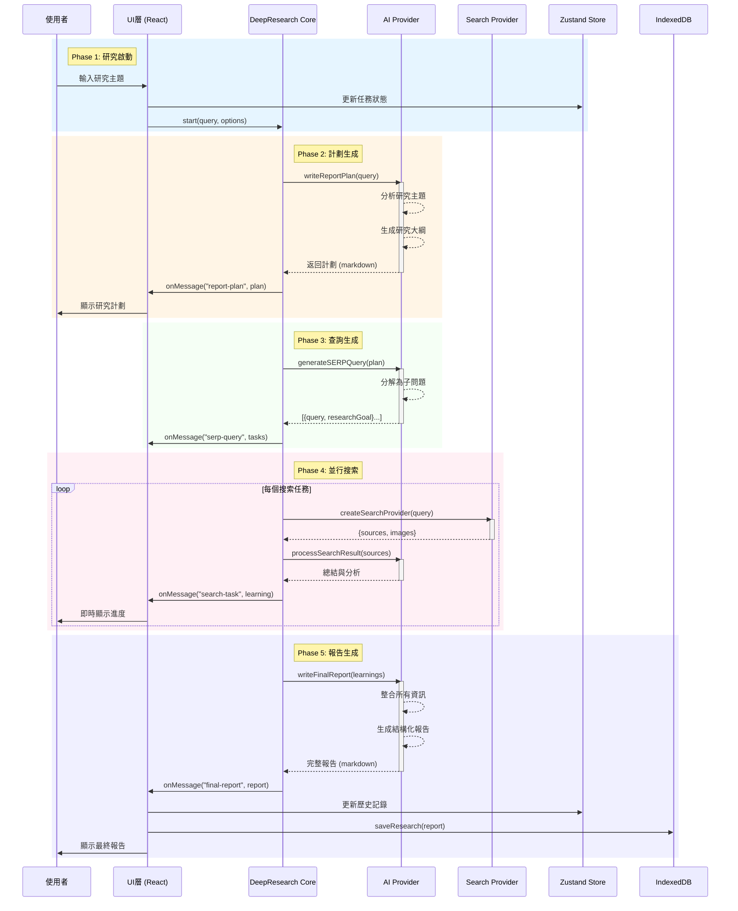
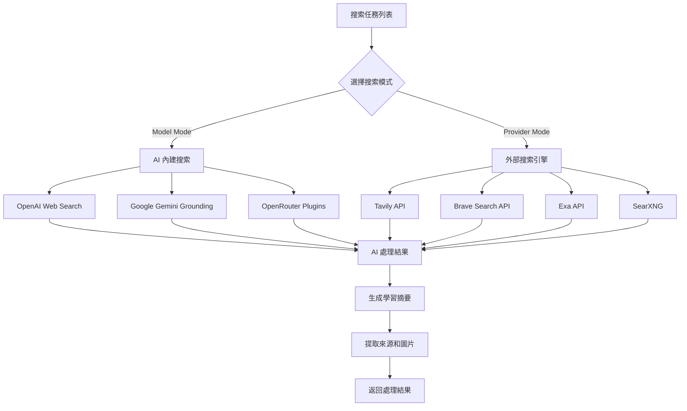
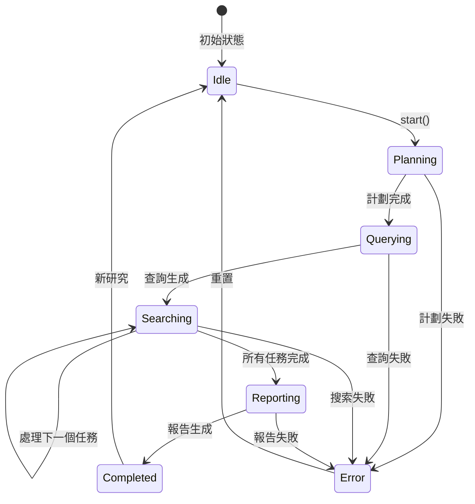

# Deep Research 序列流程分析 (Sequential Flow Analysis)

---

**文件版本:** `v1.1`
**最後更新:** `2026-02-16`
**狀態:** `已批准 (Updated for v3.0 + Context Engineering)`

---

## 執行摘要 (Executive Summary)

Deep Research 是一個 AI 驅動的研究助手，採用**五階段串行處理模式**，通過智能協調多個 AI 和搜索服務提供者來完成深度研究任務。

### 架構定位 (v3.0+)

在當前 v3.0 架構中，Deep Research 是唯一使用 `AgentRuntime` 的模式：
- **ProcessingMode**: `Modes.DEEP_RESEARCH` (frozen dataclass, `cognitive_level="agent"`)
- **Runtime**: `AgentRuntime` — 提供 WorkflowState 追蹤、smart retry (`retry_with_backoff(max=2)`)、ErrorClassifier 分類
- **Processor**: `DeepResearchProcessor` (`src/core/processors/research/processor.py`)
- **Context Engineering** (feature-flag controlled):
  - `ContextManager`: Append-only context 管理，保護 KV-Cache 前綴穩定性
  - `TodoRecitation`: 在長時研究過程中維持注意力聚焦
  - `ErrorPreservation`: 失敗的搜索步驟保留在 context 中，模型從錯誤隱式學習
  - `ToolAvailabilityMask`: Deep Research 模式允許 `["respond", "web_search", "web_fetch", "code_execute"]`

## 核心流程序列圖 (Core Sequential Flow)



## 詳細流程步驟 (Detailed Process Steps)

### 📍 Step 1: 研究啟動 (Research Initiation)

```typescript
// 入口點: src/utils/deep-research/index.ts:537
async start(
  query: string,
  enableCitationImage = true,
  enableReferences = true,
  enableFileFormatResource = false
)
```

**輸入參數:**
- `query`: 用戶的研究問題
- `enableCitationImage`: 是否包含圖片引用
- `enableReferences`: 是否包含參考文獻
- `enableFileFormatResource`: 是否生成資源文件

### 📍 Step 2: 研究計劃生成 (Report Plan Generation)

```typescript
// src/utils/deep-research/index.ts:112
async writeReportPlan(query: string): Promise<string>
```

**處理流程:**
1. 調用 AI 模型分析研究主題
2. 生成研究大綱和框架
3. 使用 streaming 實時返回內容
4. 發送進度事件: `onMessage("report-plan", content)`

**輸出範例:**
```markdown
# 研究計劃：量子計算的最新進展

## 研究目標
- 了解量子計算的基本原理
- 探索當前的應用領域
- 分析技術挑戰和限制
- 展望未來發展趨勢

## 研究範圍
1. 理論基礎
2. 硬件發展
3. 軟件和算法
4. 產業應用
5. 未來展望
```

### 📍 Step 3: SERP 查詢生成 (Search Query Generation)

```typescript
// src/utils/deep-research/index.ts:150
async generateSERPQuery(
  reportPlan: string
): Promise<DeepResearchSearchTask[]>
```

**處理流程:**
1. 基於研究計劃生成 5-7 個搜索查詢
2. 每個查詢包含具體的研究目標
3. 返回結構化的任務陣列

**輸出格式:**
```typescript
interface DeepResearchSearchTask {
  query: string;         // 搜索查詢
  researchGoal: string;  // 研究目標
}
```

### 📍 Step 4: 並行搜索執行 (Parallel Search Execution)

```typescript
// src/utils/deep-research/index.ts:189
async runSearchTask(
  tasks: DeepResearchSearchTask[],
  enableReferences = true
): Promise<SearchTask[]>
```

**執行策略:**



**並行處理特點:**
- 使用 `for await` 循環順序處理任務
- 每個任務獨立執行，失敗不影響其他
- 實時 streaming 返回結果
- 自動去重和排序

### 📍 Step 5: 最終報告生成 (Final Report Generation)

```typescript
// src/utils/deep-research/index.ts:386
async writeFinalReport(
  reportPlan: string,
  tasks: DeepResearchSearchResult[],
  enableCitationImage = true,
  enableReferences = true,
  enableFileFormatResource = true
): Promise<FinalReportResult>
```

**整合流程:**
1. 收集所有搜索任務的學習結果
2. 合併去重來源和圖片
3. 生成資源文件 (可選)
4. 調用 AI 生成結構化報告
5. 添加引用標記和參考文獻

**輸出結構:**
```typescript
interface FinalReportResult {
  title: string;          // 報告標題
  finalReport: string;    // 完整報告 (markdown)
  learnings: string[];    // 學習摘要陣列
  sources: Source[];      // 來源列表
  images: ImageSource[];  // 圖片列表
}
```

## 狀態管理與事件流 (State Management & Event Flow)

### 事件類型 (Event Types)

| 事件名稱 | 觸發時機 | 數據格式 |
|:---|:---|:---|
| `progress` | 階段開始/結束 | `{step, status, data?}` |
| `message` | 內容生成 | `{type: "text", text}` |
| `reasoning` | AI 思考過程 | `{type: "text", text}` |
| `error` | 錯誤發生 | `{message}` |

### 狀態流轉圖 (State Transition)



## 性能優化策略 (Performance Optimization)

### 1. Streaming 響應
- 使用 Server-Sent Events (SSE)
- 實時推送 AI 生成內容
- 減少用戶等待感知

### 2. 並行處理
- 搜索任務序列執行但獨立處理
- 單個失敗不影響整體
- Promise.allSettled 容錯處理

### 3. 智能快取
```typescript
// 快取策略
const cacheStrategy = {
  searchResults: 3600,    // 1 小時
  aiResponses: 0,        // 不快取
  reportPlan: 1800,      // 30 分鐘
};
```

### 4. 資源優化
- 圖片延遲加載
- 分塊傳輸大型報告
- IndexedDB 本地存儲

## 錯誤處理機制 (Error Handling)

```typescript
// 錯誤處理流程
try {
  const reportPlan = await this.writeReportPlan(query);
  const tasks = await this.generateSERPQuery(reportPlan);
  const results = await this.runSearchTask(tasks);
  const finalReport = await this.writeFinalReport(reportPlan, results);
  return finalReport;
} catch (err) {
  // 統一錯誤處理
  const errorMessage = err instanceof Error ? err.message : "Unknown error";
  this.onMessage("error", { message: errorMessage });
  throw new Error(errorMessage);
}
```

### 降級策略
1. **AI Provider 失敗**: 自動切換備用模型 (MultiProviderLLMClient fallback chain)
2. **搜索引擎失敗**: 跳過該引擎繼續 (Tavily -> Serper -> DuckDuckGo)
3. **部分失敗**: 使用成功的結果生成報告
4. **Context Engineering**: 失敗的搜索步驟通過 ErrorPreservation 保留在 context 中，後續步驟可從錯誤中學習 (feature-flag controlled)

## 配置與擴展 (Configuration & Extension)

### 提供者配置
```typescript
interface DeepResearchOptions {
  AIProvider: {
    provider: "openai" | "anthropic" | "deepseek" | "gemini";
    thinkingModel: string;  // 用於計劃和報告
    taskModel: string;      // 用於搜索處理
  };
  searchProvider: {
    provider: "tavily" | "brave" | "exa" | "model";
    maxResult?: number;     // 最大結果數
  };
  language?: string;        // 響應語言
}
```

### 擴展點
1. **新增 AI 提供者**: 實現 AIProvider 介面
2. **新增搜索引擎**: 實現 SearchProvider 介面
3. **自定義處理器**: 覆寫 onMessage 回調
4. **MCP 工具集成**: 通過 MCP Server 擴展

## 監控指標 (Monitoring Metrics)

| 指標 | 目標值 | 監控方式 |
|:---|:---|:---|
| 完整流程耗時 | < 60s | Performance API |
| 單步驟成功率 | > 95% | Event tracking |
| AI Token 使用 | < 10K/query | Provider metrics |
| 搜索 API 調用 | < 20/query | API counter |

## 最佳實踐建議 (Best Practices)

1. **查詢優化**
   - 使用明確具體的研究問題
   - 避免過於寬泛的主題
   - 提供必要的上下文

2. **資源管理**
   - 選擇合適的 AI 模型
   - 控制搜索結果數量
   - 啟用參考文獻管理

3. **用戶體驗**
   - 顯示即時進度反饋
   - 提供中斷和重試選項
   - 保存研究歷史記錄

---

## 總結 (Summary)

Deep Research 採用**五階段串行架構**，通過智能協調 AI 和搜索服務，實現高質量的自動化研究。關鍵優勢：

- **模組化設計** - 各階段獨立，易於維護
- **容錯機制** - 單點失敗不影響整體 (AgentRuntime retry + ErrorClassifier)
- **實時反饋** - Streaming 提升用戶體驗
- **可擴展性** - 輕鬆添加新的提供者
- **Context Engineering** - Append-only context 保護 KV-Cache，錯誤保留實現隱式學習 (v3.1)