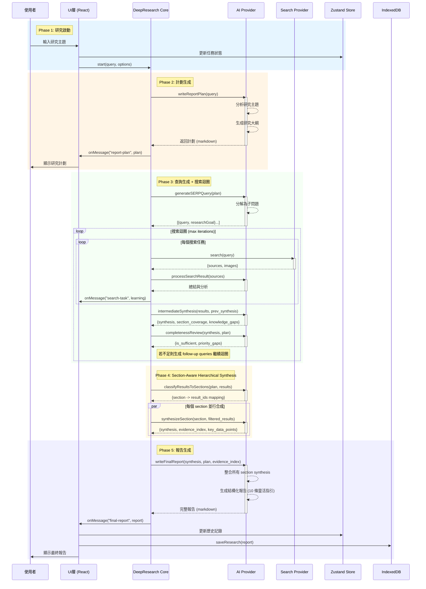
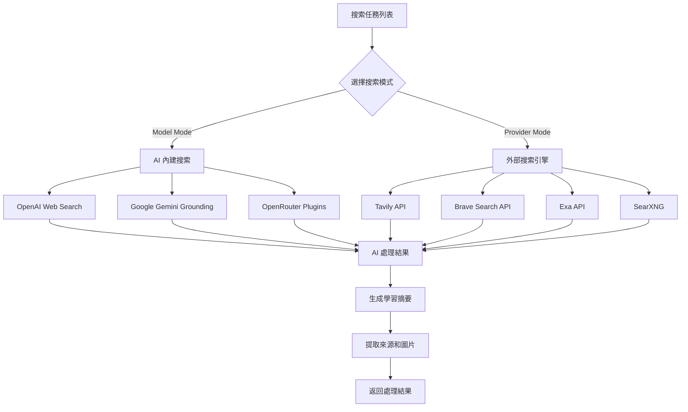
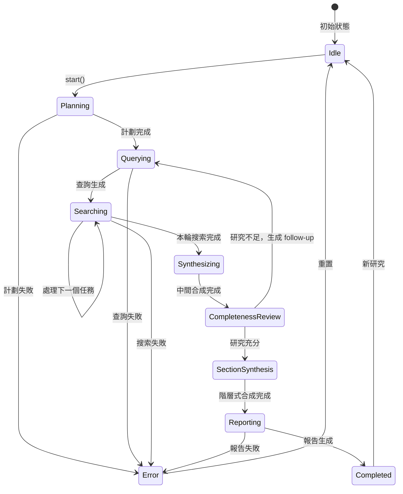

# Deep Research 序列流程分析 (Sequential Flow Analysis)

---

**文件版本:** `v2.0`
**最後更新:** `2026-02-25`
**狀態:** `已批准 (v3.3 Pipeline Reengineering — 去制式化)`

---

## 執行摘要 (Executive Summary)

Deep Research 是一個 AI 驅動的研究助手，採用**五階段串行處理模式**，通過智能協調多個 AI 和搜索服務提供者來完成深度研究任務。

**v3.3 變更 (Pipeline Reengineering)**:
- 移除 Domain Identification、Critical Analysis、Chart Planning/Execution 三個階段
- 新增 Section-Aware Hierarchical Synthesis 階段
- 報告 prompt 從 23 條制式規則簡化為 10 條靈活指引
- LLM calls 從 ~12-22 降至 ~9-16

### 架構定位 (v3.0+)

在當前 v3.0 架構中，Deep Research 是唯一使用 `AgentRuntime` 的模式：
- **ProcessingMode**: `Modes.DEEP_RESEARCH` (frozen dataclass, `cognitive_level="agent"`)
- **Runtime**: `AgentRuntime` — 提供 WorkflowState 追蹤、smart retry (`retry_with_backoff(max=2)`)、ErrorClassifier 分類
- **Processor**: `DeepResearchProcessor` (`src/core/processors/research/processor.py`)
- **Context Engineering** (feature-flag controlled):
  - `ContextManager`: Append-only context 管理，保護 KV-Cache 前綴穩定性
  - `TodoRecitation`: 在長時研究過程中維持注意力聚焦
  - `ErrorPreservation`: 失敗的搜索步驟保留在 context 中，模型從錯誤隱式學習
  - `ToolAvailabilityMask`: Deep Research 模式允許 `["respond", "web_search", "web_fetch", "code_execute"]`

## 核心流程序列圖 (Core Sequential Flow)



## 詳細流程步驟 (Detailed Process Steps)

### Step 1: 研究啟動 (Research Initiation)

```typescript
// 入口點: src/utils/deep-research/index.ts:537
async start(
  query: string,
  enableCitationImage = true,
  enableReferences = true,
  enableFileFormatResource = false
)
```

**輸入參數:**
- `query`: 用戶的研究問題
- `enableCitationImage`: 是否包含圖片引用
- `enableReferences`: 是否包含參考文獻
- `enableFileFormatResource`: 是否生成資源文件

### Step 2: 研究計劃生成 (Report Plan Generation)

```python
# src/core/processors/research/planner.py
async def write_report_plan(self, context: ProcessingContext) -> str:
```

**處理流程:**
1. 調用 AI 模型分析研究主題
2. 生成研究大綱和框架
3. 使用 streaming 實時返回內容
4. 發送進度事件: `onMessage("report-plan", content)`

### Step 3: 搜索迴圈 (Search Loop)

搜索迴圈包含四個子步驟，可迭代執行直到研究充分或達到最大迭代數：

#### 3a. SERP 查詢生成

```python
# src/core/processors/research/planner.py
async def generate_serp_queries(
    self, context: ProcessingContext, plan: str,
    search_config: SearchEngineConfig = None,
    language: str = None
) -> List[Dict]:
```

基於研究計劃生成 5-8 個搜索查詢，每個包含 `query`、`researchGoal`、`priority`。

> **v3.3 變更**: 移除了 `domains` 參數。Domain-aware 搜索策略已合併到 SERP prompt 中（"Cover different aspects/domains proportionally"），不再需要獨立的 Domain Identification LLM call。

#### 3b. 搜索執行



#### 3c. Intermediate Synthesis

```python
# src/core/processors/research/analyzer.py
async def intermediate_synthesis(
    self, context: ProcessingContext, report_plan: str,
    wave_results: List[Dict], previous_synthesis: Optional[str] = None
) -> Dict[str, Any]:
```

整合本波搜尋結果與前波理解，輸出 JSON:
```json
{
  "synthesis": "整合後的理解...",
  "section_coverage": {"section_name": {"status": "covered|partial|missing"}},
  "knowledge_gaps": ["gap1", "gap2"],
  "cross_domain_links": ["link1"]
}
```

#### 3d. Completeness Review

```python
# src/core/processors/research/analyzer.py
async def completeness_review(
    self, context: ProcessingContext, report_plan: str,
    synthesis: str, section_coverage: Dict, iteration: int
) -> Tuple[bool, Dict]:
```

章節級評估 — 每個 section 的覆蓋率和深度，整體是否足夠。不足時生成 `priority_gaps` 驅動 follow-up queries。

### Step 4: Section-Aware Hierarchical Synthesis

```python
# src/core/processors/research/section_synthesizer.py
class SectionSynthesizer:
    async def build_hierarchical_context(
        self, context, report_plan, search_results,
        language=None
    ) -> Dict:
```

**處理流程:**
1. `parse_sections(report_plan)` — 從報告大綱解析出所有 section 標題
2. `classify_results_to_sections(context, sections, search_results)` — 1 LLM call 將搜尋結果按章節分類
3. `synthesize_section(context, section, filtered_results)` — N 個並行 LLM call，每個 section 獨立合成

**輸出:**
```python
{
    "section_context": "## Section 1\n{synthesis}\n\n## Section 2\n...",
    "evidence_index": [
        {"claim": "...", "source_ids": [1, 3], "confidence": "high"},
        ...
    ]
}
```

> **v3.3 新增**: 此階段解決了「漸進式摘要資訊漏斗」問題 — 傳統的單一 synthesis 將 ~70K chars 壓縮到 ~3.5K (0.7% 保留率)。Section-aware synthesis 讓每個 section 直接存取其相關的原始搜尋結果，保留率提升至 ~16%。

### Step 5: 最終報告生成 (Final Report Generation)

```python
# src/core/processors/research/reporter.py
async def write_final_report(
    self, context: ProcessingContext,
    search_results: List[Dict],
    report_plan: str,
    synthesis: str = None,
    language: str = None,
    evidence_index: Optional[List[Dict]] = None
) -> str:
```

**整合流程:**
1. 組合 section synthesis + detailed source material (Dual-Context)
2. 構建 evidence citation index (pre-verified claim-source mappings)
3. 調用 AI 生成報告 (10 條靈活指引，信任模型推理能力)
4. 分析引用 — 區分 cited refs 和 uncited refs
5. 格式化報告 + 分類引用統計
6. 儲存 report bundle: `logs/reports/{trace_id}_{timestamp}/`

> **v3.3 變更**: 移除了 `critical_analysis` 和 `computational_result` 參數。報告 prompt 從 23 條 McKinsey-grade 制式規則簡化為 10 條靈活指引，避免 MECE/Pyramid/CEI 等 MBA 框架導致的機械化輸出。

**報告 prompt 核心指引 (10 條):**
1. Inline citations [1], [2], [3]
2. 不含 references section (另外附加)
3. ## / ### 結構化標題
4. 3000+ words 分析深度
5. 具體數字、公司名、統計數據
6. Markdown pipe-table syntax
7. 跨章節交叉引用
8. 優先引用 Tier 1-2 來源
9. 方法論章節 (研究範圍、來源、局限)
10. 自然分析式寫作，避免制式模板

## 狀態管理與事件流 (State Management & Event Flow)

### 事件類型 (Event Types)

| 事件名稱 | 觸發時機 | 數據格式 |
|:---|:---|:---|
| `progress` | 階段開始/結束 | `{step, status, data?}` |
| `message` | 內容生成 | `{type: "text", text}` |
| `reasoning` | AI 思考過程 | `{type: "text", text}` |
| `error` | 錯誤發生 | `{message}` |

### 狀態流轉圖 (State Transition)



## 性能優化策略 (Performance Optimization)

### 1. Streaming 響應
- 使用 Server-Sent Events (SSE)
- 實時推送 AI 生成內容
- 減少用戶等待感知

### 2. 並行處理
- 搜索任務序列執行但獨立處理
- Section synthesis 並行執行 (每個 section 獨立 LLM call)
- 單個失敗不影響整體

### 3. 智能快取
```typescript
// 快取策略
const cacheStrategy = {
  searchResults: 3600,    // 1 小時
  aiResponses: 0,        // 不快取
  reportPlan: 1800,      // 30 分鐘
};
```

### 4. 資源優化
- 圖片延遲加載
- 分塊傳輸大型報告
- IndexedDB 本地存儲

## 錯誤處理機制 (Error Handling)

```typescript
// 錯誤處理流程
try {
  const reportPlan = await this.writeReportPlan(query);
  const tasks = await this.generateSERPQuery(reportPlan);
  const results = await this.runSearchTask(tasks);
  const finalReport = await this.writeFinalReport(reportPlan, results);
  return finalReport;
} catch (err) {
  // 統一錯誤處理
  const errorMessage = err instanceof Error ? err.message : "Unknown error";
  this.onMessage("error", { message: errorMessage });
  throw new Error(errorMessage);
}
```

### 降級策略
1. **AI Provider 失敗**: 自動切換備用模型 (MultiProviderLLMClient fallback chain)
2. **搜索引擎失敗**: 跳過該引擎繼續 (Tavily -> Serper -> DuckDuckGo)
3. **部分失敗**: 使用成功的結果生成報告
4. **Context Engineering**: 失敗的搜索步驟通過 ErrorPreservation 保留在 context 中，後續步驟可從錯誤中學習 (feature-flag controlled)
5. **Section Synthesis 降級**: 若 section classification 失敗，退化為傳統的全量 synthesis

## 配置與擴展 (Configuration & Extension)

### 搜索預算模型 (Search Budget Model)

環境變數控制搜索資源分配：

| 環境變數 | 預設值 | 說明 |
|:---|:---:|:---|
| `DEEP_RESEARCH_QUERIES_FIRST_ITERATION` | `8` | 第一輪迭代的搜索查詢數 |
| `DEEP_RESEARCH_QUERIES_FOLLOWUP_ITERATION` | `5` | 後續迭代的搜索查詢數 |
| `DEEP_RESEARCH_MAX_TOTAL_QUERIES` | `20` | 每次研究的最大搜索查詢總數 |
| `DEEP_RESEARCH_URLS_PER_QUERY` | `3` | 每個查詢抓取的完整內容 URL 數 |

### 研究數據儲存 (Research Data Storage)

研究數據以 per-session bundle 儲存：
```
logs/reports/{trace_id[:8]}_{timestamp}/
  ├── report.md         # Clean markdown report
  └── metadata.json     # Structured metadata (query, mode, model, duration, citations)
```

### 提供者配置
```typescript
interface DeepResearchOptions {
  AIProvider: {
    provider: "openai" | "anthropic" | "deepseek" | "gemini";
    thinkingModel: string;  // 用於計劃和報告
    taskModel: string;      // 用於搜索處理
  };
  searchProvider: {
    provider: "tavily" | "brave" | "exa" | "model";
    maxResult?: number;     // 最大結果數
  };
  language?: string;        // 響應語言
}
```

### 擴展點
1. **新增 AI 提供者**: 實現 AIProvider 介面
2. **新增搜索引擎**: 實現 SearchProvider 介面
3. **自定義處理器**: 覆寫 onMessage 回調
4. **MCP 工具集成**: 通過 MCP Server 擴展

## 監控指標 (Monitoring Metrics)

| 指標 | 目標值 | 監控方式 |
|:---|:---|:---|
| 完整流程耗時 | < 60s | Performance API |
| 單步驟成功率 | > 95% | Event tracking |
| AI Token 使用 | < 10K/query | Provider metrics |
| 搜索 API 調用 | < 20/query | API counter |

## 最佳實踐建議 (Best Practices)

1. **查詢優化**
   - 使用明確具體的研究問題
   - 避免過於寬泛的主題
   - 提供必要的上下文

2. **資源管理**
   - 選擇合適的 AI 模型
   - 控制搜索結果數量
   - 啟用參考文獻管理

3. **用戶體驗**
   - 顯示即時進度反饋
   - 提供中斷和重試選項
   - 保存研究歷史記錄

---

## 總結 (Summary)

Deep Research 採用**五階段串行架構**，通過智能協調 AI 和搜索服務，實現高質量的自動化研究。關鍵優勢：

- **模組化設計** - 各階段獨立，易於維護 (planner/analyzer/section_synthesizer/reporter)
- **容錯機制** - 單點失敗不影響整體 (AgentRuntime retry + ErrorClassifier)
- **實時反饋** - Streaming 提升用戶體驗
- **可擴展性** - 輕鬆添加新的提供者
- **Context Engineering** - Append-only context 保護 KV-Cache，錯誤保留實現隱式學習 (v3.1)
- **Hierarchical Synthesis** - Section-aware 合成解決資訊漏斗問題，保留率從 0.7% 提升至 ~16% (v3.3)
- **去制式化** - 信任模型推理能力，10 條靈活指引取代 23 條制式規則 (v3.3)

---

## 版本歷史

| 版本 | 日期 | 變更 |
|------|------|------|
| v1.0 | 2026-02-18 | 初始版本 (v3.0 架構) |
| v1.1 | 2026-02-23 | 新增 Chart Planning, Computational Analysis, Report Quality |
| v1.2 | 2026-02-23 | 新增 Context Engineering |
| v2.0 | 2026-02-25 | **Pipeline Reengineering**: 移除 Domain ID / Critical Analysis / Chart Planning + Execution; 新增 Section-Aware Hierarchical Synthesis; 報告 prompt 去制式化 (23→10 rules) |
