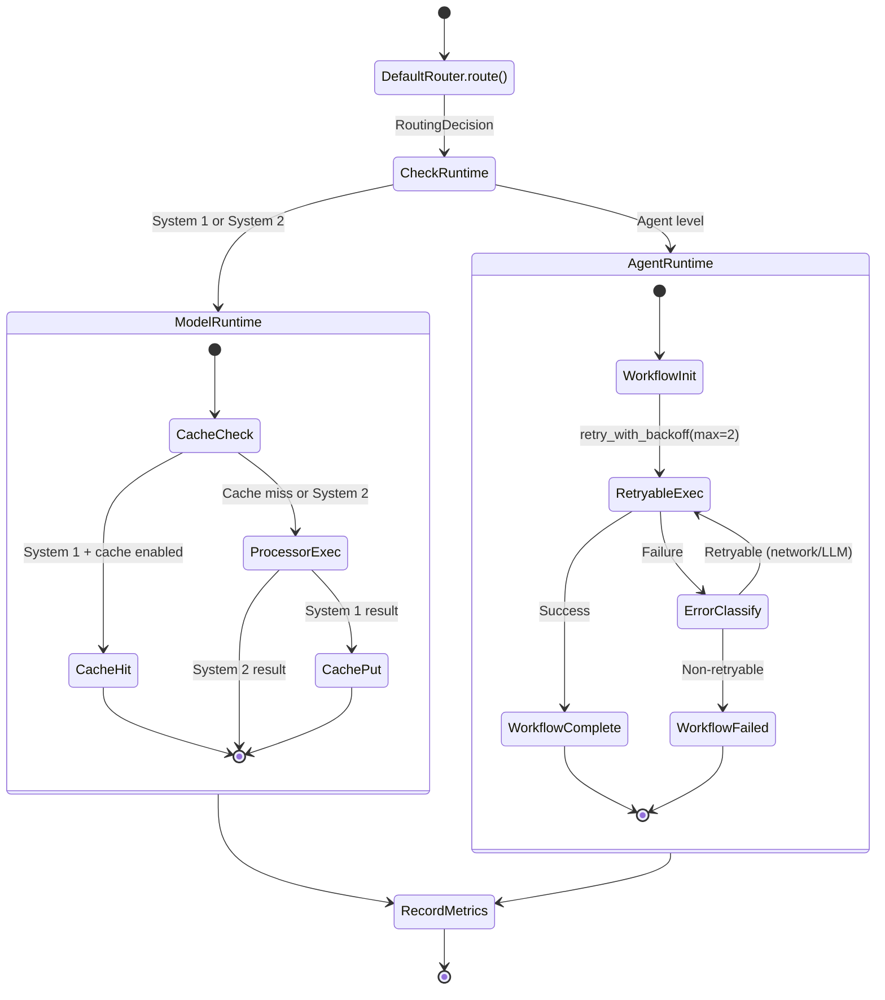
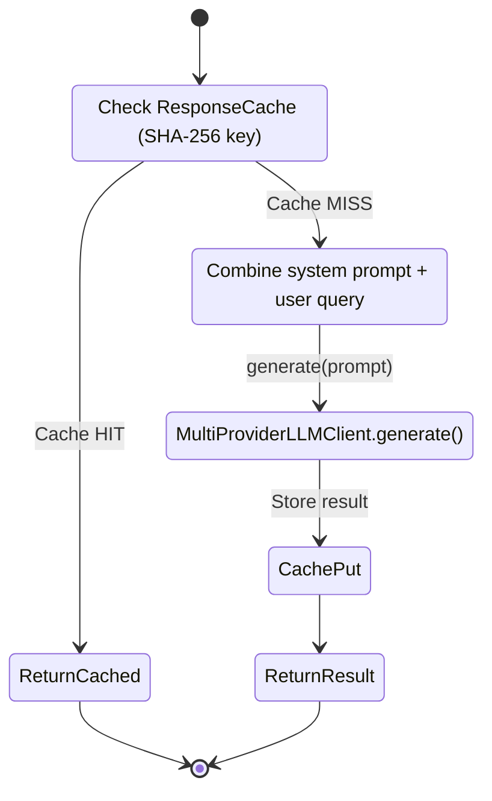
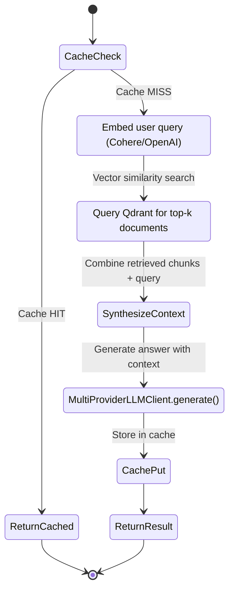
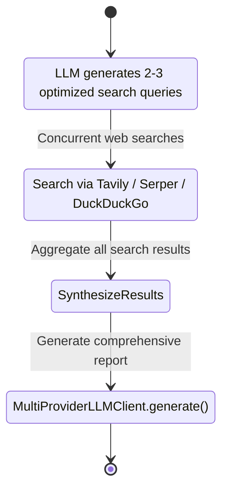
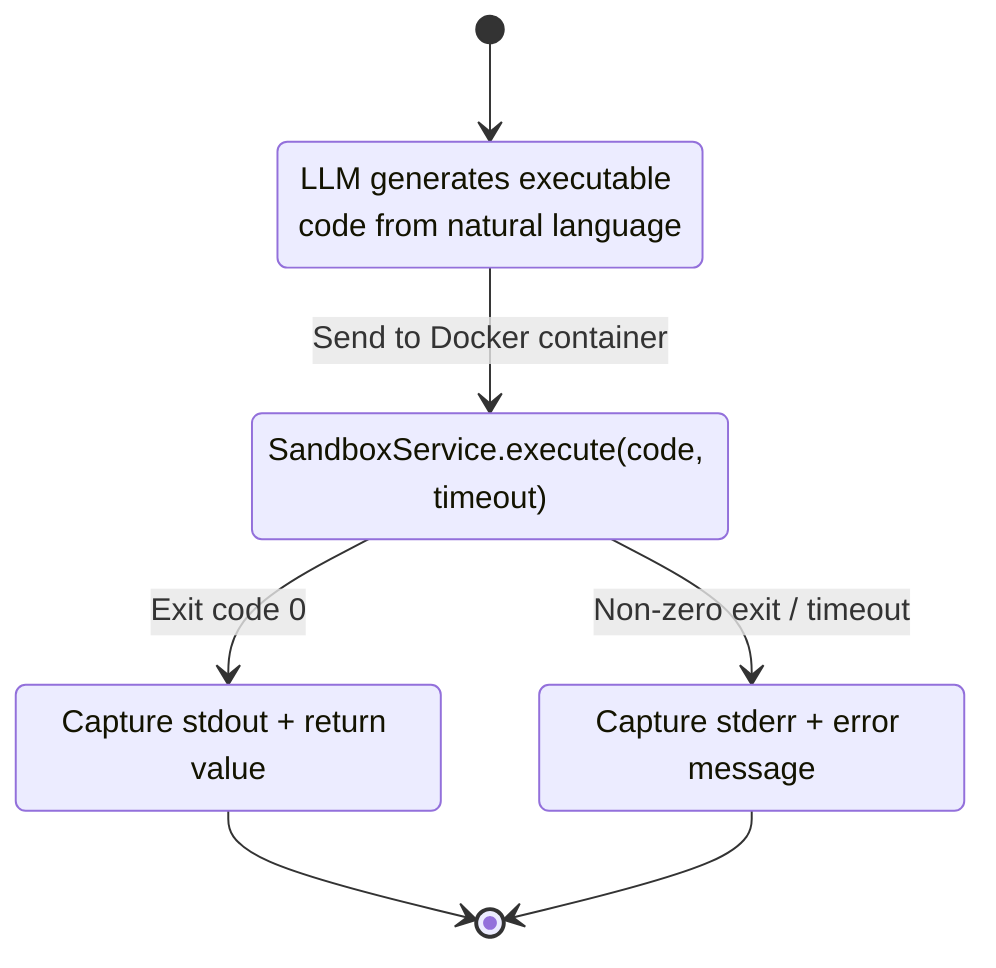
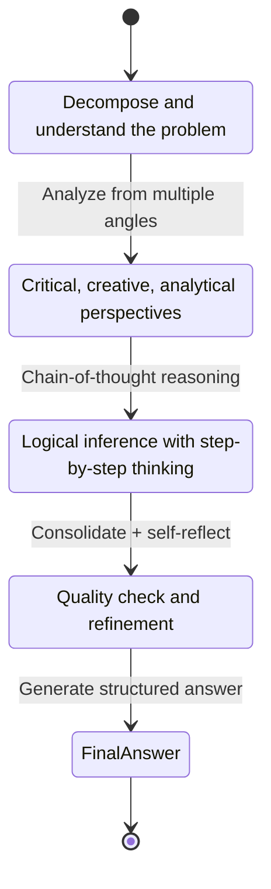
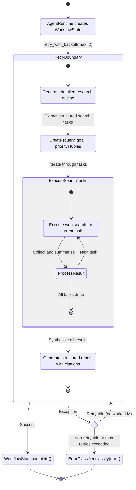

# Processing Mode State Machines

---

**Document Version:** `v2.0`
**Last Updated:** `2026-02-12`
**Status:** `Current (Implemented)`

---

## 1. Overview

This document visualizes the internal workflow of each `ProcessingMode` using state machine diagrams. Each mode is implemented by a corresponding `Processor` class in `src/core/processor.py`.

### Cognitive Architecture Context

Every mode is classified into a cognitive level that determines its runtime execution path:

| Cognitive Level | Modes | Runtime | Characteristics |
|:---|:---|:---|:---|
| **System 1** | CHAT, KNOWLEDGE | ModelRuntime | Fast, cached (optional), stateless |
| **System 2** | SEARCH, CODE, THINKING | ModelRuntime | Analytical, multi-step, stateless |
| **Agent** | DEEP_RESEARCH | AgentRuntime | Stateful, workflow-tracked, retry-wrapped |

### Request Lifecycle (All Modes)

---

## 2. Chat Mode (`ProcessingMode.CHAT`)

**Processor**: `ChatProcessor`
**Cognitive Level**: System 1
**Runtime**: ModelRuntime (cacheable)

The simplest mode. Direct LLM call with system prompt.

### State Machine

### State Descriptions

- **CacheCheck**: SHA-256 hash of `mode:query` checked against ResponseCache. Only when `system1.enable_cache` flag is ON.
- **BuildPrompt**: Combines CHAT system prompt template with user query.
- **CallLLM**: Calls `MultiProviderLLMClient.generate()` — OpenAI first, fallback to Anthropic/Gemini on retryable error.
- **CachePut**: Stores result in ResponseCache with TTL (default 300s).

---

## 3. Knowledge Mode (`ProcessingMode.KNOWLEDGE`)

**Processor**: `KnowledgeProcessor`
**Cognitive Level**: System 1
**Runtime**: ModelRuntime (cacheable)

RAG (Retrieval-Augmented Generation) pipeline — retrieves from vector DB before generating.

### State Machine

### State Descriptions

- **GenerateEmbeddings**: Converts user query to vector using embedding provider (Cohere or OpenAI).
- **SearchVectorDB**: Performs similarity search in Qdrant, retrieves top-k document chunks.
- **SynthesizeContext**: Combines retrieved document fragments with the original query into an enriched prompt.
- **CallLLM**: Generates a knowledge-grounded answer via the multi-provider LLM chain.

---

## 4. Search Mode (`ProcessingMode.SEARCH`)

**Processor**: `SearchProcessor`
**Cognitive Level**: System 2
**Runtime**: ModelRuntime (no cache)

Multi-step web search with query expansion and result synthesis.

### State Machine

### State Descriptions

- **GenerateSearchQueries**: LLM converts a vague user question into 2-3 precise, search-engine-optimized queries.
- **ExecuteSearches**: Executes each query through the multi-engine search service (Tavily > Serper > DuckDuckGo fallback).
- **SynthesizeResults**: Consolidates all search results into a unified context.
- **CallLLM**: Generates a comprehensive answer based on the aggregated context.

---

## 5. Code Mode (`ProcessingMode.CODE`)

**Processor**: `CodeProcessor`
**Cognitive Level**: System 2
**Runtime**: ModelRuntime (no cache)

Code generation and isolated execution in Docker sandbox.

### State Machine

### State Descriptions

- **GenerateCode**: LLM converts natural language requirements into executable code (Python).
- **ExecuteInSandbox**: Creates an isolated Docker container with resource limits (CPU, memory, timeout). Executes the generated code.
- **FormatSuccess/Error**: Collects stdout, stderr, return value, and execution time. Returns formatted result to user.

---

## 6. Thinking Mode (`ProcessingMode.THINKING`)

**Processor**: `ThinkingProcessor`
**Cognitive Level**: System 2
**Runtime**: ModelRuntime (no cache)

Multi-stage deep thinking process for complex or abstract problems.

### State Machine

### State Descriptions

- **ProblemAnalysis**: Decomposes the problem into components and identifies key aspects.
- **MultiPerspective**: Analyzes from different angles (critical, creative, analytical).
- **DeepReasoning**: Applies chain-of-thought (CoT) methodology for logical reasoning.
- **SynthesisAndReflection**: Consolidates all intermediate analysis, self-reflects to improve quality.
- **FinalAnswer**: Produces a comprehensive, structured final answer based on the full thinking process.

---

## 7. Deep Research Mode (`ProcessingMode.DEEP_RESEARCH`)

**Processor**: `DeepResearchProcessor`
**Cognitive Level**: Agent
**Runtime**: AgentRuntime (stateful, retry-wrapped)

Automated research pipeline. This is the only mode that uses AgentRuntime, which provides:
- **WorkflowState tracking**: steps = `[plan, search, synthesize]`
- **Smart retry**: `retry_with_backoff(max_retries=2, base_delay=1.0)` — retries on network/LLM errors only
- **Error classification**: Failed steps recorded with `ErrorClassifier.classify()` category

### State Machine

### State Descriptions

- **InitWorkflow**: AgentRuntime creates a `WorkflowState(steps=["plan", "search", "synthesize"])` and sets status to "running".
- **WriteReportPlan**: LLM generates a detailed research report outline based on user requirements.
- **GenerateSearchQueries**: Extracts structured search tasks (query, goal, priority) from the research plan.
- **ExecuteSearchTasks**: Iterates through each search task, executing web searches and processing results.
- **WriteFinalReport**: Synthesizes all search results with the original plan into a structured report with citations.
- **ErrorHandling**: On failure, `ErrorClassifier` categorizes the error. NETWORK/LLM errors trigger retry (up to 2 times with exponential backoff). BUSINESS/RESOURCE_LIMIT/UNKNOWN errors fail immediately.
- **WorkflowComplete/Failed**: Final workflow state is recorded in `context.intermediate_results["workflow_state"]`.

---

## 8. Mode-to-Infrastructure Mapping

| Mode | Cognitive Level | Runtime | Cache | Retry | LLM Calls | External Services |
|:---|:---|:---|:---:|:---:|:---:|:---|
| **CHAT** | System 1 | ModelRuntime | Yes | No | 1 | LLM only |
| **KNOWLEDGE** | System 1 | ModelRuntime | Yes | No | 1 | Embedding + Qdrant + LLM |
| **SEARCH** | System 2 | ModelRuntime | No | No | 2+ | Search engines + LLM |
| **CODE** | System 2 | ModelRuntime | No | No | 1 | LLM + Docker |
| **THINKING** | System 2 | ModelRuntime | No | No | 4-5 | LLM only |
| **DEEP_RESEARCH** | Agent | AgentRuntime | No | Yes (max 2) | 3+ | Search engines + LLM |
