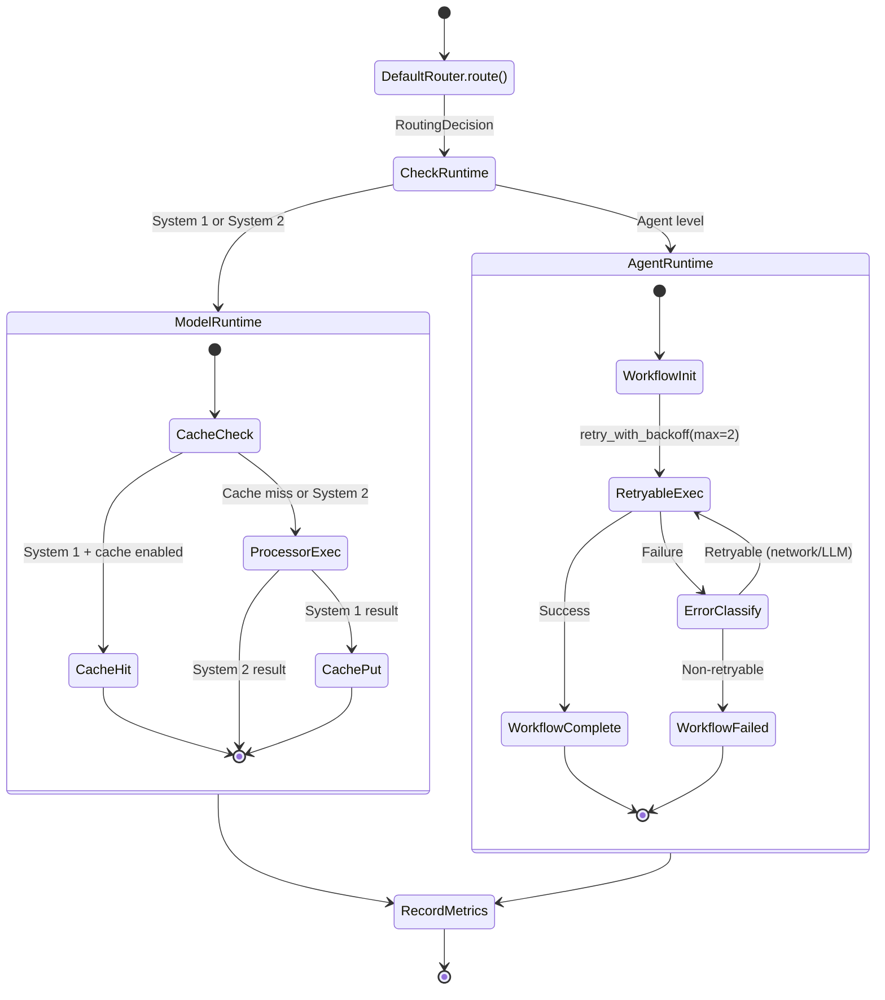
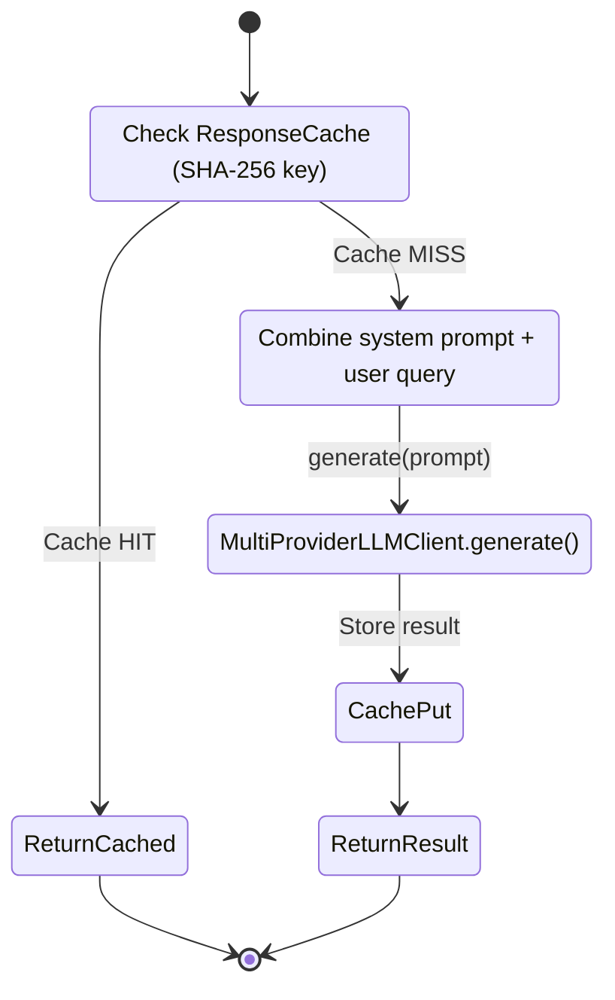
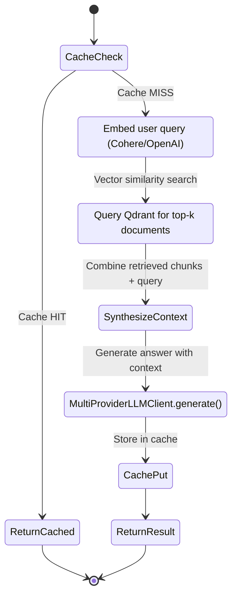
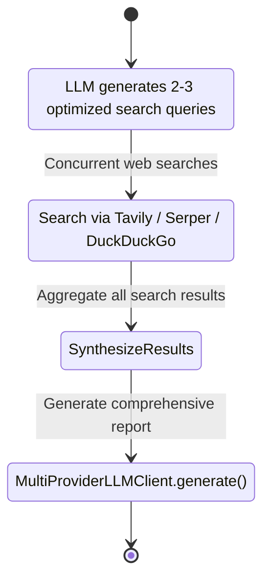
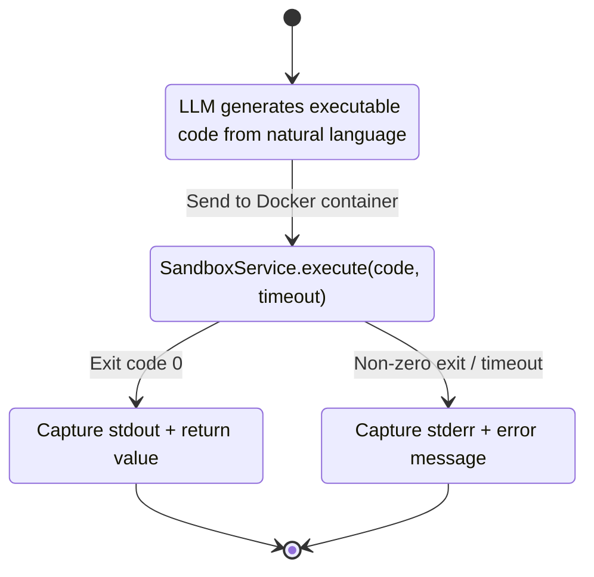
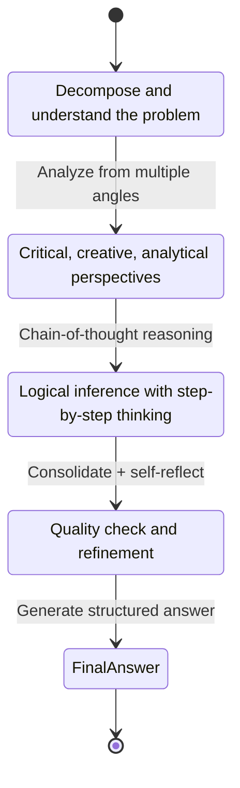
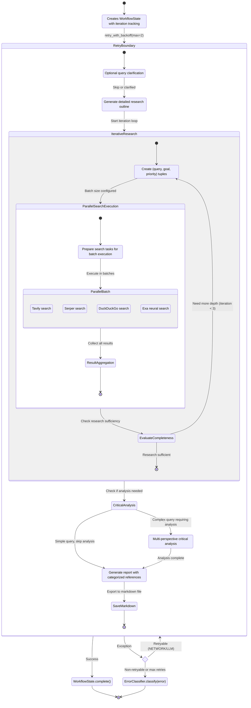

# Processing Mode State Machines

---

**Document Version:** `v2.1`
**Last Updated:** `2026-02-12`
**Status:** `Current (Enhanced with Parallel Search & Logging)`

---

## Changelog

### v2.1 (2026-02-12)
- Enhanced DeepResearchProcessor with parallel search execution
- Added multi-iteration support (up to 3 iterations)
- Implemented batch parallel search with configurable strategies
- Added Exa neural search integration
- Enhanced logging with content segmentation
- Added Markdown export capability
- Improved reference formatting (cited vs uncited)
- Added optional query clarification step
- **NEW**: Integrated critical analysis stage with ThinkingProcessor capabilities
- **NEW**: Intelligent detection for queries requiring multi-perspective analysis
- **NEW**: Enhanced report quality with critical thinking insights

### v2.0 (2026-02-12)
- Initial implementation with cognitive architecture
- Basic state machines for all processing modes

---

## 1. Overview

This document visualizes the internal workflow of each `ProcessingMode` using state machine diagrams. Each mode is implemented by a corresponding `Processor` class in `src/core/processor.py`.

### Cognitive Architecture Context

Every mode is classified into a cognitive level that determines its runtime execution path:

| Cognitive Level | Modes | Runtime | Characteristics |
|:---|:---|:---|:---|
| **System 1** | CHAT, KNOWLEDGE | ModelRuntime | Fast, cached (optional), stateless |
| **System 2** | SEARCH, CODE, THINKING | ModelRuntime | Analytical, multi-step, stateless |
| **Agent** | DEEP_RESEARCH | AgentRuntime | Stateful, workflow-tracked, retry-wrapped |

### Request Lifecycle (All Modes)



---

## 2. Chat Mode (`ProcessingMode.CHAT`)

**Processor**: `ChatProcessor`
**Cognitive Level**: System 1
**Runtime**: ModelRuntime (cacheable)

The simplest mode. Direct LLM call with system prompt.

### State Machine



### State Descriptions

- **CacheCheck**: SHA-256 hash of `mode:query` checked against ResponseCache. Only when `system1.enable_cache` flag is ON.
- **BuildPrompt**: Combines CHAT system prompt template with user query.
- **CallLLM**: Calls `MultiProviderLLMClient.generate()` — OpenAI first, fallback to Anthropic/Gemini on retryable error.
- **CachePut**: Stores result in ResponseCache with TTL (default 300s).

---

## 3. Knowledge Mode (`ProcessingMode.KNOWLEDGE`)

**Processor**: `KnowledgeProcessor`
**Cognitive Level**: System 1
**Runtime**: ModelRuntime (cacheable)

RAG (Retrieval-Augmented Generation) pipeline — retrieves from vector DB before generating.

### State Machine



### State Descriptions

- **GenerateEmbeddings**: Converts user query to vector using embedding provider (Cohere or OpenAI).
- **SearchVectorDB**: Performs similarity search in Qdrant, retrieves top-k document chunks.
- **SynthesizeContext**: Combines retrieved document fragments with the original query into an enriched prompt.
- **CallLLM**: Generates a knowledge-grounded answer via the multi-provider LLM chain.

---

## 4. Search Mode (`ProcessingMode.SEARCH`)

**Processor**: `SearchProcessor`
**Cognitive Level**: System 2
**Runtime**: ModelRuntime (no cache)

Multi-step web search with query expansion and result synthesis.

### State Machine



### State Descriptions

- **GenerateSearchQueries**: LLM converts a vague user question into 2-3 precise, search-engine-optimized queries.
- **ExecuteSearches**: Executes each query through the multi-engine search service (Tavily > Serper > DuckDuckGo fallback).
- **SynthesizeResults**: Consolidates all search results into a unified context.
- **CallLLM**: Generates a comprehensive answer based on the aggregated context.

---

## 5. Code Mode (`ProcessingMode.CODE`)

**Processor**: `CodeProcessor`
**Cognitive Level**: System 2
**Runtime**: ModelRuntime (no cache)

Code generation and isolated execution in Docker sandbox.

### State Machine



### State Descriptions

- **GenerateCode**: LLM converts natural language requirements into executable code (Python).
- **ExecuteInSandbox**: Creates an isolated Docker container with resource limits (CPU, memory, timeout). Executes the generated code.
- **FormatSuccess/Error**: Collects stdout, stderr, return value, and execution time. Returns formatted result to user.

---

## 6. Thinking Mode (`ProcessingMode.THINKING`)

**Processor**: `ThinkingProcessor`
**Cognitive Level**: System 2
**Runtime**: ModelRuntime (no cache)

Multi-stage deep thinking process for complex or abstract problems.

### State Machine



### State Descriptions

- **ProblemAnalysis**: Decomposes the problem into components and identifies key aspects.
- **MultiPerspective**: Analyzes from different angles (critical, creative, analytical).
- **DeepReasoning**: Applies chain-of-thought (CoT) methodology for logical reasoning.
- **SynthesisAndReflection**: Consolidates all intermediate analysis, self-reflects to improve quality.
- **FinalAnswer**: Produces a comprehensive, structured final answer based on the full thinking process.

---

## 7. Deep Research Mode (`ProcessingMode.DEEP_RESEARCH`)

**Processor**: `DeepResearchProcessor`
**Cognitive Level**: Agent
**Runtime**: AgentRuntime (stateful, retry-wrapped)

Automated research pipeline with advanced features. This is the only mode that uses AgentRuntime, which provides:
- **WorkflowState tracking**: steps = `[plan, search, synthesize]` with iteration support
- **Smart retry**: `retry_with_backoff(max_retries=2, base_delay=1.0)` — retries on network/LLM errors only
- **Error classification**: Failed steps recorded with `ErrorClassifier.classify()` category
- **Parallel search execution**: Batch parallel search with configurable strategies
- **Multi-iteration support**: Up to 3 iterations for comprehensive research
- **Enhanced logging**: Content segmentation for large responses and Markdown export

### State Machine



### State Descriptions

- **InitWorkflow**: Creates `WorkflowState` with:
  ```python
  {
      "status": "running",
      "steps": ["plan", "search", "synthesize"],
      "current_step": None,
      "iterations": 0,
      "errors": []
  }
  ```

- **Clarification** (Optional): If query is ambiguous, asks clarifying questions before research.

- **WriteReportPlan**: LLM generates detailed research outline with structured sections.

- **IterativeResearch**: Multi-iteration loop (max 3) for comprehensive coverage:
  - First iteration: Initial broad search based on plan
  - Subsequent iterations: Follow-up queries based on gaps

- **GenerateSearchQueries**: Creates structured search tasks with:
  - `query`: Optimized search query
  - `goal`: Specific research objective
  - `priority`: Task importance (high/medium/low)

- **ParallelSearchExecution**: Executes searches in parallel batches:
  - **Batch Strategy**: Configurable batch size (default 5)
  - **Race Mode**: First successful provider wins
  - **Multi-Engine**: Tavily → Serper → DuckDuckGo → Exa fallback chain
  - Uses `asyncio.gather()` for concurrent execution

- **EvaluateCompleteness**: AI-driven assessment of research quality:
  - Checks coverage of key topics
  - Identifies information gaps
  - Decides if more iterations needed

- **CriticalAnalysis** (Choice Point): Determines if critical analysis is needed:
  - Checks for critical thinking keywords (分析, 評估, 批判, 比較, 為什麼)
  - Mixed patterns (趨勢+分析, 市場+觀點)
  - Complex queries (>50 characters)

- **ThinkingStage** (Optional): Multi-perspective critical analysis:
  - Borrows critical thinking capability from ThinkingProcessor
  - Analyzes research findings from multiple angles
  - Provides deeper insights and balanced perspectives
  - Integrates with search results for enriched conclusions

- **WriteFinalReport**: Generates comprehensive report with:
  - Academic-style formatting
  - Categorized references (cited vs uncited)
  - Citation statistics
  - Structured sections

- **SaveMarkdown**: Exports response using `EnhancedLogger`:
  - Saves as `.md` file with metadata
  - Segments long content (>10KB) into multiple files
  - Includes trace ID and timestamp

- **ErrorHandling**: Intelligent error classification:
  - **Retryable** (NETWORK/LLM): Exponential backoff retry
  - **Non-retryable** (BUSINESS/RESOURCE_LIMIT): Immediate failure
  - All errors recorded in workflow state

### Enhanced Features

#### Parallel Search Configuration
```python
SearchEngineConfig:
  - parallel_strategy: "batch" | "race" | "hybrid"
  - batch_size: 5 (default)
  - enable_race_mode: True/False
  - enable_batch_parallel: True/False
  - max_concurrent_searches: 10
```

#### Reference Formatting
```markdown
## References
### Cited Sources (Used in Report)
[1] Title - URL
[2] Title - URL

### Additional Sources (Not Cited)
[3] Title - URL
[4] Title - URL

Citation Statistics:
- Cited: 60%
- Total: 10 sources
```

#### Enhanced Logging
- Content segmentation for responses >10KB
- Automatic markdown export to `logs/reports/`
- Segment files with checksums for integrity
- Metadata tracking (tokens, duration, errors)

---

## 8. Mode-to-Infrastructure Mapping

| Mode | Cognitive Level | Runtime | Cache | Retry | LLM Calls | External Services |
|:---|:---|:---|:---:|:---:|:---:|:---|
| **CHAT** | System 1 | ModelRuntime | Yes | No | 1 | LLM only |
| **KNOWLEDGE** | System 1 | ModelRuntime | Yes | No | 1 | Embedding + Qdrant + LLM |
| **SEARCH** | System 2 | ModelRuntime | No | No | 2+ | Search engines + LLM |
| **CODE** | System 2 | ModelRuntime | No | No | 1 | LLM + Docker |
| **THINKING** | System 2 | ModelRuntime | No | No | 4-5 | LLM only |
| **DEEP_RESEARCH** | Agent | AgentRuntime | No | Yes (max 2) | 3+ | Search engines + LLM |
