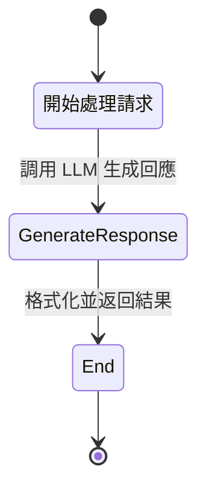
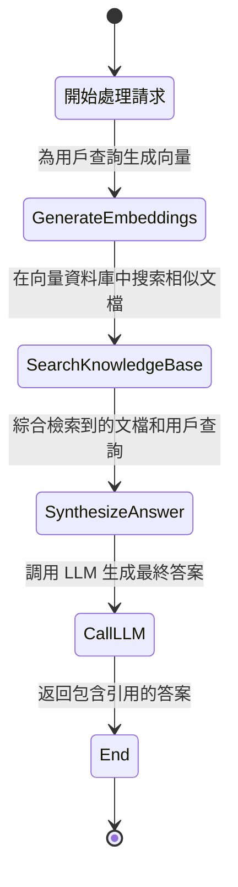
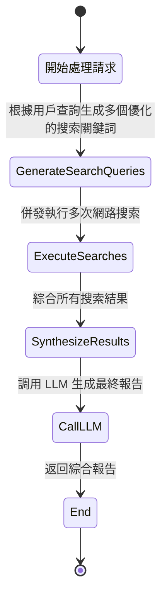
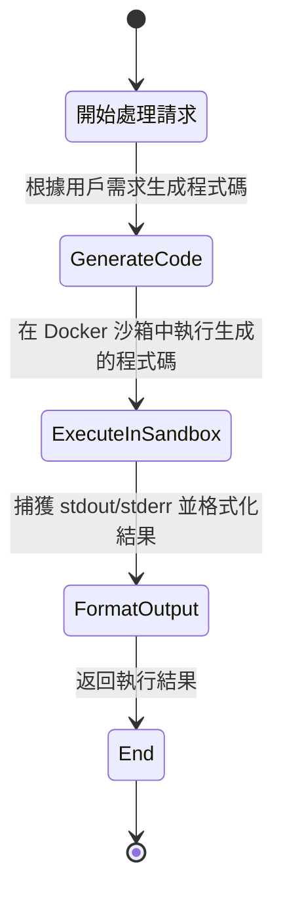
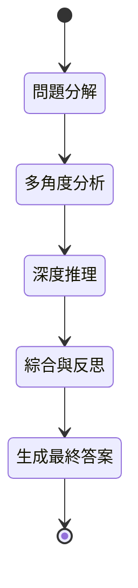
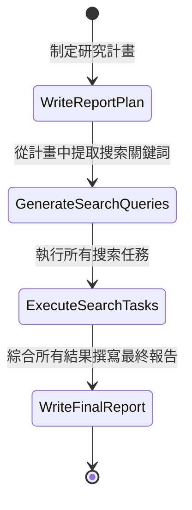

# 處理模式狀態機 (Processing Mode State Machines)

---

**文件版本 (Document Version):** `v1.0`
**最後更新 (Last Updated):** `2026-02-10`
**主要作者 (Lead Author):** `Gemini AI Architect`
**狀態 (Status):** `草稿 (Draft)`

---

## 1. 概述 (Overview)

本文檔旨在通過狀態機圖（State Machine Diagrams）視覺化展示 OpenCode Platform 中不同處理模式（`ProcessingMode`）的內部工作流程。

每種模式都由一個對應的 `Processor` 類在 `src/core/processor.py` 中實現，它們遵循一個定義好的狀態序列來完成任務。

## 2. Chat 模式 (`ProcessingMode.CHAT`)

**處理器**: `ChatProcessor`

此模式為最基礎的對話模式，流程非常直接。

### 狀態機圖

### 狀態說明
- **Start**: 接收用戶查詢。
- **GenerateResponse**: 將用戶查詢與系統提示詞組合，調用 LLM 獲取直接的回答。
- **End**: 返回 LLM 的生成結果。

---

## 3. Knowledge 模式 (`ProcessingMode.KNOWLEDGE`)

**處理器**: `KnowledgeProcessor`

此模式實現了檢索增強生成（RAG），從向量資料庫中檢索知識以生成更準確的回答。

### 狀態機圖

### 狀態說明
- **Start**: 接收用戶查詢。
- **GenerateEmbeddings**: 將用戶查詢文本轉換為向量。
- **SearchKnowledgeBase**: 使用向量在 Qdrant 中執行相似性搜索。
- **SynthesizeAnswer**: 將檢索到的文檔片段（上下文）與原始查詢組合成一個豐富的提示詞。
- **CallLLM**: 調用 LLM 根據豐富的提示詞生成回答。
- **End**: 返回 LLM 生成的、基於知識庫的答案。

---

## 4. Search 模式 (`ProcessingMode.SEARCH`)

**處理器**: `SearchProcessor`

此模式通過多步驟的網路搜索來回答需要最新信息的問題。

### 狀態機圖

### 狀態說明
- **Start**: 接收用戶查詢。
- **GenerateSearchQueries**: 調用 LLM 將一個模糊的用戶問題轉化為 2-3 個精確的、適合搜索引擎的查詢。
- **ExecuteSearches**: 循環執行生成的每個搜索查詢。
- **SynthesizeResults**: 將所有搜索結果的內容整合成一個大的上下文。
- **CallLLM**: 調用 LLM 基於此上下文生成一個全面的回答。
- **End**: 返回最終的綜合性答案。

---

## 5. Code 模式 (`ProcessingMode.CODE`)

**處理器**: `CodeProcessor`

此模式用於生成並在安全的沙箱環境中執行程式碼。

### 狀態機圖

### 狀態說明
- **Start**: 接收程式碼執行請求。
- **GenerateCode**: 調用 LLM 將自然語言需求轉換為可執行的程式碼（如 Python）。
- **ExecuteInSandbox**: 調用 `SandboxService`，創建一個隔離的 Docker 容器來運行程式碼。
- **FormatOutput**: 從容器收集執行結果（標準輸出、錯誤、退出碼）。
- **End**: 將格式化後的執行結果返回給用戶。

---

## 6. Thinking 模式 (`ProcessingMode.THINKING`)

**處理器**: `ThinkingProcessor`

此模式模擬一個多階段的深度思考過程，用於處理複雜或抽象的問題。

### 狀態機圖

### 狀態說明
- **ProblemAnalysis**: 對問題進行分解和理解。
- **MultiPerspective**: 從不同角度（如批判性、創造性）對問題進行分析。
- **DeepReasoning**: 使用思維鏈（Chain of Thought）等方法進行邏輯推理。
- **SynthesisAndReflection**: 綜合所有中間步驟的分析結果，並進行反思以提高答案質量。
- **FinalAnswer**: 基於所有思考過程，生成一個全面、結構化的最終答案。

---

## 7. Deep Research 模式 (`ProcessingMode.DEEP_RESEARCH`)

**處理器**: `DeepResearchProcessor`

此模式是一個完整的、自動化的研究管道，從計劃到生成最終報告。

### 狀態機圖

### 狀態說明
- **WriteReportPlan**: 根據用戶需求，生成一份詳細的研究報告大綱和計畫。
- **GenerateSearchQueries**: 從研究計畫中提取結構化的搜索任務（查詢、目標、優先級）。
- **ExecuteSearchTasks**: 遍歷搜索任務列表，為每個任務執行網路搜索並處理結果。
- **WriteFinalReport**: 綜合所有搜索任務的結果和原始的研究計畫，生成一份結構完整、包含引用的最終報告。
