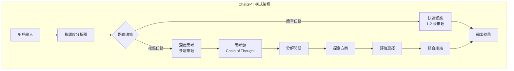
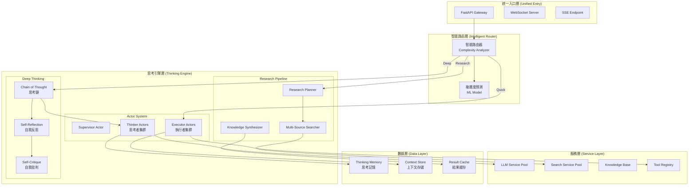
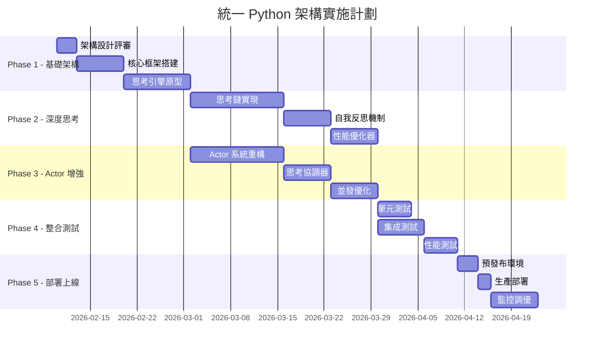

# 統一 Python 架構設計：融合 Deep Thinking 模式
## Unified Python Architecture with Deep Thinking Integration

---

**文件版本:** `v2.0`
**建立日期:** `2026-02-09`
**作者:** `架構設計團隊`
**狀態:** `規劃中 (Planning)`

---

## 執行摘要 (Executive Summary)

基於對 ChatGPT thinking mode 的深入分析，本設計提出一個**全 Python 實現**的統一架構，融合 Actor 並發模式與深度思考機制，實現真正的智能化處理。

### 核心創新
- **深度思考鏈 (Deep Thinking Chain)**: 模擬人類思考過程的多層推理
- **智能路由 (Auto Route)**: 基於任務複雜度自動選擇處理深度
- **純 Python 實現**: 統一技術棧，降低複雜度
- **思考可視化**: 展示完整思考過程，提升可解釋性

---

## 第一部分：問題分析與設計理念 (Problem Analysis & Design Philosophy)

### 1.1 現有架構痛點

| 問題 | 原因 | 影響 |
|:---|:---|:---|
| **思考深度不足** | Actor 並發執行缺乏深度推理 | 答案質量不高 |
| **技術棧分裂** | Python + TypeScript 混用 | 維護成本高 |
| **模式切換僵硬** | 缺乏智能判斷機制 | 用戶體驗差 |
| **思考不透明** | 內部處理過程不可見 | 缺乏可解釋性 |

### 1.2 ChatGPT Thinking Mode 分析



### 1.3 核心設計理念

```python
class ThinkingMode(Enum):
    """思考模式定義"""
    QUICK = "quick"           # 快速模式：直接回答
    AUTO = "auto"             # 自動模式：智能選擇
    DEEP = "deep"             # 深度模式：完整推理
    RESEARCH = "research"     # 研究模式：深度調研

class ThinkingDepth:
    """思考深度配置"""
    SHALLOW = 1    # 淺層：1-2步
    MEDIUM = 3     # 中層：3-5步
    DEEP = 5       # 深層：5-10步
    RESEARCH = 10  # 研究：10+步
```

---

## 第二部分：統一 Python 架構設計 (Unified Python Architecture)

### 2.1 整體架構圖



### 2.2 核心組件設計

#### 2.2.1 智能路由器 (Intelligent Router)

```python
class IntelligentRouter:
    """智能路由器：分析任務複雜度並選擇處理模式"""

    def __init__(self):
        self.complexity_analyzer = ComplexityAnalyzer()
        self.mode_selector = ModeSelector()
        self.performance_tracker = PerformanceTracker()

    async def route(self, request: Request) -> ThinkingMode:
        """智能路由決策"""
        # 1. 分析複雜度
        complexity = await self.complexity_analyzer.analyze(request)

        # 2. 預測所需思考深度
        required_depth = self._predict_depth(complexity)

        # 3. 考慮性能約束
        constraints = self._get_constraints(request)

        # 4. 選擇最優模式
        mode = self.mode_selector.select(
            complexity=complexity,
            depth=required_depth,
            constraints=constraints
        )

        # 5. 記錄決策用於優化
        self.performance_tracker.record(request, mode, complexity)

        return mode

    def _predict_depth(self, complexity: ComplexityScore) -> int:
        """預測所需思考深度"""
        if complexity.reasoning_required > 0.8:
            return ThinkingDepth.DEEP
        elif complexity.multi_step > 0.6:
            return ThinkingDepth.MEDIUM
        else:
            return ThinkingDepth.SHALLOW
```

#### 2.2.2 深度思考引擎 (Deep Thinking Engine)

```python
class DeepThinkingEngine:
    """深度思考引擎：實現類似 ChatGPT 的思考鏈"""

    def __init__(self):
        self.thinking_chain = ThinkingChain()
        self.reflection_module = SelfReflection()
        self.critique_module = SelfCritique()
        self.llm_service = LLMService()

    async def think_deeply(
        self,
        query: str,
        context: Context,
        depth: int = ThinkingDepth.DEEP
    ) -> ThinkingResult:
        """執行深度思考過程"""

        thinking_trace = []
        current_thought = None

        # Phase 1: 問題理解與分解
        understanding = await self._understand_problem(query, context)
        thinking_trace.append(ThinkingStep(
            phase="understanding",
            content=understanding,
            confidence=self._calculate_confidence(understanding)
        ))

        # Phase 2: 多步推理（核心思考鏈）
        for step in range(depth):
            # 2.1 生成思考步驟
            thought = await self._generate_thought(
                query=query,
                previous=current_thought,
                understanding=understanding,
                context=context
            )

            # 2.2 自我反思
            reflection = await self.reflection_module.reflect(
                thought=thought,
                context=context
            )

            # 2.3 自我批判與改進
            if reflection.needs_improvement:
                improved = await self.critique_module.critique_and_improve(
                    thought=thought,
                    reflection=reflection
                )
                thought = improved

            thinking_trace.append(ThinkingStep(
                phase=f"reasoning_step_{step+1}",
                content=thought,
                reflection=reflection,
                confidence=thought.confidence
            ))

            current_thought = thought

            # 2.4 判斷是否需要繼續思考
            if self._is_sufficient(thought, query):
                break

        # Phase 3: 綜合與總結
        synthesis = await self._synthesize_thoughts(
            thinking_trace=thinking_trace,
            query=query
        )

        return ThinkingResult(
            answer=synthesis.answer,
            thinking_trace=thinking_trace,
            confidence=synthesis.confidence,
            reasoning_depth=len(thinking_trace)
        )

    async def _generate_thought(
        self,
        query: str,
        previous: Optional[Thought],
        understanding: Understanding,
        context: Context
    ) -> Thought:
        """生成單個思考步驟"""

        # 構建思考提示
        prompt = self._build_thinking_prompt(
            query=query,
            previous_thought=previous,
            understanding=understanding,
            context=context
        )

        # 調用 LLM 生成思考
        response = await self.llm_service.generate(
            prompt=prompt,
            model="deep-thinking-model",
            temperature=0.7
        )

        # 解析思考內容
        thought = self._parse_thought(response)

        # 驗證思考邏輯
        thought.is_valid = await self._validate_logic(thought)

        return thought

    def _is_sufficient(self, thought: Thought, query: str) -> bool:
        """判斷思考是否充分"""
        return (
            thought.confidence > 0.85 and
            thought.completeness > 0.9 and
            thought.addresses_query(query)
        )
```

#### 2.2.3 增強型 Actor 系統 (Enhanced Actor System)

```python
class EnhancedActorSystem:
    """增強型 Actor 系統：結合深度思考的並發處理"""

    def __init__(self):
        self.supervisor = SupervisorActor()
        self.thinker_pool = ThinkerActorPool(size=5)
        self.executor_pool = ExecutorActorPool(size=10)
        self.coordinator = ThinkingCoordinator()

    async def process_with_thinking(
        self,
        task: Task,
        mode: ThinkingMode
    ) -> Result:
        """使用思考增強的 Actor 處理"""

        if mode == ThinkingMode.DEEP:
            # 深度思考模式：串行深度推理
            return await self._deep_thinking_process(task)

        elif mode == ThinkingMode.RESEARCH:
            # 研究模式：並發探索 + 深度綜合
            return await self._research_process(task)

        else:
            # 快速模式：傳統 Actor 並發
            return await self._quick_process(task)

    async def _deep_thinking_process(self, task: Task) -> Result:
        """深度思考處理流程"""

        # Step 1: 分配專門的思考者 Actor
        thinker = await self.thinker_pool.acquire_dedicated()

        # Step 2: 執行深度思考（不並發，確保思考連貫性）
        thinking_result = await thinker.think_deeply(
            task=task,
            iterations=5,
            enable_reflection=True
        )

        # Step 3: 基於思考結果執行
        executor = await self.executor_pool.acquire()
        execution_result = await executor.execute(
            plan=thinking_result.execution_plan
        )

        # Step 4: 驗證和優化
        final_result = await self.coordinator.validate_and_optimize(
            thinking=thinking_result,
            execution=execution_result
        )

        return final_result

    async def _research_process(self, task: Task) -> Result:
        """研究模式處理流程"""

        # Step 1: 並發探索（廣度）
        exploration_tasks = self._decompose_for_exploration(task)
        exploration_results = await asyncio.gather(*[
            self.executor_pool.explore(t)
            for t in exploration_tasks
        ])

        # Step 2: 深度思考整合（深度）
        thinker = await self.thinker_pool.acquire_dedicated()
        synthesis = await thinker.synthesize_research(
            task=task,
            explorations=exploration_results,
            depth=ThinkingDepth.RESEARCH
        )

        return synthesis
```

### 2.3 統一 Python 實現架構

```python
# 項目結構
opencode_platform_v2/
├── src/
│   ├── core/                    # 核心模組
│   │   ├── __init__.py
│   │   ├── router.py            # 智能路由
│   │   ├── thinking/            # 思考引擎
│   │   │   ├── __init__.py
│   │   │   ├── chain.py        # 思考鏈
│   │   │   ├── reflection.py   # 自我反思
│   │   │   ├── critique.py     # 自我批判
│   │   │   └── memory.py       # 思考記憶
│   │   │
│   │   ├── actors/              # Actor 系統
│   │   │   ├── __init__.py
│   │   │   ├── supervisor.py   # 監督者
│   │   │   ├── thinker.py      # 思考者
│   │   │   ├── executor.py     # 執行者
│   │   │   └── coordinator.py  # 協調者
│   │   │
│   │   └── research/            # 研究管道
│   │       ├── __init__.py
│   │       ├── planner.py      # 計劃器
│   │       ├── searcher.py     # 搜索器
│   │       └── synthesizer.py  # 綜合器
│   │
│   ├── services/                # 服務層
│   │   ├── llm/                # LLM 服務
│   │   │   ├── __init__.py
│   │   │   ├── provider.py     # 提供者抽象
│   │   │   ├── openai.py       # OpenAI 實現
│   │   │   ├── anthropic.py    # Anthropic 實現
│   │   │   └── pool.py         # 連接池
│   │   │
│   │   ├── search/              # 搜索服務
│   │   │   ├── __init__.py
│   │   │   └── providers/      # 各搜索引擎
│   │   │
│   │   └── knowledge/           # 知識庫
│   │       ├── __init__.py
│   │       ├── vectordb.py     # 向量數據庫
│   │       └── graph.py        # 知識圖譜
│   │
│   ├── api/                     # API 層
│   │   ├── __init__.py
│   │   ├── main.py             # FastAPI 主應用
│   │   ├── routes/             # 路由定義
│   │   └── websocket.py        # WebSocket/SSE
│   │
│   └── config/                  # 配置管理
│       ├── __init__.py
│       ├── settings.py         # 環境配置
│       └── prompts/            # 提示詞模板
│
├── tests/                       # 測試套件
├── docker/                      # Docker 配置
└── requirements.txt             # Python 依賴
```

---

## 第三部分：深度思考機制詳解 (Deep Thinking Mechanism)

### 3.1 思考鏈實現 (Chain of Thought Implementation)

```python
class ChainOfThought:
    """思考鏈實現：模擬人類思考過程"""

    def __init__(self):
        self.thought_templates = ThoughtTemplates()
        self.reasoning_engine = ReasoningEngine()

    async def generate_chain(
        self,
        problem: str,
        context: Context
    ) -> List[ThoughtStep]:
        """生成完整思考鏈"""

        chain = []

        # Step 1: 問題分析
        analysis = await self._analyze_problem(problem)
        chain.append(ThoughtStep(
            type="analysis",
            content=f"讓我分析這個問題：{analysis.summary}",
            details=analysis
        ))

        # Step 2: 策略制定
        strategy = await self._devise_strategy(analysis)
        chain.append(ThoughtStep(
            type="strategy",
            content=f"我的解決策略是：{strategy.approach}",
            details=strategy
        ))

        # Step 3: 分步推理
        for i, sub_problem in enumerate(strategy.sub_problems):
            reasoning = await self._reason_step(
                sub_problem=sub_problem,
                previous_steps=chain
            )
            chain.append(ThoughtStep(
                type="reasoning",
                content=f"步驟 {i+1}: {reasoning.conclusion}",
                details=reasoning
            ))

            # 3.1 檢查推理有效性
            if not reasoning.is_valid:
                # 回溯並重試
                alternative = await self._find_alternative(
                    sub_problem=sub_problem,
                    failed_reasoning=reasoning
                )
                chain.append(ThoughtStep(
                    type="correction",
                    content=f"修正: {alternative.conclusion}",
                    details=alternative
                ))

        # Step 4: 綜合結論
        conclusion = await self._synthesize_conclusion(chain)
        chain.append(ThoughtStep(
            type="conclusion",
            content=f"綜合結論：{conclusion.summary}",
            details=conclusion
        ))

        return chain

    async def _reason_step(
        self,
        sub_problem: SubProblem,
        previous_steps: List[ThoughtStep]
    ) -> Reasoning:
        """執行單步推理"""

        # 構建推理上下文
        reasoning_context = self._build_context(previous_steps)

        # 應用推理規則
        inference = await self.reasoning_engine.infer(
            problem=sub_problem,
            context=reasoning_context,
            rules=self._get_applicable_rules(sub_problem)
        )

        # 驗證推理邏輯
        validation = await self._validate_reasoning(
            inference=inference,
            context=reasoning_context
        )

        return Reasoning(
            premise=sub_problem,
            process=inference.steps,
            conclusion=inference.conclusion,
            confidence=validation.confidence,
            is_valid=validation.is_valid
        )
```

### 3.2 自我反思機制 (Self-Reflection Mechanism)

```python
class SelfReflection:
    """自我反思機制：評估和改進思考質量"""

    async def reflect(
        self,
        thought: Thought,
        context: Context
    ) -> Reflection:
        """對思考進行反思"""

        reflection = Reflection()

        # 1. 完整性檢查
        completeness = await self._check_completeness(thought, context)
        reflection.completeness = completeness

        # 2. 邏輯一致性檢查
        consistency = await self._check_consistency(thought)
        reflection.consistency = consistency

        # 3. 相關性評估
        relevance = await self._assess_relevance(thought, context)
        reflection.relevance = relevance

        # 4. 潛在問題識別
        issues = await self._identify_issues(thought)
        reflection.issues = issues

        # 5. 改進建議
        if issues:
            suggestions = await self._generate_improvements(
                thought=thought,
                issues=issues
            )
            reflection.improvements = suggestions
            reflection.needs_improvement = True

        # 6. 信心評分
        reflection.confidence = self._calculate_confidence(
            completeness=completeness,
            consistency=consistency,
            relevance=relevance
        )

        return reflection

    async def _check_consistency(self, thought: Thought) -> ConsistencyCheck:
        """檢查邏輯一致性"""

        # 提取邏輯陳述
        statements = self._extract_statements(thought)

        # 檢查矛盾
        contradictions = []
        for s1, s2 in itertools.combinations(statements, 2):
            if self._is_contradictory(s1, s2):
                contradictions.append((s1, s2))

        # 檢查循環論證
        circular_reasoning = self._detect_circular_reasoning(statements)

        return ConsistencyCheck(
            is_consistent=len(contradictions) == 0,
            contradictions=contradictions,
            circular_reasoning=circular_reasoning
        )
```

### 3.3 性能優化策略

```python
class PerformanceOptimizer:
    """性能優化器：平衡思考深度與響應速度"""

    def __init__(self):
        self.cache = ThinkingCache()
        self.predictor = DepthPredictor()
        self.monitor = PerformanceMonitor()

    async def optimize_thinking(
        self,
        request: Request,
        constraints: Constraints
    ) -> OptimizedPlan:
        """優化思考計劃"""

        # 1. 檢查緩存
        cached = await self.cache.get_similar(request)
        if cached and cached.confidence > 0.9:
            return OptimizedPlan(
                mode=ThinkingMode.QUICK,
                use_cache=True,
                cached_result=cached
            )

        # 2. 預測所需深度
        predicted_depth = await self.predictor.predict(request)

        # 3. 考慮約束條件
        if constraints.max_latency < 2000:  # 2秒內
            # 降級到快速模式
            return OptimizedPlan(
                mode=ThinkingMode.QUICK,
                depth=ThinkingDepth.SHALLOW,
                reason="latency_constraint"
            )

        # 4. 動態調整
        if predicted_depth > ThinkingDepth.DEEP:
            # 使用漸進式深化
            return OptimizedPlan(
                mode=ThinkingMode.DEEP,
                depth=predicted_depth,
                progressive=True,  # 逐步深化，可中斷
                checkpoints=3      # 設置檢查點
            )

        # 5. 標準處理
        return OptimizedPlan(
            mode=ThinkingMode.AUTO,
            depth=predicted_depth
        )
```

---

## 第四部分：實施計劃 (Implementation Plan)

### 4.1 開發階段



### 4.2 技術選型

| 組件 | 技術選擇 | 版本 | 選擇理由 |
|:---|:---|:---|:---|
| **語言** | Python | 3.11+ | 統一技術棧、異步支援 |
| **Web框架** | FastAPI | 0.108+ | 高性能、自動文檔 |
| **異步框架** | asyncio + aiohttp | Latest | 原生異步、成熟穩定 |
| **Actor框架** | Ray 或自實現 | 2.9+ | 分散式Actor支援 |
| **LLM整合** | LangChain + 自定義 | 0.1+ | 靈活、可擴展 |
| **向量數據庫** | Qdrant | 1.7+ | 性能優秀 |
| **緩存** | Redis | 7.0+ | 高性能緩存 |
| **消息隊列** | RabbitMQ/Kafka | Latest | 可靠消息傳遞 |

### 4.3 性能指標

```yaml
性能目標:
  思考深度:
    - 淺層思考: < 500ms
    - 中層思考: < 2s
    - 深層思考: < 5s
    - 研究模式: < 30s

  並發能力:
    - 同時思考任務: 100+
    - 每秒請求數: 1000+
    - Actor 池大小: 動態擴展

  準確性:
    - 思考邏輯正確率: > 95%
    - 自我修正成功率: > 80%
    - 用戶滿意度: > 90%

  資源使用:
    - CPU 使用率: < 70%
    - 內存使用: < 16GB
    - 響應時間 P95: < 3s
```

---

## 第五部分：與 ChatGPT 模式對比 (Comparison with ChatGPT)

### 5.1 功能對比

| 特性 | ChatGPT | 本設計 | 優勢 |
|:---|:---|:---|:---|
| **思考透明度** | 部分可見 | 完全可見 | 可解釋性更強 |
| **思考深度控制** | 自動 | 可配置 | 更靈活 |
| **並發處理** | 有限 | Actor 並發 | 更高吞吐量 |
| **自定義思考鏈** | 不支援 | 完全支援 | 可定制化 |
| **成本控制** | 固定 | 動態調整 | 更經濟 |
| **私有部署** | 不支援 | 完全支援 | 數據安全 |

### 5.2 創新點

1. **混合思考模式**: 結合串行深度思考與並發廣度探索
2. **思考可視化**: 完整展示思考過程，提升可信度
3. **自適應深度**: 根據問題複雜度自動調整思考深度
4. **增量式思考**: 支援中斷和恢復，優化用戶體驗
5. **思考記憶**: 學習和優化思考模式

---

## 第六部分：代碼示例 (Code Examples)

### 6.1 API 使用示例

```python
from fastapi import FastAPI, WebSocket
from typing import AsyncGenerator
import asyncio

app = FastAPI()

# 初始化統一思考引擎
thinking_engine = UnifiedThinkingEngine()

@app.post("/api/v1/think")
async def think(request: ThinkingRequest):
    """統一思考接口"""

    # 智能路由選擇模式
    mode = await thinking_engine.router.route(request)

    # 根據模式執行
    if mode == ThinkingMode.QUICK:
        result = await thinking_engine.quick_think(request.query)
    elif mode == ThinkingMode.DEEP:
        result = await thinking_engine.deep_think(
            query=request.query,
            depth=request.depth or ThinkingDepth.DEEP
        )
    else:  # RESEARCH
        result = await thinking_engine.research(request.query)

    return ThinkingResponse(
        answer=result.answer,
        thinking_trace=result.trace if request.show_thinking else None,
        mode=mode,
        confidence=result.confidence
    )

@app.websocket("/ws/think-stream")
async def think_stream(websocket: WebSocket):
    """流式思考接口"""
    await websocket.accept()

    data = await websocket.receive_json()
    request = ThinkingRequest(**data)

    # 流式返回思考過程
    async for thought_step in thinking_engine.think_stream(request):
        await websocket.send_json({
            "type": "thinking_step",
            "content": thought_step.content,
            "phase": thought_step.phase,
            "confidence": thought_step.confidence
        })

    # 發送最終結果
    await websocket.send_json({
        "type": "final_answer",
        "content": thought_step.final_answer
    })

@app.get("/api/v1/thinking-modes")
async def get_thinking_modes():
    """獲取可用的思考模式"""
    return {
        "modes": [
            {
                "name": "quick",
                "description": "快速回答，適合簡單問題",
                "max_latency": "500ms"
            },
            {
                "name": "deep",
                "description": "深度思考，適合複雜推理",
                "max_latency": "5s"
            },
            {
                "name": "research",
                "description": "研究模式，適合深度調研",
                "max_latency": "30s"
            },
            {
                "name": "auto",
                "description": "自動選擇最佳模式",
                "max_latency": "variable"
            }
        ]
    }
```

### 6.2 思考鏈使用示例

```python
# 用戶查詢
query = "如何設計一個高性能的分散式系統？"

# 創建思考引擎
engine = DeepThinkingEngine()

# 執行深度思考
result = await engine.think_deeply(
    query=query,
    depth=ThinkingDepth.DEEP,
    show_reasoning=True
)

# 輸出思考過程
for step in result.thinking_trace:
    print(f"[{step.phase}] {step.content}")
    if step.reflection:
        print(f"  反思: {step.reflection.summary}")
    print(f"  信心度: {step.confidence:.2%}")
    print("-" * 50)

# 輸出最終答案
print(f"\n最終答案:\n{result.answer}")
print(f"總體信心度: {result.confidence:.2%}")
print(f"思考深度: {result.reasoning_depth} 步")
```

---

## 總結與展望 (Conclusion & Future Vision)

### 核心價值
1. **統一 Python 實現**: 降低技術複雜度，提升開發效率
2. **深度思考能力**: 媲美 ChatGPT 的推理深度
3. **靈活可控**: 支援多種思考模式，滿足不同需求
4. **高性能**: Actor 並發 + 智能緩存，優化響應速度
5. **可解釋性**: 完整思考鏈展示，提升可信度

### 下一步行動
1. **POC 開發**: 2週內完成原型驗證
2. **性能測試**: 對比現有系統和 ChatGPT
3. **用戶測試**: 收集反饋，優化體驗
4. **生產部署**: 漸進式上線，監控優化

### 長期願景
- 成為業界領先的開源深度思考框架
- 支援自定義思考鏈和推理規則
- 建立思考模式的共享生態系統
- 推動 AI 思考透明化和可解釋性發展

---

**文檔維護**: 隨著實施進展持續更新本文檔