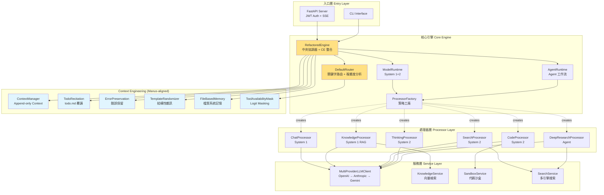
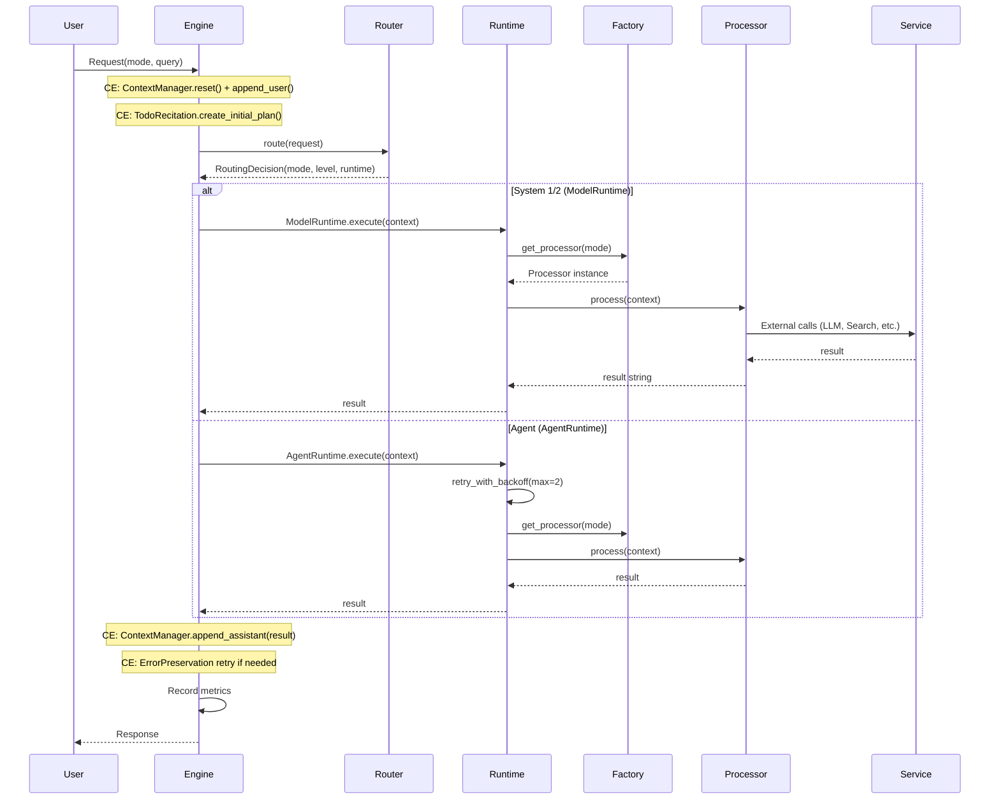

# OpenCode Platform 架構設計文檔

**版本:** `v3.1`
**更新日期:** `2026-02-16`
**狀態:** `Production Ready (v3.0 Linus Refactored + v3.1 Context Engineering)`

---

## 📋 執行摘要

本文檔定義 OpenCode Platform 的架構演進路線：

| 版本 | 狀態 | 核心設計 | 特徵 |
|------|------|---------|------|
| **v1.x** | 已完成 | 策略模式 + 分層架構 | 穩定、可擴展、明確職責 |
| **v3.0** | 已完成 | Linus 風格重構 + 雙 Runtime | 數據自包含、無字典映射、模組化處理器 |
| **v3.1** | 已完成 | Manus Context Engineering | Append-only context、KV-Cache 友好、Feature Flag 控制 |
| **v4.0+** | 條件觸發 | 增強路由 + 信心估計 | 數據驅動，僅在 v3.1 指標不足時實施 |

---

## Part 1: 當前架構 (v3.0 + v3.1) - 生產環境

### 1.1 核心架構原則

```
┌─────────────────────────────────────────┐
│ 設計原則 (Linus 風格)：                   │
│ • 數據自包含 (Data Self-Containment)     │
│ • 策略模式 (Strategy Pattern)            │
│ • 依賴注入 (Dependency Injection)        │
│ • 無特殊情況 (No Special Cases)          │
│ • Append-Only Context (KV-Cache 友好)    │
│ • Feature Flag 控制一切新功能            │
└─────────────────────────────────────────┘
```

### 1.2 系統架構圖



### 1.3 核心組件詳解

#### RefactoredEngine (`src/core/engine.py`)

```python
class RefactoredEngine:
    """系統的中央協調器 + Context Engineering 整合"""

    def __init__(self, llm_client=None, config=None):
        self.router = DefaultRouter(feature_flags)
        self._model_runtime = ModelRuntime(llm_client, self.processor_factory)
        self._agent_runtime = AgentRuntime(llm_client, self.processor_factory)

        # Context Engineering (feature-flag controlled)
        if flags.is_enabled("context_engineering.append_only_context"):
            self.context_manager = ContextManager(flags)
        if flags.is_enabled("context_engineering.todo_recitation"):
            self._todo_recitation = TodoRecitation(flags)
        # ... (6 CE components, all feature-flag gated)

    async def process(self, request: Request) -> Response:
        # 1. CE: Reset context + append user query
        if self.context_manager:
            self.context_manager.reset()
            self.context_manager.append_user(request.query)

        # 2. Route (keyword-based, no ML)
        decision = await self.router.route(request)

        # 3. Execute via Runtime dispatch
        result = await self._execute(decision, context)

        # 4. CE: Append result + update plan
        if self.context_manager:
            self.context_manager.append_assistant(result)

        # 5. CE: Error preservation retry if needed
        return Response(result=result, ...)
```

**職責邊界:**
- 請求路由與分發 (DefaultRouter)
- 上下文生命週期管理 (ContextManager)
- Runtime 調度 (ModelRuntime / AgentRuntime)
- Context Engineering 整合 (6 Manus-aligned components)
- 錯誤處理與日誌記錄
- NOT: 業務邏輯實現
- NOT: 外部服務調用

#### ProcessorFactory & BaseProcessor (`src/core/processors/`)

```python
# src/core/processors/base.py
class BaseProcessor(ABC):
    """處理器基類 - 策略模式的抽象策略"""

    @abstractmethod
    async def process(self, context: ProcessingContext) -> str:
        """每個處理器必須實現的核心方法"""
        pass

# src/core/processors/factory.py
class ProcessorFactory:
    """策略工廠 - 使用 Modes 數據直接映射，無字典查找"""

    _processors = {
        Modes.CHAT: ChatProcessor,
        Modes.KNOWLEDGE: KnowledgeProcessor,
        Modes.SEARCH: SearchProcessor,
        Modes.THINKING: ThinkingProcessor,
        Modes.CODE: CodeProcessor,
        Modes.DEEP_RESEARCH: DeepResearchProcessor,
    }

    def get_processor(self, mode: ProcessingMode) -> BaseProcessor:
        # cognitive_level 直接從 mode.cognitive_level 讀取
        # 無 COGNITIVE_MAPPING dict — 數據自包含
        return self._processors[mode](self.llm_client)
```

**設計優勢:**
- 新增處理模式無需修改核心代碼
- 處理器模組化 (每個處理器獨立檔案)
- 無字典映射 — `mode.cognitive_level` 是數據欄位

### 1.4 請求處理流程



### 1.5 擴展點與架構能力

| 類別 | 描述 | 實現 |
|------|------|------|
| **擴展點** | | |
| 新增處理器 | 實現 `BaseProcessor` + 加入 `ProcessorFactory` | 低耦合 |
| 服務替換 | 通過 DI 注入不同實現 | 高彈性 |
| Feature Flag | 所有新功能通過 `config/cognitive_features.yaml` 控制 | 漸進式發布 |
| Context Engineering | 6 個 Manus-aligned 組件，全部 Feature Flag 控制 | 零破壞性 |
| **已解決的 v1.x 限制** | | |
| ~~單步處理~~ | AgentRuntime 支持多步驟工作流 (v3.0) | DeepResearch |
| ~~無狀態~~ | AgentRuntime WorkflowState 追蹤 (v3.0) | 有狀態工作流 |
| ~~無 Context 管理~~ | ContextManager append-only (v3.1) | KV-Cache 友好 |
| ~~無元認知~~ | TodoRecitation todo.md 覆誦 (v3.1) | 注意力管理 |

---

## Part 2: 架構演進歷程與未來方向

### 2.1 已完成的演進

```
v1.x → v3.0 (Linus 風格重構)
━━━━━━━━━━━━━━━━━━━━━━━━━━━━━━━━━━━━━
ProcessingMode enum → frozen dataclass (數據自包含)
monolithic processor.py → modular processors/ directory
字典映射 → mode.cognitive_level 數據欄位
單 Runtime → Dual Runtime (Model + Agent)

v3.0 → v3.1 (Manus Context Engineering)
━━━━━━━━━━━━━━━━━━━━━━━━━━━━━━━━━━━━━
無 Context 管理 → Append-only ContextManager
無元認知 → TodoRecitation (todo.md 覆誦)
隱藏錯誤 → ErrorPreservation (保留失敗)
動態工具切換 → ToolAvailabilityMask (Logit Masking)
無記憶 → FileBasedMemory (檔案系統)
固定模板 → TemplateRandomizer (結構性雜訊)
```

### 2.2 當前完整架構 (v3.0 + v3.1)

```
RefactoredEngine (v3.0 + v3.1)
  +-- DefaultRouter (keyword-based, no ML)
  |     +-- ComplexityAnalyzer (feature-flag gated)
  |     +-- ToolAvailabilityMask (CE: logit masking)
  +-- ProcessorFactory (strategy pattern, no dict mappings)
  |     +-- ChatProcessor (System 1)
  |     +-- KnowledgeProcessor (System 1, RAG)
  |     +-- SearchProcessor (System 2, iterative)
  |     +-- ThinkingProcessor (System 2, 5-stage)
  |     +-- CodeProcessor (System 2, sandbox)
  |     +-- DeepResearchProcessor (Agent, multi-iteration)
  +-- ModelRuntime (System 1+2, stateless, cached)
  +-- AgentRuntime (Agent, stateful, retry)
  +-- ContextManager (CE: append-only context)
  +-- TodoRecitation (CE: todo.md recitation)
  +-- ErrorPreservation (CE: keep failed attempts)
  +-- TemplateRandomizer (CE: structural noise)
  +-- FileBasedMemory (CE: file system memory)
  +-- FeatureFlags (YAML-driven, all default OFF)
  +-- CognitiveMetrics (per-level tracking)
```

### 2.3 Context Engineering 組件 (v3.1, Manus-aligned)

**6 個 Manus 原則對應的組件** (總計 ~392 行生產代碼):

| 原則 | 組件 | 行數 | 替代了什麼 |
|------|------|------|-----------|
| KV-Cache 命中率 | `ContextManager` (append-only) | ~102 | GlobalWorkspace (可變字典) |
| Mask, Don't Remove | `ToolAvailabilityMask` (logit mask) | ~47 | OODA Router (動態切換) |
| File System as Context | `FileBasedMemory` | ~51 | Vector DB + 知識圖譜 |
| Attention via Recitation | `TodoRecitation` (todo.md) | ~60 | MetacognitiveGovernor (5 組件) |
| Keep Erroneous Turns | `ErrorPreservation` | ~39 | 替換 context.request 模式 |
| Avoid Few-Shot Traps | `TemplateRandomizer` | ~40 | Neuromodulation RL |

**Feature Flag 控制** (`config/cognitive_features.yaml`):
```yaml
context_engineering:
  enabled: false              # Master switch
  append_only_context: false  # ContextManager
  todo_recitation: false      # TodoRecitation
  error_preservation: false   # ErrorPreservation
  tool_masking: false         # ToolAvailabilityMask
  template_randomizer: false  # TemplateRandomizer
  file_based_memory: false    # FileBasedMemory
```

所有功能預設 OFF。啟用需要先開 master switch，再開個別功能。

### 2.4 認知層級與 Runtime 決策矩陣 (已實現)

| 認知層級 | 處理模式 | Runtime | 特徵 | ProcessingMode 示例 |
|---------|---------|---------|------|-------------------|
| **System 1** | CHAT, KNOWLEDGE | ModelRuntime | 快速、可快取、無狀態 | `Modes.CHAT` (cognitive_level="system1") |
| **System 2** | SEARCH, CODE, THINKING | ModelRuntime | 分析型、多步驟、無狀態 | `Modes.THINKING` (cognitive_level="system2") |
| **Agent** | DEEP_RESEARCH | AgentRuntime | 有狀態、工作流追蹤、重試 | `Modes.DEEP_RESEARCH` (cognitive_level="agent") |

### 2.5 架構演進時間線 (已完成 + 未來)

```
已完成:
━━━━━━━━━━━━━━━━━━━━━━━━━━━━━━━━━━━━━━
v1.x  策略模式 + 分層架構
v3.0  Linus 風格重構 (ProcessingMode dataclass, Dual Runtime, 模組化 Processor)
v3.1  Context Engineering (6 Manus-aligned components, 63 tests, 0 regressions)

條件觸發 (未來):
━━━━━━━━━━━━━━━━━━━━━━━━━━━━━━━━━━━━━━
[條件] EnhancedRouter      → 當 DefaultRouter 準確度 <70%
[條件] ConfidenceEstimator  → 當 todo.md 不足以判斷品質
[條件] Redis 分佈式快取     → 當單機快取不足
```

---

## 關鍵洞察

### Manus 教訓：Context Engineering > 認知組件

> **真正需要的不是「認知組件」，而是「Context 管理」**

| 原始設計 (已廢止) | Manus 替代方案 (已實現) | 代碼量對比 |
|------------------|----------------------|-----------|
| MetacognitiveGovernor (5 組件) | TodoRecitation (~60 行) | -90% |
| GlobalWorkspace (可變字典) | ContextManager (~102 行) | -67% |
| OODA Router (動態切換) | ToolAvailabilityMask (~47 行) | -90% |
| MemorySystems (Vector DB) | FileBasedMemory (~51 行) | -98% |
| Neuromodulation (RL) | TemplateRandomizer (~40 行) | -98% |

### 設計決策準則

```python
# Runtime 選擇 — 直接從 ProcessingMode 數據欄位讀取
mode = Modes.DEEP_RESEARCH
runtime_type = mode.runtime_type  # RuntimeType.AGENT
cognitive_level = mode.cognitive_level  # "agent"

# 無字典映射，無特殊情況
# Linus: "Good programmers worry about data structures."
```

---

## 📝 附錄

### A. 文件版本歷史

| 版本 | 日期 | 變更內容 |
|------|------|----------|
| v3.1 | 2026-02-16 | Context Engineering 整合，Manus 6 原則實現，文檔全面更新 |
| v3.0 | 2026-02-14 | Linus 風格重構：ProcessingMode frozen dataclass, Dual Runtime, 模組化 Processor |
| v2.2 | 2026-02-10 | 重構文檔結構，明確 Model vs Agent 邊界 |
| v2.1 | 2026-02-10 | 添加 v2.0 架構願景 |
| v1.0 | 2026-01-15 | 初始架構文檔 |

### B. 參考資料

- [Manus: Context Engineering for AI Agents](https://manus.im/blog/Context-Engineering-for-AI-Agents-Lessons-from-Building-Manus) — 6 Manus 原則的來源
- [Frozen Dataclass (Python docs)](https://docs.python.org/3/library/dataclasses.html#frozen-instances) — ProcessingMode 設計基礎
- [Strategy Pattern in Python](https://refactoring.guru/design-patterns/strategy/python/example)
- [Chain of Thought Prompting](https://arxiv.org/abs/2201.11903)

### C. 術語表

| 術語 | 定義 |
|------|------|
| **ProcessingMode** | Frozen dataclass，封裝模式名稱、cognitive_level、runtime_type 等數據欄位 |
| **Modes** | Helper class，提供 `Modes.CHAT`、`Modes.from_name("chat")` 等靜態存取方式 |
| **ContextEntry** | Frozen dataclass，context 中的不可變條目 (role + content + metadata) |
| **ContextManager** | Append-only context 管理器，保護 KV-Cache 前綴穩定性 |
| **TodoRecitation** | todo.md 注意力聚焦模式，取代 MetacognitiveGovernor |
| **ErrorPreservation** | 將失敗步驟保留在 context 中，讓模型從錯誤隱式學習 |
| **TemplateRandomizer** | 結構雜訊注入，防止模型模式崩潰 |
| **FileBasedMemory** | 以檔案系統作為記憶體，取代 Vector DB 方案 |
| **ToolAvailabilityMask** | 根據模式限制可用工具集的 logit masking 機制 |
| **ModelRuntime** | 無狀態運行時，用於 System 1/2 級別的處理模式 |
| **Agent Runtime** | 有狀態運行時，提供 WorkflowState 追蹤、smart retry、ErrorClassifier |
| **Feature Flag** | `config/cognitive_features.yaml` 中的功能開關，控制 CE 組件啟用 |