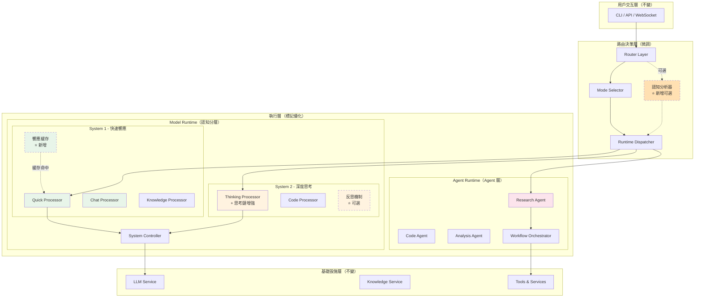
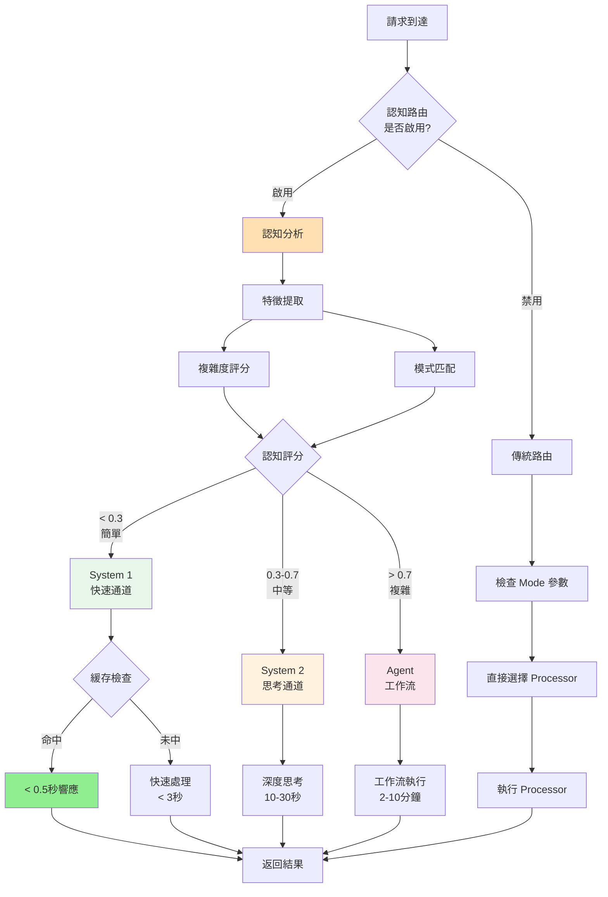
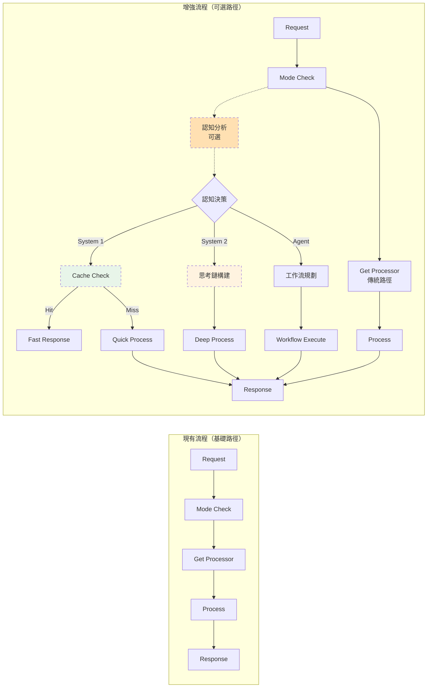
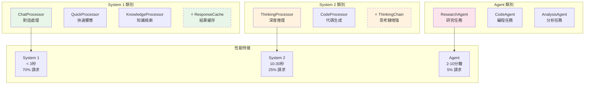
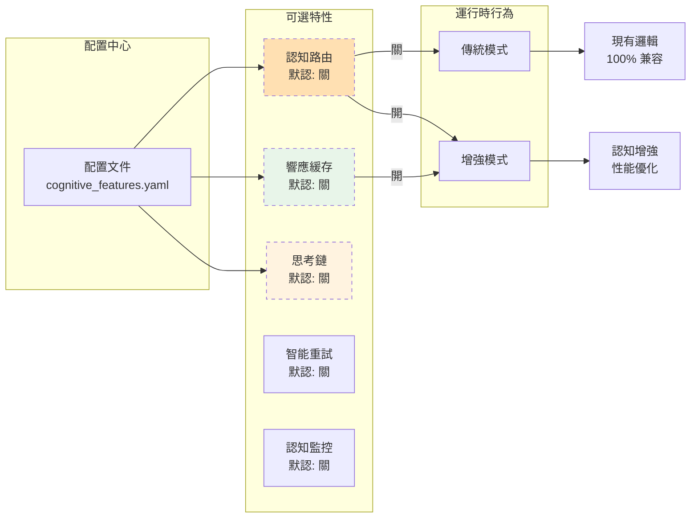
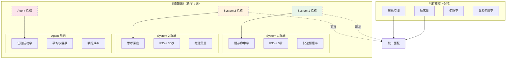
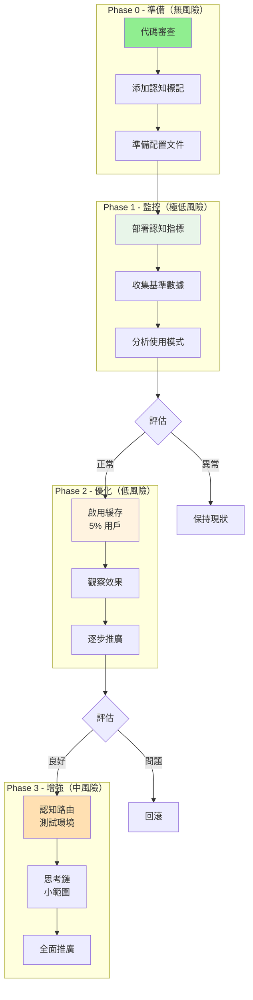
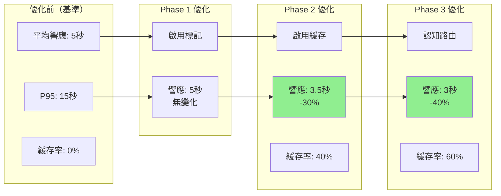
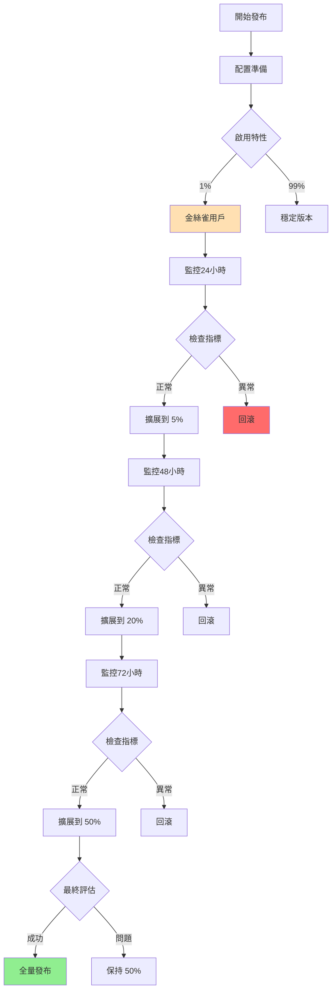
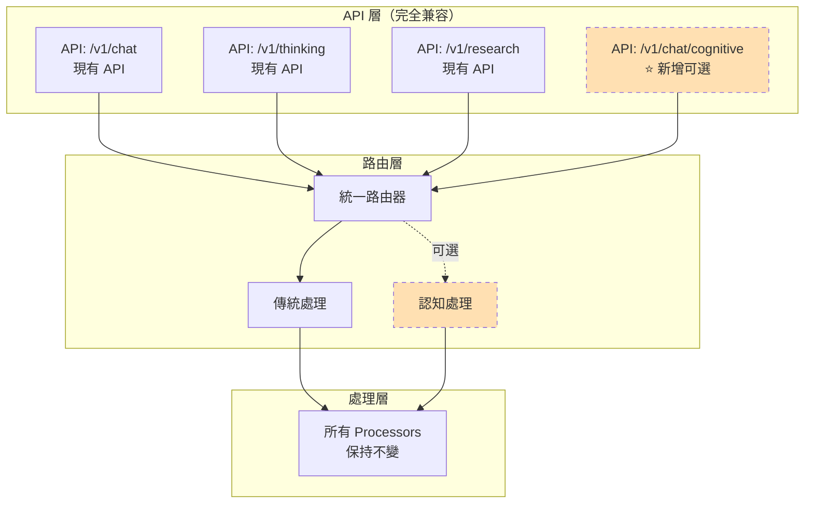

# OpenCode Platform - 調整後架構圖表

**版本**: `v1.5`
**日期**: `2026-02-10`
**原則**: `微調優化、認知增強、向後兼容`

---

## 1. 調整後的三層架構（認知增強版）

---

## 2. 認知路由決策流程（增強版）

---

## 3. 執行流程對比（微調版）

---

## 4. Processor 認知分類映射

---

## 5. 配置驅動的特性開關

---

## 6. 監控指標體系（增量式）

---

## 7. 實施階段與風險控制

---

## 8. 性能優化效果預期

---

## 9. 灰度發布流程

---

## 10. API 兼容性保證

---

## 總結

調整後的架構保持了原有結構的 90% 不變，通過以下方式實現認知增強：

1. **最小侵入**：所有改動都是可選的，通過配置開關控制
2. **向後兼容**：現有 API 和功能完全不受影響
3. **漸進優化**：分階段實施，每步都可獨立評估和回滾
4. **性能提升**：緩存和智能路由帶來顯著性能改善
5. **易於維護**：代碼改動小，理解成本低

關鍵特點：
- 🟢 **綠色部分**：性能優化區域
- 🟡 **黃色部分**：智能增強區域
- 🔴 **紅色部分**：需要謹慎的區域
- ⭐ **虛線部分**：可選特性

這個調整方案確保了系統能夠平滑演進到認知架構，同時保持穩定性和可控性。