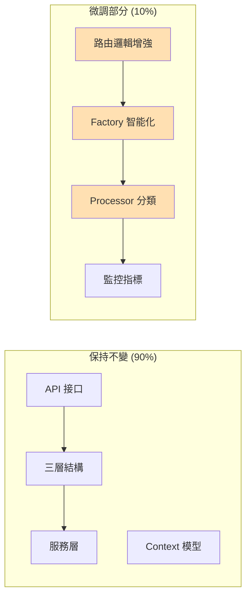
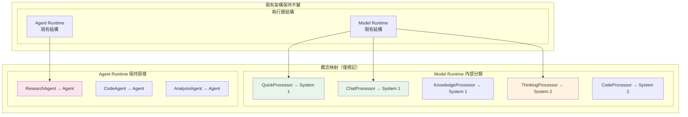
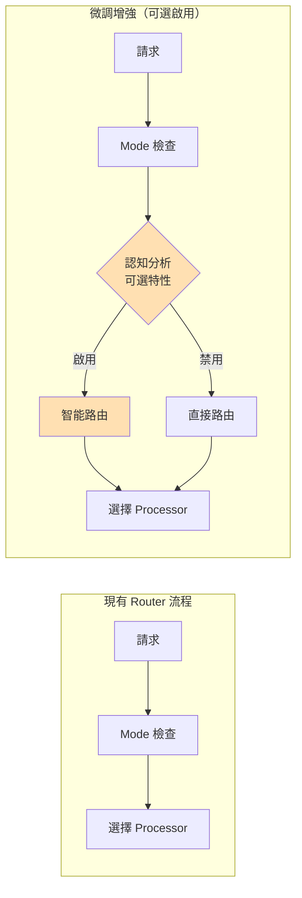
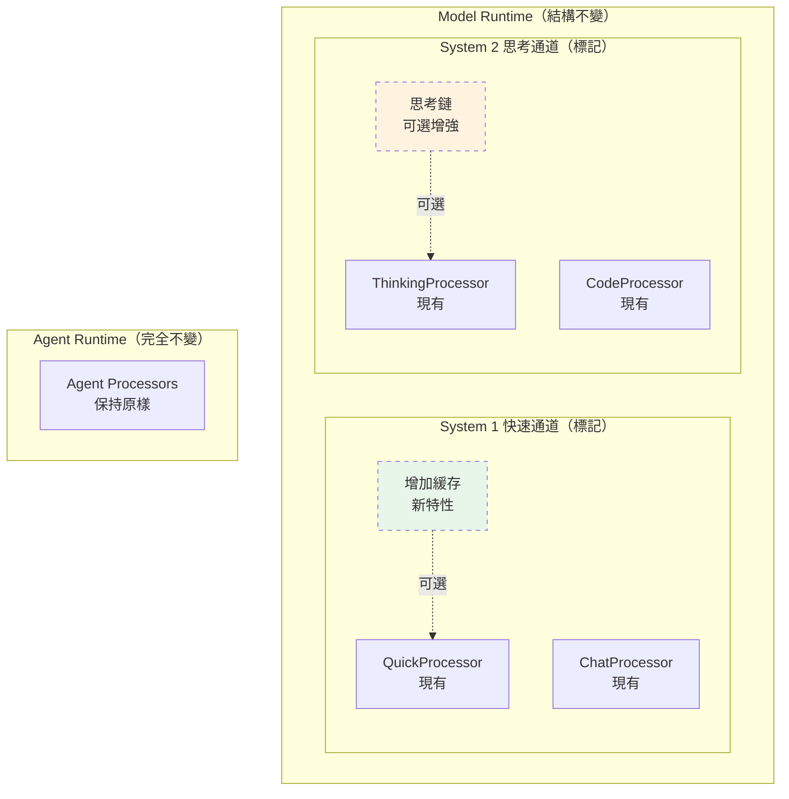
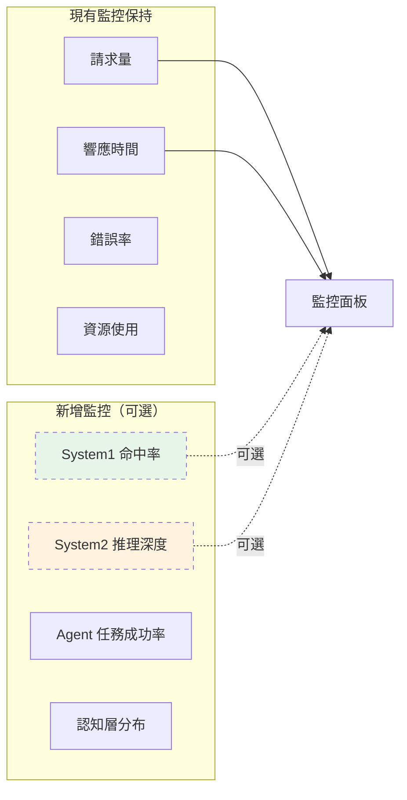
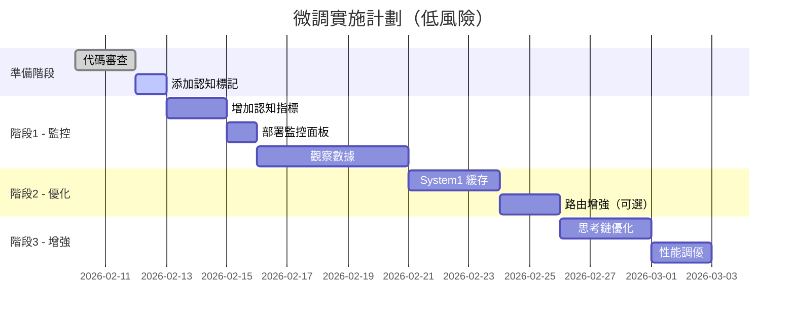
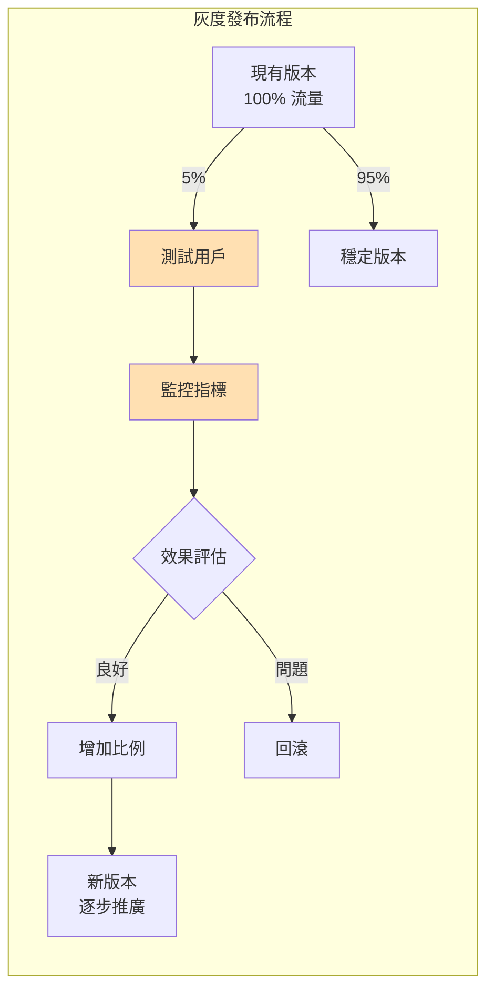
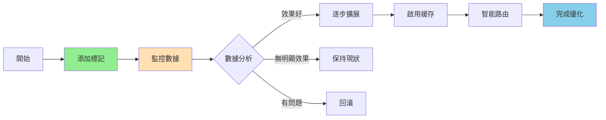

# OpenCode Platform - 最小化架構調整方案

**版本**: `v1.5`
**日期**: `2026-02-10`
**原則**: `微調優化、向後兼容、漸進演進`

---

## 一、調整策略概述

### 1.1 核心原則

```
✅ 保留現有架構主體結構
✅ 複用現有組件和接口
✅ 只在必要處引入認知層概念
✅ 保持 API 完全向後兼容
✅ 可逐步實施，不影響現有功能
```

### 1.2 微調重點



---

## 二、現有架構映射調整

### 2.1 認知層級映射（無需重構）



### 2.2 最小化代碼調整

```python
# 現有 ProcessorFactory 只需要增加分類標記
class ProcessorFactory:
    # 新增：認知層級映射（不影響現有邏輯）
    COGNITIVE_MAPPING = {
        'chat': 'system1',
        'quick': 'system1',
        'knowledge': 'system1',
        'thinking': 'system2',
        'code': 'system2',
        'research': 'agent',
        'analysis': 'agent'
    }

    @classmethod
    def get_processor(cls, mode: str) -> BaseProcessor:
        # 現有邏輯完全不變
        processor = cls._processors.get(mode)

        # 新增：設置認知層級標記（可選）
        if processor and mode in cls.COGNITIVE_MAPPING:
            processor._cognitive_level = cls.COGNITIVE_MAPPING[mode]

        return processor
```

---

## 三、Router 層微調優化

### 3.1 增強路由決策（向後兼容）



### 3.2 Router 增強實現（最小改動）

```python
class RefactoredEngine:
    def __init__(self):
        # 現有初始化保持不變
        super().__init__()
        # 新增：可選的認知路由器（默認禁用）
        self.cognitive_routing = False  # 通過配置啟用

    async def process_request(self, request: Dict) -> Dict:
        # 現有邏輯
        mode = request.get("mode", "chat")

        # 微調：可選的認知分析
        if self.cognitive_routing:
            mode = self._enhance_mode_selection(request, mode)

        # 後續邏輯完全不變
        processor = ProcessorFactory.get_processor(mode)
        return await processor.process(request)

    def _enhance_mode_selection(self, request: Dict, default_mode: str) -> str:
        """可選的智能模式選擇（不影響現有邏輯）"""
        # 簡單的認知分析
        complexity = self._estimate_complexity(request)

        if complexity < 0.3 and default_mode == "chat":
            return "quick"  # System 1 快速響應
        elif complexity > 0.7:
            return "thinking"  # System 2 深度思考

        return default_mode  # 保持原選擇
```

---

## 四、優化執行流程（保持結構）

### 4.1 執行流程微調



### 4.2 漸進式增強策略

```python
# 1. 第一階段：僅添加標記和監控
class BaseProcessor:
    def __init__(self):
        # 現有初始化
        super().__init__()
        # 新增：認知層級標記
        self._cognitive_level = None
        self._metrics = ProcessorMetrics()

# 2. 第二階段：可選的緩存增強
class QuickProcessor(BaseProcessor):
    def __init__(self):
        super().__init__()
        # 可選：啟用響應緩存
        self.enable_cache = config.get("enable_quick_cache", False)
        if self.enable_cache:
            self.cache = ResponseCache()

# 3. 第三階段：思考鏈增強（不影響現有邏輯）
class ThinkingProcessor(BaseProcessor):
    async def process(self, context):
        # 現有處理邏輯
        result = await self._original_process(context)

        # 可選：思考鏈增強
        if config.get("enable_thinking_chain", False):
            result = await self._enhance_with_chain(result, context)

        return result
```

---

## 五、監控指標調整

### 5.1 新增認知層級監控（非侵入式）



### 5.2 監控實現（插件式）

```python
# 監控模塊（可選加載）
class CognitiveMetrics:
    """可選的認知層級監控"""

    def __init__(self):
        self.enabled = config.get("enable_cognitive_metrics", False)
        if not self.enabled:
            return

        # 初始化指標收集器
        self.system1_requests = Counter("system1_requests")
        self.system2_requests = Counter("system2_requests")
        self.agent_requests = Counter("agent_requests")

    def record(self, processor_name: str, duration: float):
        if not self.enabled:
            return

        # 根據 processor 類型記錄指標
        level = ProcessorFactory.COGNITIVE_MAPPING.get(processor_name)
        if level == "system1":
            self.system1_requests.inc()
        # ...
```

---

## 六、實施計劃（最小影響）

### 6.1 分階段實施



### 6.2 風險控制

| 調整項 | 風險等級 | 回滾策略 | 影響範圍 |
|--------|----------|----------|----------|
| 添加認知標記 | 極低 | 無需回滾 | 僅監控 |
| 增加緩存 | 低 | 配置開關 | 性能提升 |
| 路由增強 | 中 | 特性開關 | 部分用戶 |
| 思考鏈 | 中 | 配置禁用 | 深度功能 |

---

## 七、配置管理

### 7.1 配置開關設計

```yaml
# config/cognitive_features.yaml
cognitive_features:
  # 核心開關
  enabled: false  # 總開關，默認關閉

  # System 1 優化
  system1:
    enable_cache: false
    cache_ttl: 300
    pattern_matching: false

  # System 2 增強
  system2:
    enable_thinking_chain: false
    reflection_depth: 3
    max_thinking_time: 30

  # 路由增強
  routing:
    smart_routing: false
    complexity_analysis: false
    auto_mode_switch: false

  # 監控
  metrics:
    cognitive_metrics: false
    detailed_tracking: false
```

### 7.2 灰度發布策略



---

## 八、向後兼容保證

### 8.1 API 兼容性

```python
# API 完全兼容示例
class APICompatibility:
    """所有現有 API 保持不變"""

    @app.post("/v1/chat")  # 保持不變
    async def chat(request: ChatRequest):
        # 現有邏輯
        response = await engine.process_request(request.dict())
        return response

    @app.post("/v1/chat/cognitive")  # 新增端點（可選）
    async def chat_cognitive(request: ChatRequest):
        # 啟用認知特性的新端點
        engine.cognitive_routing = True
        response = await engine.process_request(request.dict())
        return response
```

### 8.2 客戶端兼容

```javascript
// 客戶端代碼無需修改
class OpenCodeClient {
    // 現有方法完全兼容
    async chat(message) {
        return this.post('/v1/chat', { message });
    }

    // 可選：使用新特性
    async chatWithCognitive(message) {
        return this.post('/v1/chat/cognitive', { message });
    }
}
```

---

## 九、性能影響評估

### 9.1 性能對比


### 9.2 資源使用

| 特性 | CPU 影響 | 內存影響 | 網絡影響 |
|------|----------|----------|----------|
| 認知標記 | 忽略不計 | +0.1MB | 無 |
| 響應緩存 | -10% | +50MB | 無 |
| 智能路由 | +1% | +5MB | 無 |
| 思考鏈 | +5% | +20MB | 無 |

---

## 十、總結

### 10.1 微調方案優勢

```
✅ 最小化改動：90% 代碼保持不變
✅ 向後兼容：所有現有 API 和功能正常
✅ 漸進實施：通過配置開關控制特性
✅ 低風險：每個改動都可獨立回滾
✅ 性能提升：緩存優化帶來明顯改善
✅ 易於理解：只是添加標記和優化
```

### 10.2 實施建議

1. **第一週**：添加認知標記和監控（零風險）
2. **第二週**：啟用 System 1 緩存（性能提升）
3. **第三週**：小範圍測試智能路由（5% 用戶）
4. **第四週**：根據數據決定是否推廣

### 10.3 關鍵決策點



---

**這個微調方案確保了 OpenCode Platform 能夠以最小的改動獲得認知架構的優勢，同時保持系統的穩定性和向後兼容性。**