# Deep Research Mode 狀態機與流程解析

> 來源：`11_processing_mode_state_machines.md` Section 7
> 對應程式碼：`src/core/processors/research/`
> 版本：v2.4 (2026-02-23)

---

## 1. 模式概覽

| 屬性 | 值 |
|:---|:---|
| ProcessingMode | `Modes.DEEP_RESEARCH` |
| Processor | `DeepResearchProcessor` |
| 認知層級 | Agent（唯一使用 AgentRuntime 的模式） |
| Runtime | AgentRuntime（有狀態、帶重試） |
| 快取 | 無 |
| LLM 呼叫次數 | 3+ 次（視迭代數而定） |
| 外部服務 | 搜尋引擎 + LLM + Docker Sandbox |
| CE Tool Mask | `["respond", "web_search", "web_fetch", "code_execute"]` |

---

## 2. 模組架構

`DeepResearchProcessor` 是一個 **薄型編排器（Thin Orchestrator）**，透過組合（composition）而非繼承來整合六個專門子模組：

```
DeepResearchProcessor (processor.py)
├── ResearchPlanner    (planner.py)        — 領域識別、查詢生成、完整性審查
├── SearchExecutor     (search_executor.py) — 多引擎平行搜尋
├── ResearchAnalyzer   (analyzer.py)       — 漸進式綜合、批判性分析
├── ComputationEngine  (computation.py)    — 圖表規劃與沙箱執行
├── ReportGenerator    (reporter.py)       — 最終報告生成與持久化
└── StreamingManager   (streaming.py)      — SSE 事件基礎設施
```

所有子模組在 `__init__` 中實例化，共享 `_call_llm` 回呼函式。

---

## 3. 完整狀態機

```mermaid
stateDiagram-v2
    [*] --> InitWorkflow
    InitWorkflow: 建立 WorkflowState 含迭代追蹤

    state RetryBoundary {
        [*] --> Clarification
        Clarification: 可選的查詢澄清
        Clarification --> WriteReportPlan: 跳過或已澄清

        WriteReportPlan: 生成詳細研究大綱
        WriteReportPlan --> IterativeResearch: 開始迭代迴圈

        state IterativeResearch {
            [*] --> GenerateSearchQueries
            GenerateSearchQueries: 建立 query, goal, priority 元組

            state ParallelSearchExecution {
                [*] --> BatchPreparation
                BatchPreparation: 準備搜尋任務批次
                BatchPreparation --> ParallelBatch: 批次執行

                state ParallelBatch {
                    SearchTask1: Tavily
                    SearchTask2: Serper
                    SearchTask3: DuckDuckGo
                    SearchTask4: Exa neural
                }

                ParallelBatch --> ResultAggregation: 收集所有結果
                ResultAggregation --> [*]
            }

            GenerateSearchQueries --> ParallelSearchExecution: 依設定批次大小
            ParallelSearchExecution --> IntermediateSynthesis: 漸進式綜合

            IntermediateSynthesis --> EvaluateCompleteness: 檢查研究充分度

            state EvaluateCompleteness <<choice>>
            EvaluateCompleteness --> GenerateSearchQueries: 需更多深度且迭代 lt 3
            EvaluateCompleteness --> [*]: 研究已充分
        }

        IterativeResearch --> CriticalAnalysis: 判斷是否需要分析

        state CriticalAnalysis <<choice>>
        CriticalAnalysis --> ThinkingStage: 複雜查詢需分析
        CriticalAnalysis --> ChartPlanning: 簡單查詢跳過分析

        ThinkingStage: 多視角批判性分析
        ThinkingStage --> ChartPlanning: 分析完成

        ChartPlanning: LLM 從綜合結果生成圖表規格, 最多 5 張
        ChartPlanning --> ComputationalAnalysis: 規格就緒

        state ComputationalAnalysis {
            [*] --> ExecuteChart
            ExecuteChart: 在 PersistentSandbox 執行圖表程式碼
            ExecuteChart --> CheckChartResult

            state CheckChartResult <<choice>>
            CheckChartResult --> CollectFigure: 成功, base64 PNG
            CheckChartResult --> RetryWithFix: 失敗, LLM 嘗試修復
            RetryWithFix --> ExecuteChart: 重試一次

            CheckChartResult --> EarlyAbort: 連續失敗 gte MAX_CHART_FAILURES

            CollectFigure --> NextChart
            state NextChart <<choice>>
            NextChart --> ExecuteChart: 還有更多圖表
            NextChart --> [*]: 全部完成

            EarlyAbort --> [*]: 跳過剩餘圖表
        }

        ComputationalAnalysis --> WriteFinalReport: 圖表已收集

        WriteFinalReport: 生成報告, 強制 pipe-table 格式, 內嵌 Figure 引用
        WriteFinalReport --> SaveResearchData: 儲存至 per-session 目錄
        SaveResearchData --> [*]
    }

    InitWorkflow --> RetryBoundary: retry_with_backoff max=2

    state ErrorHandling <<choice>>
    RetryBoundary --> WorkflowComplete: 成功
    RetryBoundary --> ErrorHandling: 例外

    ErrorHandling --> RetryBoundary: 可重試 NETWORK 或 LLM
    ErrorHandling --> WorkflowFailed: 不可重試或達最大重試次數

    WorkflowComplete: WorkflowState.complete
    WorkflowFailed: ErrorClassifier.classify error

    WorkflowComplete --> [*]
    WorkflowFailed --> [*]
```



---

## 4. 各階段詳細說明

### 4.1 InitWorkflow — 工作流初始化

建立 `WorkflowState` 字典，追蹤整體進度：

```python
workflow_state = {
    "status": "running",
    "steps": ["plan", "search", "synthesize"],
    "current_step": None,
    "iterations": 0,
    "errors": []
}
```

對應程式碼：`processor.py:86-96`

---

### 4.2 Clarification — 查詢澄清（可選）

當查詢包含複雜性指標詞彙時觸發：

**觸發關鍵字**：`比較`、`分析`、`評估`、`深度`、`全面`、`詳細`、`對比`

目前為預留介面（awaiting SSE interactive impl），尚未整合進主流程。

對應程式碼：`processor.py:301-320`

---

### 4.3 WriteReportPlan — 報告大綱規劃

由 `ResearchPlanner.write_report_plan()` 執行，LLM 生成結構化研究大綱。

緊接著是 **領域識別**（`identify_research_domains()`），將查詢分類到不同研究領域，用於後續搜尋查詢的多樣性。

對應程式碼：`processor.py:175-180`、`planner.py`

---

### 4.4 IterativeResearch — 迭代式研究迴圈

最多 **3 次迭代**，每次迭代包含：

#### 4.4.1 GenerateSearchQueries — 搜尋查詢生成

| 迭代 | 方法 | 說明 |
|:---:|:---|:---|
| 第 1 次 | `generate_serp_queries()` | 根據報告大綱與研究領域生成初始查詢 |
| 第 2+ 次 | `generate_followup_queries()` | 根據已有結果的缺口生成補充查詢 |

每個搜尋任務包含三個欄位：
- `query`：最佳化後的搜尋查詢
- `goal`：具體研究目標
- `priority`：任務重要性（high/medium/low）

#### 4.4.2 ParallelSearchExecution — 平行搜尋執行

由 `SearchExecutor` 管理，支援三種策略：

| 策略 | 說明 |
|:---|:---|
| `batch` | 批次平行（預設 batch_size=5），所有引擎同時執行 |
| `race` | 競速模式，第一個成功的 provider 勝出 |
| `hybrid` | 混合策略 |

**搜尋引擎 Fallback 鏈**：Tavily → Serper → DuckDuckGo → Exa → LLM-based fallback

使用 `asyncio.gather()` 達成並行執行。

```python
SearchEngineConfig:
    parallel_strategy: "batch" | "race" | "hybrid"
    batch_size: 5
    enable_race_mode: True/False
    enable_batch_parallel: True/False
    max_concurrent_searches: 10
    max_total_queries: 可設定的搜尋預算上限
```

#### 4.4.3 IntermediateSynthesis — 漸進式中間綜合

每次搜尋迭代後，`ResearchAnalyzer.intermediate_synthesis()` 會：
- 將新搜尋結果與前次綜合結果合併
- 輸出 `synthesis`（累積文字）和 `section_coverage`（章節覆蓋率）

#### 4.4.4 EvaluateCompleteness — 完整性評估

`ResearchPlanner.review_research_completeness()` 進行 AI 驅動的品質評估：
- 檢查關鍵主題覆蓋度
- 識別資訊缺口
- 決定是否需要更多迭代

**中斷條件**（任一成立即停止迴圈）：
1. 研究已充分（`is_sufficient = True`）
2. 搜尋預算耗盡（`executed_queries >= max_total_queries`）
3. 已達最大迭代次數（3 次）

對應程式碼：`processor.py:188-254`

---

### 4.5 CriticalAnalysis — 批判性分析（條件式）

由 `ResearchAnalyzer.critical_analysis_stage()` 執行，判斷條件：

- 批判性思維關鍵字：`分析`、`評估`、`批判`、`比較`、`為什麼`
- 混合模式：`趨勢+分析`、`市場+觀點`
- 複雜查詢：長度 > 50 字元

觸發時借用 `ThinkingProcessor` 的多視角分析能力，從不同角度檢視研究發現。

對應程式碼：`processor.py:260-265`、`analyzer.py`

---

### 4.6 ChartPlanning + ComputationalAnalysis — 圖表規劃與計算分析

分為兩階段：

#### 階段一：圖表規劃
`ComputationEngine.plan_report_charts()` — LLM 從研究綜合結果規劃最多 **5 張圖表**，每張包含：
- `title`：圖表標題
- `chart_type`：圖表類型
- `data_source`：資料來源
- `python_code`：可執行的 Python 程式碼

此階段 **不需要 sandbox**，只是生成規格。

#### 階段二：圖表執行
`ComputationEngine.execute_chart_plan()` — 需要 sandbox 服務才會執行：

| 特性 | 說明 |
|:---|:---|
| 主要沙箱 | `_PersistentSandbox`（persistent REPL，無冷啟動） |
| 備用沙箱 | Ephemeral container（建立 → 執行 → 銷毀） |
| 逾時 | `SANDBOX_COMPUTE_TIMEOUT` 環境變數（預設 60s） |
| CJK 字型鏈 | Noto Sans CJK JP → TC → SC → DejaVu Sans |
| 失敗重試 | 每張圖表失敗後 LLM 嘗試修復程式碼，重試一次 |
| 早期中止 | 連續失敗 >= `SANDBOX_MAX_CHART_FAILURES`（預設 2）次後跳過剩餘圖表 |

對應程式碼：`processor.py:267-279`、`computation.py`

---

### 4.7 WriteFinalReport — 最終報告生成

`ReportGenerator.write_final_report()` 生成學術風格報告，特性：

- **強制 markdown pipe-table 語法**（禁止散文式或項目符號替代）
- **Figure 內嵌放置**：文中引用 "Figure N"，base64 圖表影像插入在引用段落之後
- **分類參考文獻**：

```markdown
## References
### Cited Sources (Used in Report)
[1] Title - URL
[2] Title - URL

### Additional Sources (Not Cited)
[3] Title - URL

Citation Statistics:
- Cited: 60%
- Total: 10 sources
```

對應程式碼：`processor.py:281-287`、`reporter.py`

---

### 4.8 SaveResearchData — 研究資料持久化

儲存路徑：`logs/research_data/{trace_id[:8]}_{timestamp}/`

| 檔案 | 內容 |
|:---|:---|
| `search_results.json` | 完整搜尋結果 |
| `report.md` | 最終報告 markdown |
| `segment_*.md` | 長內容（>10KB）分段檔案 |

另有 `logs/reports/` 目錄進行自動 markdown 匯出。

對應程式碼：`processor.py:257`、`search_executor.py`、`reporter.py`

---

## 5. 重試與錯誤處理機制

### 重試邊界

```python
MAX_RETRIES = 2
delay = 2 ** retry_count  # 指數退避：2s, 4s
```

### 錯誤分類

由 `ErrorClassifier.classify(error)` 進行分類：

| 分類 | 行為 |
|:---|:---|
| `NETWORK` | 可重試，指數退避 |
| `LLM` | 可重試，指數退避 |
| `BUSINESS` | 不可重試，立即失敗 |
| `RESOURCE_LIMIT` | 不可重試，立即失敗 |

所有錯誤都記錄在 `workflow_state["errors"]` 中，包含：
- `error`：錯誤訊息
- `category`：錯誤分類
- `retry_count`：當前重試次數
- `step`：發生錯誤的步驟

對應程式碼：`processor.py:132-168`

---

## 6. 與其他模式的差異對比

| 特性 | Chat/Knowledge | Search | Code | Thinking | **Deep Research** |
|:---|:---:|:---:|:---:|:---:|:---:|
| Runtime | ModelRuntime | ModelRuntime | ModelRuntime | ModelRuntime | **AgentRuntime** |
| 有狀態 | 否 | 否 | 否 | 否 | **是** |
| 迭代式 | 否 | 是（2次） | 否 | 否 | **是（3次）** |
| 平行搜尋 | 否 | 否 | 否 | 否 | **是** |
| 圖表生成 | 否 | 否 | 可執行程式碼 | 否 | **是** |
| 批判性分析 | 否 | 否 | 否 | 是（內建） | **條件式借用** |
| 資料持久化 | 否 | 否 | 否 | 否 | **是** |
| 重試機制 | 無 | error_handler | error_handler | error_handler | **retry_with_backoff** |
