# OpenCode Platform - 架構圖表集 (Mermaid)

**版本**: `v1.0`
**日期**: `2026-02-10`
**說明**: `所有架構流程的 Mermaid 視覺化`

---

## 1. 三層 Runtime 架構模型

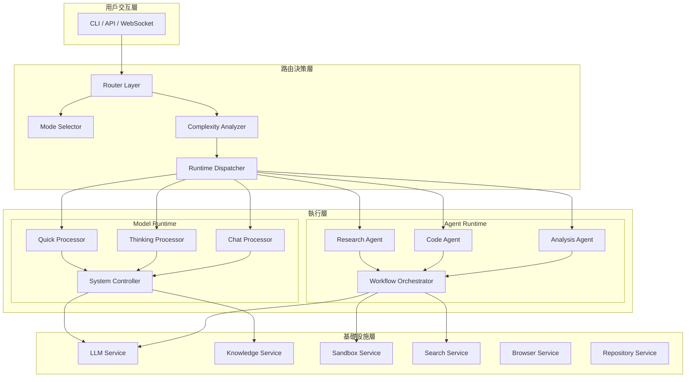

---

## 2. 請求處理管線 (Request Processing Pipeline)

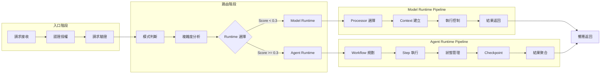

---

## 3. 架構演進路徑

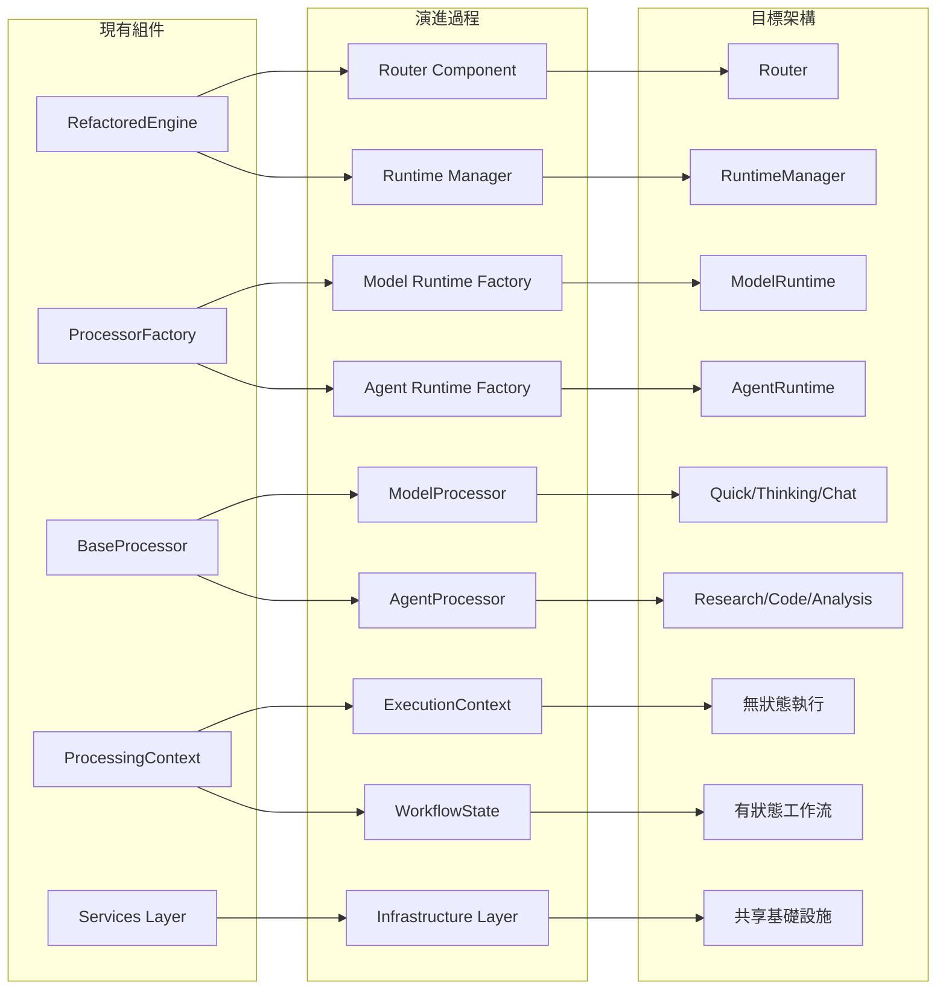

---

## 4. 控制權分配矩陣

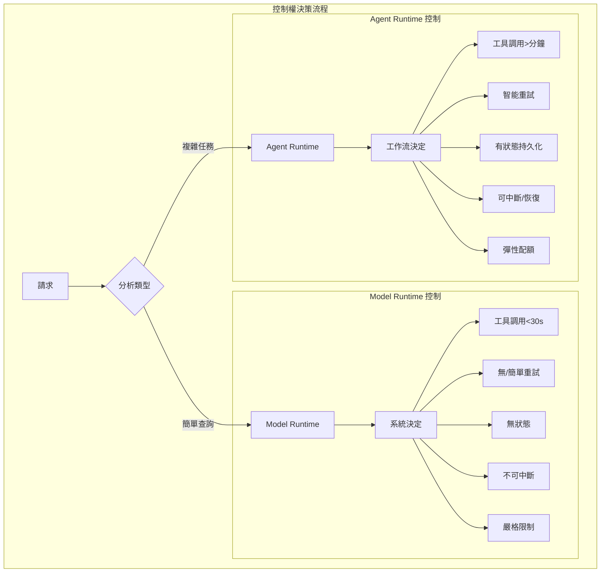

---

## 5. Runtime 執行流程對比

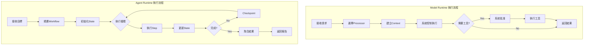

---

## 6. 基礎設施共享模型

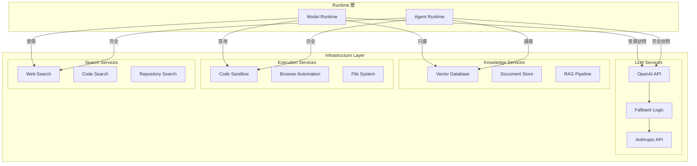

---

## 7. 實施路線圖時間線

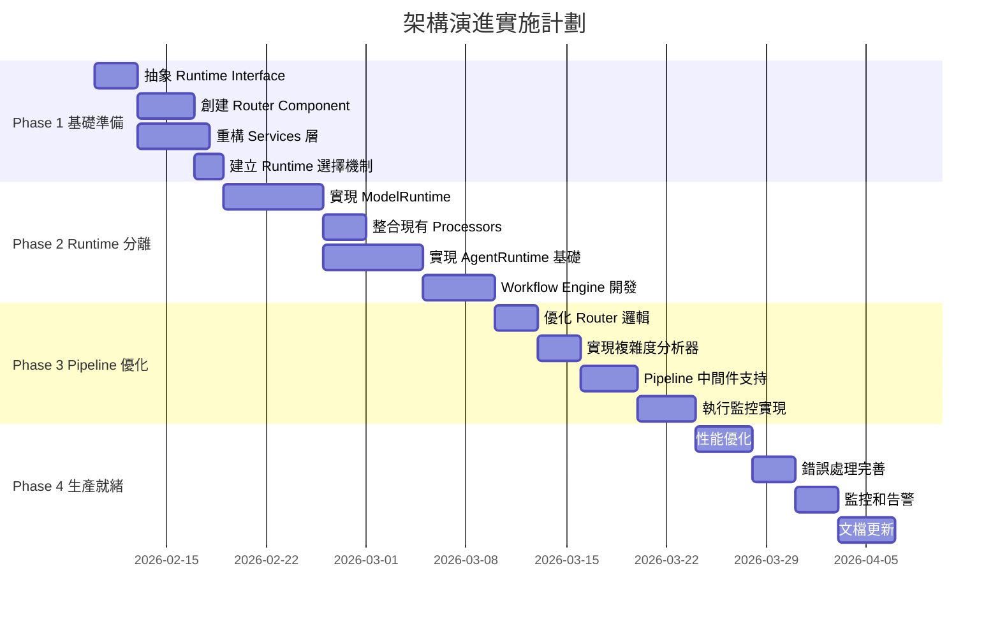

---

## 8. 複雜度分析決策樹

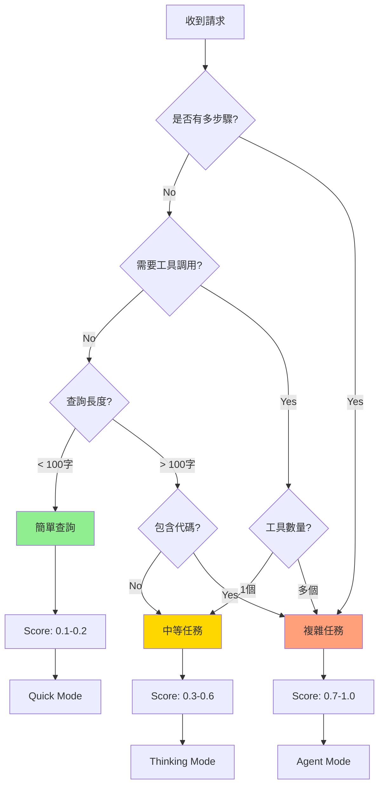

---

## 9. 狀態管理流程

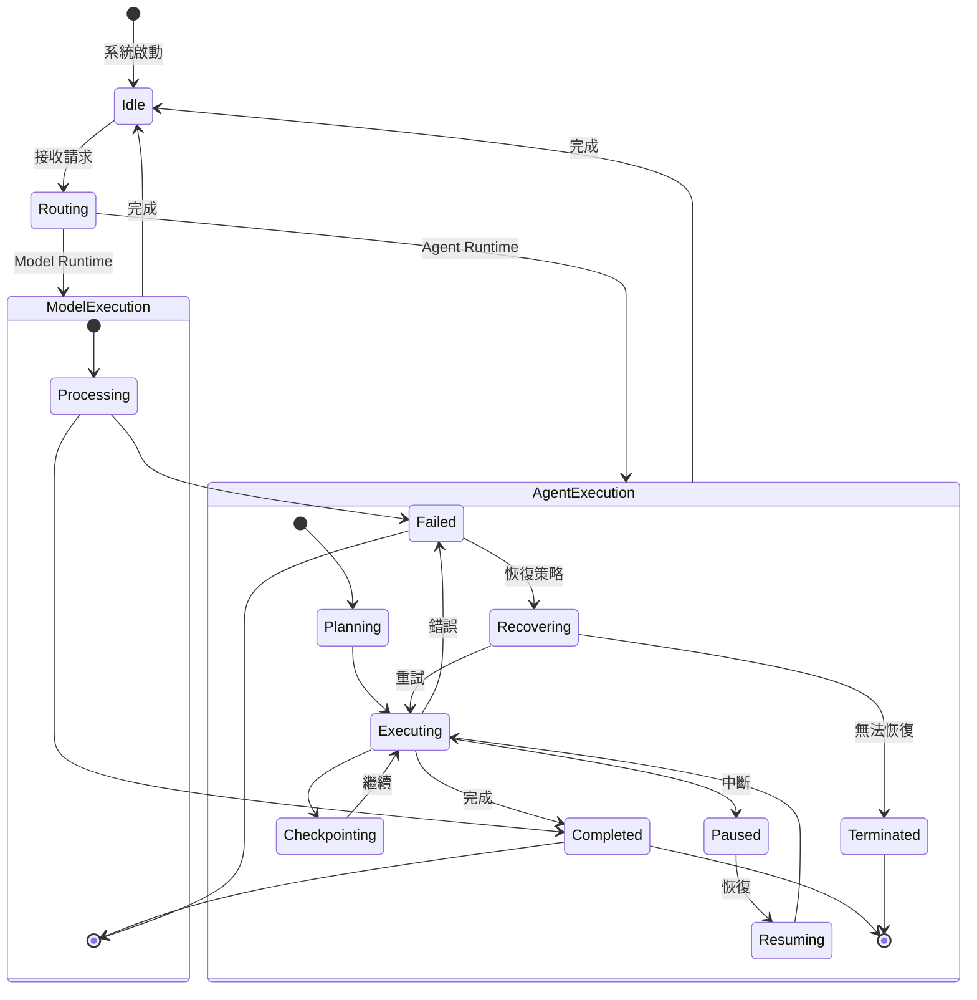

---

## 10. 錯誤處理策略

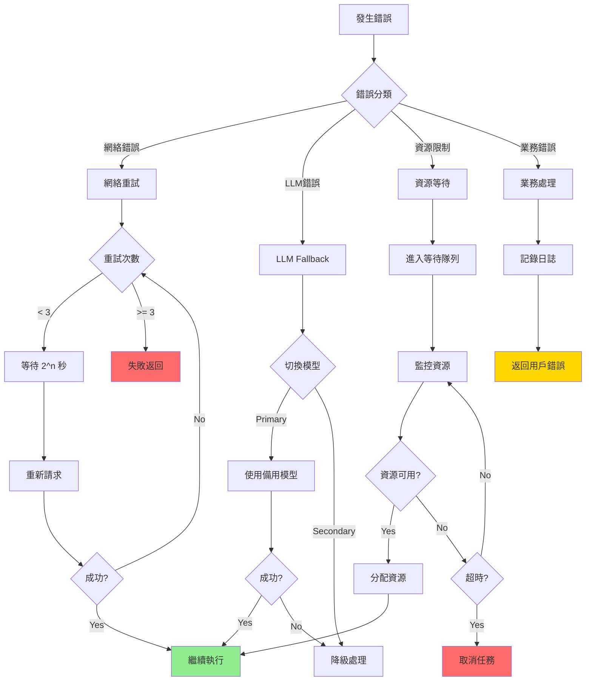

---

## 11. 性能優化決策流程

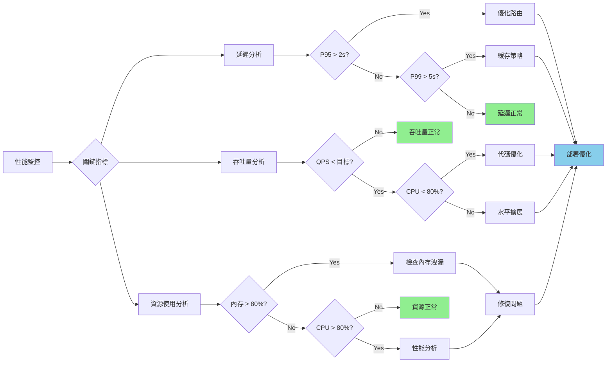

---

## 12. 架構決策流程

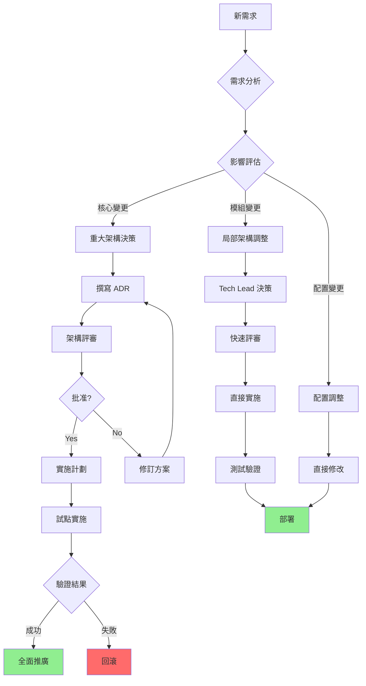

---

## 13. 監控體系架構

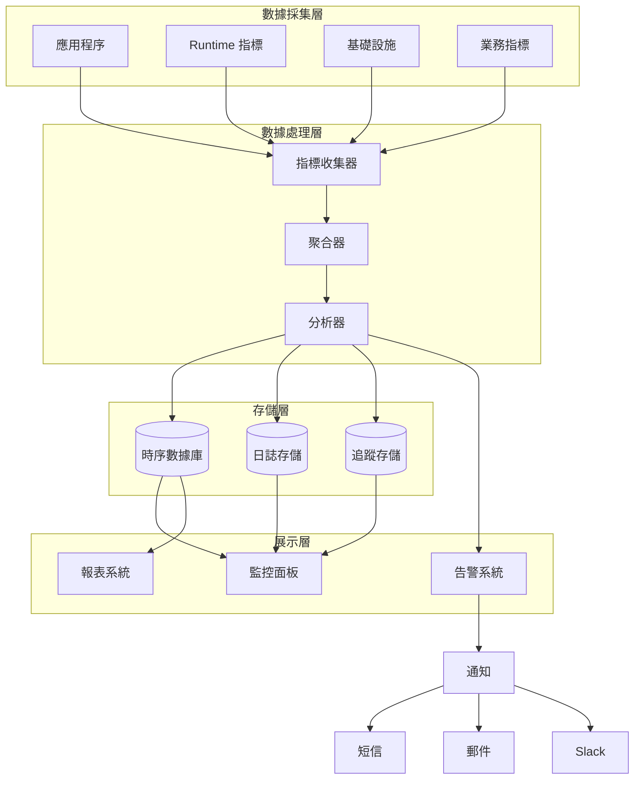

---

## 14. 部署流程

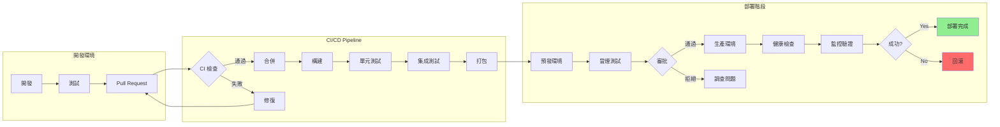

---

## 總結

這份 Mermaid 圖表集涵蓋了 OpenCode Platform 的所有核心架構和流程：

1. **架構層次**：三層 Runtime 模型、基礎設施共享
2. **處理流程**：請求管線、執行流程、狀態管理
3. **決策邏輯**：複雜度分析、路由決策、控制權分配
4. **運維流程**：錯誤處理、性能優化、部署流程
5. **管理流程**：架構決策、監控體系

每個圖表都可以直接在支持 Mermaid 的環境中渲染，提供清晰的視覺化理解。