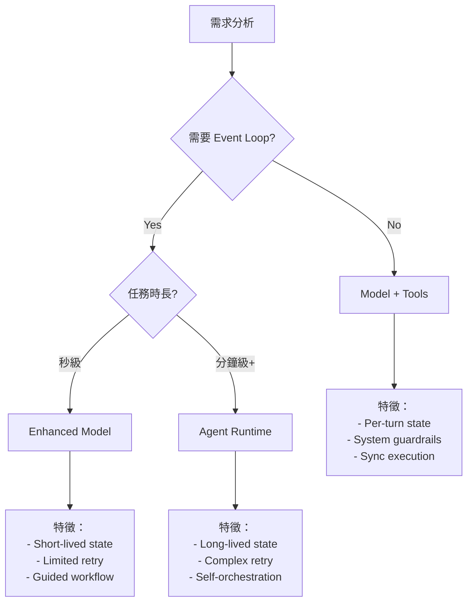

# LLM System 設計準則
> 從 Model vs Agent 的架構選擇到實作指引

## 一、核心定理

### 🔑 第一定理：能力下沉 ≠ 控制權轉移
```
Tool/MCP/Sandbox 成為「標配」代表的是：
「工具能力被下沉為基礎設施，但控制權仍在系統層」
```

### 🔑 第二定理：Runtime 決定架構
```
Model + Tool = Function-level API calls (system-controlled)
Agent = Service-level orchestration (workflow-controlled)
```

---

## 二、三層架構模型

### Layer 1: Capability（能力層）
- **定義**：系統能不能使用某個工具
- **特徵**：Binary（有/無）
- **範例**：Tool calling, Code execution, Web search

### Layer 2: Policy（策略層）
- **定義**：什麼時候、什麼條件下使用
- **特徵**：Rule-based constraints
- **範例**：Rate limits, Permissions, Context triggers

### Layer 3: Orchestration（編排層）
- **定義**：如何組合、重試、分支執行
- **特徵**：Workflow control
- **範例**：Retry logic, State management, Multi-step planning

---

## 三、設計決策樹



---

## 四、判斷準則表

### A. 何時用 Model + Tools

| 條件 | 說明 | 範例 |
|------|------|------|
| ✅ 單次往返即可完成 | No multi-turn dependency | 查詢事實、計算、翻譯 |
| ✅ 無需持久狀態 | Stateless or per-turn state | 問答、摘要、分析 |
| ✅ 失敗可接受 | No critical retry needed | 建議、創意生成 |
| ✅ 秒級響應 | Real-time interaction | 聊天、即時協助 |

### B. 何時用 Agent Runtime

| 條件 | 說明 | 範例 |
|------|------|------|
| ✅ 需要多步驟規劃 | Multi-step execution | Research、Debug、Refactor |
| ✅ 需要狀態管理 | Cross-step state | Project migration、Build |
| ✅ 需要重試機制 | Systematic retry/branch | Test automation、Deploy |
| ✅ 產出結構化成果 | Artifact generation | Report、Documentation |

---

## 五、實作指引

### 1. System Guardrails 設計

```yaml
model_runtime:
  guardrails:
    max_tool_calls: 5          # Per turn limit
    timeout_ms: 30000          # Execution timeout
    permissions:
      - read: always
      - write: confirm
      - execute: restricted
    budget:
      tokens: 10000
      api_calls: 10
```

### 2. Agent Runtime 設計

```yaml
agent_runtime:
  workflow:
    max_steps: 20
    max_duration_min: 15
    retry_policy:
      max_attempts: 3
      backoff: exponential
    state:
      persistence: required
      checkpointing: per_step
    audit:
      level: detailed
      retention: 7_days
```

### 3. 混合模式設計

```python
class SystemDesignPattern:
    """根據需求選擇執行模式"""

    @staticmethod
    def select_runtime(requirement):
        # Level 1: Basic tool use
        if requirement.is_stateless and requirement.single_turn:
            return ModelWithTools()

        # Level 2: Enhanced interaction
        if requirement.needs_retry but requirement.time_bound < 60:
            return EnhancedModel()

        # Level 3: Full agent
        if requirement.needs_orchestration:
            return AgentRuntime()
```

---

## 六、反模式警示

### ❌ 常見錯誤

1. **過度 Agent 化**
   - 錯誤：簡單查詢也用 Agent
   - 正確：Model + Tool 即可

2. **工具濫用**
   - 錯誤：每個回答都調用工具
   - 正確：按需使用，優先用模型知識

3. **狀態管理混亂**
   - 錯誤：在 Model runtime 強行維護狀態
   - 正確：需要狀態就升級到 Agent

4. **控制權不清**
   - 錯誤：讓 Model 自己決定 workflow
   - 正確：System 控制 flow，Model 執行 task

---

## 七、架構演進路線

### Phase 1: Tool Standardization
```
所有 Model 都能用基礎工具
→ 統一 API interface
→ System-level control
```

### Phase 2: Runtime Differentiation
```
區分 Model Runtime vs Agent Runtime
→ 不同的執行模型
→ 不同的狀態管理
```

### Phase 3: Intelligent Routing
```
自動判斷任務類型
→ 動態選擇 Runtime
→ Seamless escalation
```

---

## 八、快速決策檢查清單

### 🎯 一句話判斷法
> **「這個功能需要不需要一個 event loop？」**

### ✅ Model + Tools 檢查清單
- [ ] 單次對話可完成？
- [ ] 不需要記住之前的步驟？
- [ ] 失敗了用戶可以重試？
- [ ] 響應時間 < 30 秒？

**全部打勾 → 用 Model + Tools**

### ✅ Agent Runtime 檢查清單
- [ ] 需要規劃多個步驟？
- [ ] 步驟間有依賴關係？
- [ ] 需要自動重試和分支？
- [ ] 產出需要審計追蹤？

**任一打勾 → 考慮 Agent Runtime**

---

## 九、實戰範例對照

### 範例 A：程式碼解釋
```yaml
需求: 解釋這段程式碼
判斷:
  - Event loop? No
  - Multi-step? No
  - State? No
結論: Model + Tools (可能用 Code Interpreter)
```

### 範例 B：專案重構
```yaml
需求: 重構整個專案架構
判斷:
  - Event loop? Yes
  - Multi-step? Yes (分析→規劃→執行→驗證)
  - State? Yes (追蹤改動)
結論: Agent Runtime
```

### 範例 C：Debug 錯誤
```yaml
需求: Debug 這個錯誤
判斷:
  - Event loop? Maybe
  - Multi-step? Depends
  - State? Minimal
結論: Enhanced Model (可升級為 Agent if needed)
```

---

## 十、未來展望

### 🔮 趨勢預測

1. **工具能力持續下沉**
   - 更多工具成為標配
   - 但控制權保持在系統層

2. **Runtime 智能選擇**
   - 自動識別任務類型
   - 動態切換執行模式

3. **混合執行模式**
   - Model 可臨時升級為 Agent
   - Agent 可降級為 Model

### 📊 成熟度模型

```
Level 1: Tool-enabled Models (現在)
Level 2: Dual Runtime (進行中)
Level 3: Adaptive Runtime (未來)
Level 4: Self-organizing Systems (遠期)
```

---

## 結語

記住核心原則：

> **工具普及 ≠ Agent 化**
> **能力下沉 ≠ 控制上移**
> **共用工具 ≠ 相同 Runtime**

選擇正確的架構，不是選擇「最強大的」，而是選擇「最合適的」。