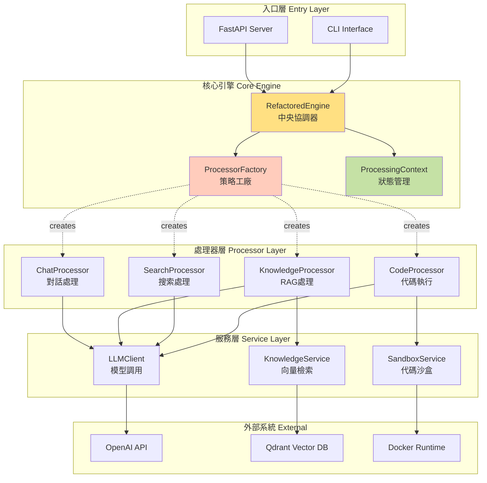
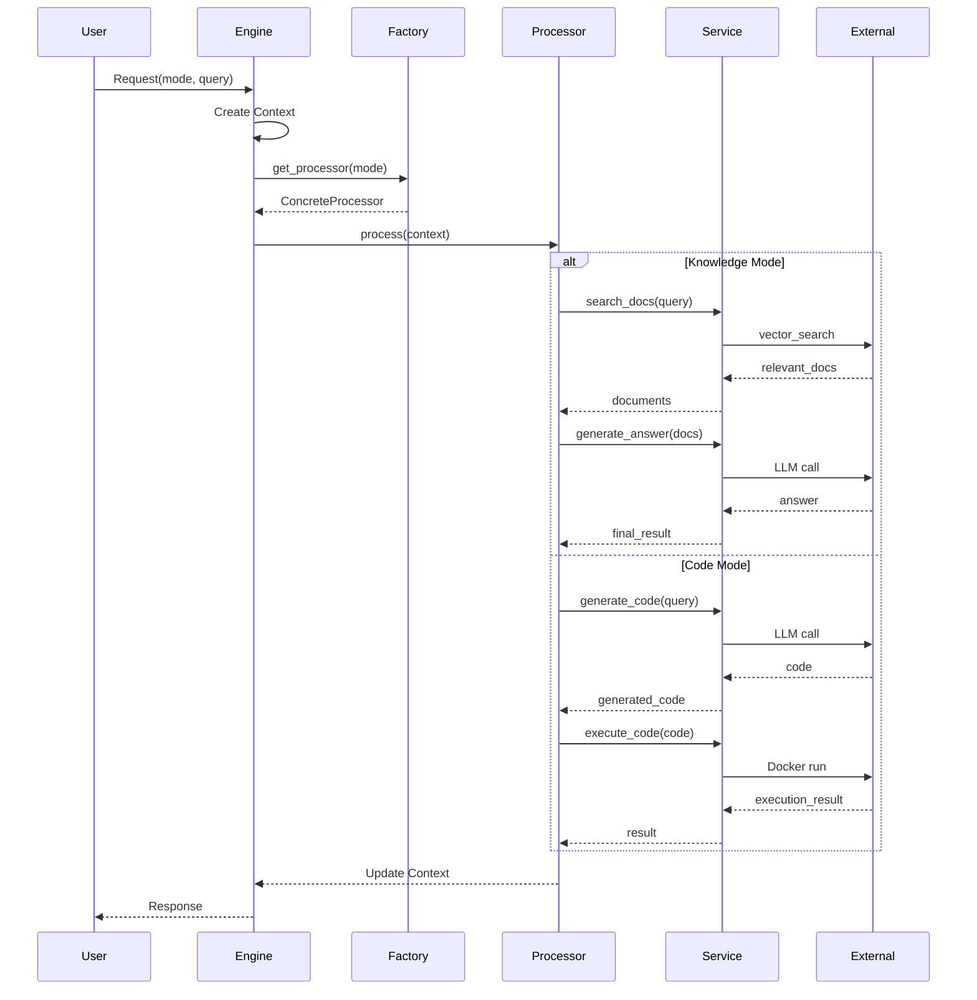
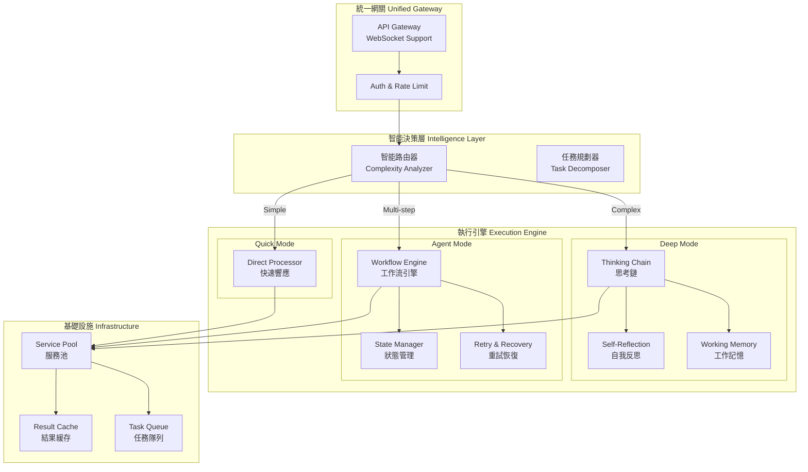
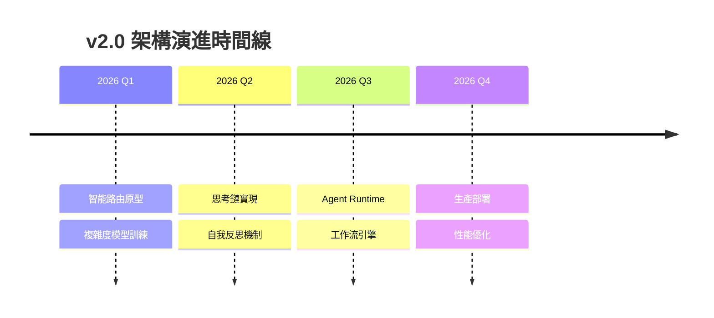

# OpenCode Platform 架構設計文檔

**版本:** `v2.2`
**更新日期:** `2026-02-10`
**狀態:** `Production Ready (v1.x) | Vision (v2.0)`

---

## 📋 執行摘要

本文檔定義 OpenCode Platform 的架構演進路線：

| 版本 | 狀態 | 核心設計 | 特徵 |
|------|------|---------|------|
| **v1.x** | 🟢 生產環境 | 策略模式 + 分層架構 | 穩定、可擴展、明確職責 |
| **v2.0** | 🔵 規劃願景 | 智能路由 + 深度思考鏈 | 自主決策、多步推理、自我反思 |

---

## Part 1: 當前架構 (v1.x) - 生產環境

### 1.1 核心架構原則

```
┌─────────────────────────────────────────┐
│ 設計原則：                               │
│ • 單一職責 (Single Responsibility)       │
│ • 策略模式 (Strategy Pattern)            │
│ • 依賴注入 (Dependency Injection)        │
│ • 明確邊界 (Clear Boundaries)            │
└─────────────────────────────────────────┘
```

### 1.2 系統架構圖



### 1.3 核心組件詳解

#### 🎯 RefactoredEngine (`src/core/engine.py`)

```python
class RefactoredEngine:
    """系統的中央協調器"""

    def process(self, request: Request) -> Response:
        # 1. 創建處理上下文
        context = ProcessingContext(request)

        # 2. 獲取對應處理器
        processor = self.factory.get_processor(request.mode)

        # 3. 執行處理邏輯
        result = processor.process(context)

        # 4. 返回處理結果
        return Response(result=result, context=context)
```

**職責邊界:**
- ✅ 請求路由與分發
- ✅ 上下文生命週期管理
- ✅ 錯誤處理與日誌記錄
- ❌ 業務邏輯實現
- ❌ 外部服務調用

#### 🏭 ProcessorFactory & BaseProcessor

```python
class BaseProcessor(ABC):
    """處理器基類 - 策略模式的抽象策略"""

    @abstractmethod
    async def process(self, context: ProcessingContext) -> Any:
        """每個處理器必須實現的核心方法"""
        pass

class ProcessorFactory:
    """策略工廠 - 根據模式創建處理器"""

    def get_processor(self, mode: ProcessingMode) -> BaseProcessor:
        return self._processors[mode]()
```

**設計優勢:**
- 🔧 新增處理模式無需修改核心代碼
- 🔄 處理器可獨立測試與部署
- 📦 明確的接口契約

### 1.4 請求處理流程



### 1.5 擴展點與限制

| 類別 | 描述 | 影響 |
|------|------|------|
| **擴展點** | | |
| 新增處理器 | 實現 `BaseProcessor` 即可 | 低耦合 |
| 服務替換 | 通過 DI 注入不同實現 | 高彈性 |
| 中間件支持 | 在 Engine 層添加 hooks | 可觀測性 |
| **當前限制** | | |
| 單步處理 | 無法處理多步驟任務 | 複雜任務受限 |
| 同步阻塞 | 部分操作仍為同步 | 性能瓶頸 |
| 無狀態 | 跨請求無法保持狀態 | 無法實現工作流 |

---

## Part 2: 未來架構願景 (v2.0)

### 2.1 核心演進方向

```
v1.x → v2.0 演進重點
━━━━━━━━━━━━━━━━━━━━━━━━━━━━━━━━━━━━━
Model + Tools → Agent Runtime
單步處理 → 多步工作流
手動路由 → 智能決策
簡單響應 → 深度思考
```

### 2.2 v2.0 架構設計



### 2.3 關鍵創新組件

#### 🧠 智能路由器

```python
class IntelligentRouter:
    """基於請求複雜度的自動路由決策"""

    async def analyze(self, request: Request) -> RoutingDecision:
        features = self.extract_features(request)

        # 複雜度評分
        complexity_score = self.complexity_model.predict(features)

        # 任務類型識別
        task_type = self.task_classifier.classify(request)

        # 路由決策
        if complexity_score < 0.3:
            return RoutingDecision(mode="direct", reason="simple_query")
        elif complexity_score < 0.7:
            return RoutingDecision(mode="thinking", reason="needs_reasoning")
        else:
            return RoutingDecision(mode="agent", reason="multi_step_task")
```

#### 🔄 深度思考引擎

```python
class DeepThinkingEngine:
    """模擬結構化思考過程"""

    async def think(self, query: str) -> ThoughtProcess:
        # Step 1: 問題分解
        components = await self.decompose(query)

        # Step 2: 逐步推理
        thoughts = []
        for component in components:
            thought = await self.reason(component)

            # Step 3: 自我檢驗
            critique = await self.reflect(thought)
            if critique.has_issues:
                thought = await self.refine(thought, critique)

            thoughts.append(thought)

        # Step 4: 綜合結論
        synthesis = await self.synthesize(thoughts)

        return ThoughtProcess(
            steps=thoughts,
            conclusion=synthesis,
            confidence=self.calculate_confidence(thoughts)
        )
```

#### 📊 Agent 運行時

```python
class AgentRuntime:
    """長時任務的完整執行環境"""

    async def execute(self, goal: str) -> AgentResult:
        # 初始化執行環境
        state = WorkflowState(goal=goal)

        while not state.is_complete:
            # 規劃下一步
            next_action = await self.planner.plan(state)

            # 執行動作
            try:
                result = await self.executor.execute(next_action)
                state.update(result)
            except ExecutionError as e:
                # 智能重試策略
                recovery = await self.recovery_planner.plan(e, state)
                state = await self.apply_recovery(recovery, state)

            # 檢查點保存
            await self.checkpoint(state)

        return AgentResult(
            goal=goal,
            steps=state.history,
            artifacts=state.artifacts,
            metrics=state.metrics
        )
```

### 2.4 Model vs Agent 決策矩陣

| 判斷維度 | Model + Tools | Agent Runtime | 決策依據 |
|---------|--------------|---------------|----------|
| **執行時間** | < 10秒 | 分鐘級 | 用戶期望 |
| **狀態管理** | 無狀態 | 有狀態 | 任務連續性 |
| **工具調用** | 1-3次 | N次 | 複雜度 |
| **失敗處理** | 直接失敗 | 重試/恢復 | 可靠性要求 |
| **輸出類型** | 文本回答 | 結構化成果 | 交付物類型 |
| **控制流** | 線性 | 分支/循環 | 邏輯複雜度 |

### 2.5 實施路線圖



---

## 🎯 關鍵洞察

### Tool 成為標配 ≠ Model 變成 Agent

> **核心區別不在於「能否使用工具」，而在於「誰控制執行流程」**

| 層次 | Model + Tools | Agent |
|------|--------------|-------|
| **能力層** | 可調用工具 | 可調用工具 |
| **策略層** | 系統決定何時調用 | 自主決定調用時機 |
| **編排層** | 無法控制重試/分支 | 完整的流程控制 |

### 設計決策準則

```python
def should_use_agent(task: Task) -> bool:
    """判斷是否需要 Agent Runtime"""

    return any([
        task.needs_event_loop,        # 需要事件循環
        task.has_multiple_steps,       # 多步驟任務
        task.requires_state,           # 需要狀態管理
        task.needs_retry_logic,        # 需要重試邏輯
        task.produces_artifacts,       # 產生結構化成果
    ])
```

---

## 📝 附錄

### A. 文件版本歷史

| 版本 | 日期 | 變更內容 |
|------|------|----------|
| v2.2 | 2026-02-10 | 重構文檔結構，明確 Model vs Agent 邊界 |
| v2.1 | 2026-02-10 | 添加 v2.0 架構願景 |
| v1.0 | 2026-01-15 | 初始架構文檔 |

### B. 參考資料

- [Strategy Pattern in Python](https://refactoring.guru/design-patterns/strategy/python/example)
- [Actor Model for Distributed Systems](https://doc.akka.io/docs/akka/current/typed/guide/actors-intro.html)
- [Chain of Thought Prompting](https://arxiv.org/abs/2201.11903)

### C. 術語表

| 術語 | 定義 |
|------|------|
| **策略模式** | 將算法族封裝起來，讓它們之間可以互相替換 |
| **思考鏈** | 通過顯式推理步驟來解決複雜問題的方法 |
| **Agent Runtime** | 具有自主決策和執行能力的運行環境 |
| **工作流引擎** | 管理多步驟任務執行的編排系統 |