# 認知架構設計 - 統一方案

**版本**: `v3.0`
**日期**: `2026-02-10`
**核心理念**: `認知分層 + 極簡設計 + 系統思考 = 智能架構`

---

## 一、架構的第一性原理

### 1.1 認知科學基礎

#### 三個認知層次對應三個根本問題

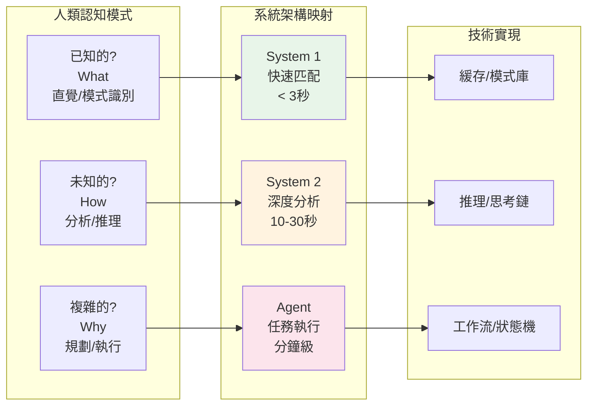

#### 認知負載特性

```
System 1 (快思考)
├─ 特點：自動、快速、低能耗、無狀態
├─ 場景：已知模式、常見問題、FAQ
├─ 實現：緩存 + 模式匹配 + 模板
└─ 目標：< 3秒響應，覆蓋 70% 請求

System 2 (慢思考)
├─ 特點：刻意、緩慢、高能耗、短狀態
├─ 場景：新問題、需要推理、深度分析
├─ 實現：LLM + 思考鏈 + 反思機制
└─ 目標：10-30秒響應，覆蓋 25% 請求

Agent (任務執行)
├─ 特點：目標導向、多步驟、可中斷、長狀態
├─ 場景：複雜任務、需要規劃、多步工作流
├─ 實現：工作流引擎 + 狀態管理 + Checkpoint
└─ 目標：2-10分鐘執行，覆蓋 5% 請求
```

### 1.2 架構核心公式

```
完整系統 = Input → Cognitive Router → Execution Path → Output

其中：
- Cognitive Router = 認知分析（What/How/Why）
- Execution Path = System 1 | System 2 | Agent
- 最優架構 = 認知分層 + 極簡設計 + 清晰邊界
```

---

## 二、統一架構設計

### 2.1 三層架構全景圖

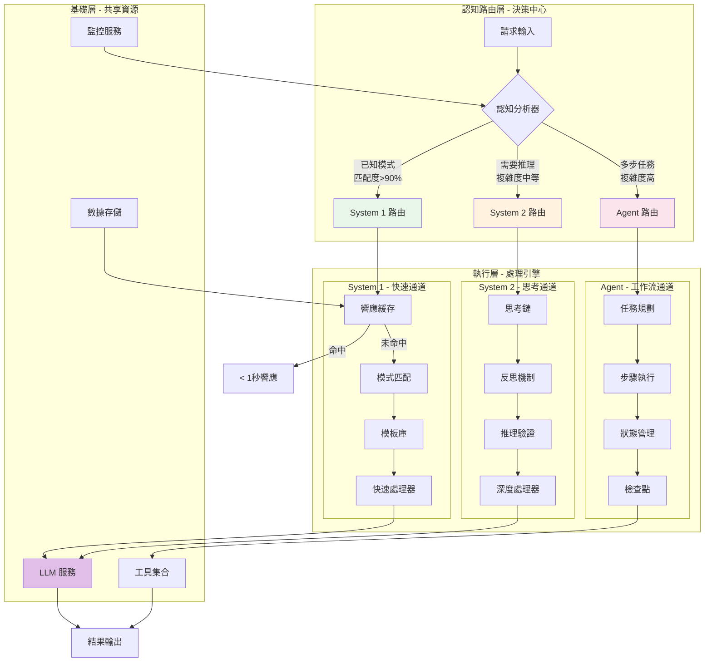

### 2.2 認知路由決策樹

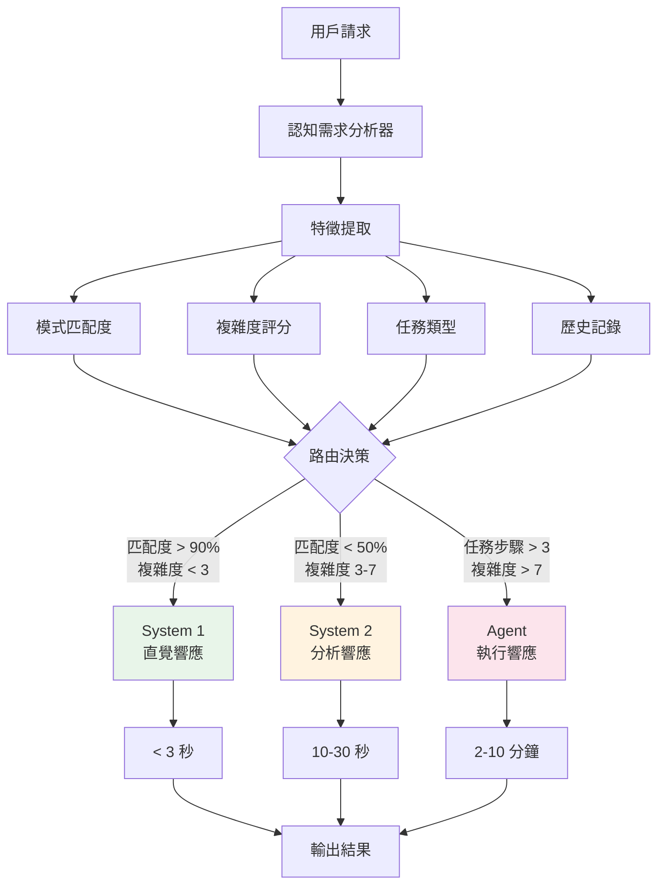

### 2.3 狀態管理模型

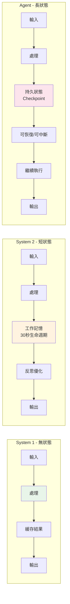

---

## 三、現有架構映射與演進

### 3.1 現有組件到目標架構的映射

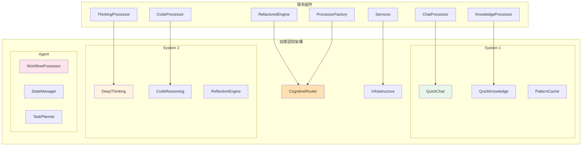

### 3.2 代碼結構演進

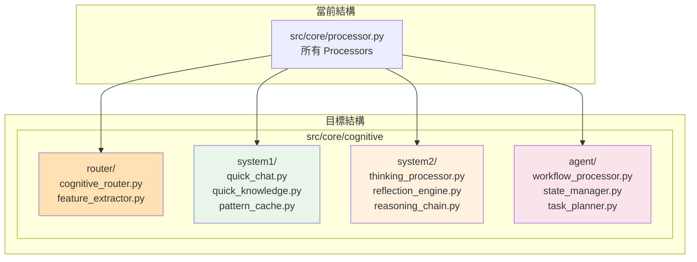

### 3.3 執行流程對比

#### 現有執行流程
```
RefactoredEngine
    └─ ProcessorFactory.get_processor(mode)
        └─ Processor.process()
            └─ Response
```

#### 目標執行流程
```
RefactoredEngine
    └─ CognitiveRouter.analyze(request)
        ├─ System1Pipeline.execute()  [< 3秒]
        │   ├─ Cache.lookup()
        │   ├─ Pattern.match()
        │   └─ Quick.process()
        │
        ├─ System2Pipeline.execute()  [10-30秒]
        │   ├─ Think.chain()
        │   ├─ Reflect.analyze()
        │   └─ Deep.process()
        │
        └─ AgentPipeline.execute()    [分鐘級]
            ├─ Plan.decompose()
            ├─ Execute.steps()
            └─ State.manage()
```

---

## 四、詳細實現方案

### 4.1 System 1 實現架構

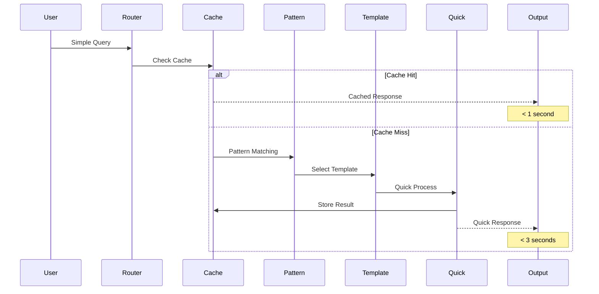

### 4.2 System 2 實現架構

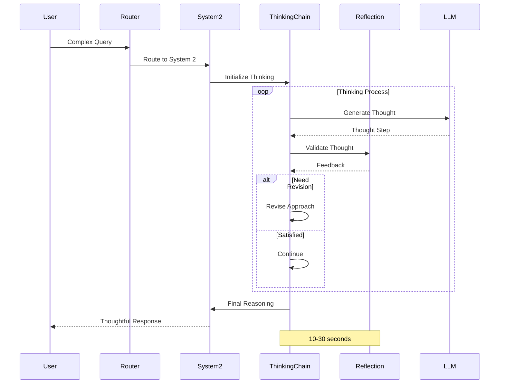

### 4.3 Agent 工作流實現

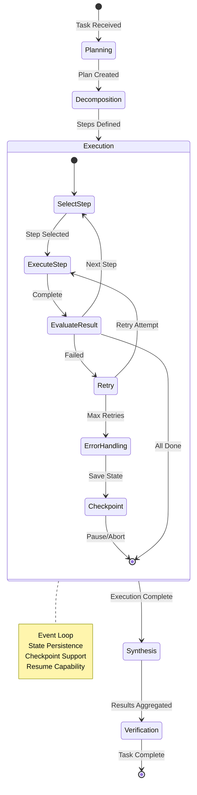

---

## 五、實施計劃

### 5.1 四階段實施路線圖

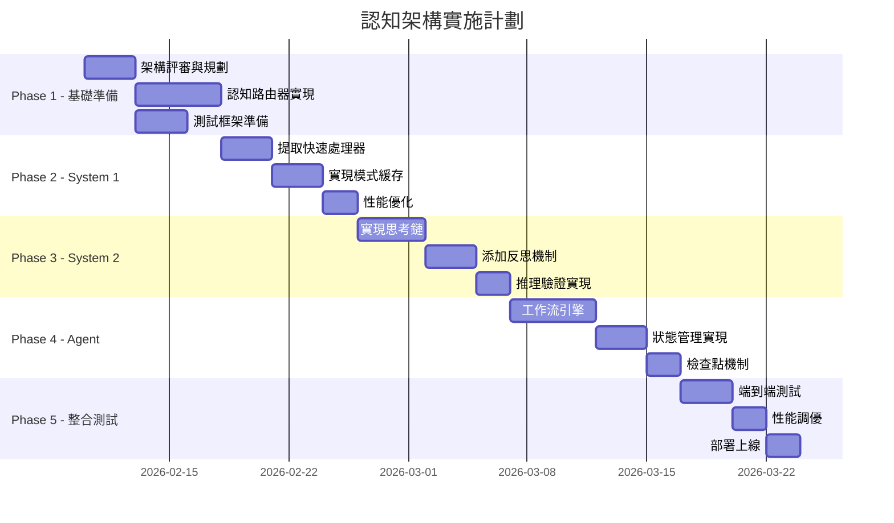

### 5.2 實施優先級

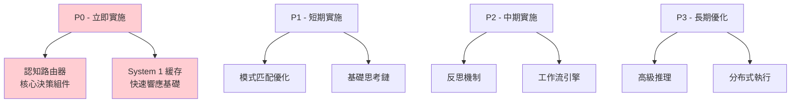

---

## 六、性能目標與監控

### 6.1 性能指標體系

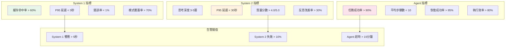

### 6.2 請求分布與資源分配

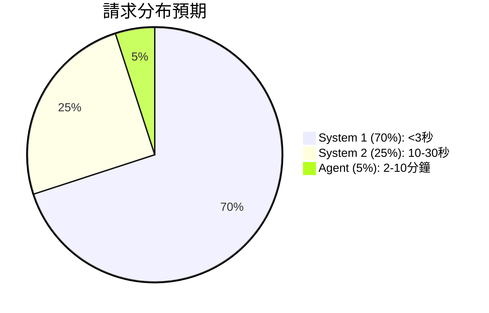

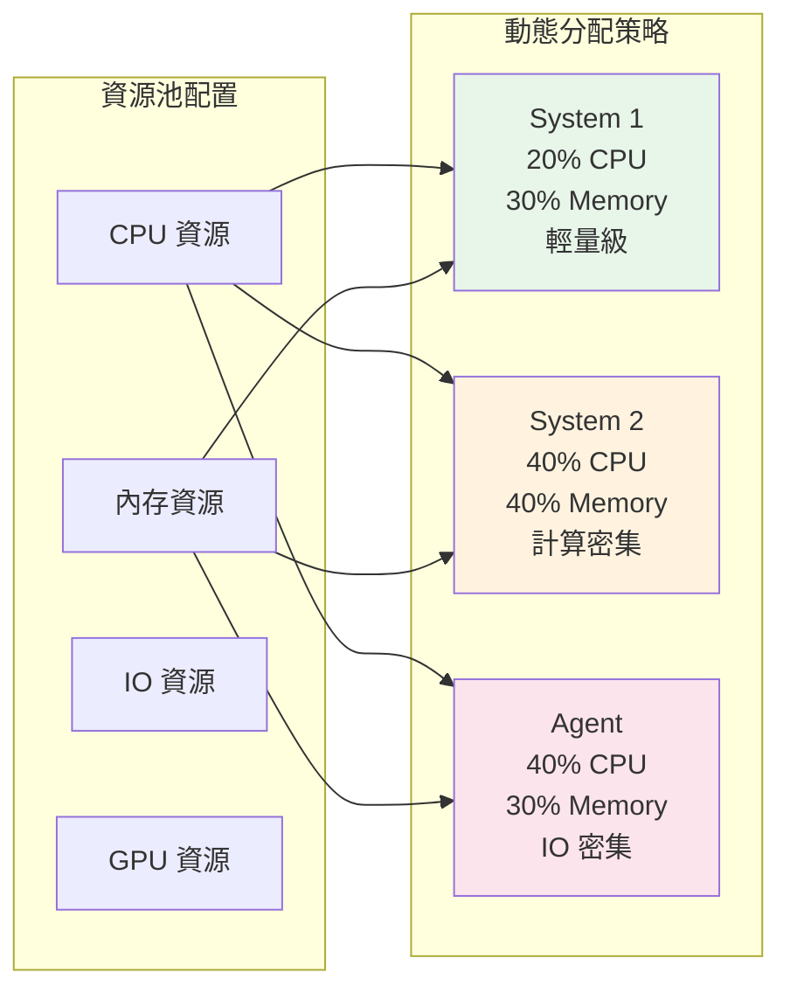

---

## 七、錯誤處理與降級策略

### 7.1 三層錯誤處理機制

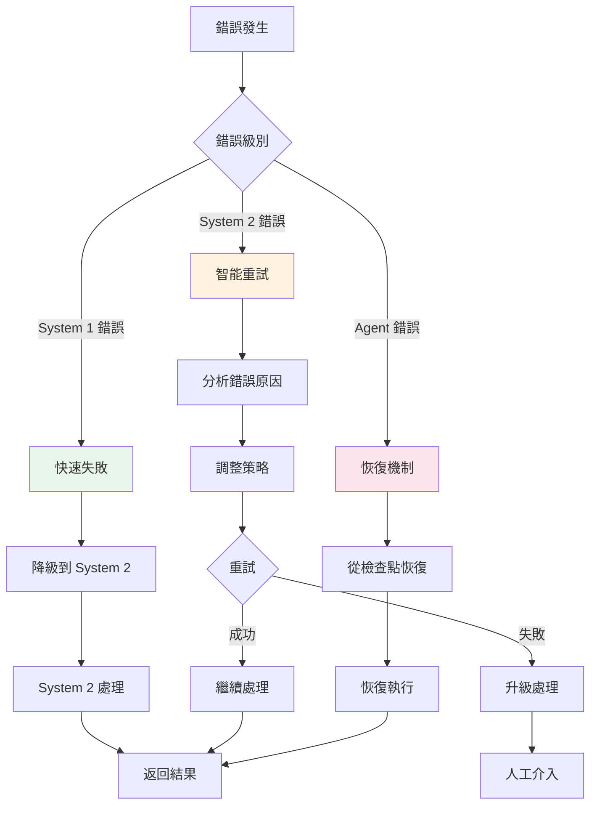

### 7.2 降級策略矩陣

```
錯誤場景                     降級策略                    恢復條件
─────────────────────────────────────────────────────────────────
System 1 緩存滿              清理 LRU 緩存               內存使用 < 80%
System 1 模式不匹配          升級到 System 2             -
System 2 思考超時            簡化推理鏈                  響應時間 < 30s
System 2 LLM 錯誤            使用備用模型                主模型恢復
Agent 步驟失敗               從檢查點重試                重試成功
Agent 完全失敗               返回部分結果                -
全系統過載                   限流 + 排隊                 負載 < 70%
```

---

## 八、架構決策記錄（ADR）

### 8.1 為什麼選擇三層認知架構？

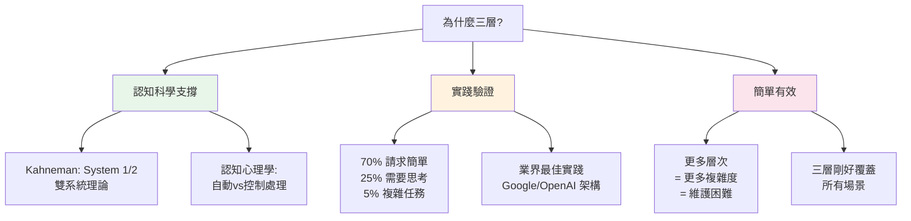

### 8.2 架構不變量

```
無論如何演進，保持不變的核心：

1. 三層認知模型
   - System 1: 快速直覺（無狀態）
   - System 2: 深度思考（短狀態）
   - Agent: 任務執行（長狀態）

2. 統一處理流程
   - Input → Router → Execution → Output
   - 所有請求經過統一路由

3. 共享基礎設施
   - 所有執行路徑共享底層資源
   - 統一的 LLM、DB、Tools 服務

4. 清晰的邊界
   - 各層職責明確
   - 接口標準化
   - 可獨立演進
```

### 8.3 關鍵設計決策

| 決策點 | 選擇 | 理由 | 替代方案 |
|--------|------|------|----------|
| 認知路由 | 集中式路由器 | 統一決策、易於優化 | 分布式路由 |
| 狀態管理 | 分層狀態（無/短/長） | 符合認知特性、資源高效 | 統一狀態管理 |
| 緩存策略 | LRU + 模式索引 | 平衡命中率和內存 | 純 LRU 或純模式 |
| 思考鏈實現 | 迭代式 + 反思 | 質量更高、可解釋 | 單次生成 |
| 工作流引擎 | 事件驅動 + Checkpoint | 可恢復、可擴展 | 線性執行 |

---

## 九、最佳實踐與指導原則

### 9.1 實施原則

```
1. 漸進式演進
   ✓ 先優化 System 1（快速見效）
   ✓ 再增強 System 2（提升質量）
   ✓ 最後構建 Agent（解鎖新能力）

2. 保持兼容性
   ✓ 現有 API 保持不變
   ✓ 內部重構對外透明
   ✓ 支持灰度切換

3. 數據驅動優化
   ✓ 收集認知層使用數據
   ✓ 持續優化路由策略
   ✓ 基於反饋調整資源

4. 簡單優先
   ✓ 不過度設計
   ✓ 保持架構簡潔
   ✓ 優先解決核心問題
```

### 9.2 開發指南

```python
# 認知路由器接口
class CognitiveRouter:
    def analyze(self, request: Request) -> CognitiveLevel:
        """分析請求並決定認知層級"""
        features = self.extract_features(request)
        return self.decide_level(features)

# System 1 處理器接口
class System1Processor:
    def process(self, request: Request) -> Response:
        """快速處理，< 3秒"""
        if cached := self.cache.get(request):
            return cached
        return self.quick_process(request)

# System 2 處理器接口
class System2Processor:
    def process(self, request: Request) -> Response:
        """深度思考，10-30秒"""
        chain = self.create_thinking_chain(request)
        return self.think_with_reflection(chain)

# Agent 處理器接口
class AgentProcessor:
    def process(self, request: Request) -> Response:
        """工作流執行，分鐘級"""
        plan = self.create_plan(request)
        return self.execute_with_state(plan)
```

### 9.3 測試策略

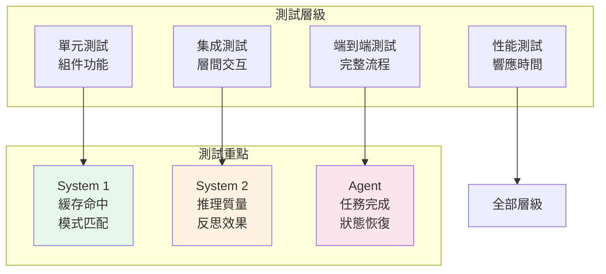

---

## 十、總結

### 10.1 架構價值

```
1. 認知對齊
   - 符合人類思考模式
   - 用戶體驗更自然
   - 預期管理清晰

2. 性能優化
   - 70% 請求秒級響應
   - 25% 請求深度分析
   - 5% 任務自動化執行

3. 資源效率
   - 按認知需求分配資源
   - 避免過度處理
   - 動態資源調度

4. 可維護性
   - 架構簡潔清晰
   - 各層獨立演進
   - 易於理解和擴展
```

### 10.2 核心公式回顧

```
最優架構 = 認知分層 + 極簡設計 + 系統思考

其中：
- 認知分層 = System 1 + System 2 + Agent
- 極簡設計 = 最少組件 + 清晰邊界 + 統一接口
- 系統思考 = 整體視角 + 反饋循環 + 持續優化
```

### 10.3 下一步行動

1. **立即開始**：實現認知路由器和 System 1 優化
2. **短期目標**：完成三層架構基礎實現
3. **中期目標**：優化性能並達到目標指標
4. **長期願景**：建立自適應的智能系統

---

**這是 QuitCode Platform 的統一認知架構設計，融合了系統思考和極簡理念，為構建高效智能系統提供完整藍圖。**