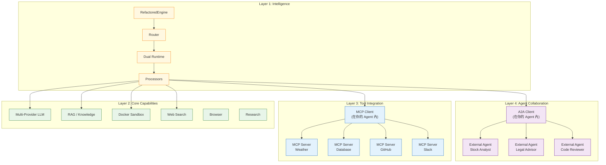
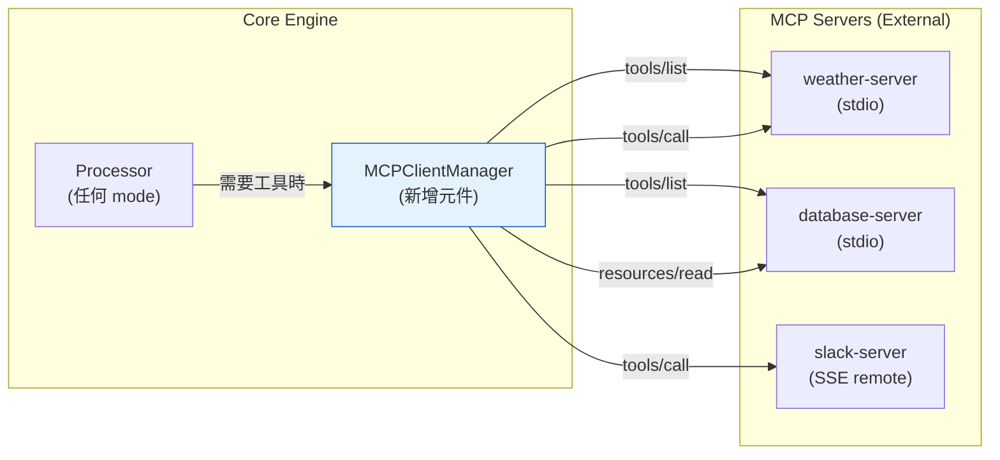
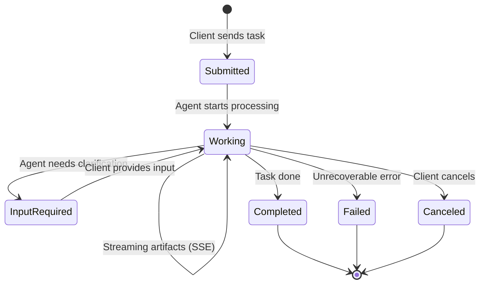
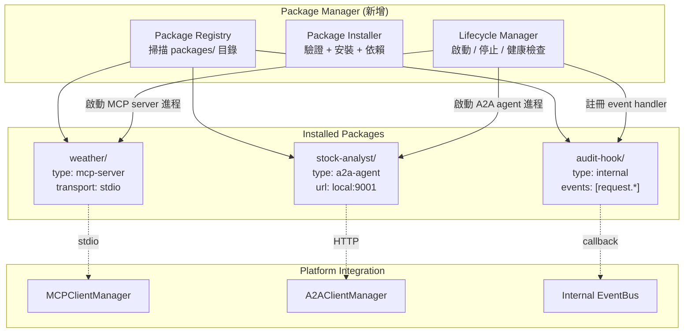
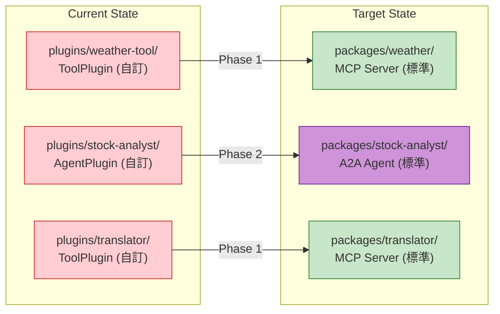

# Extension Architecture: MCP / A2A / Plugin / Service

---

**Document Version:** `v1.0`
**Last Updated:** `2026-02-13`
**Status:** `Design (Pre-Implementation)`
**Scope:** 定義平台擴展能力的四層模型，釐清 Service、MCP、A2A、Plugin 的職責邊界與演進路線

---

## Table of Contents

- [1. Problem Statement](#1-problem-statement)
- [2. Four-Layer Capability Model](#2-four-layer-capability-model)
- [3. Layer 1: Intelligence (Cognitive Core)](#3-layer-1-intelligence-cognitive-core)
- [4. Layer 2: Internal Services](#4-layer-2-internal-services)
- [5. Layer 3: MCP (Tool Integration)](#5-layer-3-mcp-tool-integration)
- [6. Layer 4: A2A (Agent Collaboration)](#6-layer-4-a2a-agent-collaboration)
- [7. Plugin = Packaging Layer](#7-plugin--packaging-layer)
- [8. Decision Framework](#8-decision-framework)
- [9. Migration Path (Current → Target)](#9-migration-path-current--target)
- [10. Implementation Priorities](#10-implementation-priorities)

---

## 1. Problem Statement

平台需要三種不同層次的擴展能力：

| 需求 | 問題 |
|:---|:---|
| 接入外部工具（API、DB、檔案系統） | 用什麼協議？自訂格式還是標準？ |
| 讓其他 AI Agent 幫忙做事 | Agent 之間怎麼溝通？ |
| 讓使用者安裝/管理擴展 | 怎麼包裝、發現、安全隔離？ |

目前平台有三個機制處理這些需求，但邊界模糊：

```
現狀：
  Service（已實作）    — 內建能力，緊耦合
  MCP Protocol（半實作）— KnowledgeBaseService 實作了 MCPServiceProtocol
  Plugin（scaffold）   — 3 個範例，未整合進 Engine
```

**核心問題**：Plugin 系統用自訂格式做了 MCP + A2A 已經標準化的事情。需要釐清每一層的正確職責。

---

## 2. Four-Layer Capability Model



### Layer Summary

| Layer | 解決的問題 | 關係模型 | 信任度 | 協議 |
|:---|:---|:---|:---|:---|
| **L1: Intelligence** | 思考與決策 | 自身 | 完全信任 | Internal |
| **L2: Internal Service** | 核心能力（LLM、RAG、執行） | 器官 | 完全信任 | Direct import |
| **L3: MCP** | 使用外部工具與資料 | 主從（Agent 主動呼叫） | 協議信任 | MCP (stdio/SSE) |
| **L4: A2A** | 與其他 Agent 協作 | 對等（能力協商） | 協商信任 | A2A (HTTP/SSE) |

---

## 3. Layer 1: Intelligence (Cognitive Core)

**現狀**：已完整實作，不需變更。

```
src/core/
  engine.py        → RefactoredEngine（中央調度）
  router.py        → DefaultRouter（模式分類 + 認知層級）
  runtime/         → ModelRuntime / AgentRuntime（雙軌執行）
  processor.py     → 6 個 Processor（策略模式）
  models.py        → Request, Response, ProcessingMode, CognitiveLevel
```

**與擴展的關係**：Engine 是 MCP Client 和 A2A Client 的宿主。Processor 在處理過程中可以決定是否呼叫 MCP tool 或委派 A2A agent。

---

## 4. Layer 2: Internal Services

**現狀**：已完整實作，不需變更。

```
src/services/
  llm/          → MultiProviderLLMClient (OpenAI → Anthropic → Gemini)
  knowledge/    → KnowledgeBaseService (RAG pipeline)
  search/       → SearchService (Tavily → Serper → DDG)
  sandbox/      → SandboxService (Docker isolation)
  browser/      → BrowserService (Web extraction)
  research/     → ResearchService (Deep research pipeline)
  repo/         → RepoService (Git operations)
```

### 何時該是 Internal Service？

```
判斷標準：移除它，核心的 6 個 ProcessingMode 會壞嗎？
  YES → Internal Service
  NO  → 不應該放在這裡
```

| Service | 移除後影響 | 結論 |
|:---|:---|:---|
| `llm/` | 所有 mode 失效 | 必須是 Internal Service |
| `knowledge/` | KNOWLEDGE mode 失效 | 必須是 Internal Service |
| `search/` | SEARCH + DEEP_RESEARCH 降級 | 必須是 Internal Service |
| `sandbox/` | CODE mode 失效 | 必須是 Internal Service |
| `browser/` | 部分 RESEARCH 降級 | 邊界 case，目前合理 |
| `research/` | DEEP_RESEARCH 降級 | 必須是 Internal Service |

### Service 與 MCP 的關係

Internal Service **可以同時實作 MCPServiceProtocol**，使其能被外部 MCP Client 呼叫。`KnowledgeBaseService` 已經這樣做了——它既是 Internal Service（被 Processor 直接呼叫），也符合 MCP 介面（有 `service_id`、`capabilities`、`execute(method, params)`）。

```
                    ┌─────────────────────┐
                    │ KnowledgeBaseService │
                    │                     │
  Internal call ──→ │  retrieve(query)    │ ←── MCP execute("rag_search", params)
  (Processor 直接用) │  store(content)     │     (外部 MCP Client 也能用)
                    │  health_check()     │
                    └─────────────────────┘
```

**設計原則**：核心服務優先保證 Internal Service 的介面穩定，MCP 介面是附加的暴露層。

---

## 5. Layer 3: MCP (Tool Integration)

### 5.1 MCP 是什麼

Model Context Protocol (Anthropic, 2024) — AI 模型與外部工具/資料的標準通訊協議。

```
角色：
  MCP Client  = 你的 Agent（呼叫工具的一方）
  MCP Server  = 工具提供者（被呼叫的一方）

傳輸：
  stdio       = 本地進程（client spawn server 子進程）
  HTTP + SSE  = 遠端服務

能力：
  Tools       = 可執行的函數（function calling）
  Resources   = 可讀取的資料（檔案、DB record）
  Prompts     = 預定義的 prompt template
```

### 5.2 MCP vs 現有 Plugin (tool type)

| 維度 | Plugin (tool type) | MCP Server |
|:---|:---|:---|
| 格式 | 自訂 `plugin.json` + `ToolPlugin` 基類 | 標準 MCP protocol |
| 語言 | 只能 Python | 任何語言 |
| 發現 | 掃描 `plugins/` 目錄 | `stdio` spawn 或 `SSE` endpoint |
| 工具定義 | `get_tools()` → OpenAI format | MCP `tools/list` → MCP format |
| 執行 | `execute(action, params)` | MCP `tools/call` |
| 生態 | 只有自己的平台能用 | Claude / Cursor / 任何 MCP client |
| 隔離 | Docker sandbox | Server 進程隔離（由 transport 決定） |

### 5.3 MCP Client 在平台中的位置



### 5.4 MCP Client 設計

```python
# 新增：src/core/mcp_client.py

class MCPClientManager:
    """管理多個 MCP Server 連線"""

    def __init__(self, config: MCPConfig):
        self._servers: Dict[str, MCPServerConnection] = {}
        # config 來自 YAML/JSON，定義有哪些 MCP servers

    async def initialize(self):
        """啟動所有設定的 MCP server 連線"""
        for server_config in self.config.servers:
            conn = await self._connect(server_config)
            self._servers[conn.name] = conn

    async def list_all_tools(self) -> List[MCPTool]:
        """聚合所有 server 的 tools"""
        tools = []
        for server in self._servers.values():
            tools.extend(await server.list_tools())
        return tools

    async def call_tool(self, server_name: str, tool_name: str,
                        arguments: Dict) -> MCPToolResult:
        """呼叫指定 server 的 tool"""
        server = self._servers[server_name]
        return await server.call_tool(tool_name, arguments)

    async def shutdown(self):
        """關閉所有連線"""
        for server in self._servers.values():
            await server.close()
```

### 5.5 MCP 設定格式

```yaml
# config/mcp_servers.yaml
servers:
  - name: "weather"
    transport: "stdio"
    command: "python"
    args: ["mcp-servers/weather/server.py"]
    env:
      OPENWEATHERMAP_API_KEY: "${OPENWEATHERMAP_API_KEY}"

  - name: "database"
    transport: "stdio"
    command: "npx"
    args: ["-y", "@modelcontextprotocol/server-postgres"]
    env:
      DATABASE_URL: "${DATABASE_URL}"

  - name: "slack"
    transport: "sse"
    url: "https://mcp.example.com/slack"
    headers:
      Authorization: "Bearer ${SLACK_MCP_TOKEN}"
```

---

## 6. Layer 4: A2A (Agent Collaboration)

### 6.1 A2A 是什麼

Agent-to-Agent Protocol (Google, 2025) — Agent 之間的標準互動協議。

```
角色：
  A2A Client = 委派任務的 Agent
  A2A Server = 接受任務的 Agent（遠端）

與 MCP 的本質差異：
  MCP:  Agent 呼叫「工具」— 確定性操作，輸入→輸出
  A2A:  Agent 委派「任務」— 非確定性，可能需要多輪、可能失敗、可能反問
```

### 6.2 A2A vs 現有 Plugin (agent type)

| 維度 | Plugin (agent type) | A2A Agent |
|:---|:---|:---|
| 能力發現 | `plugin.json` 靜態宣告 | Agent Card (`/.well-known/agent.json`) |
| 任務模型 | `process_task(desc)` 一次性 | Task lifecycle: submitted→working→completed |
| 串流回應 | 不支持 | SSE streaming（中間結果即時回傳） |
| 多輪協商 | 不支持 | `input-required` 狀態（Agent 可反問） |
| 推送通知 | 不支持 | Push notification（長任務完成通知） |
| 跨平台 | 只在自己的平台 | 任何 A2A client/server |

### 6.3 A2A Task Lifecycle



### 6.4 A2A Client 在平台中的位置

```python
# 新增：src/core/a2a_client.py

class A2AClientManager:
    """管理與外部 A2A Agent 的互動"""

    def __init__(self, config: A2AConfig):
        self._agents: Dict[str, AgentCard] = {}

    async def discover_agent(self, url: str) -> AgentCard:
        """從 /.well-known/agent.json 取得 Agent Card"""
        async with httpx.AsyncClient() as client:
            resp = await client.get(f"{url}/.well-known/agent.json")
            return AgentCard(**resp.json())

    async def send_task(self, agent_name: str,
                        message: str) -> A2ATask:
        """向外部 Agent 發送任務"""
        agent = self._agents[agent_name]
        task = A2ATask(
            message={"role": "user", "parts": [{"text": message}]}
        )
        return await self._post_task(agent.url, task)

    async def stream_task(self, agent_name: str,
                          message: str) -> AsyncIterator[A2AEvent]:
        """串流接收任務結果"""
        agent = self._agents[agent_name]
        async for event in self._stream_post(agent.url, message):
            yield event
```

### 6.5 A2A Agent Card 範例

```json
{
  "name": "Stock Analyst Agent",
  "description": "Provides stock analysis, technical indicators, and investment recommendations",
  "url": "https://agents.example.com/stock-analyst",
  "version": "1.0.0",
  "capabilities": {
    "streaming": true,
    "pushNotifications": false
  },
  "skills": [
    {
      "id": "stock-query",
      "name": "Stock Price Query",
      "description": "Query current stock prices and basic info",
      "inputModes": ["text"],
      "outputModes": ["text"]
    },
    {
      "id": "stock-analysis",
      "name": "Technical Analysis",
      "description": "MA, RSI, trend analysis with investment recommendations",
      "inputModes": ["text"],
      "outputModes": ["text"]
    }
  ],
  "authentication": {
    "schemes": ["bearer"]
  }
}
```

---

## 7. Plugin = Packaging Layer

### 7.1 重新定義 Plugin

Plugin **不是通訊協議**，是**包裝與分發機制**。Plugin 是一個「安裝包」，裡面裝的是 MCP Server 或 A2A Agent。

```
舊模型（現在的 plugins/）：          新模型：

  plugin.json                        package.json (安裝 manifest)
    type: "tool"    ──→ 自訂格式       type: "mcp-server" ──→ 標準 MCP
    type: "agent"   ──→ 自訂格式       type: "a2a-agent"  ──→ 標準 A2A
    type: "service" ──→ 自訂格式       type: "mcp-server" ──→ 標準 MCP (long-running)
    type: "hook"    ──→ 自訂格式       type: "internal"   ──→ 內部事件系統
```

### 7.2 Package Manager 架構



### 7.3 Package Manifest (取代 plugin.json)

```jsonc
// packages/weather/package.json
{
  "id": "weather-tool",
  "name": "Weather Tool",
  "version": "1.0.0",
  "description": "Current weather and 5-day forecast",
  "author": "OpenCode Community",

  // 關鍵：宣告這是什麼類型的包
  "type": "mcp-server",

  // MCP 相關設定
  "mcp": {
    "transport": "stdio",
    "command": "python",
    "args": ["server.py"],
    "env_required": ["OPENWEATHERMAP_API_KEY"]
  },

  // 安全與資源限制
  "sandbox": {
    "network": true,
    "filesystem": false,
    "memory_limit": "256MB",
    "cpu_limit": 0.5
  },

  // 依賴
  "dependencies": {
    "python": ">=3.11",
    "packages": ["httpx>=0.25.0"]
  }
}
```

```jsonc
// packages/stock-analyst/package.json
{
  "id": "stock-analyst",
  "name": "Stock Analyst Agent",
  "version": "1.0.0",
  "type": "a2a-agent",

  "a2a": {
    "command": "python",
    "args": ["server.py"],
    "port": 9001,
    "skills": ["stock-query", "stock-analysis"],
    "capabilities": {
      "streaming": true,
      "pushNotifications": false
    }
  },

  "sandbox": {
    "network": true,
    "filesystem": false,
    "memory_limit": "512MB"
  },

  "dependencies": {
    "packages": ["yfinance", "pandas"]
  }
}
```

---

## 8. Decision Framework

### 8.1 Decision Tree

```
我要加一個新功能：
│
├─ 移除它，核心 ProcessingMode 會壞嗎？
│   YES → Internal Service (Layer 2)
│   NO  ↓
│
├─ 它是一個「確定性工具」（輸入→輸出，無需多輪）？
│   YES → MCP Server (Layer 3)
│   NO  ↓
│
├─ 它是一個「自主 Agent」（需要推理、可能反問、有狀態）？
│   YES → A2A Agent (Layer 4)
│   NO  ↓
│
├─ 它是對平台事件的反應（logging、audit、通知）？
│   YES → Internal Event Hook
│   NO  ↓
│
└─ 可能不需要——回頭想想是否真的需要這個功能
```

### 8.2 Quick Reference

| 場景 | 方案 | 原因 |
|:---|:---|:---|
| 新增一個 LLM provider | Internal Service | 核心能力，需要 fallback chain 整合 |
| 接入 PostgreSQL 資料庫 | MCP Server | 標準 MCP server 已有現成的 |
| 接入 Slack 通知 | MCP Server | 確定性工具（發訊息、讀訊息） |
| 翻譯服務 | MCP Server | 確定性工具（文字輸入→翻譯輸出） |
| 股票分析師 | A2A Agent | 需要推理、多步驟分析、可能反問 |
| 法律顧問 | A2A Agent | 需要專業推理、多輪對話 |
| Code Review | A2A Agent | 需要理解上下文、給出推理結論 |
| 請求日誌記錄 | Internal Hook | 平台事件反應，不需外部協議 |
| 向量 DB 替換（Qdrant→Pinecone） | Service + MCP Protocol | 核心能力但需要可替換性 |
| 使用者自訂搜尋引擎 | MCP Server (package) | 使用者安裝，非核心 |

### 8.3 Hybrid Pattern: Service + MCP Exposure

某些元件需要「內部是 Service，外部暴露 MCP」：

```python
class KnowledgeBaseService(MCPServiceProtocol, LongTermMemoryProtocol):
    """
    Layer 2: Internal Service — Processor 直接呼叫
    Layer 3: MCP exposure   — 外部 client 也能透過 MCP 呼叫
    """

    # Internal Service interface (Processor 用)
    async def retrieve(self, query: str, top_k: int) -> List[Document]:
        ...

    # MCP interface (外部 client 用)
    async def execute(self, method: str, params: Dict) -> Any:
        if method == "rag_search":
            return await self.retrieve(params["query"], params.get("top_k", 5))
        ...
```

---

## 9. Migration Path (Current → Target)

### Phase 1: MCP Client Integration (Priority: High)

```
目標：讓 Engine 能使用外部 MCP Server

新增檔案：
  src/core/mcp_client.py         — MCPClientManager
  config/mcp_servers.yaml        — MCP server 設定

修改檔案：
  src/core/engine.py             — initialize() 加入 MCP client 啟動
  src/core/processor.py          — BaseProcessor 加入 mcp_client 存取
  src/core/protocols.py          — 加入 MCPClientProtocol

遷移：
  plugins/weather-tool/          → packages/weather/ (MCP server)
  plugins/example-translator/    → packages/translator/ (MCP server)
```

### Phase 2: A2A Client Integration (Priority: Medium)

```
目標：讓 Engine 能委派任務給外部 A2A Agent

新增檔案：
  src/core/a2a_client.py         — A2AClientManager
  config/a2a_agents.yaml         — A2A agent 設定

修改檔案：
  src/core/engine.py             — initialize() 加入 A2A client
  src/core/router.py             — 路由可以決定「委派給外部 Agent」
  src/core/protocols.py          — 加入 A2AClientProtocol

遷移：
  plugins/stock-analyst/         → packages/stock-analyst/ (A2A agent)
```

### Phase 3: Package Manager (Priority: Low)

```
目標：統一的安裝/管理/生命週期管理

新增檔案：
  src/core/package_manager.py    — PackageManager
  packages/                      — 取代 plugins/ 目錄

功能：
  - 掃描 packages/ 目錄
  - 驗證 package.json
  - 根據 type 註冊到 MCPClientManager 或 A2AClientManager
  - 生命週期管理（啟動/停止/健康檢查）
  - REST API for management
```

### Migration Diagram



---

## 10. Implementation Priorities

| Priority | Item | Effort | Impact | Dependency |
|:---|:---|:---|:---|:---|
| **P0** | 定義 `MCPClientProtocol` 在 `protocols.py` | S | High | None |
| **P1** | 實作 `MCPClientManager` | M | High | P0 |
| **P2** | 整合 MCP Client 到 Engine.initialize() | M | High | P1 |
| **P3** | 遷移 weather-tool → MCP Server | S | Medium | P1 |
| **P4** | 遷移 translator → MCP Server | S | Medium | P1 |
| **P5** | 定義 `A2AClientProtocol` | S | Medium | None |
| **P6** | 實作 `A2AClientManager` | L | Medium | P5 |
| **P7** | 遷移 stock-analyst → A2A Agent | M | Medium | P6 |
| **P8** | Package Manager | L | Low | P2, P6 |

---

## Appendix: Protocol Comparison Matrix

```
                    Internal     MCP          A2A
                    Service      Protocol     Protocol
────────────────────────────────────────────────────────
Communication       Direct       stdio/SSE    HTTP/SSE
                    import

Discovery           Hardcoded    tools/list   Agent Card
                    in Engine    resources/   /.well-known/

Invocation          Method       tools/call   tasks/send
                    call

Statefulness        Depends      Stateless    Stateful
                                 (per call)   (task lifecycle)

Multi-turn          N/A          N/A          input-required
                                              → response

Streaming           Depends      Supported    Supported
                                 (SSE)        (SSE)

Error Model         Exception    MCP Error    Task.Failed
                    + Retry      response     + error message

Trust Boundary      Full trust   Process      Network
                    (same proc)  isolation    isolation

Language            Python       Any          Any
                    (same proj)

Ecosystem           Internal     Growing      Emerging
                    only         (Anthropic)  (Google)
────────────────────────────────────────────────────────
```
