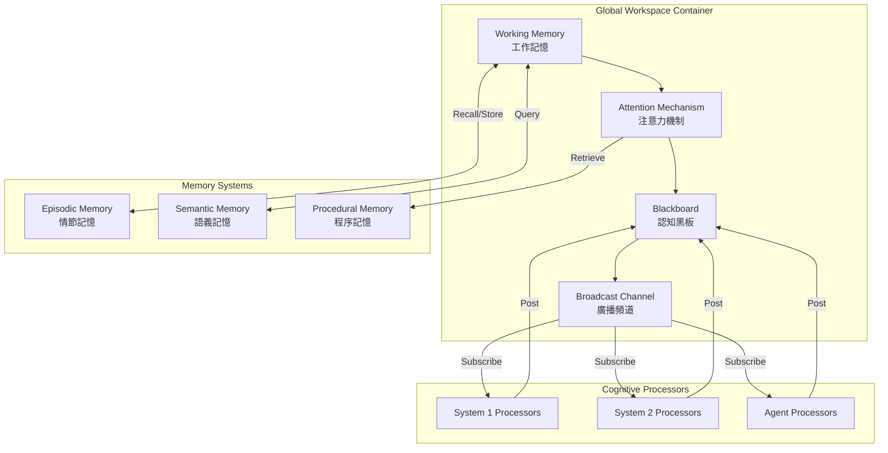
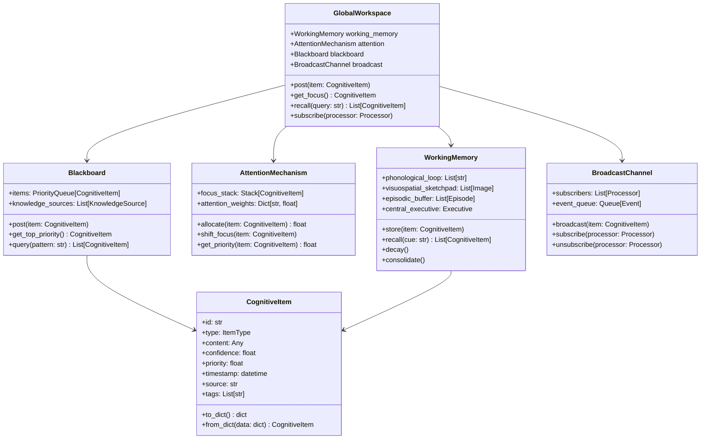

# 全域工作空間設計 (Global Workspace Design)

## 文檔編號
`COGNITIVE-ARCH-01`

**版本**: 1.0.0
**最後更新**: 2026-02-12
**狀態**: 詳細設計階段

---

## 概述

**全域工作空間 (Global Workspace)** 是類人類認知架構的核心組件，模擬大腦中意識信息的共享機制。它解決了當前架構中各 Processor 信息孤島的問題，允許跨模組的認知整合。

### 設計目標

1. **信息共享**：所有 Processor 可以訪問全域認知狀態
2. **容量限制**：模擬人類工作記憶的容量限制（Miller's Law: 7±2）
3. **注意力機制**：基於優先級動態分配認知資源
4. **廣播系統**：關鍵信息可以廣播給所有訂閱者
5. **記憶整合**：整合工作記憶、情節記憶、語義記憶

---

## 神經科學基礎

### Global Workspace Theory (Bernard Baars, 1988)

**核心假說**:
> 意識是一個「全域工作空間」，大腦中的無數專門處理器競爭進入這個空間。一旦信息被廣播到工作空間，所有處理器都可以訪問它，從而實現認知整合。

**關鍵特性**:
1. **容量限制 (Capacity Limit)**: 工作空間同時只能容納有限數量的信息（7±2 項）
2. **廣播機制 (Broadcasting)**: 進入工作空間的信息會廣播給所有訂閱者
3. **競爭與注意 (Competition & Attention)**: 信息通過競爭進入工作空間，注意力決定優先級
4. **意識閾值 (Consciousness Threshold)**: 只有超過閾值的信息才進入意識

### Baddeley's Working Memory Model (1974)

**組件**:
1. **Central Executive (中央執行器)**: 控制注意力與協調子系統
2. **Phonological Loop (語音迴路)**: 處理語言信息
3. **Visuospatial Sketchpad (視覺空間畫板)**: 處理視覺與空間信息
4. **Episodic Buffer (情節緩衝器)**: 整合多模態信息並連接長期記憶

---

## 架構設計

### L2 Container Diagram



### L3 Component Diagram



---

## 核心組件詳細設計

### 1. CognitiveItem - 認知項目

認知項目是工作空間中流通的信息單元，類比神經訊號或思維片段。

```python
from enum import Enum
from dataclasses import dataclass
from datetime import datetime
from typing import Any, List, Optional

class ItemType(Enum):
    """認知項目類型"""
    OBSERVATION = "observation"  # 觀察到的信息（來自 Search/Read）
    THOUGHT = "thought"  # 推理結果（來自 Thinking）
    CODE_RESULT = "code_result"  # 代碼執行結果
    KNOWLEDGE = "knowledge"  # 檢索到的知識
    GOAL = "goal"  # 目標或子目標
    HYPOTHESIS = "hypothesis"  # 假設
    PREDICTION = "prediction"  # 預測
    ERROR = "error"  # 錯誤或預測誤差
    REFLECTION = "reflection"  # 元認知反思

@dataclass
class CognitiveItem:
    """認知項目：工作空間中的信息單元"""

    id: str  # 唯一標識符
    type: ItemType  # 項目類型
    content: Any  # 實際內容（可以是文本、結構化數據、圖像等）
    confidence: float  # 信心分數 [0, 1]
    priority: float  # 優先級 [0, 1]，決定注意力分配
    timestamp: datetime  # 創建時間
    source: str  # 來源 Processor
    tags: List[str]  # 標籤，用於檢索
    metadata: dict  # 額外元數據

    # 工作記憶相關
    activation: float = 1.0  # 激活度，隨時間衰減
    access_count: int = 0  # 被訪問次數
    last_access: Optional[datetime] = None  # 最後訪問時間

    def decay(self, decay_rate: float = 0.1):
        """激活度隨時間衰減"""
        time_delta = (datetime.now() - self.timestamp).total_seconds()
        self.activation *= (1 - decay_rate) ** time_delta

    def boost(self, amount: float = 0.1):
        """提升激活度（被重新訪問時）"""
        self.activation = min(1.0, self.activation + amount)
        self.access_count += 1
        self.last_access = datetime.now()
```

### 2. WorkingMemory - 工作記憶

實現 Baddeley 的工作記憶模型，管理短期信息。

```python
from collections import defaultdict
from typing import List, Dict
import heapq

class WorkingMemory:
    """
    工作記憶：短期信息存儲與處理
    實現 Baddeley 模型
    """

    def __init__(self, capacity: int = 7):
        """
        Args:
            capacity: 工作記憶容量（Miller's Law: 7±2）
        """
        self.capacity = capacity

        # Baddeley 模型的三個子系統
        self.phonological_loop: List[CognitiveItem] = []  # 語言信息
        self.visuospatial_sketchpad: List[CognitiveItem] = []  # 視覺空間信息
        self.episodic_buffer: List[CognitiveItem] = []  # 整合多模態信息

        # 激活度追蹤
        self.items: Dict[str, CognitiveItem] = {}
        self.activation_heap: List[tuple] = []  # (activation, item_id)

    def store(self, item: CognitiveItem):
        """存儲認知項目到工作記憶"""
        # 如果已滿，移除激活度最低的項目
        if len(self.items) >= self.capacity:
            self._evict_lowest_activation()

        # 根據類型存儲到對應的子系統
        if item.type in [ItemType.OBSERVATION, ItemType.THOUGHT]:
            self.phonological_loop.append(item)
        elif item.type == ItemType.CODE_RESULT:
            self.visuospatial_sketchpad.append(item)
        else:
            self.episodic_buffer.append(item)

        # 添加到主存儲
        self.items[item.id] = item
        heapq.heappush(self.activation_heap, (-item.activation, item.id))

    def recall(self, cue: str, top_k: int = 3) -> List[CognitiveItem]:
        """
        根據線索檢索相關項目

        Args:
            cue: 檢索線索（關鍵字或語義）
            top_k: 返回前 k 個最相關的項目
        """
        # 簡單的關鍵字匹配（生產環境應使用語義相似度）
        results = []
        for item in self.items.values():
            if cue.lower() in str(item.content).lower():
                item.boost()  # 提升激活度
                results.append((item.activation * item.confidence, item))

        # 按相關性排序
        results.sort(reverse=True, key=lambda x: x[0])
        return [item for _, item in results[:top_k]]

    def decay_all(self, decay_rate: float = 0.1):
        """對所有項目進行激活度衰減"""
        for item in self.items.values():
            item.decay(decay_rate)

    def _evict_lowest_activation(self):
        """移除激活度最低的項目"""
        while self.activation_heap:
            neg_activation, item_id = heapq.heappop(self.activation_heap)
            if item_id in self.items:
                # 移除項目（可選：轉移到長期記憶）
                removed_item = self.items.pop(item_id)
                # TODO: 轉移到 EpisodicMemory
                break

    def consolidate(self, episodic_memory: 'EpisodicMemory'):
        """
        記憶鞏固：將重要的工作記憶項目轉移到長期記憶

        標準：
        - 高激活度（被頻繁訪問）
        - 高信心度
        - 特定類型（如成功的策略、重要發現）
        """
        for item in self.items.values():
            if item.activation > 0.7 and item.confidence > 0.8:
                # 轉移到情節記憶
                episode = Episode(
                    item=item,
                    context=self._get_context(item),
                    timestamp=item.timestamp
                )
                episodic_memory.store(episode)

    def _get_context(self, item: CognitiveItem) -> Dict:
        """獲取項目的上下文（周圍的認知項目）"""
        context_items = []
        for other in self.items.values():
            if other.id != item.id:
                time_diff = abs((item.timestamp - other.timestamp).total_seconds())
                if time_diff < 60:  # 1 分鐘內的項目視為上下文
                    context_items.append(other)

        return {
            "nearby_items": context_items,
            "task_context": item.metadata.get("task_context", {})
        }
```

### 3. AttentionMechanism - 注意力機制

模擬注意力的選擇性與容量限制。

```python
import numpy as np
from typing import List, Dict
from dataclasses import dataclass

@dataclass
class AttentionWeight:
    """注意力權重"""
    item_id: str
    weight: float
    reason: str  # 為什麼給予注意力

class AttentionMechanism:
    """
    注意力機制：決定哪些認知項目獲得優先處理

    實現：
    - 優先級基礎注意力
    - 新奇性偵測（Norepinephrine 類比）
    - 目標相關性（Top-down attention）
    - 顯著性（Bottom-up attention）
    """

    def __init__(self):
        self.focus_stack: List[CognitiveItem] = []  # 當前焦點堆疊
        self.attention_weights: Dict[str, float] = {}  # item_id -> weight

        # 注意力偏好參數
        self.novelty_bias: float = 0.3  # 新奇性權重
        self.goal_relevance_bias: float = 0.5  # 目標相關性權重
        self.salience_bias: float = 0.2  # 顯著性權重

    def allocate(self, items: List[CognitiveItem], goal: Optional[str] = None) -> List[AttentionWeight]:
        """
        為一組認知項目分配注意力權重

        Args:
            items: 候選認知項目
            goal: 當前目標（用於計算相關性）

        Returns:
            排序後的注意力權重列表
        """
        weights = []

        for item in items:
            # 計算多個因子
            novelty = self._compute_novelty(item)
            goal_relevance = self._compute_goal_relevance(item, goal) if goal else 0.5
            salience = self._compute_salience(item)

            # 加權組合
            total_weight = (
                self.novelty_bias * novelty +
                self.goal_relevance_bias * goal_relevance +
                self.salience_bias * salience
            )

            # 考慮項目本身的優先級與激活度
            total_weight *= item.priority * item.activation

            weights.append(AttentionWeight(
                item_id=item.id,
                weight=total_weight,
                reason=f"novelty={novelty:.2f}, goal_rel={goal_relevance:.2f}, salience={salience:.2f}"
            ))

        # 排序並歸一化
        weights.sort(key=lambda x: x.weight, reverse=True)
        total = sum(w.weight for w in weights)
        for w in weights:
            w.weight /= total
            self.attention_weights[w.item_id] = w.weight

        return weights

    def shift_focus(self, item: CognitiveItem):
        """將焦點轉移到新的認知項目"""
        # 維護焦點堆疊（類似函數調用堆疊）
        self.focus_stack.append(item)

        # 限制堆疊深度（避免過深的嵌套思考）
        if len(self.focus_stack) > 5:
            self.focus_stack.pop(0)

    def get_current_focus(self) -> Optional[CognitiveItem]:
        """獲取當前焦點"""
        return self.focus_stack[-1] if self.focus_stack else None

    def pop_focus(self) -> Optional[CognitiveItem]:
        """退出當前焦點，返回上一層"""
        return self.focus_stack.pop() if self.focus_stack else None

    def _compute_novelty(self, item: CognitiveItem) -> float:
        """
        計算新奇性：新信息比已知信息更吸引注意力

        實現：基於訪問次數和時間
        """
        if item.access_count == 0:
            return 1.0  # 完全新的信息

        # 考慮訪問頻率與最近性
        time_since_access = (datetime.now() - item.last_access).total_seconds()
        novelty = 1.0 / (1 + np.log1p(item.access_count))
        novelty *= np.exp(-time_since_access / 3600)  # 1 小時衰減時間

        return min(1.0, novelty)

    def _compute_goal_relevance(self, item: CognitiveItem, goal: str) -> float:
        """
        計算目標相關性：與當前目標相關的信息獲得更多注意力

        實現：簡單的關鍵字匹配（生產環境應使用語義相似度）
        """
        if not goal:
            return 0.5

        # 簡單的關鍵字重疊
        goal_terms = set(goal.lower().split())
        item_terms = set(str(item.content).lower().split())

        if not goal_terms:
            return 0.5

        overlap = len(goal_terms & item_terms) / len(goal_terms)
        return overlap

    def _compute_salience(self, item: CognitiveItem) -> float:
        """
        計算顯著性：內在顯著的信息（如錯誤、警告）自動吸引注意力

        實現：基於類型、信心度、優先級
        """
        # 錯誤和預測誤差非常顯著
        if item.type in [ItemType.ERROR, ItemType.PREDICTION]:
            return 1.0

        # 低信心度的結果需要注意
        if item.confidence < 0.5:
            return 0.8

        # 否則基於優先級
        return item.priority
```

### 4. Blackboard - 認知黑板

實現黑板架構模式，允許多個知識源協作解決問題。

```python
from queue import PriorityQueue
from typing import List, Callable, Dict
import threading

class KnowledgeSource:
    """知識源：訂閱黑板並對特定模式做出響應"""

    def __init__(self, name: str, trigger_condition: Callable[[CognitiveItem], bool]):
        self.name = name
        self.trigger_condition = trigger_condition

    def can_contribute(self, item: CognitiveItem) -> bool:
        """判斷是否可以對此項目做出貢獻"""
        return self.trigger_condition(item)

    async def contribute(self, item: CognitiveItem, workspace: 'GlobalWorkspace') -> List[CognitiveItem]:
        """
        對黑板做出貢獻（抽象方法，由具體 Processor 實現）

        Returns:
            新產生的認知項目列表
        """
        raise NotImplementedError

class Blackboard:
    """
    認知黑板：問題解決的共享空間

    特性：
    - 知識源（KnowledgeSource）訂閱黑板
    - 當新項目發布時，觸發相關知識源
    - 知識源可以添加新的項目到黑板
    - 優先級隊列管理處理順序
    """

    def __init__(self):
        self.items: Dict[str, CognitiveItem] = {}  # 所有項目
        self.priority_queue: PriorityQueue = PriorityQueue()  # 待處理項目
        self.knowledge_sources: List[KnowledgeSource] = []  # 知識源
        self.lock = threading.Lock()

    def post(self, item: CognitiveItem):
        """發布新的認知項目到黑板"""
        with self.lock:
            self.items[item.id] = item
            # 優先級取負值，因為 PriorityQueue 默認最小堆
            self.priority_queue.put((-item.priority, item.id))

    def get_top_priority(self) -> Optional[CognitiveItem]:
        """獲取最高優先級的項目"""
        if self.priority_queue.empty():
            return None

        _, item_id = self.priority_queue.get()
        return self.items.get(item_id)

    def query(self, pattern: str) -> List[CognitiveItem]:
        """查詢匹配特定模式的項目"""
        results = []
        for item in self.items.values():
            if pattern.lower() in str(item.content).lower():
                results.append(item)
        return results

    def register_knowledge_source(self, ks: KnowledgeSource):
        """註冊知識源"""
        self.knowledge_sources.append(ks)

    async def trigger_knowledge_sources(self, item: CognitiveItem, workspace: 'GlobalWorkspace'):
        """
        觸發可以對此項目做出貢獻的知識源

        這是黑板架構的核心機制：
        1. 新項目發布到黑板
        2. 檢查哪些知識源可以處理
        3. 觸發知識源產生新的認知項目
        4. 新項目再次發布到黑板（遞迴）
        """
        for ks in self.knowledge_sources:
            if ks.can_contribute(item):
                new_items = await ks.contribute(item, workspace)
                for new_item in new_items:
                    self.post(new_item)
```

### 5. BroadcastChannel - 廣播頻道

實現 Pub/Sub 模式，允許 Processor 訂閱認知事件。

```python
from typing import List, Callable
from asyncio import Queue
from dataclasses import dataclass

@dataclass
class CognitiveEvent:
    """認知事件"""
    type: str  # "item_posted", "item_updated", "focus_shifted", etc.
    item: CognitiveItem
    timestamp: datetime

class BroadcastChannel:
    """
    廣播頻道：將認知項目廣播給所有訂閱者

    實現 Pub/Sub 模式，允許 Processor 響應式地處理認知事件
    """

    def __init__(self):
        self.subscribers: Dict[str, Callable] = {}  # processor_name -> callback
        self.event_queue: Queue[CognitiveEvent] = Queue()

    def subscribe(self, processor_name: str, callback: Callable[[CognitiveEvent], None]):
        """訂閱認知事件"""
        self.subscribers[processor_name] = callback

    def unsubscribe(self, processor_name: str):
        """取消訂閱"""
        if processor_name in self.subscribers:
            del self.subscribers[processor_name]

    async def broadcast(self, event: CognitiveEvent):
        """廣播認知事件給所有訂閱者"""
        # 添加到事件隊列
        await self.event_queue.put(event)

        # 通知所有訂閱者
        for processor_name, callback in self.subscribers.items():
            try:
                # 非阻塞調用（使用 asyncio.create_task）
                callback(event)
            except Exception as e:
                logger.error(f"Broadcast error to {processor_name}: {e}")
```

---

## 完整的 GlobalWorkspace 整合

```python
class GlobalWorkspace:
    """
    全域工作空間：認知架構的核心

    職責：
    1. 管理工作記憶（短期信息）
    2. 分配注意力資源
    3. 維護認知黑板（問題解決空間）
    4. 廣播認知事件給訂閱者
    5. 連接長期記憶系統
    """

    def __init__(
        self,
        working_memory_capacity: int = 7,
        episodic_memory: Optional['EpisodicMemory'] = None,
        semantic_memory: Optional['SemanticMemory'] = None
    ):
        # 核心組件
        self.working_memory = WorkingMemory(capacity=working_memory_capacity)
        self.attention = AttentionMechanism()
        self.blackboard = Blackboard()
        self.broadcast = BroadcastChannel()

        # 記憶系統連接
        self.episodic_memory = episodic_memory
        self.semantic_memory = semantic_memory

        # 狀態追蹤
        self.current_goal: Optional[str] = None
        self.processing_history: List[CognitiveItem] = []

    def post(self, item: CognitiveItem):
        """
        發布認知項目到工作空間

        流程：
        1. 存儲到工作記憶
        2. 發布到黑板
        3. 廣播事件給訂閱者
        4. 分配注意力
        """
        # 1. 存儲到工作記憶
        self.working_memory.store(item)

        # 2. 發布到黑板
        self.blackboard.post(item)

        # 3. 廣播事件
        event = CognitiveEvent(
            type="item_posted",
            item=item,
            timestamp=datetime.now()
        )
        asyncio.create_task(self.broadcast.broadcast(event))

        # 4. 更新注意力
        self._update_attention()

        # 5. 記錄歷史
        self.processing_history.append(item)

    def get_focus(self) -> Optional[CognitiveItem]:
        """獲取當前注意力焦點"""
        return self.attention.get_current_focus()

    def recall(self, cue: str, top_k: int = 3) -> List[CognitiveItem]:
        """
        從工作記憶中檢索相關項目

        如果工作記憶中沒有，會查詢長期記憶
        """
        # 首先從工作記憶檢索
        results = self.working_memory.recall(cue, top_k)

        # 如果不足，從情節記憶檢索
        if len(results) < top_k and self.episodic_memory:
            episodic_results = self.episodic_memory.recall_similar(cue, top_k - len(results))
            results.extend([ep.item for ep in episodic_results])

        # 如果還不足，從語義記憶檢索
        if len(results) < top_k and self.semantic_memory:
            semantic_results = self.semantic_memory.query(cue, top_k - len(results))
            results.extend(semantic_results)

        return results

    def set_goal(self, goal: str):
        """設置當前目標（影響注意力分配）"""
        self.current_goal = goal
        self._update_attention()

    def subscribe(self, processor_name: str, callback: Callable):
        """訂閱工作空間事件"""
        self.broadcast.subscribe(processor_name, callback)

    def consolidate_memory(self):
        """
        記憶鞏固：將重要的工作記憶轉移到長期記憶

        應該在任務完成後或系統空閒時調用
        """
        if self.episodic_memory:
            self.working_memory.consolidate(self.episodic_memory)

    def decay(self):
        """
        激活度衰減：定期調用以模擬遺忘

        建議每分鐘調用一次
        """
        self.working_memory.decay_all()

    def _update_attention(self):
        """根據當前工作記憶內容更新注意力分配"""
        items = list(self.working_memory.items.values())
        if items:
            weights = self.attention.allocate(items, self.current_goal)
            # 將注意力焦點轉移到最高權重的項目
            if weights:
                top_item_id = weights[0].item_id
                top_item = self.working_memory.items.get(top_item_id)
                if top_item:
                    self.attention.shift_focus(top_item)
```

---

## Processor 整合範例

如何將現有的 Processor 整合到全域工作空間：

```python
class SearchProcessor(KnowledgeSource):
    """
    Search Processor 作為知識源訂閱工作空間

    觸發條件：當黑板上出現「需要外部信息」的項目時
    """

    def __init__(self, workspace: GlobalWorkspace):
        super().__init__(
            name="SearchProcessor",
            trigger_condition=lambda item: item.type == ItemType.GOAL and "search" in item.tags
        )
        self.workspace = workspace
        self.tool = SearchTool()

        # 訂閱工作空間事件
        workspace.subscribe("SearchProcessor", self.on_workspace_event)

    def on_workspace_event(self, event: CognitiveEvent):
        """響應工作空間事件"""
        if event.type == "item_posted" and event.item.type == ItemType.GOAL:
            # 新目標發布，檢查是否需要搜尋
            if "information needed" in str(event.item.content).lower():
                logger.info("SearchProcessor triggered by workspace event")

    async def contribute(self, item: CognitiveItem, workspace: GlobalWorkspace) -> List[CognitiveItem]:
        """
        對工作空間做出貢獻

        執行搜尋並將結果發布到工作空間
        """
        # 執行搜尋
        query = str(item.content)
        search_results = await self.tool.run(query)

        # 創建新的認知項目
        result_item = CognitiveItem(
            id=f"search_{uuid.uuid4()}",
            type=ItemType.OBSERVATION,
            content=search_results,
            confidence=0.7,
            priority=0.8,
            timestamp=datetime.now(),
            source="SearchProcessor",
            tags=["search_result", "external_info"],
            metadata={"query": query}
        )

        return [result_item]
```

---

## 測試策略

### 單元測試

```python
import pytest
from datetime import datetime, timedelta

class TestWorkingMemory:
    def test_capacity_limit(self):
        """測試容量限制"""
        wm = WorkingMemory(capacity=3)

        # 添加 4 個項目
        for i in range(4):
            item = CognitiveItem(
                id=f"item_{i}",
                type=ItemType.THOUGHT,
                content=f"Content {i}",
                confidence=0.8,
                priority=0.5,
                timestamp=datetime.now(),
                source="test",
                tags=[]
            )
            wm.store(item)

        # 應該只保留 3 個（最早的被淘汰）
        assert len(wm.items) == 3
        assert "item_0" not in wm.items

    def test_activation_decay(self):
        """測試激活度衰減"""
        item = CognitiveItem(
            id="test_item",
            type=ItemType.THOUGHT,
            content="Test content",
            confidence=0.8,
            priority=0.5,
            timestamp=datetime.now() - timedelta(seconds=10),
            source="test",
            tags=[]
        )

        initial_activation = item.activation
        item.decay(decay_rate=0.1)

        assert item.activation < initial_activation

class TestAttentionMechanism:
    def test_novelty_detection(self):
        """測試新奇性偵測"""
        attn = AttentionMechanism()

        # 新項目應該有高新奇性
        new_item = CognitiveItem(
            id="new",
            type=ItemType.OBSERVATION,
            content="New information",
            confidence=0.8,
            priority=0.5,
            timestamp=datetime.now(),
            source="test",
            tags=[]
        )

        novelty = attn._compute_novelty(new_item)
        assert novelty == 1.0

        # 訪問後新奇性應該降低
        new_item.boost()
        novelty_after = attn._compute_novelty(new_item)
        assert novelty_after < novelty
```

---

## 性能考量

### 容量限制
- **工作記憶容量**: 7±2 項（可配置）
- **黑板項目**: 最多 100 項（超過時清理低優先級項目）
- **事件隊列**: 最多 1000 事件（防止內存洩漏）

### 並發處理
- 使用 `asyncio` 非阻塞廣播
- 黑板使用鎖保護並發訪問
- 注意力計算可以並行（多個候選項目）

### 記憶體管理
- 定期激活度衰減（每分鐘）
- 記憶鞏固（轉移到長期記憶）
- 黑板清理（移除處理完的項目）

---

## 監控與可觀測性

```python
@dataclass
class WorkspaceMetrics:
    """工作空間指標"""
    working_memory_utilization: float  # 0-1
    attention_focus_count: int
    blackboard_item_count: int
    broadcast_event_count: int
    average_item_confidence: float
    top_priority_items: List[str]

class WorkspaceMonitor:
    """工作空間監控器"""

    def __init__(self, workspace: GlobalWorkspace):
        self.workspace = workspace

    def get_metrics(self) -> WorkspaceMetrics:
        """獲取當前指標"""
        wm = self.workspace.working_memory

        return WorkspaceMetrics(
            working_memory_utilization=len(wm.items) / wm.capacity,
            attention_focus_count=len(self.workspace.attention.focus_stack),
            blackboard_item_count=len(self.workspace.blackboard.items),
            broadcast_event_count=self.workspace.broadcast.event_queue.qsize(),
            average_item_confidence=np.mean([item.confidence for item in wm.items.values()]),
            top_priority_items=[
                item.id for item in sorted(
                    wm.items.values(),
                    key=lambda x: x.priority,
                    reverse=True
                )[:3]
            ]
        )
```

---

## 下一步

- **[02_metacognitive_governor.md](./02_metacognitive_governor.md)**: 如何監控工作空間並觸發干預
- **[05_memory_systems.md](./05_memory_systems.md)**: 情節記憶與語義記憶的詳細設計
- **[10_code_examples.md](./10_code_examples.md)**: 完整的端到端範例

---

**文檔維護者**: OpenAgent Architecture Team
**審核狀態**: Pending Review
