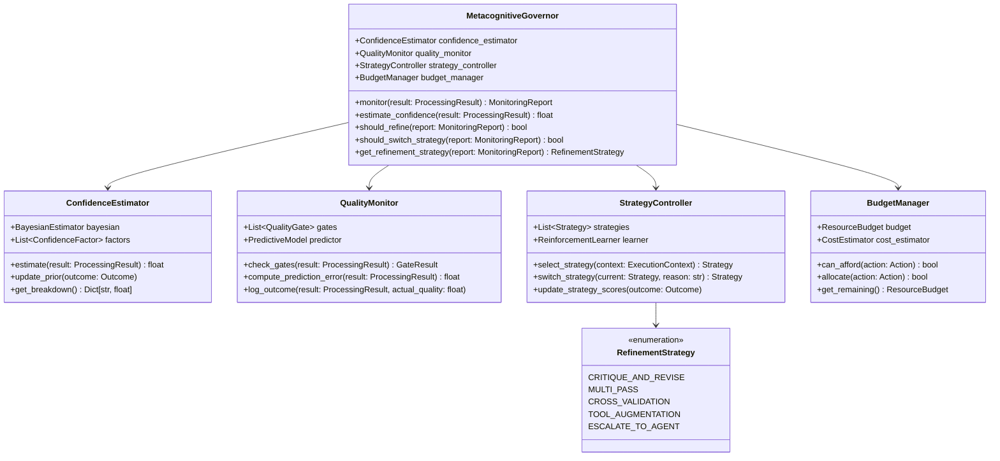

# 元認知治理層設計 (Metacognitive Governor)

## 文檔編號
`COGNITIVE-ARCH-02`

**版本**: 1.0.0
**最後更新**: 2026-02-12
**狀態**: 詳細設計階段

---

## 概述

**元認知治理層 (Metacognitive Governor)** 是類人類認知架構中負責「思考自己的思考」的組件，模擬前額葉皮質 (Prefrontal Cortex) 的執行功能。

它解決了當前架構的核心問題：**無法評估自身處理品質，也無法在執行中動態調整策略**。

### 設計目標

1. **實時品質監控**：評估每個處理步驟的信心度與正確性
2. **預測誤差偵測**：發現預期與實際的差距（Predictive Coding）
3. **動態策略調整**：根據品質評估觸發重試、精煉或模式切換
4. **學習與改進**：從成功/失敗中學習，調整未來決策
5. **預算管理**：平衡品質與成本，避免無限迭代

---

## 神經科學與心理學基礎

### 1. Prefrontal Cortex (PFC) - 前額葉皮質

**功能**：
- **執行控制 (Executive Control)**：規劃、決策、監控、抑制
- **工作記憶維護 (Working Memory Maintenance)**：保持目標與中間結果
- **認知靈活性 (Cognitive Flexibility)**：在策略間切換
- **錯誤監控 (Error Monitoring)**：偵測與糾正錯誤

**在 OpenAgent 中的類比**：
```python
class MetacognitiveGovernor:
    """
    類比前額葉皮質的執行功能

    - 持續監控處理品質
    - 偵測預測誤差
    - 決定是否需要調整策略
    - 管理認知資源（預算、時間）
    """
```

### 2. Predictive Coding (Karl Friston)

**核心理論**：
> 大腦是一個預測機器，持續產生對感知輸入的預測。當預測與實際不符時，產生「預測誤差」(Prediction Error)，驅動學習與調整。

**公式**：
```
Prediction Error = Actual - Predicted
```

**在 OpenAgent 中的應用**：
```python
# 系統預測：LLM 應該能回答這個問題
predicted_confidence = 0.9

# 實際結果：LLM 回覆「我不確定」
actual_confidence = 0.3

# 預測誤差大 → 觸發 System 2 或 Agent
prediction_error = abs(predicted_confidence - actual_confidence)
if prediction_error > 0.5:
    trigger_deeper_processing()
```

### 3. Metacognition (Nelson & Narens, 1990)

**雙層模型**：
- **對象層 (Object-Level)**：執行認知任務（如思考、推理）
- **元層 (Meta-Level)**：監控對象層的活動並控制其行為

**關鍵流程**：
1. **Monitoring（監控）**：元層持續評估對象層的狀態
2. **Control（控制）**：元層根據評估結果調整對象層的行為

**在 OpenAgent 中的實現**：
```python
# Object-Level: 實際的處理器
processor = ThinkingProcessor()
result = await processor.process(task)

# Meta-Level: 元認知治理層
confidence = metacog.estimate_confidence(result)

if confidence < QUALITY_THRESHOLD:
    # 元層控制：觸發精煉
    result = await refine_processor.process(task, previous=result)
```

---

## 架構設計

### L3 Component Diagram



---

## 核心組件詳細設計

### 1. ConfidenceEstimator - 信心估計器

使用貝葉斯方法整合多個信心指標。

```python
from dataclasses import dataclass
from typing import List, Dict
import numpy as np

@dataclass
class ConfidenceFactor:
    """信心因子"""
    name: str
    weight: float  # 權重
    value: float  # 當前值 [0, 1]
    source: str  # 數據來源

class ConfidenceEstimator:
    """
    多因子貝葉斯信心估計器

    整合以下信心來源：
    1. LLM 自報信心（如 logprobs）
    2. 工具可靠性（歷史成功率）
    3. 交叉驗證（多個來源的一致性）
    4. 歷史準確度（該類型任務的先驗）
    5. 內容完整性（回答是否完整、是否有免責聲明）
    """

    def __init__(self):
        # 因子權重（可以通過學習調整）
        self.factor_weights = {
            "llm_confidence": 0.3,
            "tool_reliability": 0.2,
            "cross_validation": 0.2,
            "historical_accuracy": 0.2,
            "content_completeness": 0.1
        }

        # 先驗：不同任務類型的歷史準確度
        self.task_type_priors: Dict[str, float] = {}

    def estimate(self, result: 'ProcessingResult') -> float:
        """
        估計處理結果的信心度

        使用貝葉斯公式：
        P(correct | evidence) ∝ P(evidence | correct) * P(correct)

        Returns:
            信心分數 [0, 1]
        """
        factors = self._extract_factors(result)

        # 加權組合
        weighted_sum = sum(
            self.factor_weights.get(f.name, 0.1) * f.value
            for f in factors
        )

        # 歸一化到 [0, 1]
        confidence = np.clip(weighted_sum, 0, 1)

        return confidence

    def _extract_factors(self, result: 'ProcessingResult') -> List[ConfidenceFactor]:
        """提取所有信心因子"""
        factors = []

        # 1. LLM 自報信心
        if hasattr(result, 'llm_confidence'):
            factors.append(ConfidenceFactor(
                name="llm_confidence",
                weight=self.factor_weights["llm_confidence"],
                value=result.llm_confidence,
                source="llm"
            ))

        # 2. 工具可靠性
        if result.tools_used:
            tool_reliability = self._compute_tool_reliability(result.tools_used)
            factors.append(ConfidenceFactor(
                name="tool_reliability",
                weight=self.factor_weights["tool_reliability"],
                value=tool_reliability,
                source="tools"
            ))

        # 3. 交叉驗證
        if result.cross_check_results:
            consistency = self._compute_consistency(result.cross_check_results)
            factors.append(ConfidenceFactor(
                name="cross_validation",
                weight=self.factor_weights["cross_validation"],
                value=consistency,
                source="cross_check"
            ))

        # 4. 歷史準確度（先驗）
        prior = self.task_type_priors.get(result.task_type, 0.5)
        factors.append(ConfidenceFactor(
            name="historical_accuracy",
            weight=self.factor_weights["historical_accuracy"],
            value=prior,
            source="history"
        ))

        # 5. 內容完整性
        completeness = self._assess_completeness(result.content)
        factors.append(ConfidenceFactor(
            name="content_completeness",
            weight=self.factor_weights["content_completeness"],
            value=completeness,
            source="content_analysis"
        ))

        return factors

    def _compute_tool_reliability(self, tools_used: List[str]) -> float:
        """計算工具的平均可靠性"""
        # TODO: 從歷史數據中查詢工具成功率
        return 0.8  # 佔位符

    def _compute_consistency(self, cross_check_results: List[Any]) -> float:
        """
        計算多個來源的一致性

        如果多個來源給出相似的答案，信心度更高
        """
        if len(cross_check_results) < 2:
            return 0.5

        # 簡化版：計算結果的重疊度
        # TODO: 使用語義相似度
        return 0.7  # 佔位符

    def _assess_completeness(self, content: str) -> float:
        """
        評估內容的完整性

        檢測：
        - 是否包含免責聲明（"I'm not sure", "I don't know"）
        - 是否回答了問題
        - 是否有明顯的邏輯斷層
        """
        content_lower = content.lower()

        # 免責聲明降低信心
        disclaimers = ["i'm not sure", "i don't know", "uncertain", "cannot determine"]
        has_disclaimer = any(d in content_lower for d in disclaimers)

        if has_disclaimer:
            return 0.3

        # 內容長度（太短可能不完整，太長可能冗餘）
        optimal_length = (100, 1000)
        length_score = 1.0
        if len(content) < optimal_length[0]:
            length_score = len(content) / optimal_length[0]
        elif len(content) > optimal_length[1]:
            length_score = optimal_length[1] / len(content)

        return length_score

    def update_prior(self, task_type: str, was_correct: bool):
        """
        根據實際結果更新先驗

        貝葉斯更新
        """
        current_prior = self.task_type_priors.get(task_type, 0.5)

        # 簡單的移動平均
        alpha = 0.1  # 學習率
        new_prior = current_prior * (1 - alpha) + (1.0 if was_correct else 0.0) * alpha

        self.task_type_priors[task_type] = new_prior
```

### 2. QualityMonitor - 品質監控器

實現預測編碼與品質閘門。

```python
from dataclasses import dataclass
from typing import List, Optional
from enum import Enum

class GateType(Enum):
    """品質閘門類型"""
    CONFIDENCE_THRESHOLD = "confidence_threshold"
    COMPLETENESS_CHECK = "completeness_check"
    LOGICAL_CONSISTENCY = "logical_consistency"
    TOOL_SUCCESS = "tool_success"
    PREDICTION_ERROR = "prediction_error"

@dataclass
class QualityGate:
    """品質閘門"""
    type: GateType
    threshold: float
    description: str

    def check(self, result: 'ProcessingResult') -> bool:
        """檢查結果是否通過此閘門"""
        raise NotImplementedError

@dataclass
class GateResult:
    """閘門檢查結果"""
    passed: bool
    failed_gates: List[QualityGate]
    warnings: List[str]
    overall_score: float

class QualityMonitor:
    """
    品質監控器：持續評估處理品質

    實現兩個機制：
    1. 品質閘門 (Quality Gates)：必須通過的最低標準
    2. 預測編碼 (Predictive Coding)：偵測預期與實際的差異
    """

    def __init__(self):
        self.gates: List[QualityGate] = self._init_gates()
        self.prediction_history: List[tuple] = []  # (predicted, actual)

    def _init_gates(self) -> List[QualityGate]:
        """初始化品質閘門"""
        return [
            ConfidenceGate(threshold=0.7),
            CompletenessGate(threshold=0.8),
            LogicalConsistencyGate(threshold=0.9),
            ToolSuccessGate(threshold=1.0),  # 所有工具必須成功
            PredictionErrorGate(threshold=0.3)  # 預測誤差閾值
        ]

    def check_gates(self, result: 'ProcessingResult') -> GateResult:
        """檢查所有品質閘門"""
        failed_gates = []
        warnings = []
        scores = []

        for gate in self.gates:
            try:
                passed = gate.check(result)
                scores.append(1.0 if passed else 0.0)

                if not passed:
                    failed_gates.append(gate)
                    warnings.append(f"Failed gate: {gate.type.value} (threshold={gate.threshold})")
            except Exception as e:
                warnings.append(f"Gate check error for {gate.type.value}: {e}")

        overall_score = np.mean(scores) if scores else 0.0

        return GateResult(
            passed=len(failed_gates) == 0,
            failed_gates=failed_gates,
            warnings=warnings,
            overall_score=overall_score
        )

    def compute_prediction_error(self, result: 'ProcessingResult') -> float:
        """
        計算預測誤差（Predictive Coding）

        預測：基於任務複雜度與歷史數據，預期的信心度
        實際：實際獲得的信心度
        誤差：|predicted - actual|
        """
        # 預測：基於任務類型與複雜度
        predicted_confidence = self._predict_confidence(result.task)

        # 實際：從結果中獲取
        actual_confidence = result.confidence

        # 預測誤差
        prediction_error = abs(predicted_confidence - actual_confidence)

        # 記錄到歷史
        self.prediction_history.append((predicted_confidence, actual_confidence))

        return prediction_error

    def _predict_confidence(self, task: 'Task') -> float:
        """
        預測任務的信心度

        基於：
        - 任務複雜度
        - 歷史類似任務的平均信心度
        - 當前系統狀態（負載、可用工具等）
        """
        # 簡化版：基於複雜度的啟發式
        if task.complexity < 3:
            return 0.9  # 簡單任務預期高信心
        elif task.complexity < 7:
            return 0.7  # 中等任務
        else:
            return 0.5  # 複雜任務

    def log_outcome(self, result: 'ProcessingResult', actual_quality: float):
        """
        記錄實際品質（用於學習）

        Args:
            result: 處理結果
            actual_quality: 實際品質（如用戶評分、測試結果）
        """
        # TODO: 更新預測模型
        pass

# 具體的品質閘門實現

class ConfidenceGate(QualityGate):
    """信心度閘門"""

    def __init__(self, threshold: float = 0.7):
        super().__init__(
            type=GateType.CONFIDENCE_THRESHOLD,
            threshold=threshold,
            description=f"Confidence must be >= {threshold}"
        )

    def check(self, result: 'ProcessingResult') -> bool:
        return result.confidence >= self.threshold

class CompletenessGate(QualityGate):
    """完整性閘門"""

    def __init__(self, threshold: float = 0.8):
        super().__init__(
            type=GateType.COMPLETENESS_CHECK,
            threshold=threshold,
            description="Result must be complete"
        )

    def check(self, result: 'ProcessingResult') -> bool:
        # 檢查是否有明顯的不完整標記
        content = str(result.content).lower()
        incomplete_markers = ["...", "todo", "incomplete", "to be continued"]

        has_incomplete = any(marker in content for marker in incomplete_markers)
        return not has_incomplete

class LogicalConsistencyGate(QualityGate):
    """邏輯一致性閘門"""

    def __init__(self, threshold: float = 0.9):
        super().__init__(
            type=GateType.LOGICAL_CONSISTENCY,
            threshold=threshold,
            description="Result must be logically consistent"
        )

    def check(self, result: 'ProcessingResult') -> bool:
        # TODO: 實現邏輯一致性檢查
        # - 檢查是否有矛盾的陳述
        # - 使用 LLM 進行邏輯驗證
        return True  # 佔位符

class ToolSuccessGate(QualityGate):
    """工具成功閘門"""

    def __init__(self, threshold: float = 1.0):
        super().__init__(
            type=GateType.TOOL_SUCCESS,
            threshold=threshold,
            description="All tools must succeed"
        )

    def check(self, result: 'ProcessingResult') -> bool:
        if not result.tool_results:
            return True  # 沒有使用工具

        # 所有工具調用必須成功
        all_success = all(
            tr.get("success", False)
            for tr in result.tool_results
        )

        return all_success

class PredictionErrorGate(QualityGate):
    """預測誤差閘門"""

    def __init__(self, threshold: float = 0.3):
        super().__init__(
            type=GateType.PREDICTION_ERROR,
            threshold=threshold,
            description=f"Prediction error must be < {threshold}"
        )

    def check(self, result: 'ProcessingResult') -> bool:
        if not hasattr(result, 'prediction_error'):
            return True  # 沒有預測誤差信息

        return result.prediction_error < self.threshold
```

### 3. StrategyController - 策略控制器

根據監控結果決定是否調整策略。

```python
from enum import Enum
from typing import List, Optional
from dataclasses import dataclass

class RefinementStrategy(Enum):
    """精煉策略"""
    NONE = "none"  # 不需要精煉
    CRITIQUE_AND_REVISE = "critique_and_revise"  # 自我批評並修訂
    MULTI_PASS = "multi_pass"  # 多遍處理
    CROSS_VALIDATION = "cross_validation"  # 交叉驗證
    TOOL_AUGMENTATION = "tool_augmentation"  # 增加工具使用
    ESCALATE_TO_AGENT = "escalate_to_agent"  # 升級到 Agent 模式
    SWITCH_PROCESSOR = "switch_processor"  # 切換處理器

@dataclass
class StrategyDecision:
    """策略決策"""
    strategy: RefinementStrategy
    reason: str
    estimated_cost: float  # 預估成本（token/時間）
    expected_improvement: float  # 預期改進（信心度提升）

class StrategyController:
    """
    策略控制器：決定如何響應品質問題

    策略選擇基於：
    1. 當前品質狀況
    2. 可用預算
    3. 歷史策略效果
    4. 任務類型
    """

    def __init__(self, budget_manager: 'BudgetManager'):
        self.budget_manager = budget_manager

        # 策略效果統計（用於學習）
        self.strategy_stats: Dict[RefinementStrategy, StrategyStats] = {}

    def select_refinement_strategy(
        self,
        result: 'ProcessingResult',
        gate_result: GateResult,
        confidence: float
    ) -> StrategyDecision:
        """
        選擇精煉策略

        決策樹：
        1. 如果信心度已經很高 (>0.9) → NONE
        2. 如果預算不足 → NONE（接受當前結果）
        3. 如果工具失敗 → TOOL_AUGMENTATION
        4. 如果預測誤差大 → ESCALATE_TO_AGENT
        5. 如果邏輯不一致 → CRITIQUE_AND_REVISE
        6. 否則 → MULTI_PASS
        """
        # 1. 品質已經足夠好
        if confidence > 0.9 and gate_result.passed:
            return StrategyDecision(
                strategy=RefinementStrategy.NONE,
                reason="Quality already high",
                estimated_cost=0.0,
                expected_improvement=0.0
            )

        # 2. 預算不足
        if not self.budget_manager.can_afford_refinement():
            return StrategyDecision(
                strategy=RefinementStrategy.NONE,
                reason="Insufficient budget",
                estimated_cost=0.0,
                expected_improvement=0.0
            )

        # 3. 根據失敗的閘門選擇策略
        if GateType.TOOL_SUCCESS in [g.type for g in gate_result.failed_gates]:
            return StrategyDecision(
                strategy=RefinementStrategy.TOOL_AUGMENTATION,
                reason="Tool failure detected",
                estimated_cost=0.3,
                expected_improvement=0.2
            )

        if GateType.PREDICTION_ERROR in [g.type for g in gate_result.failed_gates]:
            return StrategyDecision(
                strategy=RefinementStrategy.ESCALATE_TO_AGENT,
                reason="High prediction error",
                estimated_cost=0.8,
                expected_improvement=0.4
            )

        if GateType.LOGICAL_CONSISTENCY in [g.type for g in gate_result.failed_gates]:
            return StrategyDecision(
                strategy=RefinementStrategy.CRITIQUE_AND_REVISE,
                reason="Logical inconsistency",
                estimated_cost=0.4,
                expected_improvement=0.3
            )

        # 4. 默認策略：多遍處理
        return StrategyDecision(
            strategy=RefinementStrategy.MULTI_PASS,
            reason="General quality improvement",
            estimated_cost=0.5,
            expected_improvement=0.25
        )

    def update_strategy_effectiveness(
        self,
        strategy: RefinementStrategy,
        before_confidence: float,
        after_confidence: float,
        cost: float
    ):
        """更新策略效果統計"""
        if strategy not in self.strategy_stats:
            self.strategy_stats[strategy] = StrategyStats()

        stats = self.strategy_stats[strategy]
        stats.total_uses += 1
        stats.total_improvement += (after_confidence - before_confidence)
        stats.total_cost += cost

        # 計算平均值
        stats.avg_improvement = stats.total_improvement / stats.total_uses
        stats.avg_cost = stats.total_cost / stats.total_uses
        stats.roi = stats.avg_improvement / stats.avg_cost if stats.avg_cost > 0 else 0

@dataclass
class StrategyStats:
    """策略統計"""
    total_uses: int = 0
    total_improvement: float = 0.0
    total_cost: float = 0.0
    avg_improvement: float = 0.0
    avg_cost: float = 0.0
    roi: float = 0.0  # Return on Investment
```

### 4. BudgetManager - 預算管理器

管理認知資源（token、時間、API 調用）的分配。

```python
from dataclasses import dataclass
from typing import Optional

@dataclass
class ResourceBudget:
    """資源預算"""
    max_tokens: int
    used_tokens: int
    max_time_seconds: float
    elapsed_time: float
    max_iterations: int
    current_iteration: int
    max_api_calls: int
    current_api_calls: int

    def has_budget(self) -> bool:
        """是否還有預算"""
        return (
            self.used_tokens < self.max_tokens and
            self.elapsed_time < self.max_time_seconds and
            self.current_iteration < self.max_iterations and
            self.current_api_calls < self.max_api_calls
        )

    def remaining_ratio(self) -> float:
        """剩餘預算比例 [0, 1]"""
        ratios = [
            1 - (self.used_tokens / self.max_tokens),
            1 - (self.elapsed_time / self.max_time_seconds),
            1 - (self.current_iteration / self.max_iterations),
            1 - (self.current_api_calls / self.max_api_calls)
        ]
        return min(ratios)

class BudgetManager:
    """
    預算管理器：管理認知資源的分配

    防止無限迭代與資源耗盡
    """

    def __init__(self, budget: ResourceBudget):
        self.budget = budget
        self.start_time = time.time()

    def can_afford(self, action: str, estimated_cost: float) -> bool:
        """
        判斷是否有足夠預算執行動作

        Args:
            action: 動作類型（如 "refinement", "tool_call"）
            estimated_cost: 預估成本（歸一化到 [0, 1]）
        """
        remaining = self.budget.remaining_ratio()
        return remaining > estimated_cost

    def can_afford_refinement(self) -> bool:
        """是否有足夠預算進行精煉"""
        # 至少需要 30% 剩餘預算
        return self.budget.remaining_ratio() > 0.3

    def allocate(self, tokens: int = 0, api_calls: int = 0):
        """分配資源"""
        self.budget.used_tokens += tokens
        self.budget.current_api_calls += api_calls
        self.budget.elapsed_time = time.time() - self.start_time

    def increment_iteration(self):
        """增加迭代計數"""
        self.budget.current_iteration += 1

    def get_remaining(self) -> ResourceBudget:
        """獲取剩餘預算"""
        return self.budget
```

---

## 完整的 MetacognitiveGovernor 整合

```python
from dataclasses import dataclass
from typing import Optional

@dataclass
class MonitoringReport:
    """監控報告"""
    confidence: float
    gate_result: GateResult
    prediction_error: float
    should_refine: bool
    refinement_strategy: Optional[RefinementStrategy]
    warnings: List[str]

class MetacognitiveGovernor:
    """
    元認知治理層：監控與控制認知過程

    工作流程：
    1. Monitor（監控）：評估處理結果的品質
    2. Decide（決策）：決定是否需要調整策略
    3. Control（控制）：觸發精煉、切換處理器或接受結果
    """

    def __init__(self, budget: ResourceBudget):
        self.confidence_estimator = ConfidenceEstimator()
        self.quality_monitor = QualityMonitor()
        self.strategy_controller = StrategyController(BudgetManager(budget))
        self.budget_manager = BudgetManager(budget)

    def monitor(self, result: 'ProcessingResult') -> MonitoringReport:
        """
        監控處理結果

        Returns:
            監控報告，包含品質評估與改進建議
        """
        # 1. 估計信心度
        confidence = self.confidence_estimator.estimate(result)
        result.confidence = confidence

        # 2. 檢查品質閘門
        gate_result = self.quality_monitor.check_gates(result)

        # 3. 計算預測誤差
        prediction_error = self.quality_monitor.compute_prediction_error(result)
        result.prediction_error = prediction_error

        # 4. 決定是否需要精煉
        should_refine = self._should_refine(confidence, gate_result, prediction_error)

        # 5. 如果需要，選擇精煉策略
        refinement_strategy = None
        if should_refine:
            strategy_decision = self.strategy_controller.select_refinement_strategy(
                result, gate_result, confidence
            )
            refinement_strategy = strategy_decision.strategy

        # 6. 生成監控報告
        warnings = gate_result.warnings.copy()
        if prediction_error > 0.3:
            warnings.append(f"High prediction error: {prediction_error:.2f}")
        if not self.budget_manager.budget.has_budget():
            warnings.append("Budget exhausted")

        return MonitoringReport(
            confidence=confidence,
            gate_result=gate_result,
            prediction_error=prediction_error,
            should_refine=should_refine,
            refinement_strategy=refinement_strategy,
            warnings=warnings
        )

    def _should_refine(
        self,
        confidence: float,
        gate_result: GateResult,
        prediction_error: float
    ) -> bool:
        """
        決定是否需要精煉

        條件：
        1. 信心度低於閾值（<0.7）
        2. 品質閘門未通過
        3. 預測誤差大（>0.3）
        4. 仍有足夠預算
        """
        has_quality_issue = (
            confidence < 0.7 or
            not gate_result.passed or
            prediction_error > 0.3
        )

        has_budget = self.budget_manager.can_afford_refinement()

        return has_quality_issue and has_budget

    def update_from_outcome(
        self,
        task_type: str,
        predicted_confidence: float,
        actual_quality: float,
        strategy_used: Optional[RefinementStrategy],
        cost: float
    ):
        """
        從實際結果中學習

        更新：
        1. 信心估計器的先驗
        2. 品質監控器的預測模型
        3. 策略控制器的效果統計
        """
        # 1. 更新信心估計器
        was_correct = (actual_quality > 0.7)
        self.confidence_estimator.update_prior(task_type, was_correct)

        # 2. 記錄到品質監控器
        # self.quality_monitor.log_outcome(...) # TODO

        # 3. 如果使用了精煉策略，更新其效果統計
        if strategy_used and strategy_used != RefinementStrategy.NONE:
            self.strategy_controller.update_strategy_effectiveness(
                strategy_used,
                before_confidence=predicted_confidence,
                after_confidence=actual_quality,
                cost=cost
            )
```

---

## 與 RefactoredEngine 整合

```python
class RefactoredEngine:
    """重構後的引擎，整合元認知治理層"""

    def __init__(self, ...):
        # ... 現有組件

        # 新增：元認知治理層
        self.metacog = MetacognitiveGovernor(
            budget=ResourceBudget(
                max_tokens=10000,
                used_tokens=0,
                max_time_seconds=300,
                elapsed_time=0,
                max_iterations=3,
                current_iteration=0,
                max_api_calls=20,
                current_api_calls=0
            )
        )

    async def process(self, task: Task) -> ProcessingResult:
        """處理任務（帶元認知監控）"""

        # 1. 初始處理
        route = await self.router.route(task)
        processor = self._get_processor(route)
        result = await processor.process(task)

        # 2. 元認知監控
        report = self.metacog.monitor(result)

        # 3. 記錄監控結果
        logger.info(f"Metacognitive report: confidence={report.confidence:.2f}, "
                   f"gates_passed={report.gate_result.passed}, "
                   f"prediction_error={report.prediction_error:.2f}")

        # 4. 如果需要精煉
        if report.should_refine and report.refinement_strategy:
            logger.info(f"Triggering refinement: {report.refinement_strategy.value}")
            result = await self._refine(
                task,
                result,
                report.refinement_strategy
            )

            # 再次監控精煉後的結果
            refined_report = self.metacog.monitor(result)
            logger.info(f"After refinement: confidence={refined_report.confidence:.2f}")

        # 5. 如果仍然不滿意但預算耗盡，記錄警告
        if report.warnings:
            for warning in report.warnings:
                logger.warning(f"Metacognitive warning: {warning}")

        return result

    async def _refine(
        self,
        task: Task,
        previous_result: ProcessingResult,
        strategy: RefinementStrategy
    ) -> ProcessingResult:
        """根據策略精煉結果"""

        if strategy == RefinementStrategy.CRITIQUE_AND_REVISE:
            return await self._critique_and_revise(task, previous_result)

        elif strategy == RefinementStrategy.MULTI_PASS:
            return await self._multi_pass(task, previous_result)

        elif strategy == RefinementStrategy.CROSS_VALIDATION:
            return await self._cross_validate(task, previous_result)

        elif strategy == RefinementStrategy.TOOL_AUGMENTATION:
            return await self._augment_with_tools(task, previous_result)

        elif strategy == RefinementStrategy.ESCALATE_TO_AGENT:
            return await self._escalate_to_agent(task, previous_result)

        else:
            return previous_result

    async def _critique_and_revise(
        self,
        task: Task,
        previous: ProcessingResult
    ) -> ProcessingResult:
        """自我批評並修訂"""
        # 使用 LLM 進行自我批評
        critique_prompt = f"""
        Previous answer: {previous.content}

        Please critique this answer:
        1. Is it logically consistent?
        2. Is it complete?
        3. Are there any errors?

        Then provide a revised, improved answer.
        """

        # 調用 Thinking Processor
        thinking_processor = ThinkingProcessor(workspace=self.workspace)
        refined_result = await thinking_processor.process_with_prompt(critique_prompt)

        return refined_result
```

---

## 測試策略

```python
class TestMetacognitiveGovernor:
    def test_confidence_estimation(self):
        """測試信心估計"""
        estimator = ConfidenceEstimator()

        # 高信心結果
        high_conf_result = ProcessingResult(
            content="Clear answer",
            llm_confidence=0.9,
            tools_used=["search"],
            tool_results=[{"success": True}],
            task_type="simple_question"
        )

        confidence = estimator.estimate(high_conf_result)
        assert confidence > 0.7

        # 低信心結果
        low_conf_result = ProcessingResult(
            content="I'm not sure about this...",
            llm_confidence=0.3,
            tools_used=[],
            tool_results=[],
            task_type="complex_reasoning"
        )

        confidence = estimator.estimate(low_conf_result)
        assert confidence < 0.5

    def test_quality_gates(self):
        """測試品質閘門"""
        monitor = QualityMonitor()

        # 應該通過的結果
        good_result = ProcessingResult(
            content="Complete answer",
            confidence=0.85,
            tool_results=[{"success": True}]
        )

        gate_result = monitor.check_gates(good_result)
        assert gate_result.passed

        # 應該失敗的結果
        bad_result = ProcessingResult(
            content="Incomplete...",
            confidence=0.4,
            tool_results=[{"success": False}]
        )

        gate_result = monitor.check_gates(bad_result)
        assert not gate_result.passed
        assert len(gate_result.failed_gates) > 0
```

---

## 監控與可觀測性

```python
@dataclass
class MetacognitiveMetrics:
    """元認知指標"""
    total_monitorings: int
    refinements_triggered: int
    refinement_success_rate: float
    average_confidence_before: float
    average_confidence_after: float
    average_prediction_error: float
    budget_utilization: float

class MetacognitiveMonitor:
    """元認知監控器（監控監控器）"""

    def __init__(self, governor: MetacognitiveGovernor):
        self.governor = governor
        self.metrics_history: List[MetacognitiveMetrics] = []

    def get_metrics(self) -> MetacognitiveMetrics:
        """獲取當前指標"""
        # TODO: 從 governor 的統計數據中提取指標
        pass
```

---

## 下一步

- **[03_ooda_loop_router.md](./03_ooda_loop_router.md)**: OODA 循環路由設計
- **[06_iterative_refinement.md](./06_iterative_refinement.md)**: 迭代精煉機制詳細設計
- **[10_code_examples.md](./10_code_examples.md)**: 完整的端到端範例

---

**文檔維護者**: OpenAgent Architecture Team
**審核狀態**: Pending Review
