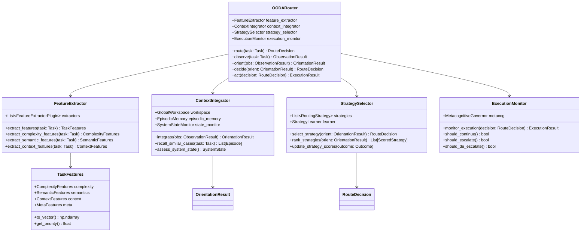

# OODA 循環路由設計 (OODA Loop Router)

## 文檔編號
`COGNITIVE-ARCH-03`

**版本**: 1.0.0
**最後更新**: 2026-02-12
**狀態**: 詳細設計階段

---

## 概述

**OODA 循環路由器 (OODA Loop Router)** 取代當前的靜態 `DefaultRouter`，實現動態的、持續循環的認知評估與決策機制。

OODA 代表：
- **Observe (觀察)**：收集任務特徵與環境信息
- **Orient (定位)**：根據內部模型解釋信息
- **Decide (決策)**：選擇最佳認知策略
- **Act (執行)**：執行策略並觀察結果

### 當前 Router 的問題

```python
# 當前的 DefaultRouter：靜態、一次性決策
class DefaultRouter:
    def route(self, task: Task) -> RouteDecision:
        complexity = self._analyze_complexity(task)  # 一次分析

        if complexity < 3:
            return RouteDecision(level=CognitiveLevel.SYSTEM_1)
        elif complexity < 7:
            return RouteDecision(level=CognitiveLevel.SYSTEM_2)
        else:
            return RouteDecision(level=CognitiveLevel.AGENT)
        # 之後無法調整！
```

**問題**：
1. **靜態決策**：一開始決定就不再改變
2. **單一維度**：只基於複雜度分析
3. **無反饋**：不考慮執行結果
4. **無學習**：不從歷史經驗中改進

### OODA Router 的優勢

```python
# OODA Router：動態、持續循環
class OODARouter:
    async def route(self, task: Task) -> RouteDecision:
        while not self.goal_achieved():
            # 1. Observe: 多維度觀察
            obs = await self.observe(task)

            # 2. Orient: 結合系統狀態與歷史
            orient = await self.orient(obs)

            # 3. Decide: 選擇策略
            decision = await self.decide(orient)

            # 4. Act: 執行並監控
            result = await self.act(decision)

            # 根據結果調整（重新進入循環）
            if self.should_adjust(result):
                continue
            else:
                return result
```

---

## 理論基礎

### John Boyd's OODA Loop (1976)

**背景**：美國空軍上校 John Boyd 開發的決策模型，原用於空戰策略。

**核心概念**：
> 決策不是一次性的，而是持續循環的。更快的 OODA 循環迭代速度意味著更強的適應能力。

**四個階段**：

1. **Observe (觀察)**
   - 收集原始數據
   - 多感官輸入（視覺、聽覺、文本等）
   - 無過濾、無偏見

2. **Orient (定位)**
   - **最關鍵的階段**
   - 根據文化、遺傳、經驗、分析能力解釋觀察
   - 更新內部世界模型

3. **Decide (決策)**
   - 基於定位結果選擇行動
   - 生成多個候選方案
   - 評估並選擇最優方案

4. **Act (執行)**
   - 執行決策
   - 觀察結果（回到 Observe）

**隱式反饋循環**：
- Orient 影響 Observe（我們觀察什麼取決於我們的模型）
- Act 的結果變成新的 Observation
- 形成持續的認知循環

### 在 OpenAgent 中的應用

| OODA 階段 | OpenAgent 實現 | 說明 |
|----------|---------------|------|
| **Observe** | `FeatureExtractor` | 提取任務的多維度特徵（不只是複雜度） |
| **Orient** | `ContextIntegrator` | 結合系統狀態、歷史經驗、工作空間信息 |
| **Decide** | `StrategySelector` | 基於貝葉斯決策或強化學習選擇策略 |
| **Act** | `Processor` 執行 + `MetacognitiveGovernor` 監控 | 執行並持續監控品質 |

---

## 架構設計

### L3 Component Diagram



---

## 核心組件詳細設計

### 1. FeatureExtractor - 特徵提取器（Observe）

不再只依賴「複雜度」，而是提取多維度特徵。

```python
from dataclasses import dataclass
from typing import List, Dict
import numpy as np

@dataclass
class ComplexityFeatures:
    """複雜度特徵"""
    logical_depth: int  # 邏輯推理深度
    entity_count: int  # 涉及的實體數量
    constraint_count: int  # 約束條件數量
    ambiguity_score: float  # 模糊度 [0, 1]
    overall_complexity: float  # 綜合複雜度 [0, 10]

@dataclass
class SemanticFeatures:
    """語義特徵"""
    intent: str  # 意圖分類（question, command, reasoning, etc.）
    domain: str  # 領域（code, math, general, etc.）
    keywords: List[str]  # 關鍵詞
    embedding: np.ndarray  # 語義嵌入向量

@dataclass
class ContextFeatures:
    """上下文特徵"""
    has_code: bool  # 是否涉及代碼
    has_tools: bool  # 是否需要工具
    requires_search: bool  # 是否需要外部信息
    requires_multi_step: bool  # 是否需要多步驟
    time_sensitivity: float  # 時間敏感度 [0, 1]

@dataclass
class MetaFeatures:
    """元特徵"""
    user_priority: float  # 用戶指定的優先級
    budget_constraint: float  # 預算約束
    quality_requirement: float  # 品質要求

@dataclass
class TaskFeatures:
    """任務的完整特徵集"""
    complexity: ComplexityFeatures
    semantics: SemanticFeatures
    context: ContextFeatures
    meta: MetaFeatures

    def to_vector(self) -> np.ndarray:
        """轉換為特徵向量（用於機器學習模型）"""
        return np.concatenate([
            [
                self.complexity.overall_complexity,
                self.complexity.logical_depth,
                self.complexity.entity_count,
                self.complexity.ambiguity_score,
            ],
            self.semantics.embedding,
            [
                float(self.context.has_code),
                float(self.context.has_tools),
                float(self.context.requires_search),
                float(self.context.requires_multi_step),
                self.context.time_sensitivity,
            ],
            [
                self.meta.user_priority,
                self.meta.budget_constraint,
                self.meta.quality_requirement,
            ]
        ])

class FeatureExtractor:
    """
    特徵提取器：從任務中提取多維度特徵

    使用插件架構，允許擴展新的特徵提取器
    """

    def __init__(self):
        self.complexity_analyzer = ComplexityAnalyzer()
        self.semantic_analyzer = SemanticAnalyzer()
        self.context_analyzer = ContextAnalyzer()

    def extract_features(self, task: Task) -> TaskFeatures:
        """提取完整特徵集"""
        return TaskFeatures(
            complexity=self._extract_complexity(task),
            semantics=self._extract_semantics(task),
            context=self._extract_context(task),
            meta=self._extract_meta(task)
        )

    def _extract_complexity(self, task: Task) -> ComplexityFeatures:
        """提取複雜度特徵"""
        # 邏輯深度：需要多少層推理
        logical_depth = self._estimate_logical_depth(task.query)

        # 實體數量
        entity_count = len(self._extract_entities(task.query))

        # 約束條件
        constraint_count = self._count_constraints(task.query)

        # 模糊度
        ambiguity_score = self._assess_ambiguity(task.query)

        # 綜合複雜度（權重組合）
        overall = (
            logical_depth * 0.4 +
            entity_count * 0.2 +
            constraint_count * 0.2 +
            ambiguity_score * 10 * 0.2
        )

        return ComplexityFeatures(
            logical_depth=logical_depth,
            entity_count=entity_count,
            constraint_count=constraint_count,
            ambiguity_score=ambiguity_score,
            overall_complexity=overall
        )

    def _estimate_logical_depth(self, query: str) -> int:
        """
        估計邏輯推理深度

        啟發式：
        - 包含 "why" → 深度 +1
        - 包含 "how" → 深度 +1
        - 包含 "if...then" → 深度 +1
        - 包含 "compare" → 深度 +2
        """
        depth = 1  # 基礎深度

        query_lower = query.lower()

        if "why" in query_lower:
            depth += 1
        if "how" in query_lower:
            depth += 1
        if "if" in query_lower and "then" in query_lower:
            depth += 1
        if "compare" in query_lower or "vs" in query_lower:
            depth += 2

        return min(depth, 5)  # 上限為 5

    def _extract_semantics(self, task: Task) -> SemanticFeatures:
        """提取語義特徵"""
        # 意圖分類
        intent = self._classify_intent(task.query)

        # 領域分類
        domain = self._classify_domain(task.query)

        # 關鍵詞提取
        keywords = self._extract_keywords(task.query)

        # 語義嵌入（使用預訓練模型）
        embedding = self._get_embedding(task.query)

        return SemanticFeatures(
            intent=intent,
            domain=domain,
            keywords=keywords,
            embedding=embedding
        )

    def _classify_intent(self, query: str) -> str:
        """
        分類用戶意圖

        類別：
        - question: 提問
        - command: 指令
        - reasoning: 推理
        - generation: 生成
        - analysis: 分析
        """
        query_lower = query.lower()

        if any(q in query_lower for q in ["what", "who", "when", "where", "which"]):
            return "question"
        elif any(c in query_lower for c in ["write", "create", "generate", "build"]):
            return "generation"
        elif any(c in query_lower for c in ["explain", "why", "how", "analyze"]):
            return "reasoning"
        elif any(c in query_lower for c in ["compare", "evaluate", "assess"]):
            return "analysis"
        else:
            return "command"

    def _classify_domain(self, query: str) -> str:
        """
        分類任務領域

        領域：
        - code: 編程相關
        - math: 數學相關
        - science: 科學相關
        - business: 商業相關
        - general: 通用知識
        """
        query_lower = query.lower()

        code_keywords = ["code", "function", "class", "algorithm", "debug", "program"]
        if any(kw in query_lower for kw in code_keywords):
            return "code"

        math_keywords = ["calculate", "equation", "formula", "prove", "solve"]
        if any(kw in query_lower for kw in math_keywords):
            return "math"

        # 其他領域...

        return "general"

    def _extract_context(self, task: Task) -> ContextFeatures:
        """提取上下文特徵"""
        query_lower = task.query.lower()

        return ContextFeatures(
            has_code="code" in query_lower or "function" in query_lower,
            has_tools="search" in query_lower or "api" in query_lower,
            requires_search="search" in query_lower or "find" in query_lower,
            requires_multi_step="step" in query_lower or "first" in query_lower,
            time_sensitivity=self._assess_time_sensitivity(task)
        )

    def _extract_meta(self, task: Task) -> MetaFeatures:
        """提取元特徵"""
        return MetaFeatures(
            user_priority=task.metadata.get("priority", 0.5),
            budget_constraint=task.metadata.get("budget", 1.0),
            quality_requirement=task.metadata.get("quality", 0.7)
        )
```

### 2. ContextIntegrator - 上下文整合器（Orient）

整合觀察結果與系統內部狀態。

```python
from dataclasses import dataclass
from typing import List, Optional

@dataclass
class SystemState:
    """系統狀態"""
    current_load: float  # 當前負載 [0, 1]
    available_tools: List[str]  # 可用工具
    budget_remaining: float  # 剩餘預算
    recent_failures: List[str]  # 最近的失敗
    success_rate: float  # 最近的成功率

@dataclass
class OrientationResult:
    """定位結果"""
    features: TaskFeatures
    similar_cases: List['Episode']
    system_state: SystemState
    recommended_level: CognitiveLevel
    confidence: float  # 推薦的信心度

class ContextIntegrator:
    """
    上下文整合器：Orient 階段的核心

    整合：
    1. 觀察到的任務特徵
    2. 工作空間中的相關信息
    3. 情節記憶中的類似案例
    4. 當前系統狀態
    """

    def __init__(
        self,
        workspace: GlobalWorkspace,
        episodic_memory: EpisodicMemory,
        state_monitor: 'SystemStateMonitor'
    ):
        self.workspace = workspace
        self.episodic_memory = episodic_memory
        self.state_monitor = state_monitor

    async def integrate(
        self,
        features: TaskFeatures,
        task: Task
    ) -> OrientationResult:
        """
        整合所有信息，產生定位結果

        這是 OODA 循環中最關鍵的階段
        """
        # 1. 從情節記憶檢索類似案例
        similar_cases = await self._recall_similar_cases(features, task)

        # 2. 從工作空間獲取相關上下文
        workspace_context = self.workspace.recall(task.query, top_k=3)

        # 3. 獲取當前系統狀態
        system_state = self.state_monitor.get_state()

        # 4. 基於所有信息推薦認知層級
        recommended_level = self._recommend_level(
            features,
            similar_cases,
            system_state
        )

        # 5. 估計推薦的信心度
        confidence = self._estimate_recommendation_confidence(
            features,
            similar_cases,
            system_state
        )

        return OrientationResult(
            features=features,
            similar_cases=similar_cases,
            system_state=system_state,
            recommended_level=recommended_level,
            confidence=confidence
        )

    async def _recall_similar_cases(
        self,
        features: TaskFeatures,
        task: Task
    ) -> List['Episode']:
        """
        從情節記憶檢索類似案例

        使用：
        - 語義相似度（embedding）
        - 特徵向量距離
        - 領域匹配
        """
        # 簡化版：基於語義相似度
        similar = self.episodic_memory.recall_similar(
            query=task.query,
            top_k=5
        )

        # 過濾：只保留成功的案例
        successful_cases = [
            ep for ep in similar
            if ep.outcome and ep.outcome.get("success", False)
        ]

        return successful_cases[:3]  # 最多 3 個

    def _recommend_level(
        self,
        features: TaskFeatures,
        similar_cases: List['Episode'],
        system_state: SystemState
    ) -> CognitiveLevel:
        """
        基於所有信息推薦認知層級

        決策樹：
        1. 如果有成功的類似案例 → 使用類似案例的層級
        2. 如果複雜度低 → System 1
        3. 如果複雜度中等且系統負載低 → System 2
        4. 如果複雜度高或需要工具 → Agent
        """
        # 1. 類比推理：如果有類似案例
        if similar_cases:
            # 統計類似案例中最常用的層級
            level_counts = {}
            for case in similar_cases:
                level = case.metadata.get("cognitive_level")
                if level:
                    level_counts[level] = level_counts.get(level, 0) + 1

            if level_counts:
                most_common = max(level_counts, key=level_counts.get)
                return CognitiveLevel(most_common)

        # 2. 基於特徵的啟發式
        complexity = features.complexity.overall_complexity

        if complexity < 3:
            return CognitiveLevel.SYSTEM_1

        if complexity < 7:
            # 考慮系統負載
            if system_state.current_load < 0.7:
                return CognitiveLevel.SYSTEM_2
            else:
                return CognitiveLevel.SYSTEM_1  # 負載高，降級

        # 複雜任務或需要工具
        if complexity >= 7 or features.context.requires_search:
            return CognitiveLevel.AGENT

        return CognitiveLevel.SYSTEM_2  # 默認

    def _estimate_recommendation_confidence(
        self,
        features: TaskFeatures,
        similar_cases: List['Episode'],
        system_state: SystemState
    ) -> float:
        """
        估計推薦的信心度

        因子：
        - 類似案例的數量與質量
        - 特徵的明確性（低模糊度）
        - 系統狀態的穩定性
        """
        confidence = 0.5  # 基礎信心

        # 類似案例加分
        if similar_cases:
            confidence += 0.2 * len(similar_cases) / 3

        # 低模糊度加分
        if features.complexity.ambiguity_score < 0.3:
            confidence += 0.2

        # 系統穩定性加分
        if system_state.success_rate > 0.8:
            confidence += 0.1

        return min(1.0, confidence)
```

### 3. StrategySelector - 策略選擇器（Decide）

基於定位結果選擇最佳策略。

```python
from dataclasses import dataclass
from typing import List, Callable
from enum import Enum

class RoutingStrategy(Enum):
    """路由策略"""
    DIRECT_SYSTEM_1 = "direct_system_1"  # 直接使用 System 1
    DIRECT_SYSTEM_2 = "direct_system_2"  # 直接使用 System 2
    DIRECT_AGENT = "direct_agent"  # 直接使用 Agent
    PROGRESSIVE = "progressive"  # 漸進式（1→2→Agent）
    PARALLEL = "parallel"  # 並行處理多個層級
    ADAPTIVE = "adaptive"  # 自適應（根據中間結果調整）

@dataclass
class ScoredStrategy:
    """評分後的策略"""
    strategy: RoutingStrategy
    score: float  # 預期效果分數
    confidence: float  # 信心度
    estimated_cost: float  # 預估成本
    estimated_quality: float  # 預期品質

@dataclass
class RouteDecision:
    """路由決策"""
    strategy: RoutingStrategy
    initial_level: CognitiveLevel
    backup_levels: List[CognitiveLevel]
    max_iterations: int
    quality_threshold: float

class StrategySelector:
    """
    策略選擇器：Decide 階段的核心

    使用強化學習或貝葉斯優化選擇最佳策略
    """

    def __init__(self):
        # 策略效果統計
        self.strategy_stats: Dict[RoutingStrategy, StrategyStats] = {}

        # 策略選擇器（可以是規則、ML 模型或 RL agent）
        self.selector_type = "rule_based"  # "rule_based" or "learned"

    async def select_strategy(
        self,
        orientation: OrientationResult
    ) -> RouteDecision:
        """
        選擇路由策略

        流程：
        1. 生成候選策略
        2. 為每個策略評分
        3. 選擇最高分策略
        4. 生成完整的路由決策
        """
        # 1. 生成候選策略
        candidates = self._generate_candidates(orientation)

        # 2. 評分
        scored = await self._score_strategies(candidates, orientation)

        # 3. 選擇最佳
        best = max(scored, key=lambda s: s.score)

        # 4. 生成決策
        decision = self._make_decision(best, orientation)

        return decision

    def _generate_candidates(
        self,
        orientation: OrientationResult
    ) -> List[RoutingStrategy]:
        """
        生成候選策略

        基於任務特徵決定哪些策略可行
        """
        features = orientation.features
        candidates = []

        # 簡單任務：可以直接使用 System 1
        if features.complexity.overall_complexity < 3:
            candidates.append(RoutingStrategy.DIRECT_SYSTEM_1)

        # 中等任務：System 2 或漸進式
        if 3 <= features.complexity.overall_complexity < 7:
            candidates.append(RoutingStrategy.DIRECT_SYSTEM_2)
            candidates.append(RoutingStrategy.PROGRESSIVE)

        # 複雜任務：Agent 或自適應
        if features.complexity.overall_complexity >= 7:
            candidates.append(RoutingStrategy.DIRECT_AGENT)
            candidates.append(RoutingStrategy.ADAPTIVE)

        # 如果有足夠預算，可以嘗試並行
        if orientation.system_state.budget_remaining > 0.5:
            candidates.append(RoutingStrategy.PARALLEL)

        return candidates

    async def _score_strategies(
        self,
        candidates: List[RoutingStrategy],
        orientation: OrientationResult
    ) -> List[ScoredStrategy]:
        """
        為候選策略評分

        評分基於：
        - 歷史效果（從統計數據）
        - 預期品質
        - 預估成本
        - 當前系統狀態
        """
        scored = []

        for strategy in candidates:
            # 獲取歷史統計
            stats = self.strategy_stats.get(strategy, StrategyStats())

            # 預估成本
            estimated_cost = self._estimate_cost(strategy, orientation)

            # 預期品質
            estimated_quality = self._estimate_quality(strategy, orientation, stats)

            # 綜合評分（可以使用多目標優化）
            score = self._compute_score(
                estimated_quality,
                estimated_cost,
                orientation.system_state.budget_remaining
            )

            scored.append(ScoredStrategy(
                strategy=strategy,
                score=score,
                confidence=orientation.confidence,
                estimated_cost=estimated_cost,
                estimated_quality=estimated_quality
            ))

        return scored

    def _estimate_cost(
        self,
        strategy: RoutingStrategy,
        orientation: OrientationResult
    ) -> float:
        """
        預估策略成本

        成本因子：
        - System 1: 低成本 (0.1)
        - System 2: 中成本 (0.3)
        - Agent: 高成本 (0.7)
        - Parallel: 最高成本 (1.0)
        """
        cost_map = {
            RoutingStrategy.DIRECT_SYSTEM_1: 0.1,
            RoutingStrategy.DIRECT_SYSTEM_2: 0.3,
            RoutingStrategy.DIRECT_AGENT: 0.7,
            RoutingStrategy.PROGRESSIVE: 0.4,  # 平均
            RoutingStrategy.PARALLEL: 1.0,
            RoutingStrategy.ADAPTIVE: 0.5,
        }

        base_cost = cost_map.get(strategy, 0.5)

        # 根據任務複雜度調整
        complexity_factor = orientation.features.complexity.overall_complexity / 10
        adjusted_cost = base_cost * (1 + complexity_factor)

        return min(1.0, adjusted_cost)

    def _estimate_quality(
        self,
        strategy: RoutingStrategy,
        orientation: OrientationResult,
        stats: 'StrategyStats'
    ) -> float:
        """
        預期品質

        基於：
        - 歷史平均品質
        - 任務特徵與策略的匹配度
        """
        # 歷史品質
        historical_quality = stats.avg_quality if stats.total_uses > 0 else 0.7

        # 匹配度
        match_score = self._compute_match_score(strategy, orientation)

        # 綜合
        estimated = 0.7 * historical_quality + 0.3 * match_score

        return estimated

    def _compute_match_score(
        self,
        strategy: RoutingStrategy,
        orientation: OrientationResult
    ) -> float:
        """
        計算策略與任務的匹配度

        啟發式：
        - 簡單任務 + System 1 → 高匹配
        - 複雜任務 + Agent → 高匹配
        - 不匹配 → 低分
        """
        complexity = orientation.features.complexity.overall_complexity

        if strategy == RoutingStrategy.DIRECT_SYSTEM_1:
            return 1.0 if complexity < 3 else 0.3

        if strategy == RoutingStrategy.DIRECT_SYSTEM_2:
            return 1.0 if 3 <= complexity < 7 else 0.5

        if strategy == RoutingStrategy.DIRECT_AGENT:
            return 1.0 if complexity >= 7 else 0.6

        if strategy == RoutingStrategy.PROGRESSIVE:
            return 0.8  # 通用策略

        if strategy == RoutingStrategy.ADAPTIVE:
            return 0.9  # 最靈活

        return 0.5

    def _compute_score(
        self,
        quality: float,
        cost: float,
        budget_remaining: float
    ) -> float:
        """
        綜合評分

        公式：Score = Quality - λ * Cost
        λ 取決於預算剩餘
        """
        # 預算充足時，優先品質；預算不足時，重視成本
        lambda_penalty = 2.0 * (1 - budget_remaining)

        score = quality - lambda_penalty * cost

        return score

    def _make_decision(
        self,
        best_strategy: ScoredStrategy,
        orientation: OrientationResult
    ) -> RouteDecision:
        """
        將評分策略轉換為完整的路由決策
        """
        # 根據策略確定初始層級與備份層級
        if best_strategy.strategy == RoutingStrategy.DIRECT_SYSTEM_1:
            initial = CognitiveLevel.SYSTEM_1
            backup = [CognitiveLevel.SYSTEM_2]

        elif best_strategy.strategy == RoutingStrategy.DIRECT_SYSTEM_2:
            initial = CognitiveLevel.SYSTEM_2
            backup = [CognitiveLevel.AGENT]

        elif best_strategy.strategy == RoutingStrategy.DIRECT_AGENT:
            initial = CognitiveLevel.AGENT
            backup = []

        elif best_strategy.strategy == RoutingStrategy.PROGRESSIVE:
            initial = CognitiveLevel.SYSTEM_1
            backup = [CognitiveLevel.SYSTEM_2, CognitiveLevel.AGENT]

        else:  # ADAPTIVE
            initial = orientation.recommended_level
            backup = [CognitiveLevel.AGENT]

        return RouteDecision(
            strategy=best_strategy.strategy,
            initial_level=initial,
            backup_levels=backup,
            max_iterations=3,
            quality_threshold=0.7
        )

@dataclass
class StrategyStats:
    """策略統計"""
    total_uses: int = 0
    total_quality: float = 0.0
    total_cost: float = 0.0
    avg_quality: float = 0.7
    avg_cost: float = 0.5
```

### 4. ExecutionMonitor - 執行監控器（Act）

監控執行並決定是否需要重新進入 OODA 循環。

```python
from dataclasses import dataclass
from typing import Optional

@dataclass
class ExecutionResult:
    """執行結果"""
    processing_result: ProcessingResult
    metacog_report: MonitoringReport
    should_continue: bool  # 是否繼續 OODA 循環
    next_action: str  # "accept", "refine", "escalate", "de-escalate"

class ExecutionMonitor:
    """
    執行監控器：Act 階段的監控

    決定：
    - 是否接受當前結果
    - 是否需要精煉
    - 是否需要升級/降級處理器
    - 是否重新進入 OODA 循環
    """

    def __init__(self, metacog: MetacognitiveGovernor):
        self.metacog = metacog

    async def monitor_execution(
        self,
        result: ProcessingResult,
        decision: RouteDecision
    ) -> ExecutionResult:
        """
        監控執行結果

        返回是否需要調整策略
        """
        # 1. 元認知評估
        report = self.metacog.monitor(result)

        # 2. 決定下一步行動
        if report.confidence > decision.quality_threshold and report.gate_result.passed:
            # 品質滿意，接受結果
            return ExecutionResult(
                processing_result=result,
                metacog_report=report,
                should_continue=False,
                next_action="accept"
            )

        elif report.should_refine:
            # 需要精煉，但不改變層級
            return ExecutionResult(
                processing_result=result,
                metacog_report=report,
                should_continue=True,
                next_action="refine"
            )

        elif self._should_escalate(report, decision):
            # 升級到更高層級
            return ExecutionResult(
                processing_result=result,
                metacog_report=report,
                should_continue=True,
                next_action="escalate"
            )

        elif self._should_de_escalate(report, decision):
            # 降級（節省成本）
            return ExecutionResult(
                processing_result=result,
                metacog_report=report,
                should_continue=True,
                next_action="de-escalate"
            )

        else:
            # 無法改進，接受當前結果（即使不理想）
            return ExecutionResult(
                processing_result=result,
                metacog_report=report,
                should_continue=False,
                next_action="accept_with_warning"
            )

    def _should_escalate(
        self,
        report: MonitoringReport,
        decision: RouteDecision
    ) -> bool:
        """
        是否應該升級處理器

        條件：
        - 品質不佳
        - 還有更高層級可用
        - 預算充足
        """
        has_backup = len(decision.backup_levels) > 0
        has_budget = self.metacog.budget_manager.can_afford_refinement()
        quality_low = report.confidence < 0.5

        return has_backup and has_budget and quality_low

    def _should_de_escalate(
        self,
        report: MonitoringReport,
        decision: RouteDecision
    ) -> bool:
        """
        是否應該降級處理器

        條件：
        - 品質已經很好，但使用了高層級處理器
        - 預算緊張
        """
        quality_high = report.confidence > 0.9
        using_high_level = decision.initial_level == CognitiveLevel.AGENT
        budget_low = self.metacog.budget_manager.budget.remaining_ratio() < 0.3

        return quality_high and using_high_level and budget_low
```

---

## 完整的 OODARouter 實現

```python
class OODARouter:
    """
    OODA 循環路由器：動態的認知評估與決策

    工作流程：
    1. Observe: 提取任務特徵
    2. Orient: 整合系統狀態與歷史經驗
    3. Decide: 選擇最佳策略
    4. Act: 執行並監控
    5. 根據結果決定是否重新進入循環
    """

    def __init__(
        self,
        workspace: GlobalWorkspace,
        episodic_memory: EpisodicMemory,
        metacog: MetacognitiveGovernor
    ):
        self.feature_extractor = FeatureExtractor()
        self.context_integrator = ContextIntegrator(
            workspace,
            episodic_memory,
            SystemStateMonitor()
        )
        self.strategy_selector = StrategySelector()
        self.execution_monitor = ExecutionMonitor(metacog)

        self.max_ooda_iterations = 3  # 防止無限循環

    async def route(self, task: Task) -> RouteDecision:
        """
        OODA 循環路由

        這不是一次性決策，而是持續循環直到達成目標
        """
        iteration = 0

        while iteration < self.max_ooda_iterations:
            iteration += 1
            logger.info(f"OODA iteration {iteration}")

            # 1. Observe
            features = self.feature_extractor.extract_features(task)
            logger.debug(f"Extracted features: complexity={features.complexity.overall_complexity:.2f}")

            # 2. Orient
            orientation = await self.context_integrator.integrate(features, task)
            logger.debug(f"Orientation: recommended_level={orientation.recommended_level.value}")

            # 3. Decide
            decision = await self.strategy_selector.select_strategy(orientation)
            logger.info(f"Decision: strategy={decision.strategy.value}, "
                       f"initial_level={decision.initial_level.value}")

            # 4. Act (初步執行 - 實際執行由 Engine 完成)
            # 這裡只是返回決策，實際執行由調用者完成
            # 然後調用者會使用 ExecutionMonitor 檢查結果

            return decision  # 第一次迭代就返回決策

        # 達到最大迭代次數，返回最後的決策
        logger.warning(f"Reached max OODA iterations: {self.max_ooda_iterations}")
        return decision

    async def adapt(
        self,
        previous_decision: RouteDecision,
        execution_result: ExecutionResult,
        task: Task
    ) -> RouteDecision:
        """
        根據執行結果調整決策（重新進入 OODA 循環）

        這是 OODA 的核心：根據 Act 的結果重新 Observe
        """
        if execution_result.next_action == "accept":
            return previous_decision  # 不需要調整

        elif execution_result.next_action == "escalate":
            # 升級到下一個層級
            if previous_decision.backup_levels:
                next_level = previous_decision.backup_levels[0]
                logger.info(f"Escalating to {next_level.value}")

                return RouteDecision(
                    strategy=previous_decision.strategy,
                    initial_level=next_level,
                    backup_levels=previous_decision.backup_levels[1:],
                    max_iterations=previous_decision.max_iterations,
                    quality_threshold=previous_decision.quality_threshold
                )

        elif execution_result.next_action == "de-escalate":
            # 降級（節省資源）
            # TODO: 實現降級邏輯
            pass

        # 默認：重新開始 OODA 循環
        return await self.route(task)
```

---

## 與 RefactoredEngine 整合

```python
class RefactoredEngine:
    """整合 OODA Router 的引擎"""

    def __init__(self, ...):
        # 替換 DefaultRouter
        self.router = OODARouter(
            workspace=self.workspace,
            episodic_memory=self.episodic_memory,
            metacog=self.metacog
        )

    async def process(self, task: Task) -> ProcessingResult:
        """使用 OODA 循環處理任務"""

        # 1. OODA 路由決策
        decision = await self.router.route(task)

        # 2. 執行初始策略
        processor = self._get_processor(decision.initial_level)
        result = await processor.process(task)

        # 3. 監控執行
        execution_result = await self.router.execution_monitor.monitor_execution(
            result,
            decision
        )

        # 4. 如果需要調整
        while execution_result.should_continue:
            # 重新進入 OODA 循環
            adapted_decision = await self.router.adapt(
                decision,
                execution_result,
                task
            )

            # 執行調整後的策略
            processor = self._get_processor(adapted_decision.initial_level)
            result = await processor.process(task)

            # 再次監控
            execution_result = await self.router.execution_monitor.monitor_execution(
                result,
                adapted_decision
            )

            decision = adapted_decision

        return result
```

---

## 測試策略

```python
class TestOODARouter:
    def test_observe_phase(self):
        """測試觀察階段"""
        extractor = FeatureExtractor()

        simple_task = Task(query="What is 2+2?")
        features = extractor.extract_features(simple_task)

        assert features.complexity.overall_complexity < 3
        assert features.semantics.intent == "question"

    def test_orient_phase(self):
        """測試定位階段"""
        # TODO: 實現測試

    def test_decide_phase(self):
        """測試決策階段"""
        selector = StrategySelector()

        # 簡單任務應該選擇 System 1
        # 複雜任務應該選擇 Agent
        # TODO: 實現測試

    def test_full_ooda_cycle(self):
        """測試完整 OODA 循環"""
        # TODO: 實現端到端測試
```

---

## 性能優化

### 特徵提取緩存
```python
class FeatureExtractor:
    def __init__(self):
        self.feature_cache = {}  # query_hash -> features

    def extract_features(self, task: Task) -> TaskFeatures:
        # 檢查緩存
        query_hash = hash(task.query)
        if query_hash in self.feature_cache:
            return self.feature_cache[query_hash]

        # 提取特徵
        features = self._do_extract(task)

        # 緩存
        self.feature_cache[query_hash] = features
        return features
```

---

## 監控與可觀測性

```python
@dataclass
class OODAMetrics:
    """OODA 循環指標"""
    total_cycles: int
    avg_iterations_per_task: float
    strategy_distribution: Dict[RoutingStrategy, int]
    escalation_rate: float
    de_escalation_rate: float
    avg_decision_confidence: float
```

---

## 下一步

- **[04_neuromodulation_system.md](./04_neuromodulation_system.md)**: 神經調控系統設計
- **[05_memory_systems.md](./05_memory_systems.md)**: 記憶系統設計
- **[10_code_examples.md](./10_code_examples.md)**: 完整的端到端範例

---

**文檔維護者**: OpenAgent Architecture Team
**審核狀態**: Pending Review
