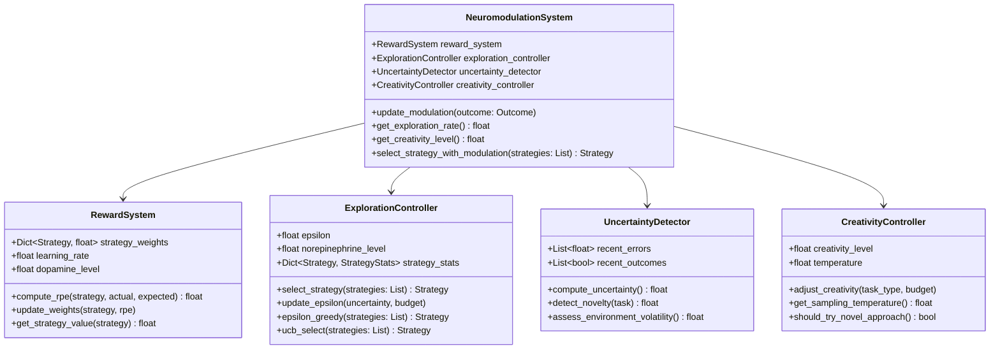

# 神經調控系統設計 (Neuromodulation System)

## 文檔編號
`COGNITIVE-ARCH-04`

**版本**: 1.0.0
**最後更新**: 2026-02-12
**狀態**: 詳細設計階段

---

## 概述

**神經調控系統 (Neuromodulation System)** 模擬大腦中神經調控物質（多巴胺、去甲腎上腺素、血清素）的作用，實現探索-利用平衡、創造力調控與適應性學習。

它解決了當前架構的核心問題：**無法從經驗中學習，無法適應性地調整策略選擇**。

### 設計目標

1. **探索-利用平衡**：在嘗試新策略與使用已知策略之間動態平衡
2. **獎勵學習**：成功的策略獲得強化，失敗的策略被抑制
3. **不確定性響應**：面對高不確定性時增加探索
4. **創造力調控**：根據任務需求與預算動態調整創造力
5. **在線學習**：持續從實際結果中學習，無需離線訓練

---

## 神經科學基礎

### 1. 多巴胺 (Dopamine) - 獎勵與學習

**功能**：
- **獎勵預測誤差 (Reward Prediction Error, RPE)**：當實際獎勵超過預期時釋放
- **動機與探索**：驅動探索行為，尋找更好的策略
- **學習信號**：強化成功的行為模式

**公式**：
```
RPE = Actual Reward - Expected Reward

If RPE > 0:  # 超出預期
    多巴胺釋放 ↑ → 強化該策略
If RPE < 0:  # 低於預期
    多巴胺降低 ↓ → 抑制該策略
```

**在 OpenAgent 中的應用**：
```python
class RewardSystem:
    def compute_reward_prediction_error(self, strategy, actual_quality, expected_quality):
        rpe = actual_quality - expected_quality

        if rpe > 0:
            # 正向預測誤差：強化策略
            self.strategy_weights[strategy] *= (1 + self.learning_rate * rpe)
        else:
            # 負向預測誤差：削弱策略
            self.strategy_weights[strategy] *= (1 + self.learning_rate * rpe)

        return rpe
```

### 2. 去甲腎上腺素 (Norepinephrine) - 不確定性與警覺

**功能**：
- **不確定性偵測**：當環境不可預測時釋放
- **注意力增強**：提高警覺性，增加信息收集
- **探索驅動**：高不確定性 → 探索新策略

**在 OpenAgent 中的應用**：
```python
class UncertaintyDetector:
    def compute_uncertainty(self, result):
        """
        計算不確定性

        因子：
        - 信心度的變異性
        - 預測誤差的大小
        - 最近失敗的頻率
        """
        confidence_variance = np.var(recent_confidences)
        prediction_error = abs(predicted - actual)
        failure_rate = recent_failures / recent_total

        uncertainty = (
            0.4 * confidence_variance +
            0.3 * prediction_error +
            0.3 * failure_rate
        )

        return uncertainty
```

### 3. 血清素 (Serotonin) - 耐心與風險規避

**功能**：
- **時間折扣**：影響對長期獎勵的重視程度
- **風險態度**：高血清素 → 保守策略，低血清素 → 冒險策略
- **資源意識**：預算充足時更有耐心

**在 OpenAgent 中的應用**：
```python
class ResourceAwareness:
    def adjust_risk_tolerance(self, budget_remaining):
        """
        根據預算調整風險容忍度

        預算充足 → 可以嘗試冒險策略
        預算不足 → 保守策略
        """
        if budget_remaining > 0.7:
            self.risk_tolerance = 0.8  # 高風險容忍
        elif budget_remaining > 0.3:
            self.risk_tolerance = 0.5  # 中等
        else:
            self.risk_tolerance = 0.2  # 保守
```

---

## 架構設計

### L3 Component Diagram



---

## 核心組件詳細設計

### 1. RewardSystem - 獎勵系統

實現多巴胺類比的獎勵學習機制。

```python
from dataclasses import dataclass
from typing import Dict
import numpy as np

@dataclass
class StrategyValue:
    """策略價值"""
    weight: float  # 當前權重
    total_reward: float  # 累積獎勵
    trial_count: int  # 嘗試次數
    success_count: int  # 成功次數
    avg_reward: float  # 平均獎勵

    @property
    def success_rate(self) -> float:
        return self.success_count / self.trial_count if self.trial_count > 0 else 0.5

class RewardSystem:
    """
    獎勵系統：模擬多巴胺的獎勵學習機制

    核心機制：
    1. 計算獎勵預測誤差 (RPE)
    2. 根據 RPE 更新策略權重
    3. 維護每個策略的價值估計
    """

    def __init__(self, learning_rate: float = 0.1):
        self.learning_rate = learning_rate
        self.dopamine_level = 0.5  # 基線多巴胺水平

        # 策略價值表
        self.strategy_values: Dict[str, StrategyValue] = {}

    def compute_rpe(
        self,
        strategy: str,
        actual_reward: float,
        expected_reward: float
    ) -> float:
        """
        計算獎勵預測誤差 (Reward Prediction Error)

        Args:
            strategy: 使用的策略
            actual_reward: 實際獲得的獎勵（如任務品質）
            expected_reward: 預期的獎勵

        Returns:
            RPE 值（正值表示超出預期，負值表示低於預期）
        """
        rpe = actual_reward - expected_reward

        # 更新多巴胺水平（類比）
        self.dopamine_level = 0.5 + 0.5 * np.tanh(rpe)

        return rpe

    def update_strategy_value(
        self,
        strategy: str,
        actual_reward: float,
        success: bool
    ):
        """
        根據實際結果更新策略價值

        使用指數移動平均 (EMA) 更新
        """
        # 初始化策略價值
        if strategy not in self.strategy_values:
            self.strategy_values[strategy] = StrategyValue(
                weight=1.0,
                total_reward=0.0,
                trial_count=0,
                success_count=0,
                avg_reward=0.5
            )

        value = self.strategy_values[strategy]

        # 更新統計
        value.trial_count += 1
        value.total_reward += actual_reward
        if success:
            value.success_count += 1

        # 計算 RPE
        expected_reward = value.avg_reward
        rpe = self.compute_rpe(strategy, actual_reward, expected_reward)

        # 更新平均獎勵（EMA）
        value.avg_reward = (
            (1 - self.learning_rate) * value.avg_reward +
            self.learning_rate * actual_reward
        )

        # 更新權重（基於 RPE）
        if rpe > 0:
            # 正向強化
            value.weight *= (1 + self.learning_rate * rpe)
        else:
            # 負向強化（但不降到 0）
            value.weight *= max(0.1, 1 + self.learning_rate * rpe)

        # 歸一化權重（防止過大）
        value.weight = np.clip(value.weight, 0.1, 10.0)

    def get_strategy_value(self, strategy: str) -> float:
        """獲取策略的當前價值估計"""
        if strategy not in self.strategy_values:
            return 0.5  # 未知策略的默認價值

        value = self.strategy_values[strategy]
        return value.weight * value.avg_reward

    def get_best_strategy(self, strategies: List[str]) -> str:
        """
        獲取當前價值最高的策略（利用 Exploitation）

        Returns:
            價值最高的策略名稱
        """
        if not strategies:
            raise ValueError("No strategies provided")

        strategy_values = [
            (s, self.get_strategy_value(s))
            for s in strategies
        ]

        best_strategy, _ = max(strategy_values, key=lambda x: x[1])
        return best_strategy
```

### 2. ExplorationController - 探索控制器

實現探索-利用權衡 (Exploration-Exploitation Trade-off)。

```python
from enum import Enum
import random
import math

class ExplorationStrategy(Enum):
    """探索策略"""
    EPSILON_GREEDY = "epsilon_greedy"  # ε-貪心
    UCB = "upper_confidence_bound"  # 上置信界
    THOMPSON_SAMPLING = "thompson_sampling"  # 湯普森採樣
    SOFTMAX = "softmax"  # Softmax (Boltzmann)

class ExplorationController:
    """
    探索控制器：決定何時探索新策略 vs. 利用已知策略

    實現多種探索策略：
    1. Epsilon-Greedy: 以 ε 機率隨機探索
    2. UCB: 基於不確定性的探索
    3. Thompson Sampling: 貝葉斯探索
    4. Softmax: 基於溫度的機率選擇
    """

    def __init__(
        self,
        strategy: ExplorationStrategy = ExplorationStrategy.EPSILON_GREEDY,
        initial_epsilon: float = 0.1
    ):
        self.strategy = strategy
        self.epsilon = initial_epsilon
        self.norepinephrine_level = 0.5  # 去甲腎上腺素水平（類比）

    def select_strategy(
        self,
        strategies: List[str],
        reward_system: RewardSystem
    ) -> str:
        """
        選擇策略（考慮探索-利用權衡）

        Args:
            strategies: 候選策略列表
            reward_system: 獎勵系統（提供價值估計）

        Returns:
            選中的策略
        """
        if self.strategy == ExplorationStrategy.EPSILON_GREEDY:
            return self._epsilon_greedy(strategies, reward_system)
        elif self.strategy == ExplorationStrategy.UCB:
            return self._ucb(strategies, reward_system)
        elif self.strategy == ExplorationStrategy.SOFTMAX:
            return self._softmax(strategies, reward_system)
        else:
            return self._epsilon_greedy(strategies, reward_system)

    def _epsilon_greedy(
        self,
        strategies: List[str],
        reward_system: RewardSystem
    ) -> str:
        """
        Epsilon-Greedy 策略

        以 ε 機率隨機探索，(1-ε) 機率選擇最佳策略
        """
        if random.random() < self.epsilon:
            # 探索：隨機選擇
            return random.choice(strategies)
        else:
            # 利用：選擇最佳
            return reward_system.get_best_strategy(strategies)

    def _ucb(
        self,
        strategies: List[str],
        reward_system: RewardSystem,
        c: float = 2.0
    ) -> str:
        """
        Upper Confidence Bound (UCB) 策略

        公式：UCB(s) = Q(s) + c * sqrt(log(N) / n(s))
        - Q(s): 策略 s 的平均獎勵
        - N: 總嘗試次數
        - n(s): 策略 s 的嘗試次數
        - c: 探索係數
        """
        total_trials = sum(
            reward_system.strategy_values.get(s, StrategyValue(0, 0, 0, 0, 0)).trial_count
            for s in strategies
        )

        if total_trials == 0:
            return random.choice(strategies)

        ucb_values = []
        for s in strategies:
            value = reward_system.strategy_values.get(
                s,
                StrategyValue(weight=1.0, total_reward=0, trial_count=0, success_count=0, avg_reward=0.5)
            )

            if value.trial_count == 0:
                # 未嘗試過的策略：給予最高優先級
                ucb = float('inf')
            else:
                q_value = value.avg_reward
                exploration_bonus = c * math.sqrt(math.log(total_trials) / value.trial_count)
                ucb = q_value + exploration_bonus

            ucb_values.append((s, ucb))

        # 選擇 UCB 最高的策略
        best_strategy, _ = max(ucb_values, key=lambda x: x[1])
        return best_strategy

    def _softmax(
        self,
        strategies: List[str],
        reward_system: RewardSystem,
        temperature: float = 1.0
    ) -> str:
        """
        Softmax (Boltzmann) 探索

        機率與策略價值成正比，溫度控制探索程度
        - 高溫 (T >> 1): 接近隨機探索
        - 低溫 (T → 0): 接近貪心選擇
        """
        # 計算每個策略的價值
        values = [reward_system.get_strategy_value(s) for s in strategies]

        # Softmax 機率
        exp_values = [math.exp(v / temperature) for v in values]
        total = sum(exp_values)
        probabilities = [e / total for e in exp_values]

        # 根據機率選擇
        return random.choices(strategies, weights=probabilities)[0]

    def update_epsilon(
        self,
        uncertainty: float,
        budget_remaining: float
    ):
        """
        動態調整探索率

        Args:
            uncertainty: 當前不確定性 [0, 1]
            budget_remaining: 剩餘預算 [0, 1]

        規則：
        - 高不確定性 → 增加探索（去甲腎上腺素類比）
        - 預算充足 → 可以探索
        - 預算不足 → 降低探索，利用已知策略
        """
        # 更新去甲腎上腺素水平（類比）
        self.norepinephrine_level = uncertainty

        # 基礎探索率
        base_epsilon = 0.1

        # 不確定性因子：高不確定性 → 增加探索
        uncertainty_factor = 1.0 + uncertainty

        # 預算因子：預算不足 → 降低探索
        if budget_remaining > 0.5:
            budget_factor = 1.2  # 預算充足，可以探索
        elif budget_remaining > 0.2:
            budget_factor = 1.0
        else:
            budget_factor = 0.5  # 預算緊張，保守策略

        # 綜合調整
        self.epsilon = base_epsilon * uncertainty_factor * budget_factor

        # 限制範圍
        self.epsilon = np.clip(self.epsilon, 0.01, 0.5)
```

### 3. CreativityController - 創造力控制器

調控系統的創造性與風險容忍度。

```python
class CreativityController:
    """
    創造力控制器：調控系統的創造性

    機制：
    1. 溫度參數：控制 LLM 生成的隨機性
    2. 新奇性獎勵：鼓勵嘗試新方法
    3. 風險容忍度：決定是否嘗試未經驗證的策略
    """

    def __init__(self):
        self.creativity_level = 0.5  # [0, 1]
        self.temperature = 0.7  # LLM 溫度參數
        self.novelty_bonus = 0.1  # 新奇性獎勵

    def adjust_creativity(
        self,
        task_type: str,
        budget_remaining: float,
        uncertainty: float
    ):
        """
        根據任務類型與系統狀態調整創造力

        Args:
            task_type: 任務類型（generation, analysis, question, etc.）
            budget_remaining: 剩餘預算
            uncertainty: 當前不確定性
        """
        # 1. 任務類型影響
        task_creativity_map = {
            "generation": 0.8,  # 生成任務需要高創造力
            "creative_writing": 0.9,
            "coding": 0.6,
            "analysis": 0.4,
            "question": 0.3,  # 問答需要準確性，低創造力
            "factual": 0.2
        }

        base_creativity = task_creativity_map.get(task_type, 0.5)

        # 2. 預算影響
        if budget_remaining > 0.7:
            budget_factor = 1.2  # 預算充足，可以發揮創造力
        elif budget_remaining > 0.3:
            budget_factor = 1.0
        else:
            budget_factor = 0.7  # 預算緊張，保守策略

        # 3. 不確定性影響
        # 高不確定性時可能需要創造性的解決方案
        uncertainty_factor = 1.0 + 0.3 * uncertainty

        # 綜合調整
        self.creativity_level = base_creativity * budget_factor * uncertainty_factor
        self.creativity_level = np.clip(self.creativity_level, 0.0, 1.0)

        # 更新溫度參數
        self.temperature = 0.3 + 0.7 * self.creativity_level  # [0.3, 1.0]

    def should_try_novel_approach(self) -> bool:
        """
        決定是否嘗試新奇的方法

        基於當前創造力水平隨機決定
        """
        return random.random() < self.creativity_level

    def get_sampling_temperature(self) -> float:
        """獲取 LLM 採樣溫度"""
        return self.temperature

    def apply_novelty_bonus(
        self,
        strategy: str,
        reward_system: RewardSystem
    ) -> float:
        """
        為新奇策略添加獎勵加成

        鼓勵嘗試少用的策略
        """
        value = reward_system.strategy_values.get(strategy)

        if value is None or value.trial_count < 3:
            # 少用或未用的策略：添加新奇性獎勵
            return self.novelty_bonus
        else:
            return 0.0
```

---

## 完整的 NeuromodulationSystem 整合

```python
class NeuromodulationSystem:
    """
    神經調控系統：整合獎勵學習、探索控制、創造力調控

    模擬大腦中神經調控物質的作用：
    - 多巴胺 (Dopamine): 獎勵與學習
    - 去甲腎上腺素 (Norepinephrine): 不確定性響應
    - 血清素 (Serotonin): 耐心與風險態度
    """

    def __init__(
        self,
        learning_rate: float = 0.1,
        exploration_strategy: ExplorationStrategy = ExplorationStrategy.EPSILON_GREEDY
    ):
        # 核心組件
        self.reward_system = RewardSystem(learning_rate)
        self.exploration_controller = ExplorationController(exploration_strategy)
        self.uncertainty_detector = UncertaintyDetector()
        self.creativity_controller = CreativityController()

        # 神經調控物質水平（類比）
        self.dopamine = 0.5
        self.norepinephrine = 0.5
        self.serotonin = 0.5

    def select_strategy(
        self,
        strategies: List[str],
        task_type: str = "general",
        budget_remaining: float = 1.0
    ) -> str:
        """
        選擇策略（考慮神經調控影響）

        流程：
        1. 檢測當前不確定性
        2. 調整探索率
        3. 調整創造力
        4. 選擇策略
        """
        # 1. 檢測不確定性
        uncertainty = self.uncertainty_detector.compute_uncertainty()

        # 2. 調整探索率（去甲腎上腺素類比）
        self.exploration_controller.update_epsilon(uncertainty, budget_remaining)

        # 3. 調整創造力
        self.creativity_controller.adjust_creativity(
            task_type,
            budget_remaining,
            uncertainty
        )

        # 4. 選擇策略
        selected = self.exploration_controller.select_strategy(
            strategies,
            self.reward_system
        )

        return selected

    def update_from_outcome(
        self,
        strategy: str,
        actual_quality: float,
        success: bool,
        expected_quality: float = 0.7
    ):
        """
        從實際結果中學習

        Args:
            strategy: 使用的策略
            actual_quality: 實際品質 [0, 1]
            success: 是否成功
            expected_quality: 預期品質
        """
        # 1. 計算 RPE（多巴胺類比）
        rpe = self.reward_system.compute_rpe(
            strategy,
            actual_quality,
            expected_quality
        )

        # 2. 更新策略價值
        self.reward_system.update_strategy_value(
            strategy,
            actual_quality,
            success
        )

        # 3. 記錄結果到不確定性檢測器
        self.uncertainty_detector.record_outcome(success, actual_quality)

        # 4. 更新神經調控物質水平
        self.dopamine = self.reward_system.dopamine_level
        self.norepinephrine = self.exploration_controller.norepinephrine_level

    def get_modulation_state(self) -> Dict[str, float]:
        """獲取當前神經調控狀態"""
        return {
            "dopamine": self.dopamine,
            "norepinephrine": self.norepinephrine,
            "serotonin": self.serotonin,
            "exploration_rate": self.exploration_controller.epsilon,
            "creativity_level": self.creativity_controller.creativity_level,
            "temperature": self.creativity_controller.temperature
        }
```

---

## 與其他組件整合

### 與 OODARouter 整合

```python
class OODARouter:
    """整合神經調控的 OODA 路由器"""

    def __init__(self, ..., neuromod: NeuromodulationSystem):
        # ... 現有組件
        self.neuromod = neuromod

    async def decide(self, orientation: OrientationResult) -> RouteDecision:
        """決策階段（使用神經調控）"""

        # 1. 生成候選策略
        candidates = self._generate_candidates(orientation)

        # 2. 使用神經調控選擇策略
        selected_strategy = self.neuromod.select_strategy(
            strategies=[c.value for c in candidates],
            task_type=orientation.features.semantics.intent,
            budget_remaining=orientation.system_state.budget_remaining
        )

        # 3. 轉換為路由決策
        decision = self._make_decision_from_strategy(selected_strategy, orientation)

        return decision

    async def adapt(self, decision: RouteDecision, result: ExecutionResult):
        """根據執行結果調整（學習）"""

        # 更新神經調控系統
        self.neuromod.update_from_outcome(
            strategy=decision.strategy.value,
            actual_quality=result.metacog_report.confidence,
            success=result.metacog_report.gate_result.passed,
            expected_quality=0.7
        )
```

---

## 測試與驗證

### 單元測試

```python
class TestRewardSystem:
    def test_positive_rpe(self):
        """測試正向 RPE"""
        reward_system = RewardSystem()

        # 超出預期的結果
        reward_system.update_strategy_value("strategy_a", actual_reward=0.9, success=True)
        reward_system.update_strategy_value("strategy_a", actual_reward=0.85, success=True)

        # 策略權重應該增加
        value = reward_system.strategy_values["strategy_a"]
        assert value.weight > 1.0
        assert value.avg_reward > 0.7

    def test_negative_rpe(self):
        """測試負向 RPE"""
        reward_system = RewardSystem()

        # 低於預期的結果
        reward_system.update_strategy_value("strategy_b", actual_reward=0.3, success=False)
        reward_system.update_strategy_value("strategy_b", actual_reward=0.4, success=False)

        # 策略權重應該降低（但不會為 0）
        value = reward_system.strategy_values["strategy_b"]
        assert 0.1 < value.weight < 1.0

class TestExplorationController:
    def test_epsilon_greedy_exploration(self):
        """測試 ε-貪心探索"""
        reward_system = RewardSystem()
        controller = ExplorationController(epsilon=0.5)

        # 添加策略價值
        reward_system.update_strategy_value("good", 0.9, True)
        reward_system.update_strategy_value("bad", 0.3, False)

        # 多次選擇，應該有探索與利用的混合
        selections = [
            controller.select_strategy(["good", "bad"], reward_system)
            for _ in range(100)
        ]

        # 應該有探索（選到 bad）
        assert "bad" in selections
        # 但主要是利用（選 good）
        assert selections.count("good") > selections.count("bad")
```

---

## 性能優化

### 策略緩存

```python
class NeuromodulationSystem:
    def __init__(self, ...):
        # ... 現有代碼
        self.strategy_cache = {}  # 緩存策略選擇結果

    def select_strategy(self, strategies, task_type, budget_remaining):
        # 檢查緩存
        cache_key = (tuple(sorted(strategies)), task_type, int(budget_remaining * 10))
        if cache_key in self.strategy_cache:
            return self.strategy_cache[cache_key]

        # 選擇策略
        selected = self._do_select(strategies, task_type, budget_remaining)

        # 緩存結果（有效期 1 分鐘）
        self.strategy_cache[cache_key] = selected
        return selected
```

---

## 監控與可觀測性

```python
@dataclass
class NeuromodulationMetrics:
    """神經調控指標"""
    dopamine_level: float
    norepinephrine_level: float
    exploration_rate: float
    creativity_level: float
    top_strategies: List[Tuple[str, float]]  # (strategy, value)
    total_explorations: int
    total_exploitations: int
```

---

## 下一步

- **[05_memory_systems.md](./05_memory_systems.md)**: 記憶系統設計
- **[06_iterative_refinement.md](./06_iterative_refinement.md)**: 迭代精煉機制
- **[10_code_examples.md](./10_code_examples.md#Example 6)**: 神經調控範例

---

**文檔維護者**: OpenAgent Architecture Team
**審核狀態**: Pending Review
