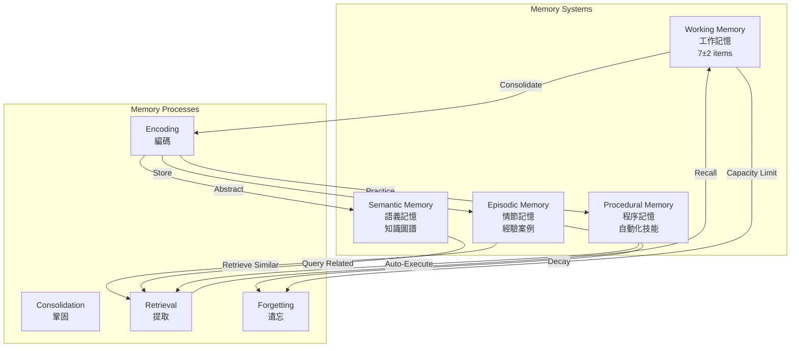
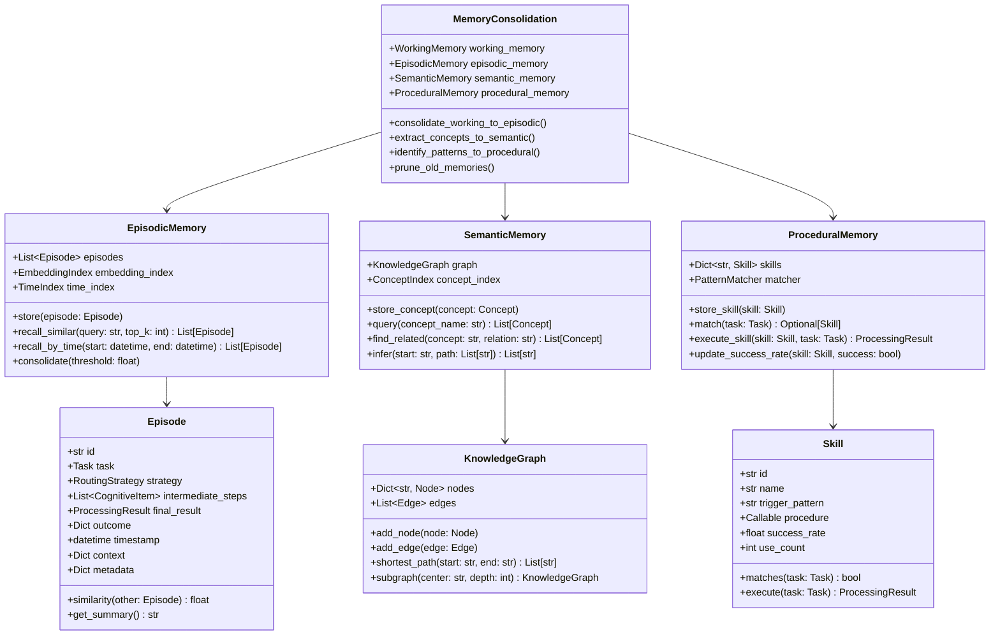

# 記憶系統設計 (Memory Systems)

## 文檔編號
`COGNITIVE-ARCH-05`

**版本**: 1.0.0
**最後更新**: 2026-02-12
**狀態**: 詳細設計階段

---

## 概述

**記憶系統 (Memory Systems)** 模擬人類的多層次記憶架構，實現經驗累積、知識整合與類比推理能力。

它解決了當前架構的核心問題：**每次請求都從零開始，無法從過去經驗中學習與類比應用**。

### 設計目標

1. **經驗累積**：保存成功/失敗的案例供未來參考
2. **類比推理**：識別當前任務與過去經驗的相似性
3. **知識整合**：構建語義網絡，理解概念關聯
4. **技能學習**：將重複的模式固化為自動化流程
5. **遺忘機制**：避免記憶無限增長，保留重要信息

---

## 神經科學與心理學基礎

### 1. Atkinson-Shiffrin 記憶模型 (1968)

**三級記憶架構**：

```
感覺記憶 (Sensory Memory)
    ↓ (注意力)
工作記憶 (Working Memory) ← 已在 GlobalWorkspace 實現
    ↓ (編碼)
長期記憶 (Long-Term Memory)
    ├─ 情節記憶 (Episodic)
    ├─ 語義記憶 (Semantic)
    └─ 程序記憶 (Procedural)
```

### 2. 情節記憶 (Episodic Memory) - Tulving (1972)

**定義**：對個人經歷的記憶，包含時間、地點、情境。

**特性**：
- **情境依賴**：包含「何時、何地、發生了什麼」
- **自傳式**：第一人稱視角
- **可提取**：可以回憶並重新體驗

**在 OpenAgent 中的應用**：
```python
class Episode:
    """
    情節記憶：記錄一次完整的任務處理經歷

    包含：
    - 任務內容
    - 使用的策略
    - 中間步驟
    - 最終結果
    - 成功與否
    """
    task: Task
    strategy: RoutingStrategy
    intermediate_steps: List[CognitiveItem]
    final_result: ProcessingResult
    outcome: Dict  # {"success": bool, "quality": float}
    timestamp: datetime
    context: Dict  # 當時的系統狀態、環境因素
```

### 3. 語義記憶 (Semantic Memory)

**定義**：對事實、概念、知識的記憶，獨立於個人經歷。

**特性**：
- **去情境化**：不依賴特定時間地點
- **結構化**：概念之間有層次與關聯
- **可推理**：支持推理與知識組合

**在 OpenAgent 中的應用**：
```python
class KnowledgeGraph:
    """
    語義記憶：知識圖譜

    節點：概念、實體、技術
    邊：關係（is-a, part-of, used-for, etc.）
    """
    nodes: Dict[str, Node]
    edges: List[Edge]

    def query(self, concept: str) -> List[Node]:
        """查詢相關概念"""

    def infer(self, start: str, relation: str) -> List[str]:
        """推理：如果 A is-a B，且 B has-property C，則 A has-property C"""
```

### 4. 程序記憶 (Procedural Memory)

**定義**：關於「如何做」的記憶，通常是無意識的技能。

**特性**：
- **隱性**：難以用語言描述
- **自動化**：經過練習後自動執行
- **穩定**：一旦形成很難遺忘（如騎自行車）

**在 OpenAgent 中的應用**：
```python
class Skill:
    """
    程序記憶：自動化的處理流程

    例如：
    - "Python 代碼問題" → 自動觸發 CodeProcessor
    - "搜尋 + 總結" → 固化為 SearchAndSummarize 流程
    """
    trigger_pattern: str  # 觸發模式
    procedure: Callable  # 自動執行的流程
    success_rate: float  # 成功率
```

---

## 架構設計

### L2 Container Diagram



### L3 Component Diagram



---

## 核心組件詳細設計

### 1. EpisodicMemory - 情節記憶

存儲與檢索完整的任務處理經歷。

```python
from dataclasses import dataclass, field
from datetime import datetime
from typing import List, Dict, Optional
import numpy as np
from sklearn.metrics.pairwise import cosine_similarity

@dataclass
class Episode:
    """情節記憶單元"""
    id: str
    task: Task
    strategy: str  # 使用的路由策略
    intermediate_steps: List[CognitiveItem]
    final_result: ProcessingResult
    outcome: Dict  # {"success": bool, "quality": float, "user_rating": float}
    timestamp: datetime
    context: Dict = field(default_factory=dict)
    metadata: Dict = field(default_factory=dict)

    # 嵌入向量（用於相似度計算）
    embedding: Optional[np.ndarray] = None

    def get_summary(self) -> str:
        """獲取情節摘要"""
        return f"""
        Task: {self.task.query[:100]}
        Strategy: {self.strategy}
        Success: {self.outcome.get('success', False)}
        Quality: {self.outcome.get('quality', 0):.2f}
        Timestamp: {self.timestamp.isoformat()}
        """

    def similarity(self, other: 'Episode') -> float:
        """計算與另一個情節的相似度"""
        if self.embedding is None or other.embedding is None:
            return 0.0

        return cosine_similarity(
            self.embedding.reshape(1, -1),
            other.embedding.reshape(1, -1)
        )[0][0]

class EpisodicMemory:
    """
    情節記憶系統：存儲與檢索任務處理經歷

    特性：
    1. 基於嵌入的相似度檢索
    2. 時間索引（最近的經驗更容易提取）
    3. 記憶鞏固（重要經驗長期保留）
    4. 遺忘機制（不重要的經驗衰減）
    """

    def __init__(self, max_episodes: int = 10000):
        self.episodes: Dict[str, Episode] = {}
        self.max_episodes = max_episodes

        # 索引
        self.embedding_index = None  # 向量索引（如 FAISS）
        self.time_index: List[Tuple[datetime, str]] = []  # (時間, episode_id)

        # 嵌入模型（用於計算語義相似度）
        self.embedding_model = self._init_embedding_model()

    def _init_embedding_model(self):
        """初始化嵌入模型"""
        # 使用 sentence-transformers 或類似模型
        # from sentence_transformers import SentenceTransformer
        # return SentenceTransformer('all-MiniLM-L6-v2')
        return None  # 佔位符

    def store(self, episode: Episode):
        """
        存儲情節到記憶

        流程：
        1. 計算嵌入向量
        2. 存儲到主存儲
        3. 更新索引
        4. 檢查容量限制
        """
        # 1. 計算嵌入
        if self.embedding_model:
            text = f"{episode.task.query} {episode.final_result.content}"
            episode.embedding = self.embedding_model.encode(text)

        # 2. 存儲
        self.episodes[episode.id] = episode

        # 3. 更新時間索引
        self.time_index.append((episode.timestamp, episode.id))
        self.time_index.sort(reverse=True)  # 最新的在前

        # 4. 容量檢查
        if len(self.episodes) > self.max_episodes:
            self._prune_old_episodes()

    def recall_similar(
        self,
        query: str,
        top_k: int = 5,
        min_similarity: float = 0.5
    ) -> List[Episode]:
        """
        檢索相似的情節

        Args:
            query: 查詢文本（通常是當前任務）
            top_k: 返回前 k 個最相似的
            min_similarity: 最小相似度閾值

        Returns:
            相似情節列表（按相似度降序）
        """
        if not self.episodes:
            return []

        # 計算查詢的嵌入
        if self.embedding_model:
            query_embedding = self.embedding_model.encode(query)
        else:
            # Fallback: 簡單的關鍵詞匹配
            return self._keyword_match(query, top_k)

        # 計算與所有情節的相似度
        similarities = []
        for ep_id, episode in self.episodes.items():
            if episode.embedding is not None:
                sim = cosine_similarity(
                    query_embedding.reshape(1, -1),
                    episode.embedding.reshape(1, -1)
                )[0][0]

                if sim >= min_similarity:
                    similarities.append((sim, episode))

        # 排序並返回 top-k
        similarities.sort(reverse=True, key=lambda x: x[0])
        return [ep for _, ep in similarities[:top_k]]

    def _keyword_match(self, query: str, top_k: int) -> List[Episode]:
        """Fallback: 基於關鍵詞的匹配"""
        query_words = set(query.lower().split())
        matches = []

        for episode in self.episodes.values():
            task_words = set(episode.task.query.lower().split())
            overlap = len(query_words & task_words)

            if overlap > 0:
                matches.append((overlap, episode))

        matches.sort(reverse=True, key=lambda x: x[0])
        return [ep for _, ep in matches[:top_k]]

    def recall_by_time(
        self,
        start: datetime,
        end: datetime
    ) -> List[Episode]:
        """按時間範圍檢索情節"""
        results = []
        for timestamp, ep_id in self.time_index:
            if start <= timestamp <= end:
                results.append(self.episodes[ep_id])

        return results

    def recall_successful_cases(
        self,
        task_type: str,
        top_k: int = 5
    ) -> List[Episode]:
        """檢索特定類型的成功案例"""
        successful = [
            ep for ep in self.episodes.values()
            if ep.outcome.get("success", False) and
               ep.task.metadata.get("type") == task_type
        ]

        # 按品質排序
        successful.sort(
            key=lambda ep: ep.outcome.get("quality", 0),
            reverse=True
        )

        return successful[:top_k]

    def _prune_old_episodes(self):
        """
        清理舊情節（遺忘機制）

        策略：
        - 保留最近的 20%
        - 保留高品質的 (quality > 0.8)
        - 保留被頻繁檢索的
        - 刪除其餘的
        """
        all_episodes = list(self.episodes.values())
        n_keep = int(self.max_episodes * 0.8)

        # 評分：時間 + 品質 + 訪問頻率
        scored = []
        for ep in all_episodes:
            age_days = (datetime.now() - ep.timestamp).days
            recency_score = 1.0 / (1 + age_days)
            quality_score = ep.outcome.get("quality", 0)
            access_score = ep.metadata.get("access_count", 0) / 10.0

            total_score = (
                0.3 * recency_score +
                0.5 * quality_score +
                0.2 * access_score
            )

            scored.append((total_score, ep))

        # 保留高分的
        scored.sort(reverse=True, key=lambda x: x[0])
        to_keep = set(ep.id for _, ep in scored[:n_keep])

        # 刪除其餘的
        self.episodes = {
            ep_id: ep for ep_id, ep in self.episodes.items()
            if ep_id in to_keep
        }

        # 重建時間索引
        self.time_index = [
            (ep.timestamp, ep.id)
            for ep in self.episodes.values()
        ]
        self.time_index.sort(reverse=True)
```

### 2. SemanticMemory - 語義記憶

構建知識圖譜，支持概念查詢與推理。

```python
from enum import Enum
from dataclasses import dataclass
from typing import List, Set, Optional

class RelationType(Enum):
    """關係類型"""
    IS_A = "is_a"  # 繼承關係
    PART_OF = "part_of"  # 組成關係
    USED_FOR = "used_for"  # 用途關係
    REQUIRES = "requires"  # 依賴關係
    SIMILAR_TO = "similar_to"  # 相似關係
    OPPOSITE_OF = "opposite_of"  # 對立關係

@dataclass
class Node:
    """知識圖譜節點（概念）"""
    id: str
    name: str
    type: str  # "technology", "concept", "method", etc.
    properties: Dict[str, Any]
    description: str

@dataclass
class Edge:
    """知識圖譜邊（關係）"""
    source: str  # 源節點 ID
    target: str  # 目標節點 ID
    relation: RelationType
    weight: float = 1.0  # 關係強度

class KnowledgeGraph:
    """知識圖譜"""

    def __init__(self):
        self.nodes: Dict[str, Node] = {}
        self.edges: List[Edge] = []

        # 鄰接表（加速查詢）
        self.adjacency: Dict[str, List[Edge]] = {}

    def add_node(self, node: Node):
        """添加節點"""
        self.nodes[node.id] = node
        if node.id not in self.adjacency:
            self.adjacency[node.id] = []

    def add_edge(self, edge: Edge):
        """添加邊"""
        self.edges.append(edge)
        self.adjacency[edge.source].append(edge)

    def get_related(
        self,
        node_id: str,
        relation: Optional[RelationType] = None,
        depth: int = 1
    ) -> List[Node]:
        """
        獲取相關節點

        Args:
            node_id: 起始節點
            relation: 關係類型（None 表示所有類型）
            depth: 查詢深度

        Returns:
            相關節點列表
        """
        if node_id not in self.adjacency:
            return []

        visited = set()
        queue = [(node_id, 0)]  # (node_id, current_depth)
        results = []

        while queue:
            current_id, current_depth = queue.pop(0)

            if current_depth > depth:
                continue

            if current_id in visited:
                continue

            visited.add(current_id)

            # 獲取相鄰節點
            for edge in self.adjacency.get(current_id, []):
                if relation is None or edge.relation == relation:
                    target_node = self.nodes.get(edge.target)
                    if target_node and current_depth > 0:  # 不包括起始節點
                        results.append(target_node)

                    # 繼續擴展
                    if current_depth < depth:
                        queue.append((edge.target, current_depth + 1))

        return results

    def shortest_path(self, start: str, end: str) -> Optional[List[str]]:
        """找到兩個概念之間的最短路徑（BFS）"""
        if start not in self.nodes or end not in self.nodes:
            return None

        visited = {start}
        queue = [(start, [start])]

        while queue:
            current, path = queue.pop(0)

            if current == end:
                return path

            for edge in self.adjacency.get(current, []):
                if edge.target not in visited:
                    visited.add(edge.target)
                    queue.append((edge.target, path + [edge.target]))

        return None  # 無路徑

class SemanticMemory:
    """
    語義記憶系統：知識圖譜 + 概念查詢

    功能：
    1. 存儲概念與關係
    2. 查詢相關概念
    3. 推理（如傳遞性：A is-a B, B is-a C → A is-a C）
    4. 概念激活擴散
    """

    def __init__(self):
        self.graph = KnowledgeGraph()

    def store_concept(self, concept: Node):
        """存儲概念"""
        self.graph.add_node(concept)

    def store_relation(self, source: str, target: str, relation: RelationType):
        """存儲關係"""
        edge = Edge(source, target, relation)
        self.graph.add_edge(edge)

    def query(self, concept_name: str) -> Optional[Node]:
        """查詢概念"""
        for node in self.graph.nodes.values():
            if node.name.lower() == concept_name.lower():
                return node
        return None

    def find_related(
        self,
        concept: str,
        relation: RelationType,
        depth: int = 1
    ) -> List[Node]:
        """
        查找相關概念

        Example:
            find_related("Python", RelationType.USED_FOR, depth=1)
            → ["web development", "data science", "automation"]
        """
        node = self.query(concept)
        if not node:
            return []

        return self.graph.get_related(node.id, relation, depth)

    def infer_properties(self, concept: str) -> Dict[str, Any]:
        """
        推理概念的屬性（通過 is-a 關係繼承）

        Example:
            Python is-a programming_language
            programming_language has-property {compiled: False}
            → Python inherits {compiled: False}
        """
        node = self.query(concept)
        if not node:
            return {}

        properties = node.properties.copy()

        # 沿 is-a 關係向上查找
        parents = self.graph.get_related(node.id, RelationType.IS_A, depth=5)
        for parent in parents:
            # 繼承父類屬性（如果不衝突）
            for key, value in parent.properties.items():
                if key not in properties:
                    properties[key] = value

        return properties
```

### 3. ProceduralMemory - 程序記憶

存儲自動化的處理流程與技能。

```python
@dataclass
class Skill:
    """技能：自動化的處理流程"""
    id: str
    name: str
    trigger_pattern: str  # 正則或關鍵詞模式
    procedure: Callable[[Task], ProcessingResult]  # 執行流程
    success_rate: float = 0.5
    use_count: int = 0
    avg_latency: float = 0.0
    created_at: datetime = field(default_factory=datetime.now)

    def matches(self, task: Task) -> bool:
        """判斷是否匹配任務"""
        import re
        return bool(re.search(self.trigger_pattern, task.query, re.IGNORECASE))

    async def execute(self, task: Task) -> ProcessingResult:
        """執行技能"""
        self.use_count += 1
        start_time = time.time()

        result = await self.procedure(task)

        # 更新統計
        latency = time.time() - start_time
        self.avg_latency = (
            0.9 * self.avg_latency + 0.1 * latency
        )

        return result

class ProceduralMemory:
    """
    程序記憶系統：自動化技能

    特性：
    1. 模式匹配：識別熟悉的任務模式
    2. 自動執行：無需重新思考，直接執行固化流程
    3. 性能追蹤：監控技能的成功率與效率
    4. 學習新技能：從重複模式中抽取新技能
    """

    def __init__(self):
        self.skills: Dict[str, Skill] = {}

    def store_skill(self, skill: Skill):
        """存儲技能"""
        self.skills[skill.id] = skill

    def match(self, task: Task) -> Optional[Skill]:
        """
        匹配任務到技能

        Returns:
            匹配的技能（如果有）
        """
        for skill in self.skills.values():
            if skill.matches(task):
                return skill
        return None

    async def execute_if_matched(self, task: Task) -> Optional[ProcessingResult]:
        """
        如果匹配到技能，自動執行

        Returns:
            處理結果（如果匹配），否則 None
        """
        skill = self.match(task)
        if skill and skill.success_rate > 0.7:  # 只執行高成功率的技能
            logger.info(f"Executing skill: {skill.name}")
            return await skill.execute(task)
        return None

    def update_success_rate(self, skill_id: str, success: bool):
        """更新技能成功率"""
        skill = self.skills.get(skill_id)
        if skill:
            alpha = 0.1  # 學習率
            skill.success_rate = (
                (1 - alpha) * skill.success_rate +
                alpha * (1.0 if success else 0.0)
            )

    def identify_new_skill(
        self,
        episodes: List[Episode],
        min_occurrences: int = 3
    ) -> Optional[Skill]:
        """
        從情節記憶中識別新技能

        策略：
        - 尋找重複出現的任務模式
        - 如果使用相同策略且成功率高
        - 固化為自動化技能
        """
        # 簡化版：尋找相似任務
        # TODO: 使用聚類算法
        return None
```

---

## 記憶鞏固 (Memory Consolidation)

模擬睡眠時的記憶鞏固過程。

```python
class MemoryConsolidation:
    """
    記憶鞏固：從工作記憶到長期記憶的轉移

    模擬人類睡眠時的記憶鞏固過程：
    1. 重放重要經驗
    2. 提取共性形成概念
    3. 識別重複模式形成技能
    4. 清理不重要的記憶
    """

    def __init__(
        self,
        working_memory: 'WorkingMemory',
        episodic_memory: EpisodicMemory,
        semantic_memory: SemanticMemory,
        procedural_memory: ProceduralMemory
    ):
        self.working_memory = working_memory
        self.episodic_memory = episodic_memory
        self.semantic_memory = semantic_memory
        self.procedural_memory = procedural_memory

    async def consolidate(self):
        """
        執行記憶鞏固

        應該在系統空閒時定期調用（如每小時）
        """
        logger.info("Starting memory consolidation...")

        # 1. 工作記憶 → 情節記憶
        await self._consolidate_working_to_episodic()

        # 2. 情節記憶 → 語義記憶（抽取概念）
        await self._extract_concepts()

        # 3. 情節記憶 → 程序記憶（識別技能）
        await self._identify_skills()

        # 4. 清理舊記憶
        self._prune_memories()

        logger.info("Memory consolidation complete")

    async def _consolidate_working_to_episodic(self):
        """將重要的工作記憶項目轉移到情節記憶"""
        for item in self.working_memory.items.values():
            # 只保留高激活度 + 高信心度的項目
            if item.activation > 0.7 and item.confidence > 0.8:
                # 構造情節
                episode = Episode(
                    id=f"ep_{item.id}",
                    task=Task(query=str(item.content)),
                    strategy="unknown",  # TODO: 從 metadata 中提取
                    intermediate_steps=[item],
                    final_result=None,
                    outcome={"success": True, "quality": item.confidence},
                    timestamp=item.timestamp,
                    context=item.metadata
                )

                self.episodic_memory.store(episode)

    async def _extract_concepts(self):
        """從情節中提取概念到語義記憶"""
        # 簡化版：提取頻繁出現的實體
        # TODO: 使用 NER 或 LLM 提取
        pass

    async def _identify_skills(self):
        """識別重複模式並固化為技能"""
        # 獲取最近的成功情節
        recent_episodes = self.episodic_memory.recall_by_time(
            datetime.now() - timedelta(days=7),
            datetime.now()
        )

        # 使用程序記憶識別新技能
        new_skill = self.procedural_memory.identify_new_skill(recent_episodes)

        if new_skill:
            self.procedural_memory.store_skill(new_skill)
            logger.info(f"New skill learned: {new_skill.name}")

    def _prune_memories(self):
        """清理不重要的記憶"""
        # 情節記憶已有自己的清理機制
        pass
```

---

## 與其他組件整合

### 與 ContextIntegrator 整合

```python
class ContextIntegrator:
    """整合記憶系統的上下文整合器"""

    def __init__(
        self,
        workspace: GlobalWorkspace,
        episodic_memory: EpisodicMemory,
        semantic_memory: SemanticMemory,
        procedural_memory: ProceduralMemory,
        state_monitor: 'SystemStateMonitor'
    ):
        # ... 現有組件
        self.semantic_memory = semantic_memory
        self.procedural_memory = procedural_memory

    async def integrate(self, features: TaskFeatures, task: Task) -> OrientationResult:
        """整合所有信息（包含記憶系統）"""

        # 1. 檢查是否有匹配的技能（程序記憶）
        skill = self.procedural_memory.match(task)

        if skill and skill.success_rate > 0.8:
            # 高成功率技能：直接推薦使用
            return OrientationResult(
                features=features,
                similar_cases=[],
                system_state=self.state_monitor.get_state(),
                recommended_level=CognitiveLevel.SYSTEM_1,  # 自動化
                confidence=skill.success_rate,
                metadata={"skill": skill.name}
            )

        # 2. 從情節記憶檢索類似案例
        similar_cases = await self.episodic_memory.recall_similar(task.query, top_k=3)

        # 3. 從語義記憶查詢相關概念
        # 提取任務中的關鍵概念
        concepts = self._extract_concepts(task.query)
        related_knowledge = []
        for concept in concepts:
            related = self.semantic_memory.find_related(concept, RelationType.USED_FOR)
            related_knowledge.extend(related)

        # 4. 整合所有信息進行定位
        # ... 現有邏輯
```

---

## 測試與驗證

```python
class TestEpisodicMemory:
    def test_store_and_recall(self):
        """測試存儲與檢索"""
        memory = EpisodicMemory()

        # 存儲情節
        episode = Episode(
            id="ep1",
            task=Task(query="How to sort a list in Python?"),
            strategy="direct_system_1",
            intermediate_steps=[],
            final_result=None,
            outcome={"success": True, "quality": 0.9},
            timestamp=datetime.now(),
            context={}
        )

        memory.store(episode)

        # 檢索相似情節
        similar = memory.recall_similar("Python list sorting", top_k=1)

        assert len(similar) == 1
        assert similar[0].id == "ep1"

class TestSemanticMemory:
    def test_knowledge_graph(self):
        """測試知識圖譜"""
        memory = SemanticMemory()

        # 添加概念
        memory.store_concept(Node(
            id="python",
            name="Python",
            type="language",
            properties={"compiled": False, "paradigm": "multi-paradigm"},
            description="A high-level programming language"
        ))

        # 查詢
        python = memory.query("Python")
        assert python is not None
        assert python.properties["compiled"] == False
```

---

## 下一步

- **[06_iterative_refinement.md](./06_iterative_refinement.md)**: 迭代精煉機制
- **[10_code_examples.md](./10_code_examples.md#Example 5)**: 記憶系統範例

---

**文檔維護者**: OpenAgent Architecture Team
**審核狀態**: Pending Review
