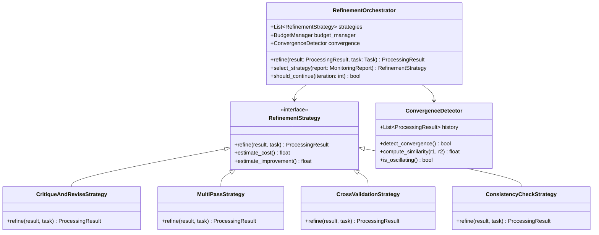

# 迭代精煉機制設計 (Iterative Refinement)

## 文檔編號
`COGNITIVE-ARCH-06`

**版本**: 1.0.0
**最後更新**: 2026-02-12
**狀態**: 詳細設計階段

---

## 概述

**迭代精煉機制 (Iterative Refinement)** 是元認知治理層的核心功能之一，模擬人類思考中的「再思考」與「自我修正」過程。

它解決了當前架構的問題：**一次性輸出，無論品質如何都直接返回，無法自我改進**。

### 設計目標

1. **品質提升**：通過多輪迭代持續改進輸出品質
2. **錯誤修正**：自動發現並修正邏輯錯誤、不一致性
3. **完整性保證**：確保輸出完整回答問題
4. **預算意識**：在預算約束下最大化品質
5. **收斂保證**：避免無限迭代，確保最終收斂

---

## 理論基礎

### 1. 自我解釋 (Self-Explanation) - Chi et al. (1989)

**研究發現**：
> 學生在學習時主動解釋內容給自己聽，學習效果顯著提升。

**機制**：
- 識別知識缺口
- 修正錯誤理解
- 整合新舊知識

**在 OpenAgent 中的應用**：
```python
class SelfExplanationRefiner:
    """自我解釋精煉器"""

    async def refine(self, result: ProcessingResult) -> ProcessingResult:
        """
        通過自我解釋改進結果

        流程：
        1. 讓 LLM 解釋自己的答案
        2. 識別解釋中的不一致
        3. 修正並重新生成
        """
        # 1. 請 LLM 解釋答案
        explanation_prompt = f"""
        Your previous answer: {result.content}

        Please explain:
        1. Why did you give this answer?
        2. What are the key assumptions?
        3. Are there any potential issues?
        """

        explanation = await llm.generate(explanation_prompt)

        # 2. 檢測問題
        if self._detect_inconsistency(explanation):
            # 3. 修正
            revised = await self._revise(result, explanation)
            return revised

        return result
```

### 2. 批判性思維 (Critical Thinking)

**核心技能**：
- **分析 (Analysis)**：分解論證結構
- **評估 (Evaluation)**：判斷論據強度
- **推理 (Inference)**：得出合理結論
- **自我調整 (Self-Regulation)**：監控與修正思考過程

**在 OpenAgent 中的應用**：
```python
class CriticalThinkingRefiner:
    """批判性思維精煉器"""

    async def critique(self, result: ProcessingResult) -> List[str]:
        """
        批判性評估結果

        返回發現的問題列表
        """
        critique_prompt = f"""
        Critically evaluate this answer: {result.content}

        Check for:
        1. Logical fallacies
        2. Unsupported claims
        3. Missing information
        4. Contradictions
        5. Ambiguity

        List all issues found.
        """

        critique = await llm.generate(critique_prompt)
        issues = self._parse_issues(critique)

        return issues
```

### 3. 多樣性思維 (Divergent-Convergent Thinking)

**雙階段過程**：
1. **發散階段 (Divergent)**：生成多個候選答案
2. **收斂階段 (Convergent)**：評估並選擇最佳答案

**在 OpenAgent 中的應用**：
```python
class MultiCandidateRefiner:
    """多候選精煉器"""

    async def refine(self, task: Task, initial: ProcessingResult) -> ProcessingResult:
        """
        生成多個候選答案，選擇最佳

        流程：
        1. 生成 N 個不同的答案（發散）
        2. 評估每個答案的品質
        3. 選擇最佳或組合（收斂）
        """
        # 1. 生成候選
        candidates = await self._generate_candidates(task, n=3)

        # 2. 評估
        scored = [
            (self._score(c), c)
            for c in candidates
        ]

        # 3. 選擇最佳
        best = max(scored, key=lambda x: x[0])[1]

        return best
```

---

## 架構設計

### L3 Component Diagram



---

## 核心組件詳細設計

### 1. Critique-and-Revise 策略

最常用的精煉策略：批評 → 修訂。

```python
from abc import ABC, abstractmethod
from dataclasses import dataclass
from typing import List, Optional

@dataclass
class Critique:
    """批評意見"""
    issue_type: str  # "logical_error", "incomplete", "unclear", etc.
    description: str
    severity: float  # [0, 1]
    location: Optional[str]  # 問題位置

class CritiqueAndReviseStrategy:
    """
    批評-修訂策略

    流程：
    1. 批評當前結果，識別問題
    2. 根據批評意見修訂
    3. 驗證修訂後的結果
    """

    def __init__(self, llm_client):
        self.llm = llm_client

    async def refine(
        self,
        result: ProcessingResult,
        task: Task
    ) -> ProcessingResult:
        """執行批評-修訂"""

        # 1. 批評階段
        critiques = await self._critique(result, task)

        if not critiques:
            # 沒有問題，無需修訂
            return result

        # 2. 修訂階段
        revised = await self._revise(result, task, critiques)

        # 3. 驗證修訂
        if self._is_improvement(result, revised):
            return revised
        else:
            # 修訂沒有改進，返回原結果
            logger.warning("Revision did not improve quality")
            return result

    async def _critique(
        self,
        result: ProcessingResult,
        task: Task
    ) -> List[Critique]:
        """
        批評結果，識別問題

        使用 LLM 作為批評者
        """
        critique_prompt = f"""
You are a critical reviewer. Review the following answer to the question.

Question: {task.query}

Answer: {result.content}

Identify all issues with this answer. For each issue, provide:
1. Type (logical_error, incomplete, unclear, factually_wrong, etc.)
2. Description
3. Severity (0.0 to 1.0)

Format your response as JSON:
[
  {{"type": "...", "description": "...", "severity": 0.8}},
  ...
]
"""

        critique_text = await self.llm.generate(
            critique_prompt,
            temperature=0.3  # 低溫度，追求準確
        )

        # 解析批評
        critiques = self._parse_critiques(critique_text)

        # 過濾低嚴重性的問題
        return [c for c in critiques if c.severity > 0.5]

    async def _revise(
        self,
        result: ProcessingResult,
        task: Task,
        critiques: List[Critique]
    ) -> ProcessingResult:
        """
        根據批評意見修訂結果
        """
        # 構造修訂提示
        issues_text = "\n".join([
            f"- {c.issue_type}: {c.description} (severity: {c.severity})"
            for c in critiques
        ])

        revision_prompt = f"""
The following answer has issues that need to be addressed:

Original Question: {task.query}

Original Answer: {result.content}

Issues identified:
{issues_text}

Please provide a revised answer that addresses all these issues.
Focus on fixing the problems while maintaining the good parts of the original answer.
"""

        revised_content = await self.llm.generate(
            revision_prompt,
            temperature=0.5
        )

        # 構造新的 ProcessingResult
        revised_result = ProcessingResult(
            content=revised_content,
            confidence=result.confidence + 0.1,  # 假設有所提升
            metadata={
                **result.metadata,
                "refinement_strategy": "critique_and_revise",
                "critiques_addressed": len(critiques)
            }
        )

        return revised_result

    def _is_improvement(
        self,
        original: ProcessingResult,
        revised: ProcessingResult
    ) -> bool:
        """
        判斷修訂是否改進了品質

        簡單版本：比較長度與信心度
        生產版本：應使用 LLM 或其他評估器
        """
        # 至少應該更長（更完整）或信心度更高
        length_improved = len(revised.content) > len(original.content) * 0.9
        confidence_improved = revised.confidence > original.confidence

        return length_improved or confidence_improved

    def _parse_critiques(self, critique_text: str) -> List[Critique]:
        """解析 LLM 返回的批評"""
        import json
        try:
            critiques_data = json.loads(critique_text)
            return [
                Critique(
                    issue_type=c.get("type", "unknown"),
                    description=c.get("description", ""),
                    severity=c.get("severity", 0.5),
                    location=c.get("location")
                )
                for c in critiques_data
            ]
        except json.JSONDecodeError:
            logger.error("Failed to parse critiques")
            return []
```

### 2. Multi-Pass 策略

多遍處理，每遍專注於不同方面。

```python
class MultiPassStrategy:
    """
    多遍處理策略

    每遍專注於不同方面：
    - Pass 1: 內容完整性
    - Pass 2: 邏輯一致性
    - Pass 3: 語言清晰度
    """

    def __init__(self, llm_client, max_passes: int = 3):
        self.llm = llm_client
        self.max_passes = max_passes

        # 定義每遍的焦點
        self.passes = [
            {
                "name": "completeness",
                "focus": "Ensure the answer is complete and addresses all parts of the question",
                "weight": 0.4
            },
            {
                "name": "consistency",
                "focus": "Check for logical consistency and remove contradictions",
                "weight": 0.3
            },
            {
                "name": "clarity",
                "focus": "Improve clarity, readability, and remove ambiguity",
                "weight": 0.3
            }
        ]

    async def refine(
        self,
        result: ProcessingResult,
        task: Task
    ) -> ProcessingResult:
        """執行多遍精煉"""

        current = result

        for pass_idx, pass_config in enumerate(self.passes[:self.max_passes]):
            logger.info(f"Pass {pass_idx + 1}/{self.max_passes}: {pass_config['name']}")

            # 執行本遍的精煉
            current = await self._execute_pass(current, task, pass_config)

            # 可選：檢查是否已經足夠好
            if current.confidence > 0.9:
                logger.info(f"High confidence reached after {pass_idx + 1} passes")
                break

        return current

    async def _execute_pass(
        self,
        result: ProcessingResult,
        task: Task,
        pass_config: dict
    ) -> ProcessingResult:
        """執行單遍精煉"""

        prompt = f"""
Question: {task.query}

Current Answer: {result.content}

This pass focuses on: {pass_config['focus']}

Please review and improve the answer with this focus in mind.
If the answer is already good in this aspect, you can keep it mostly unchanged.
"""

        improved_content = await self.llm.generate(prompt, temperature=0.5)

        # 更新結果
        improved_result = ProcessingResult(
            content=improved_content,
            confidence=result.confidence + 0.05,  # 每遍小幅提升
            metadata={
                **result.metadata,
                "refinement_strategy": "multi_pass",
                f"pass_{pass_config['name']}": True
            }
        )

        return improved_result
```

### 3. Cross-Validation 策略

交叉驗證：生成多個答案並相互驗證。

```python
class CrossValidationStrategy:
    """
    交叉驗證策略

    流程：
    1. 生成 N 個獨立的答案
    2. 讓它們相互驗證
    3. 識別一致與不一致的部分
    4. 綜合最佳答案
    """

    def __init__(self, llm_client, n_candidates: int = 3):
        self.llm = llm_client
        self.n_candidates = n_candidates

    async def refine(
        self,
        result: ProcessingResult,
        task: Task
    ) -> ProcessingResult:
        """執行交叉驗證精煉"""

        # 1. 生成多個候選答案
        candidates = await self._generate_candidates(task, self.n_candidates)

        # 2. 交叉驗證
        consistency_matrix = await self._cross_validate(candidates)

        # 3. 識別一致的部分
        consistent_parts = self._extract_consistent_parts(candidates, consistency_matrix)

        # 4. 綜合最佳答案
        synthesized = await self._synthesize(task, candidates, consistent_parts)

        return synthesized

    async def _generate_candidates(
        self,
        task: Task,
        n: int
    ) -> List[ProcessingResult]:
        """生成 N 個獨立答案（使用不同溫度或提示變體）"""
        candidates = []

        for i in range(n):
            # 使用不同的溫度增加多樣性
            temperature = 0.5 + i * 0.2

            content = await self.llm.generate(
                task.query,
                temperature=temperature
            )

            candidates.append(ProcessingResult(
                content=content,
                confidence=0.7,
                metadata={"candidate_id": i}
            ))

        return candidates

    async def _cross_validate(
        self,
        candidates: List[ProcessingResult]
    ) -> np.ndarray:
        """
        交叉驗證候選答案

        返回一致性矩陣 [N x N]，其中 matrix[i][j] 表示答案 i 與答案 j 的一致性
        """
        n = len(candidates)
        matrix = np.zeros((n, n))

        for i in range(n):
            for j in range(i + 1, n):
                # 計算答案 i 與答案 j 的一致性
                consistency = await self._compute_consistency(
                    candidates[i],
                    candidates[j]
                )

                matrix[i][j] = consistency
                matrix[j][i] = consistency

        return matrix

    async def _compute_consistency(
        self,
        answer1: ProcessingResult,
        answer2: ProcessingResult
    ) -> float:
        """
        計算兩個答案的一致性

        使用 LLM 判斷
        """
        prompt = f"""
Compare these two answers and rate their consistency (0.0 to 1.0):

Answer 1: {answer1.content}

Answer 2: {answer2.content}

Rate how consistent they are:
- 1.0: Completely consistent, saying the same thing
- 0.5: Partially consistent, some overlap
- 0.0: Completely inconsistent, contradictory

Provide only a number between 0.0 and 1.0.
"""

        response = await self.llm.generate(prompt, temperature=0.1)

        try:
            consistency = float(response.strip())
            return max(0.0, min(1.0, consistency))
        except ValueError:
            return 0.5  # 默認值

    def _extract_consistent_parts(
        self,
        candidates: List[ProcessingResult],
        consistency_matrix: np.ndarray
    ) -> List[str]:
        """
        提取所有候選答案中一致的部分

        簡化版：找到平均一致性高的候選
        """
        avg_consistency = consistency_matrix.mean(axis=1)
        best_idx = np.argmax(avg_consistency)

        # 返回最一致的答案作為基礎
        return [candidates[best_idx].content]

    async def _synthesize(
        self,
        task: Task,
        candidates: List[ProcessingResult],
        consistent_parts: List[str]
    ) -> ProcessingResult:
        """
        綜合多個答案

        基於一致的部分生成最終答案
        """
        all_answers = "\n\n---\n\n".join([c.content for c in candidates])

        synthesis_prompt = f"""
Question: {task.query}

Multiple answers have been generated:
{all_answers}

Please synthesize a final answer that:
1. Includes all consistent information from the answers
2. Resolves any contradictions
3. Provides the most accurate and complete response

Final Answer:
"""

        synthesized_content = await self.llm.generate(
            synthesis_prompt,
            temperature=0.3
        )

        return ProcessingResult(
            content=synthesized_content,
            confidence=0.85,  # 交叉驗證提升信心
            metadata={
                "refinement_strategy": "cross_validation",
                "n_candidates": len(candidates)
            }
        )
```

### 4. Consistency-Check 策略

檢查並修復邏輯不一致性。

```python
class ConsistencyCheckStrategy:
    """
    一致性檢查策略

    檢查：
    1. 內部邏輯一致性（不自相矛盾）
    2. 與已知事實的一致性
    3. 與問題的一致性（確實回答了問題）
    """

    def __init__(self, llm_client):
        self.llm = llm_client

    async def refine(
        self,
        result: ProcessingResult,
        task: Task
    ) -> ProcessingResult:
        """執行一致性檢查與修復"""

        # 1. 檢查內部一致性
        internal_issues = await self._check_internal_consistency(result)

        # 2. 檢查與問題的一致性
        question_issues = await self._check_question_alignment(result, task)

        # 3. 如果有問題，修復
        all_issues = internal_issues + question_issues

        if all_issues:
            fixed = await self._fix_inconsistencies(result, task, all_issues)
            return fixed

        return result

    async def _check_internal_consistency(
        self,
        result: ProcessingResult
    ) -> List[str]:
        """檢查答案內部的邏輯一致性"""

        prompt = f"""
Analyze this text for logical inconsistencies or contradictions:

{result.content}

List any contradictions or inconsistencies you find.
If there are none, respond with "NONE".
"""

        response = await self.llm.generate(prompt, temperature=0.2)

        if "NONE" in response.upper():
            return []

        # 解析問題列表
        return [line.strip() for line in response.split("\n") if line.strip()]

    async def _check_question_alignment(
        self,
        result: ProcessingResult,
        task: Task
    ) -> List[str]:
        """檢查答案是否真正回答了問題"""

        prompt = f"""
Question: {task.query}

Answer: {result.content}

Does the answer actually address the question?
List any aspects of the question that are not addressed.
If the answer is complete, respond with "COMPLETE".
"""

        response = await self.llm.generate(prompt, temperature=0.2)

        if "COMPLETE" in response.upper():
            return []

        return [line.strip() for line in response.split("\n") if line.strip()]

    async def _fix_inconsistencies(
        self,
        result: ProcessingResult,
        task: Task,
        issues: List[str]
    ) -> ProcessingResult:
        """修復識別出的不一致性"""

        issues_text = "\n".join([f"- {issue}" for issue in issues])

        fix_prompt = f"""
Question: {task.query}

Current Answer: {result.content}

Issues to fix:
{issues_text}

Please provide a corrected version that addresses all these issues.
"""

        fixed_content = await self.llm.generate(fix_prompt, temperature=0.4)

        return ProcessingResult(
            content=fixed_content,
            confidence=result.confidence + 0.1,
            metadata={
                **result.metadata,
                "refinement_strategy": "consistency_check",
                "issues_fixed": len(issues)
            }
        )
```

---

## 收斂檢測 (Convergence Detection)

避免無限迭代，檢測何時應停止精煉。

```python
class ConvergenceDetector:
    """
    收斂檢測器：判斷迭代是否應該停止

    停止條件：
    1. 連續兩次迭代變化很小（收斂）
    2. 開始振盪（在兩個狀態間來回）
    3. 達到預算限制
    4. 達到品質閾值
    """

    def __init__(self, convergence_threshold: float = 0.95):
        self.convergence_threshold = convergence_threshold
        self.history: List[ProcessingResult] = []

    def add_iteration(self, result: ProcessingResult):
        """添加一次迭代結果"""
        self.history.append(result)

    def should_stop(self, budget_manager: 'BudgetManager') -> tuple[bool, str]:
        """
        判斷是否應該停止迭代

        Returns:
            (should_stop, reason)
        """
        # 1. 預算耗盡
        if not budget_manager.can_afford_refinement():
            return True, "budget_exhausted"

        # 2. 至少需要 2 次迭代才能判斷收斂
        if len(self.history) < 2:
            return False, ""

        # 3. 檢查收斂（變化很小）
        if self._is_converged():
            return True, "converged"

        # 4. 檢查振盪
        if self._is_oscillating():
            return True, "oscillating"

        # 5. 達到高品質
        if self.history[-1].confidence > 0.95:
            return True, "high_quality_achieved"

        # 6. 達到最大迭代次數
        if len(self.history) >= 5:
            return True, "max_iterations"

        return False, ""

    def _is_converged(self) -> bool:
        """
        檢查是否收斂

        標準：最近兩次迭代的相似度 > 閾值
        """
        if len(self.history) < 2:
            return False

        last = self.history[-1]
        prev = self.history[-2]

        similarity = self._compute_similarity(last, prev)

        return similarity > self.convergence_threshold

    def _is_oscillating(self) -> bool:
        """
        檢查是否在振盪

        標準：奇數次迭代與偶數次迭代分別相似
        """
        if len(self.history) < 4:
            return False

        # 比較 n-2 和 n-4（相隔兩次）
        recent = self.history[-1]
        two_ago = self.history[-3] if len(self.history) >= 3 else None

        if two_ago:
            similarity = self._compute_similarity(recent, two_ago)
            if similarity > 0.9:
                logger.warning("Oscillation detected")
                return True

        return False

    def _compute_similarity(
        self,
        result1: ProcessingResult,
        result2: ProcessingResult
    ) -> float:
        """
        計算兩個結果的相似度

        簡化版：基於內容長度與重疊詞
        生產版：應使用語義相似度（如嵌入向量）
        """
        text1 = result1.content.lower().split()
        text2 = result2.content.lower().split()

        # Jaccard 相似度
        set1 = set(text1)
        set2 = set(text2)

        intersection = len(set1 & set2)
        union = len(set1 | set2)

        if union == 0:
            return 0.0

        return intersection / union
```

---

## 完整的 RefinementOrchestrator

整合所有策略的協調器。

```python
class RefinementOrchestrator:
    """
    精煉協調器：選擇並執行精煉策略

    職責：
    1. 根據問題類型選擇合適的精煉策略
    2. 管理迭代過程
    3. 檢測收斂
    4. 管理預算
    """

    def __init__(
        self,
        llm_client,
        budget_manager: 'BudgetManager'
    ):
        self.llm = llm_client
        self.budget_manager = budget_manager

        # 初始化所有策略
        self.strategies = {
            "critique_and_revise": CritiqueAndReviseStrategy(llm_client),
            "multi_pass": MultiPassStrategy(llm_client),
            "cross_validation": CrossValidationStrategy(llm_client),
            "consistency_check": ConsistencyCheckStrategy(llm_client)
        }

        self.convergence = ConvergenceDetector()

    async def refine(
        self,
        result: ProcessingResult,
        task: Task,
        strategy_name: Optional[str] = None
    ) -> ProcessingResult:
        """
        執行迭代精煉

        Args:
            result: 初始結果
            task: 原始任務
            strategy_name: 指定策略（None 表示自動選擇）

        Returns:
            精煉後的結果
        """
        # 選擇策略
        if strategy_name is None:
            strategy_name = self._select_strategy(result, task)

        strategy = self.strategies[strategy_name]

        logger.info(f"Starting refinement with strategy: {strategy_name}")

        # 初始化收斂檢測
        self.convergence = ConvergenceDetector()
        self.convergence.add_iteration(result)

        current = result
        iteration = 0

        while True:
            iteration += 1

            # 檢查是否應該停止
            should_stop, reason = self.convergence.should_stop(self.budget_manager)

            if should_stop:
                logger.info(f"Refinement stopped after {iteration} iterations: {reason}")
                break

            # 執行精煉
            logger.info(f"Refinement iteration {iteration}")
            refined = await strategy.refine(current, task)

            # 記錄迭代
            self.convergence.add_iteration(refined)
            self.budget_manager.increment_iteration()

            current = refined

        return current

    def _select_strategy(
        self,
        result: ProcessingResult,
        task: Task
    ) -> str:
        """
        自動選擇精煉策略

        基於：
        - 任務類型
        - 當前結果的信心度
        - 可用預算
        """
        # 高信心度：只需簡單檢查
        if result.confidence > 0.8:
            return "consistency_check"

        # 預算充足：使用交叉驗證
        if self.budget_manager.budget.remaining_ratio() > 0.5:
            return "cross_validation"

        # 默認：批評-修訂
        return "critique_and_revise"
```

---

## 與 MetacognitiveGovernor 整合

```python
class MetacognitiveGovernor:
    """整合精煉機制的元認知治理層"""

    def __init__(self, budget: ResourceBudget):
        # ... 現有組件
        self.refinement_orchestrator = RefinementOrchestrator(
            llm_client,
            self.budget_manager
        )

    def monitor(self, result: ProcessingResult) -> MonitoringReport:
        """監控並決定是否精煉"""

        # ... 現有監控邏輯

        # 如果需要精煉
        if report.should_refine:
            # 選擇精煉策略
            strategy = self._select_refinement_strategy(report)
            report.refinement_strategy = strategy

        return report

    async def refine(
        self,
        result: ProcessingResult,
        task: Task,
        strategy: str
    ) -> ProcessingResult:
        """執行精煉"""
        return await self.refinement_orchestrator.refine(
            result,
            task,
            strategy
        )
```

---

## 測試與驗證

```python
class TestIterativeRefinement:
    def test_critique_and_revise(self):
        """測試批評-修訂策略"""
        # TODO: 實現測試

    def test_convergence_detection(self):
        """測試收斂檢測"""
        detector = ConvergenceDetector()

        # 模擬收斂的迭代
        for i in range(3):
            result = ProcessingResult(
                content=f"Answer version {i}",
                confidence=0.7 + i * 0.1
            )
            detector.add_iteration(result)

        # 應該檢測到收斂
        # TODO: 完整測試邏輯

    def test_oscillation_detection(self):
        """測試振盪檢測"""
        # TODO: 實現測試
```

---

## 性能優化

### 並行精煉

對於 Cross-Validation 策略，可以並行生成候選答案：

```python
async def _generate_candidates_parallel(self, task: Task, n: int):
    """並行生成候選答案"""
    tasks = [
        self.llm.generate(task.query, temperature=0.5 + i * 0.2)
        for i in range(n)
    ]

    contents = await asyncio.gather(*tasks)

    return [
        ProcessingResult(content=c, confidence=0.7, metadata={"candidate_id": i})
        for i, c in enumerate(contents)
    ]
```

---

## 監控與可觀測性

```python
@dataclass
class RefinementMetrics:
    """精煉指標"""
    total_refinements: int
    avg_iterations: float
    strategy_distribution: Dict[str, int]
    avg_quality_improvement: float
    convergence_rate: float
    oscillation_rate: float
```

---

## 下一步

- **[07_event_driven_architecture.md](./07_event_driven_architecture.md)**: 事件驅動架構
- **[02_metacognitive_governor.md](./02_metacognitive_governor.md)**: 元認知治理層（包含精煉觸發邏輯）
- **[10_code_examples.md](./10_code_examples.md#Example 3)**: 元認知與精煉範例

---

**文檔維護者**: OpenAgent Architecture Team
**審核狀態**: Pending Review
