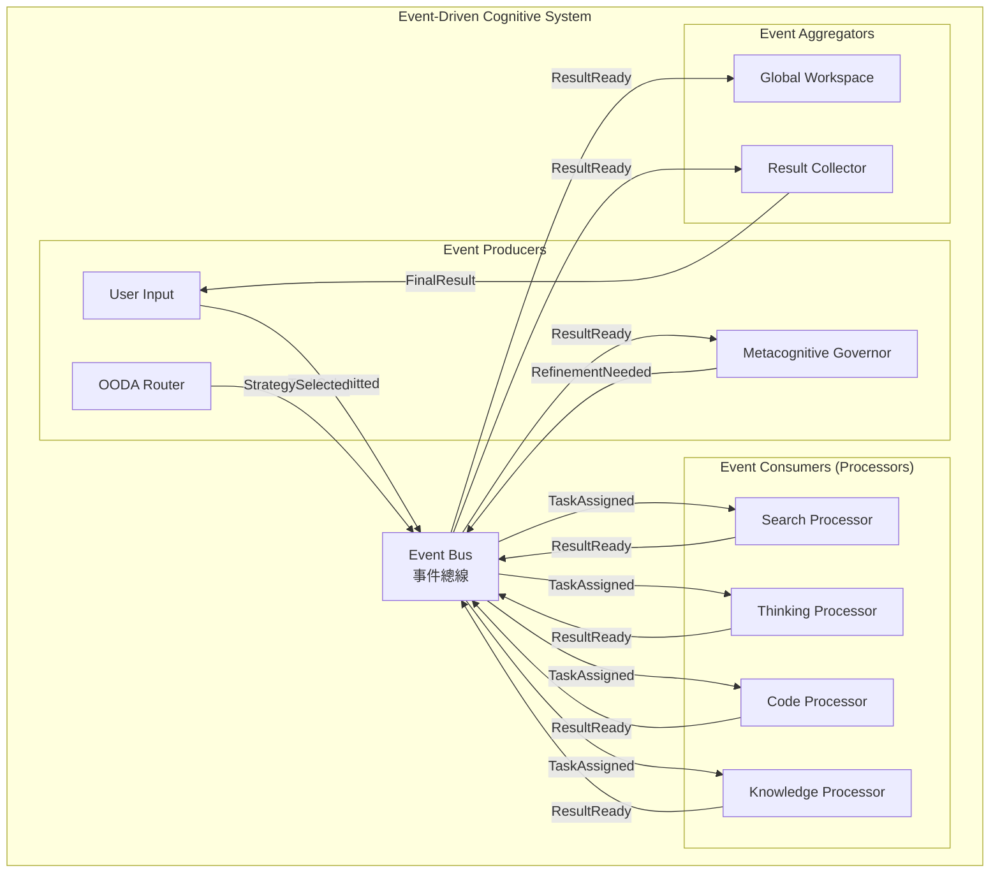
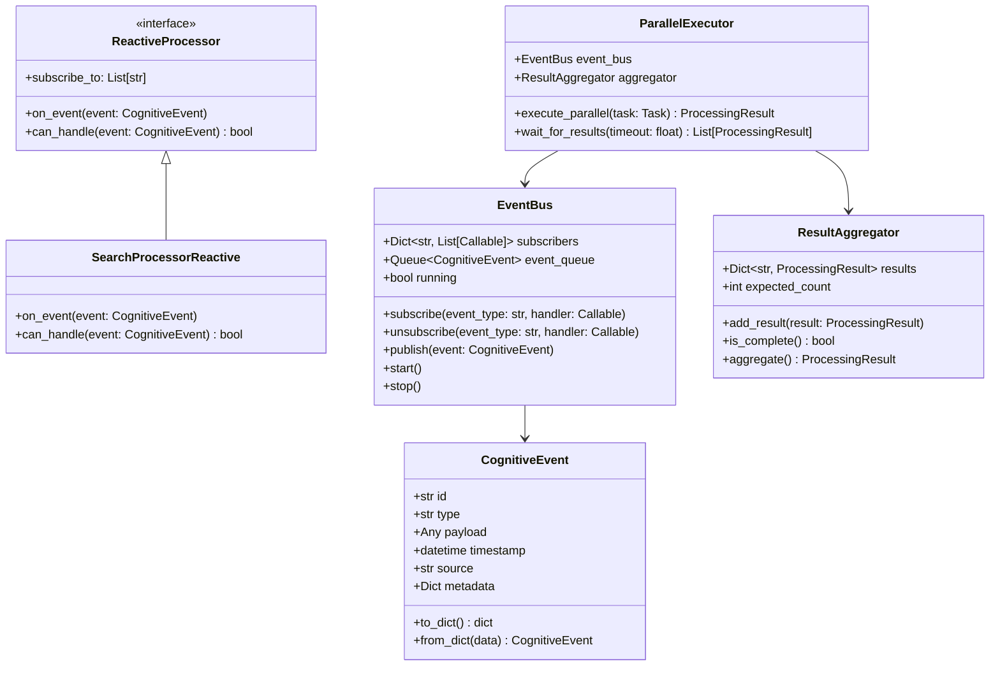

# 事件驅動架構設計 (Event-Driven Architecture)

## 文檔編號
`COGNITIVE-ARCH-07`

**版本**: 1.0.0
**最後更新**: 2026-02-12
**狀態**: 詳細設計階段

---

## 概述

**事件驅動架構 (Event-Driven Architecture, EDA)** 將認知系統從同步順序執行轉變為異步響應式處理，實現更高的並行度與更類人腦的分散式處理模式。

它解決了當前架構的問題：**所有處理器順序執行，無法並行處理，效率低下**。

### 設計目標

1. **並行處理**：多個 Processor 可以同時處理不同方面
2. **響應式**：Processor 響應事件而非被動調用
3. **解耦**：Processor 之間通過事件通信，降低耦合
4. **彈性**：單個 Processor 失敗不影響整體
5. **可擴展**：易於添加新的 Processor 或功能

---

## 理論基礎

### 1. 大腦的分散式並行處理

**神經科學發現**：
> 大腦不是單一的中央處理器，而是由多個專門區域（視覺皮層、聽覺皮層、運動皮層等）並行處理信息。

**特性**：
- **並行性 (Parallelism)**：多個腦區同時活動
- **專門化 (Specialization)**：每個腦區負責特定功能
- **整合 (Integration)**：通過神經連接整合信息

**在 OpenAgent 中的應用**：
```python
# 傳統同步模式（串行）
result1 = await search_processor.process(task)
result2 = await thinking_processor.process(task)
result3 = await code_processor.process(task)

# 事件驅動模式（並行）
event_bus.publish(TaskReceivedEvent(task))
# 所有訂閱的 Processor 同時開始處理
# SearchProcessor, ThinkingProcessor, CodeProcessor 並行運行
```

### 2. Actor Model (Carl Hewitt, 1973)

**核心概念**：
- **Actor**：獨立的計算單元，有自己的狀態
- **消息傳遞**：Actor 之間只通過消息通信
- **並發**：每個 Actor 可以並發執行

**在 OpenAgent 中的應用**：
```python
class ProcessorActor:
    """Processor 作為 Actor"""

    async def on_message(self, message: CognitiveEvent):
        """響應消息"""
        if message.type == "task_assigned":
            result = await self.process(message.task)
            self.send(ProcessingCompleteEvent(result))
```

### 3. Publish-Subscribe Pattern

**模式**：
- **Publisher**：發布事件，不關心誰訂閱
- **Subscriber**：訂閱感興趣的事件
- **Event Bus**：中介，負責路由事件

---

## 架構設計

### L2 Container Diagram



### L3 Component Diagram



---

## 核心組件詳細設計

### 1. CognitiveEvent - 認知事件

事件系統的基本單元。

```python
from dataclasses import dataclass, field
from datetime import datetime
from typing import Any, Dict, Optional
from enum import Enum
import uuid

class EventType(Enum):
    """事件類型"""
    # 任務生命週期
    TASK_SUBMITTED = "task_submitted"
    TASK_ASSIGNED = "task_assigned"
    TASK_COMPLETED = "task_completed"

    # 處理流程
    PROCESSING_STARTED = "processing_started"
    PROCESSING_COMPLETED = "processing_completed"
    PROCESSING_FAILED = "processing_failed"

    # 認知事件
    ITEM_POSTED_TO_WORKSPACE = "item_posted_to_workspace"
    ATTENTION_SHIFTED = "attention_shifted"
    REFINEMENT_TRIGGERED = "refinement_triggered"

    # 學習事件
    STRATEGY_UPDATED = "strategy_updated"
    MEMORY_CONSOLIDATED = "memory_consolidated"

@dataclass
class CognitiveEvent:
    """認知事件：系統中發生的可觀察事件"""

    id: str = field(default_factory=lambda: str(uuid.uuid4()))
    type: EventType = EventType.TASK_SUBMITTED
    payload: Any = None
    timestamp: datetime = field(default_factory=datetime.now)
    source: str = "unknown"
    metadata: Dict[str, Any] = field(default_factory=dict)

    # 事件追蹤
    correlation_id: Optional[str] = None  # 關聯ID（同一任務的所有事件共享）
    causation_id: Optional[str] = None  # 因果ID（此事件由哪個事件引起）

    def to_dict(self) -> dict:
        """序列化為字典"""
        return {
            "id": self.id,
            "type": self.type.value,
            "payload": self.payload,
            "timestamp": self.timestamp.isoformat(),
            "source": self.source,
            "metadata": self.metadata,
            "correlation_id": self.correlation_id,
            "causation_id": self.causation_id
        }

    @classmethod
    def from_dict(cls, data: dict) -> 'CognitiveEvent':
        """從字典反序列化"""
        return cls(
            id=data["id"],
            type=EventType(data["type"]),
            payload=data["payload"],
            timestamp=datetime.fromisoformat(data["timestamp"]),
            source=data["source"],
            metadata=data.get("metadata", {}),
            correlation_id=data.get("correlation_id"),
            causation_id=data.get("causation_id")
        )
```

### 2. EventBus - 事件總線

事件的發布-訂閱中心。

```python
import asyncio
from asyncio import Queue
from typing import Callable, Dict, List
import logging

logger = logging.getLogger(__name__)

class EventBus:
    """
    認知事件總線：發布-訂閱模式的事件路由

    特性：
    1. 異步事件處理
    2. 類型化訂閱（訂閱特定類型的事件）
    3. 事件持久化（可選）
    4. 事件重放（可選）
    """

    def __init__(self, max_queue_size: int = 10000):
        # 訂閱者註冊表：event_type -> list of handlers
        self.subscribers: Dict[str, List[Callable]] = {}

        # 事件隊列
        self.event_queue: Queue[CognitiveEvent] = Queue(maxsize=max_queue_size)

        # 運行狀態
        self.running = False

        # 事件歷史（可選）
        self.event_history: List[CognitiveEvent] = []
        self.max_history = 1000

    def subscribe(self, event_type: str, handler: Callable[[CognitiveEvent], None]):
        """
        訂閱事件

        Args:
            event_type: 事件類型（可以使用 "*" 訂閱所有事件）
            handler: 事件處理函數（可以是同步或異步）
        """
        if event_type not in self.subscribers:
            self.subscribers[event_type] = []

        self.subscribers[event_type].append(handler)
        logger.info(f"Subscribed to {event_type}: {handler.__name__}")

    def unsubscribe(self, event_type: str, handler: Callable):
        """取消訂閱"""
        if event_type in self.subscribers:
            self.subscribers[event_type].remove(handler)

    async def publish(self, event: CognitiveEvent):
        """
        發布事件

        事件會被添加到隊列，由事件循環異步處理
        """
        await self.event_queue.put(event)

        # 記錄歷史
        self.event_history.append(event)
        if len(self.event_history) > self.max_history:
            self.event_history.pop(0)

    def publish_sync(self, event: CognitiveEvent):
        """同步發布（用於非異步上下文）"""
        asyncio.create_task(self.publish(event))

    async def start(self):
        """啟動事件循環"""
        self.running = True
        logger.info("Event bus started")

        # 事件處理循環
        while self.running:
            try:
                # 從隊列獲取事件（阻塞）
                event = await self.event_queue.get()

                # 分發事件
                await self._dispatch(event)

            except Exception as e:
                logger.error(f"Error processing event: {e}")

    async def stop(self):
        """停止事件循環"""
        self.running = False
        logger.info("Event bus stopped")

    async def _dispatch(self, event: CognitiveEvent):
        """
        分發事件到訂閱者

        並行調用所有訂閱者（使用 asyncio.gather）
        """
        event_type = event.type.value

        # 獲取訂閱者
        handlers = self.subscribers.get(event_type, [])
        wildcard_handlers = self.subscribers.get("*", [])

        all_handlers = handlers + wildcard_handlers

        if not all_handlers:
            return

        logger.debug(f"Dispatching {event_type} to {len(all_handlers)} handlers")

        # 並行調用所有處理器
        tasks = []
        for handler in all_handlers:
            # 判斷是同步還是異步
            if asyncio.iscoroutinefunction(handler):
                tasks.append(handler(event))
            else:
                # 同步函數包裝為異步
                tasks.append(asyncio.to_thread(handler, event))

        # 並行執行，捕獲異常
        results = await asyncio.gather(*tasks, return_exceptions=True)

        # 記錄錯誤
        for i, result in enumerate(results):
            if isinstance(result, Exception):
                logger.error(f"Handler {all_handlers[i].__name__} failed: {result}")

    def get_event_stats(self) -> Dict[str, Any]:
        """獲取事件統計"""
        return {
            "queue_size": self.event_queue.qsize(),
            "total_subscribers": sum(len(v) for v in self.subscribers.values()),
            "event_types": list(self.subscribers.keys()),
            "history_size": len(self.event_history)
        }
```

### 3. ReactiveProcessor - 響應式處理器

基於事件的 Processor 基類。

```python
from abc import ABC, abstractmethod

class ReactiveProcessor(ABC):
    """
    響應式處理器基類

    特性：
    1. 聲明訂閱的事件類型
    2. 事件處理方法
    3. 可選的過濾條件
    """

    def __init__(self, event_bus: EventBus, workspace: GlobalWorkspace):
        self.event_bus = event_bus
        self.workspace = workspace

        # 訂閱事件
        for event_type in self.subscribe_to:
            event_bus.subscribe(event_type, self.on_event)

    @property
    @abstractmethod
    def subscribe_to(self) -> List[str]:
        """聲明訂閱的事件類型"""
        pass

    @abstractmethod
    async def on_event(self, event: CognitiveEvent):
        """處理事件"""
        pass

    def can_handle(self, event: CognitiveEvent) -> bool:
        """
        判斷是否可以處理此事件

        可選的過濾條件，子類可以覆蓋
        """
        return True

    async def emit(self, event: CognitiveEvent):
        """發布事件"""
        # 設置因果關係
        # event.causation_id = current_event.id

        await self.event_bus.publish(event)

# 具體實現示例

class SearchProcessorReactive(ReactiveProcessor):
    """響應式搜尋處理器"""

    @property
    def subscribe_to(self) -> List[str]:
        """訂閱任務分配事件"""
        return ["task_assigned"]

    def can_handle(self, event: CognitiveEvent) -> bool:
        """只處理需要搜尋的任務"""
        task = event.payload
        return "search" in task.query.lower() or task.metadata.get("requires_search", False)

    async def on_event(self, event: CognitiveEvent):
        """處理事件"""
        if not self.can_handle(event):
            return

        task = event.payload

        logger.info(f"SearchProcessor handling task: {task.query[:50]}")

        # 執行搜尋
        result = await self._search(task)

        # 發布到工作空間
        self.workspace.post(CognitiveItem(
            id=f"search_{uuid.uuid4()}",
            type=ItemType.OBSERVATION,
            content=result,
            confidence=0.8,
            priority=0.7,
            timestamp=datetime.now(),
            source="SearchProcessorReactive",
            tags=["search_result"]
        ))

        # 發布完成事件
        await self.emit(CognitiveEvent(
            type=EventType.PROCESSING_COMPLETED,
            payload=result,
            source="SearchProcessorReactive",
            correlation_id=event.correlation_id,
            causation_id=event.id
        ))

    async def _search(self, task: Task) -> str:
        """實際搜尋邏輯"""
        # TODO: 實現搜尋
        return "Search results..."
```

### 4. ParallelExecutor - 並行執行器

協調多個 Processor 的並行執行。

```python
class ParallelExecutor:
    """
    並行執行器：協調多個 Processor 並行處理任務

    流程：
    1. 發布任務分配事件
    2. 多個 Processor 並行處理
    3. 聚合結果
    """

    def __init__(self, event_bus: EventBus):
        self.event_bus = event_bus

    async def execute_parallel(
        self,
        task: Task,
        expected_processors: List[str],
        timeout: float = 30.0
    ) -> ProcessingResult:
        """
        並行執行任務

        Args:
            task: 任務
            expected_processors: 預期會處理的 Processor 列表
            timeout: 超時時間

        Returns:
            聚合後的處理結果
        """
        # 創建結果聚合器
        aggregator = ResultAggregator(expected_count=len(expected_processors))

        # 訂閱處理完成事件
        correlation_id = str(uuid.uuid4())

        async def result_handler(event: CognitiveEvent):
            if event.correlation_id == correlation_id:
                aggregator.add_result(event.payload)

        self.event_bus.subscribe("processing_completed", result_handler)

        try:
            # 發布任務分配事件
            await self.event_bus.publish(CognitiveEvent(
                type=EventType.TASK_ASSIGNED,
                payload=task,
                source="ParallelExecutor",
                correlation_id=correlation_id
            ))

            # 等待結果
            results = await self._wait_for_results(aggregator, timeout)

            # 聚合結果
            final_result = aggregator.aggregate()

            return final_result

        finally:
            # 取消訂閱
            self.event_bus.unsubscribe("processing_completed", result_handler)

    async def _wait_for_results(
        self,
        aggregator: ResultAggregator,
        timeout: float
    ) -> List[ProcessingResult]:
        """
        等待結果（帶超時）

        使用輪詢檢查，而非阻塞等待
        """
        start_time = asyncio.get_event_loop().time()

        while not aggregator.is_complete():
            # 檢查超時
            elapsed = asyncio.get_event_loop().time() - start_time
            if elapsed > timeout:
                logger.warning(f"Parallel execution timeout after {timeout}s")
                break

            # 等待一小段時間
            await asyncio.sleep(0.1)

        return aggregator.get_results()

class ResultAggregator:
    """
    結果聚合器：收集並聚合多個 Processor 的結果

    策略：
    - 取最高信心度的結果
    - 組合互補的結果
    - 投票（多數）
    """

    def __init__(self, expected_count: int):
        self.expected_count = expected_count
        self.results: Dict[str, ProcessingResult] = {}

    def add_result(self, result: ProcessingResult):
        """添加結果"""
        source = result.metadata.get("source", "unknown")
        self.results[source] = result

    def is_complete(self) -> bool:
        """是否收集齊所有結果"""
        return len(self.results) >= self.expected_count

    def get_results(self) -> List[ProcessingResult]:
        """獲取所有結果"""
        return list(self.results.values())

    def aggregate(self) -> ProcessingResult:
        """
        聚合結果

        策略：選擇信心度最高的
        """
        if not self.results:
            return ProcessingResult(
                content="No results available",
                confidence=0.0
            )

        # 按信心度排序
        sorted_results = sorted(
            self.results.values(),
            key=lambda r: r.confidence,
            reverse=True
        )

        # 返回最高信心度的結果
        best = sorted_results[0]

        # 可選：組合多個結果
        # combined_content = self._combine_results(sorted_results)

        return best

    def _combine_results(self, results: List[ProcessingResult]) -> str:
        """組合多個結果（可選）"""
        # TODO: 實現結果組合邏輯
        return "\n\n".join([r.content for r in results])
```

---

## 事件溯源 (Event Sourcing)

可選的高級功能：將所有事件持久化，支持重放與審計。

```python
class EventStore:
    """
    事件存儲：持久化所有事件

    功能：
    1. 存儲事件
    2. 查詢事件
    3. 重放事件
    """

    def __init__(self, storage_path: str):
        self.storage_path = storage_path
        self.events: List[CognitiveEvent] = []

    async def append(self, event: CognitiveEvent):
        """追加事件"""
        self.events.append(event)

        # 持久化到磁盤
        await self._persist(event)

    async def _persist(self, event: CognitiveEvent):
        """持久化事件"""
        # TODO: 寫入資料庫或文件
        pass

    async def replay(self, event_bus: EventBus, from_timestamp: Optional[datetime] = None):
        """
        重放事件

        用於：
        - 調試
        - 恢復系統狀態
        - 審計
        """
        for event in self.events:
            if from_timestamp and event.timestamp < from_timestamp:
                continue

            await event_bus.publish(event)

    def query(
        self,
        event_type: Optional[str] = None,
        correlation_id: Optional[str] = None,
        start_time: Optional[datetime] = None,
        end_time: Optional[datetime] = None
    ) -> List[CognitiveEvent]:
        """查詢事件"""
        results = self.events

        if event_type:
            results = [e for e in results if e.type.value == event_type]

        if correlation_id:
            results = [e for e in results if e.correlation_id == correlation_id]

        if start_time:
            results = [e for e in results if e.timestamp >= start_time]

        if end_time:
            results = [e for e in results if e.timestamp <= end_time]

        return results
```

---

## 與其他組件整合

### 與 RefactoredEngine 整合

```python
class RefactoredEngine:
    """事件驅動的認知引擎"""

    def __init__(self):
        # 事件總線
        self.event_bus = EventBus()

        # 啟動事件循環
        asyncio.create_task(self.event_bus.start())

        # 初始化響應式 Processor
        self.search_processor = SearchProcessorReactive(self.event_bus, self.workspace)
        self.thinking_processor = ThinkingProcessorReactive(self.event_bus, self.workspace)
        self.code_processor = CodeProcessorReactive(self.event_bus, self.workspace)

        # 並行執行器
        self.parallel_executor = ParallelExecutor(self.event_bus)

    async def process(self, task: Task) -> ProcessingResult:
        """處理任務（事件驅動模式）"""

        # 模式 1：並行執行
        if self._should_use_parallel(task):
            result = await self.parallel_executor.execute_parallel(
                task,
                expected_processors=["SearchProcessor", "ThinkingProcessor"],
                timeout=30.0
            )
            return result

        # 模式 2：傳統順序執行
        else:
            # ... 現有邏輯
            pass

    def _should_use_parallel(self, task: Task) -> bool:
        """判斷是否使用並行模式"""
        # 複雜任務可以並行處理多個方面
        return task.metadata.get("complexity", 0) > 7
```

---

## 測試與驗證

```python
class TestEventDrivenArchitecture:
    @pytest.mark.asyncio
    async def test_event_bus(self):
        """測試事件總線"""
        bus = EventBus()
        received_events = []

        # 訂閱
        async def handler(event):
            received_events.append(event)

        bus.subscribe("test_event", handler)

        # 發布
        await bus.publish(CognitiveEvent(
            type=EventType.TASK_SUBMITTED,
            payload="test"
        ))

        # 啟動事件循環（短暫）
        task = asyncio.create_task(bus.start())
        await asyncio.sleep(0.5)
        await bus.stop()

        # 驗證
        assert len(received_events) == 1

    @pytest.mark.asyncio
    async def test_parallel_execution(self):
        """測試並行執行"""
        # TODO: 實現測試
        pass
```

---

## 性能優化

### 事件批處理

```python
class BatchEventBus(EventBus):
    """批處理事件總線"""

    async def _dispatch_batch(self, events: List[CognitiveEvent]):
        """批量分發事件"""
        # 按事件類型分組
        by_type = {}
        for event in events:
            if event.type.value not in by_type:
                by_type[event.type.value] = []
            by_type[event.type.value].append(event)

        # 並行處理每個類型
        tasks = [
            self._dispatch_type_batch(event_type, event_list)
            for event_type, event_list in by_type.items()
        ]

        await asyncio.gather(*tasks)
```

---

## 監控與可觀測性

```python
@dataclass
class EventBusMetrics:
    """事件總線指標"""
    total_events_processed: int
    events_per_second: float
    avg_dispatch_latency: float
    subscriber_count: int
    queue_depth: int
    failed_dispatches: int
```

---

## 下一步

- **[11_api_specifications.md](./11_api_specifications.md)**: API 規格
- **[10_code_examples.md](./10_code_examples.md)**: 程式碼範例

---

**文檔維護者**: OpenAgent Architecture Team
**審核狀態**: Pending Review
