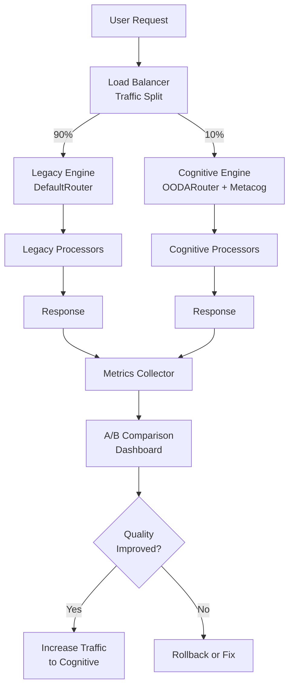

# 遷移策略與風險管理 (Migration Strategy)

## 文檔編號
`COGNITIVE-ARCH-09`

**版本**: 1.0.0
**最後更新**: 2026-02-12
**狀態**: 實施計劃

---

## 總覽

本文檔提供從當前架構向類人類認知架構遷移的詳細策略，包括風險評估、緩解措施、回滾計劃與驗證標準。

### 遷移原則

1. **零停機遷移 (Zero-Downtime Migration)**：新舊系統並行，平滑切換
2. **漸進式推進 (Incremental Rollout)**：從 5% 開始逐步擴大
3. **特性開關控制 (Feature Flag Driven)**：所有新功能都在開關後面
4. **完全可回滾 (Fully Reversible)**：任何時候都可以回退
5. **數據驅動決策 (Data-Driven Decisions)**：基於指標決定推進或回退

---

## 遷移架構

### 雙軌運行架構 (Dual-Track Architecture)



### Feature Flag 層次結構

```yaml
# config/feature_flags.yaml

cognitive:
  enabled: true  # 主開關

  global_workspace:
    enabled: true  # 全域工作空間
    capacity: 7    # 工作記憶容量
    decay_rate: 0.1

  metacognition:
    enabled: true  # 元認知治理
    quality_threshold: 0.7
    max_iterations: 3
    budget:
      max_tokens: 10000
      max_time_seconds: 300

  ooda_router:
    enabled: false  # OODA 路由（初期關閉）
    use_embeddings: false

  memory_systems:
    enabled: false  # 記憶系統（初期關閉）
    episodic_enabled: false
    semantic_enabled: false

  neuromodulation:
    enabled: false  # 神經調控（初期關閉）
    exploration_rate: 0.1

  event_driven:
    enabled: false  # 事件驅動（初期關閉）
    parallel_execution: false
```

---

## 遷移階段

### Stage 0: 準備階段（Week 1-2）

**目標**：建立遷移基礎設施

#### 0.1 Feature Flag 系統部署

```python
# src/core/feature_flags.py

import yaml
from typing import Any, Dict
from pathlib import Path

class FeatureFlagManager:
    """特性開關管理器"""

    _instance = None

    def __new__(cls):
        if cls._instance is None:
            cls._instance = super().__new__(cls)
            cls._instance._initialized = False
        return cls._instance

    def __init__(self):
        if self._initialized:
            return

        self.flags: Dict[str, Any] = {}
        self.reload()
        self._initialized = True

    def reload(self):
        """重新加載配置（支持熱更新）"""
        config_path = Path("config/feature_flags.yaml")
        with open(config_path) as f:
            self.flags = yaml.safe_load(f)

    def is_enabled(self, flag_path: str) -> bool:
        """
        檢查特性是否啟用

        Examples:
            is_enabled("cognitive.global_workspace")
            is_enabled("cognitive.metacognition.enabled")
        """
        keys = flag_path.split(".")
        value = self.flags

        for key in keys:
            if not isinstance(value, dict):
                return False
            value = value.get(key, False)

        return bool(value)

    def get(self, flag_path: str, default: Any = None) -> Any:
        """獲取特性配置值"""
        keys = flag_path.split(".")
        value = self.flags

        for key in keys:
            if not isinstance(value, dict):
                return default
            value = value.get(key, default)

        return value

# 全域單例
feature_flags = FeatureFlagManager()
```

#### 0.2 流量分割器

```python
# src/api/traffic_splitter.py

import random
from typing import Optional
from src.core.feature_flags import feature_flags

class TrafficSplitter:
    """流量分割器：控制新舊系統的流量比例"""

    def __init__(self):
        self.cognitive_traffic_ratio = 0.0  # 初始為 0%

    def should_use_cognitive_engine(
        self,
        user_id: Optional[str] = None,
        force: Optional[bool] = None
    ) -> bool:
        """
        決定是否使用認知引擎

        Args:
            user_id: 用戶ID（用於一致性哈希）
            force: 強制使用（用於測試）

        Returns:
            True if should use cognitive engine
        """
        # 強制模式
        if force is not None:
            return force

        # 檢查總開關
        if not feature_flags.is_enabled("cognitive.enabled"):
            return False

        # 一致性哈希（確保同一用戶總是使用同一系統）
        if user_id:
            hash_value = hash(user_id) % 100
            return hash_value < (self.cognitive_traffic_ratio * 100)

        # 隨機分配
        return random.random() < self.cognitive_traffic_ratio

    def set_traffic_ratio(self, ratio: float):
        """
        設置流量比例

        Args:
            ratio: 0.0 to 1.0
        """
        self.cognitive_traffic_ratio = max(0.0, min(1.0, ratio))
        logger.info(f"Cognitive traffic ratio set to {self.cognitive_traffic_ratio:.1%}")

# 全域單例
traffic_splitter = TrafficSplitter()
```

#### 0.3 A/B 測試框架

```python
# src/monitoring/ab_testing.py

from dataclasses import dataclass
from typing import List, Dict
from datetime import datetime, timedelta
import numpy as np

@dataclass
class VariantMetrics:
    """變體指標"""
    variant_name: str
    total_requests: int
    success_count: int
    avg_latency: float
    avg_confidence: float
    avg_user_rating: float
    error_rate: float

    @property
    def success_rate(self) -> float:
        return self.success_count / self.total_requests if self.total_requests > 0 else 0

class ABTestManager:
    """A/B 測試管理器"""

    def __init__(self):
        self.metrics: Dict[str, VariantMetrics] = {
            "legacy": VariantMetrics("legacy", 0, 0, 0.0, 0.0, 0.0, 0.0),
            "cognitive": VariantMetrics("cognitive", 0, 0, 0.0, 0.0, 0.0, 0.0)
        }

    def record_result(
        self,
        variant: str,
        success: bool,
        latency: float,
        confidence: float,
        user_rating: Optional[float] = None
    ):
        """記錄測試結果"""
        metrics = self.metrics[variant]

        metrics.total_requests += 1
        if success:
            metrics.success_count += 1

        # 移動平均
        alpha = 0.1  # 平滑係數
        metrics.avg_latency = (1 - alpha) * metrics.avg_latency + alpha * latency
        metrics.avg_confidence = (1 - alpha) * metrics.avg_confidence + alpha * confidence

        if user_rating:
            metrics.avg_user_rating = (1 - alpha) * metrics.avg_user_rating + alpha * user_rating

        metrics.error_rate = 1 - metrics.success_rate

    def compare_variants(self) -> Dict[str, Any]:
        """
        比較兩個變體

        Returns:
            比較報告
        """
        legacy = self.metrics["legacy"]
        cognitive = self.metrics["cognitive"]

        # 計算改進百分比
        def improvement(new_val, old_val):
            if old_val == 0:
                return 0.0
            return ((new_val - old_val) / old_val) * 100

        return {
            "success_rate": {
                "legacy": legacy.success_rate,
                "cognitive": cognitive.success_rate,
                "improvement": improvement(cognitive.success_rate, legacy.success_rate)
            },
            "latency": {
                "legacy": legacy.avg_latency,
                "cognitive": cognitive.avg_latency,
                "improvement": improvement(legacy.avg_latency, cognitive.avg_latency)  # 負值為好
            },
            "confidence": {
                "legacy": legacy.avg_confidence,
                "cognitive": cognitive.avg_confidence,
                "improvement": improvement(cognitive.avg_confidence, legacy.avg_confidence)
            },
            "user_rating": {
                "legacy": legacy.avg_user_rating,
                "cognitive": cognitive.avg_user_rating,
                "improvement": improvement(cognitive.avg_user_rating, legacy.avg_user_rating)
            },
            "recommendation": self._make_recommendation(legacy, cognitive)
        }

    def _make_recommendation(
        self,
        legacy: VariantMetrics,
        cognitive: VariantMetrics
    ) -> str:
        """
        基於數據給出推進建議

        決策樹：
        1. 如果認知引擎成功率 < 舊引擎 -5% → ROLLBACK
        2. 如果錯誤率 > 10% → ROLLBACK
        3. 如果成功率提升 >5% 且錯誤率 <5% → SCALE_UP
        4. 如果沒有顯著差異 → HOLD（需要更多數據）
        """
        if cognitive.total_requests < 100:
            return "HOLD - Need more data (min 100 requests)"

        # 致命問題：錯誤率過高
        if cognitive.error_rate > 0.1:
            return "ROLLBACK - Error rate too high"

        # 顯著退化
        if cognitive.success_rate < legacy.success_rate - 0.05:
            return "ROLLBACK - Success rate degraded"

        # 顯著提升
        if (
            cognitive.success_rate > legacy.success_rate + 0.05 and
            cognitive.error_rate < 0.05
        ):
            return "SCALE_UP - Significant improvement"

        # 輕微提升
        if cognitive.success_rate > legacy.success_rate + 0.02:
            return "SCALE_UP_SLOWLY - Minor improvement"

        # 沒有顯著差異
        return "HOLD - No significant difference"

# 全域單例
ab_test_manager = ABTestManager()
```

---

### Stage 1: 灰度發布（Week 3-16）

#### 1.1 流量分配時間表

| Week | 流量比例 | 驗證標準 | 動作 |
|------|---------|---------|------|
| 3-4 | 0% → 5% | Phase 1 完成，工作空間功能驗證 | 內部測試通過後開放 |
| 5-6 | 5% → 10% | Phase 2 完成，元認知功能驗證 | 錯誤率 <10% |
| 7-8 | 10% → 20% | Phase 3 完成，OODA 路由驗證 | 成功率提升 >5% |
| 9-10 | 20% → 30% | Phase 4 完成，記憶系統驗證 | 用戶滿意度提升 >10% |
| 11-12 | 30% → 50% | Phase 5 完成，神經調控驗證 | 無重大事故 |
| 13-14 | 50% → 70% | Phase 6 完成，事件驅動驗證 | 性能達標 |
| 15-16 | 70% → 100% | Phase 7 完成，全量上線 | 所有指標達標 |

#### 1.2 灰度控制腳本

```bash
#!/bin/bash
# scripts/set_cognitive_traffic.sh

RATIO=$1

if [ -z "$RATIO" ]; then
    echo "Usage: $0 <ratio>"
    echo "Example: $0 0.05  # Set to 5%"
    exit 1
fi

# 更新配置
curl -X POST http://admin-api/config/traffic-ratio \
    -H "Content-Type: application/json" \
    -d "{\"ratio\": $RATIO}"

echo "Cognitive traffic ratio set to $RATIO"

# 等待 1 分鐘觀察
sleep 60

# 檢查指標
curl http://admin-api/metrics/ab-comparison | jq .

echo "Monitor: http://grafana/dashboard/ab-testing"
```

---

### Stage 2: 組件遷移順序

#### 2.1 Processor 遷移優先級

**優先級 1（Week 3-4）**：
- ✅ SearchProcessor - 低風險，清晰的輸入輸出
- ✅ KnowledgeProcessor - 低風險，讀取型操作

**優先級 2（Week 5-6）**：
- ✅ ThinkingProcessor - 中風險，受益於元認知監控
- ✅ CodeProcessor - 中風險，需要品質保證

**優先級 3（Week 7-10）**：
- ✅ CustomProcessor - 高風險，用戶自定義邏輯

#### 2.2 單個 Processor 遷移模板

```python
# src/core/processors/search_processor.py

from src.core.feature_flags import feature_flags
from src.core.cognitive.global_workspace import GlobalWorkspace

class SearchProcessor:
    """Search Processor with cognitive workspace integration"""

    def __init__(self, workspace: Optional[GlobalWorkspace] = None):
        self.workspace = workspace
        self.tool = SearchTool()

    async def process(self, task: Task) -> ProcessingResult:
        """Process with optional workspace integration"""

        # 執行搜尋
        results = await self.tool.run(task.query)

        # 如果啟用工作空間，廣播結果
        if self.workspace and feature_flags.is_enabled("cognitive.global_workspace"):
            self._broadcast_to_workspace(results, task)

        return ProcessingResult(
            content=results,
            confidence=0.8,
            metadata={"processor": "SearchProcessor"}
        )

    def _broadcast_to_workspace(self, results: Any, task: Task):
        """廣播到工作空間（新功能）"""
        from src.core.cognitive.cognitive_item import CognitiveItem, ItemType

        item = CognitiveItem(
            id=f"search_{uuid.uuid4()}",
            type=ItemType.OBSERVATION,
            content=results,
            confidence=0.8,
            priority=0.7,
            timestamp=datetime.now(),
            source="SearchProcessor",
            tags=["search_result", "external_info"],
            metadata={"query": task.query}
        )

        self.workspace.post(item)
        logger.debug(f"Broadcasted search results to workspace: {item.id}")
```

#### 2.3 遷移驗證清單

每個 Processor 遷移後必須通過：

```python
# tests/migration/test_processor_migration.py

class TestSearchProcessorMigration:
    """驗證 SearchProcessor 遷移"""

    def test_backward_compatibility(self):
        """向後兼容性：關閉工作空間時行為與舊版一致"""
        feature_flags.disable("cognitive.global_workspace")

        processor = SearchProcessor()
        result = await processor.process(simple_task)

        # 與舊版 baseline 比較
        assert result.content == baseline_result.content

    def test_workspace_integration(self):
        """工作空間整合：啟用時正確廣播"""
        feature_flags.enable("cognitive.global_workspace")
        workspace = GlobalWorkspace()

        processor = SearchProcessor(workspace=workspace)
        result = await processor.process(simple_task)

        # 驗證廣播
        assert len(workspace.blackboard.items) > 0
        assert any(item.source == "SearchProcessor" for item in workspace.blackboard.items.values())

    def test_performance_overhead(self):
        """性能開銷：啟用工作空間後開銷 <10%"""
        baseline_time = measure_time(lambda: processor.process(task))

        feature_flags.enable("cognitive.global_workspace")
        cognitive_time = measure_time(lambda: processor.process(task))

        overhead = (cognitive_time - baseline_time) / baseline_time
        assert overhead < 0.1, f"Performance overhead too high: {overhead:.1%}"
```

---

## 風險管理

### 風險矩陣

| 風險 | 可能性 | 影響 | 等級 | 緩解措施 |
|-----|-------|------|------|---------|
| R1: 性能嚴重退化 | 中 | 高 | 🔴 高 | 性能測試閘門 + 自動回滾 |
| R2: 錯誤率上升 | 中 | 高 | 🔴 高 | A/B 測試 + 品質閘門 |
| R3: 內存洩漏 | 低 | 高 | 🟡 中 | 內存監控 + 定期重啟 |
| R4: 並發 bug（死鎖/競態） | 中 | 中 | 🟡 中 | 壓力測試 + 超時保護 |
| R5: 配置錯誤導致服務中斷 | 低 | 高 | 🟡 中 | 配置驗證 + 雙份部署 |
| R6: 學習曲線影響生產力 | 高 | 低 | 🟢 低 | 培訓 + 文檔 |

### 回滾觸發條件

**自動回滾**（無需人工干預）：
```python
# src/monitoring/auto_rollback.py

class AutoRollbackMonitor:
    """自動回滾監控器"""

    def __init__(self):
        self.thresholds = {
            "error_rate": 0.15,  # 15% 錯誤率
            "p95_latency": 30.0,  # 30s P95 延遲
            "memory_usage": 0.9,  # 90% 內存使用
            "cpu_usage": 0.9,     # 90% CPU 使用
        }

    def check_and_rollback(self) -> bool:
        """檢查指標並決定是否自動回滾"""
        current_metrics = metrics_collector.get_current()

        # 檢查每個閾值
        if current_metrics["error_rate"] > self.thresholds["error_rate"]:
            logger.critical("AUTO ROLLBACK: Error rate exceeded threshold")
            self._execute_rollback("error_rate_high")
            return True

        if current_metrics["p95_latency"] > self.thresholds["p95_latency"]:
            logger.critical("AUTO ROLLBACK: P95 latency exceeded threshold")
            self._execute_rollback("latency_high")
            return True

        # ... 其他檢查

        return False

    def _execute_rollback(self, reason: str):
        """執行回滾"""
        # 1. 禁用所有認知功能
        feature_flags.disable("cognitive.enabled")

        # 2. 將流量全部切換到舊系統
        traffic_splitter.set_traffic_ratio(0.0)

        # 3. 發送告警
        alert_manager.send_critical_alert(
            title="Auto Rollback Triggered",
            reason=reason,
            metrics=metrics_collector.get_current()
        )

        # 4. 記錄事件
        logger.critical(f"Auto rollback executed: {reason}")
```

**手動回滾**（需要人工判斷）：
- 用戶滿意度下降 >10%
- 出現未預期的行為模式
- 團隊反饋負面

### 回滾腳本

```bash
#!/bin/bash
# scripts/emergency_rollback.sh

echo "🚨 EMERGENCY ROLLBACK INITIATED"

# 1. 禁用所有認知功能
echo "Disabling cognitive features..."
kubectl set env deployment/openagent COGNITIVE_ENABLED=false

# 2. 切換流量到舊系統
echo "Switching traffic to legacy system..."
curl -X POST http://admin-api/config/traffic-ratio -d '{"ratio": 0.0}'

# 3. 重啟服務（確保配置生效）
echo "Restarting services..."
kubectl rollout restart deployment/openagent

# 4. 驗證
echo "Waiting for rollout..."
kubectl rollout status deployment/openagent

# 5. 檢查指標
echo "Checking metrics..."
sleep 30
curl http://admin-api/metrics/health | jq .

echo "✅ Rollback complete. Monitor: http://grafana/dashboard/health"
```

---

## 數據遷移

### 情節記憶數據遷移

```python
# scripts/migrate_episodic_memory.py

"""
將舊的 cache 數據遷移到新的情節記憶系統

從: Redis cache (key-value)
到: EpisodicMemory (結構化的 Episode)
"""

import asyncio
from src.core.memory.episodic_memory import EpisodicMemory, Episode
from src.legacy.cache import LegacyCache

async def migrate_cache_to_episodic():
    """遷移 cache 到情節記憶"""
    legacy_cache = LegacyCache()
    episodic_memory = EpisodicMemory()

    # 獲取所有 cache 條目
    cache_entries = legacy_cache.get_all()

    migrated_count = 0
    for entry in cache_entries:
        # 將 cache 條目轉換為 Episode
        episode = Episode(
            item=CognitiveItem(
                id=entry["id"],
                type=ItemType.OBSERVATION,
                content=entry["content"],
                confidence=0.7,  # 默認信心度
                priority=0.5,
                timestamp=entry["timestamp"],
                source="LegacyCache",
                tags=["migrated"],
                metadata={"original_key": entry["key"]}
            ),
            context={},
            timestamp=entry["timestamp"]
        )

        # 存儲到情節記憶
        episodic_memory.store(episode)
        migrated_count += 1

    print(f"✅ Migrated {migrated_count} cache entries to episodic memory")

if __name__ == "__main__":
    asyncio.run(migrate_cache_to_episodic())
```

---

## 驗證與測試

### 冒煙測試（Smoke Test）

每次部署後必須通過的最小測試集：

```python
# tests/smoke/test_cognitive_smoke.py

class TestCognitiveSmoke:
    """冒煙測試：確保基本功能可用"""

    def test_basic_request(self):
        """基本請求：系統可以響應"""
        response = client.post("/api/v1/process", json={
            "query": "What is 2+2?",
            "use_cognitive": True
        })

        assert response.status_code == 200
        assert "result" in response.json()

    def test_workspace_enabled(self):
        """工作空間啟用時正常工作"""
        feature_flags.enable("cognitive.global_workspace")

        response = client.post("/api/v1/process", json={
            "query": "Search for Python tutorials",
            "use_cognitive": True
        })

        assert response.status_code == 200
        # 檢查是否有工作空間活動
        workspace_metrics = metrics_collector.get_workspace_metrics()
        assert workspace_metrics["item_count"] > 0

    def test_metacog_enabled(self):
        """元認知啟用時正常工作"""
        feature_flags.enable("cognitive.metacognition")

        response = client.post("/api/v1/process", json={
            "query": "Explain quantum computing",
            "use_cognitive": True
        })

        assert response.status_code == 200
        result = response.json()["result"]
        assert "confidence" in result
        assert 0 <= result["confidence"] <= 1

    def test_rollback_works(self):
        """回滾機制可用"""
        # 禁用認知功能
        feature_flags.disable("cognitive.enabled")

        response = client.post("/api/v1/process", json={
            "query": "Test query",
            "use_cognitive": True
        })

        # 應該自動 fallback 到舊系統
        assert response.status_code == 200
        assert response.json()["engine"] == "legacy"
```

### 性能基準測試

```python
# tests/benchmarks/test_performance_regression.py

class TestPerformanceRegression:
    """性能回歸測試"""

    @pytest.mark.benchmark
    def test_latency_regression(self, baseline_metrics):
        """延遲不應回歸 >10%"""
        # 測試認知引擎
        cognitive_latency = benchmark(
            lambda: client.post("/api/v1/process", json={
                "query": "Sample query",
                "use_cognitive": True
            })
        )

        # 與基線比較
        baseline_latency = baseline_metrics["p95_latency"]
        regression = (cognitive_latency - baseline_latency) / baseline_latency

        assert regression < 0.1, f"Latency regression: {regression:.1%}"

    @pytest.mark.benchmark
    def test_token_usage_regression(self, baseline_metrics):
        """Token 使用量不應增加 >20%"""
        # ... 類似測試
```

---

## 監控與告警

### 關鍵指標儀表板

**Grafana Dashboard: Cognitive Architecture Migration**

```yaml
# config/grafana/dashboards/migration.json

{
  "dashboard": {
    "title": "Cognitive Architecture Migration",
    "panels": [
      {
        "title": "Traffic Split",
        "type": "gauge",
        "targets": [{
          "expr": "cognitive_traffic_ratio"
        }]
      },
      {
        "title": "Success Rate Comparison",
        "type": "graph",
        "targets": [
          {"expr": "rate(legacy_success_total[5m])", "legend": "Legacy"},
          {"expr": "rate(cognitive_success_total[5m])", "legend": "Cognitive"}
        ]
      },
      {
        "title": "P95 Latency Comparison",
        "type": "graph",
        "targets": [
          {"expr": "histogram_quantile(0.95, legacy_latency_bucket)", "legend": "Legacy"},
          {"expr": "histogram_quantile(0.95, cognitive_latency_bucket)", "legend": "Cognitive"}
        ]
      },
      {
        "title": "Error Rate",
        "type": "graph",
        "targets": [
          {"expr": "rate(legacy_errors_total[5m])", "legend": "Legacy"},
          {"expr": "rate(cognitive_errors_total[5m])", "legend": "Cognitive"}
        ]
      }
    ]
  }
}
```

### 告警規則

```yaml
# config/prometheus/alerts/cognitive_migration.yml

groups:
  - name: cognitive_migration
    rules:
      - alert: CognitiveErrorRateHigh
        expr: rate(cognitive_errors_total[5m]) > 0.1
        for: 5m
        labels:
          severity: critical
        annotations:
          summary: "Cognitive engine error rate too high"
          description: "Error rate: {{ $value | humanizePercentage }}"

      - alert: CognitiveLatencyHigh
        expr: histogram_quantile(0.95, cognitive_latency_bucket) > 30
        for: 5m
        labels:
          severity: warning
        annotations:
          summary: "Cognitive engine P95 latency too high"
          description: "P95 latency: {{ $value }}s"

      - alert: CognitiveSuccessRateLow
        expr: rate(cognitive_success_total[5m]) / rate(cognitive_requests_total[5m]) < 0.8
        for: 10m
        labels:
          severity: warning
        annotations:
          summary: "Cognitive engine success rate too low"
          description: "Success rate: {{ $value | humanizePercentage }}"
```

---

## 團隊培訓

### 培訓計劃

**Week 1: 架構概覽**
- 類人類認知架構的核心概念
- Global Workspace Theory
- Metacognition 原理
- 實機演示

**Week 2: 開發實踐**
- Feature Flag 使用
- 如何遷移 Processor
- 測試策略
- 實作練習

**Week 3: 運維實踐**
- 監控指標解讀
- 故障排除
- 回滾流程
- 演練

### 培訓材料

```
docs/training/
├── 01_architecture_overview.pdf
├── 02_development_guide.md
├── 03_operations_runbook.md
├── 04_troubleshooting.md
└── videos/
    ├── architecture_walkthrough.mp4
    └── hands_on_migration.mp4
```

---

## 成功標準

### 最終驗收標準

在完成 100% 流量切換前，必須滿足：

✅ **品質指標**
- 輸出信心分數 >0.8 佔比 ≥ 80%
- 品質閘門通過率 ≥ 90%
- 錯誤率 < 10%
- 用戶滿意度提升 ≥ 20%

✅ **性能指標**
- System 1 P95 延遲 < 3s
- System 2 P95 延遲 < 15s
- Token 使用量降低或持平（±5%）

✅ **穩定性指標**
- 無 P0/P1 事故
- 可用性 ≥ 99.9%
- 自動回滾機制驗證通過

✅ **運維指標**
- 監控覆蓋率 100%
- 告警及時性 < 5min
- 故障恢復時間 < 15min

---

## 時間表總覽

```
Week 1-2  ━━━━━━━━━━ Phase 0: 準備
Week 3-4  ━━━━━━━━━━ Phase 1: 工作空間 (5%)
Week 5-6  ━━━━━━━━━━ Phase 2: 元認知 (10%)
Week 7-8  ━━━━━━━━━━ Phase 3: OODA (20%)
Week 9-10 ━━━━━━━━━━ Phase 4: 記憶 (30%)
Week 11-12━━━━━━━━━━ Phase 5: 神經調控 (50%)
Week 13-14━━━━━━━━━━ Phase 6: 事件驅動 (70%)
Week 15-16━━━━━━━━━━ Phase 7: 全量上線 (100%)
```

---

## 下一步

- **[10_code_examples.md](./10_code_examples.md)**: 完整的程式碼範例
- **[00_overview_and_vision.md](./00_overview_and_vision.md)**: 返回總覽

---

**文檔維護者**: OpenAgent Architecture Team
**審核狀態**: Pending Review
