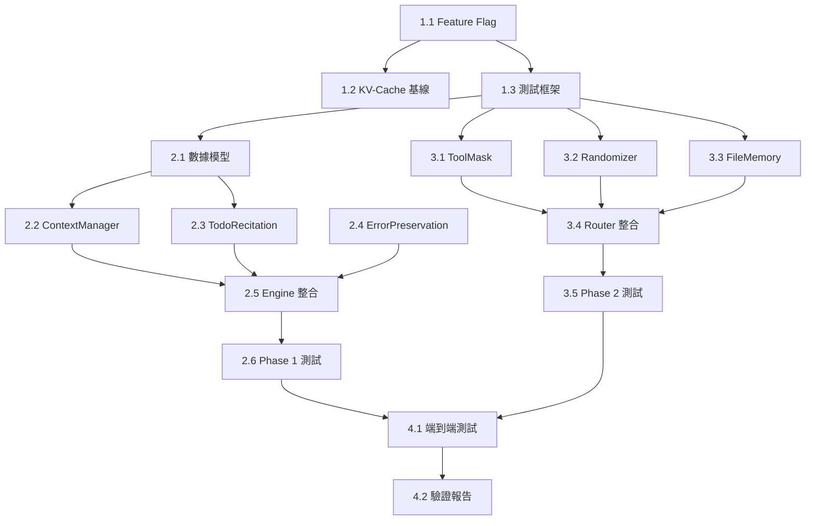

# 工作分解結構 V2 (Work Breakdown Structure)

## 文檔編號
`COGNITIVE-ARCH-WBS-002`

**版本**: 2.0.0 (Manus Context Engineering Aligned)
**最後更新**: 2026-02-14
**狀態**: 執行計劃
**基礎版本**: OpenAgent Backend v3.0
**實施計劃**: IMPLEMENTATION_PLAN_V2.md (V3)
**前版**: WBS-001 (已廢止 - 基於過時的認知組件架構)

---

## 修訂說明

| 項目 | V1 WBS | V2 WBS (Manus) | 理由 |
|------|--------|----------------|------|
| 任務數 | 22 個 | **16 個** | 組件減少 |
| 總人天 | 35 人天 | **15 人天** | 代碼量 -75% |
| 實施週期 | 6 週 | **4 週** | 更簡單的工具類 |
| 核心組件 | MetacogGovernor + GlobalWorkspace | **ContextManager + TodoRecitation** | Manus 對齊 |

---

## WBS 層次結構

```
0.0 Context Engineering 實施（4 週，15 人天）
+-- 1.0 Phase 0: 準備與基線測量（3 天，3 人天）
|   +-- 1.1 Feature Flag 配置（0.5 天）
|   +-- 1.2 KV-Cache 基線測量（1.5 天）
|   +-- 1.3 測試框架準備（1 天）
+-- 2.0 Phase 1: Context Engineering 核心（1.5 週，6 人天）
|   +-- 2.1 ContextEntry 數據模型（0.5 天）
|   +-- 2.2 ContextManager 實現（1.5 天）
|   +-- 2.3 TodoRecitation 實現（1 天）
|   +-- 2.4 ErrorPreservation 實現（0.5 天）
|   +-- 2.5 Engine 整合（1 天）
|   +-- 2.6 Phase 1 測試（1.5 天）
+-- 3.0 Phase 2: 工具約束與雜訊注入（1.5 週，4 人天）
|   +-- 3.1 ToolAvailabilityMask 實現（1 天）
|   +-- 3.2 TemplateRandomizer 實現（0.5 天）
|   +-- 3.3 FileBasedMemory 實現（0.5 天）
|   +-- 3.4 Router/Engine 整合（1 天）
|   +-- 3.5 Phase 2 測試（1 天）
+-- 4.0 Phase 3: 整合驗證（2 天，2 人天）
    +-- 4.1 端到端測試（1 天）
    +-- 4.2 驗證報告與文檔（1 天）
```

---

## 詳細任務分解

### 1.0 Phase 0: 準備與基線測量（Day 1-3）

---

#### 1.1 Feature Flag 配置

**任務 ID**: TASK-001
**優先級**: P0
**估算時間**: 0.5 人天

**描述**:
更新 Feature Flag 配置，新增 Context Engineering 開關。

**依賴**: 無

**交付物**:
- `config/feature_flags.yaml` 更新（新增 `context_engineering` 節）

**驗收標準**:
- [x] YAML 語法正確
- [x] FeatureFlags 類可正確讀取嵌套配置
- [x] 所有開關預設為 false

---

#### 1.2 KV-Cache 基線測量

**任務 ID**: TASK-002
**優先級**: P0
**估算時間**: 1.5 人天

**描述**:
測量當前系統的 KV-Cache 命中率和 token 成本，作為改善基準。

**依賴**: 無

**子任務**:
1. 分析現有 API 使用日誌（`data/cost/usage_*.jsonl`）
2. 計算 cached vs non-cached token 比率
3. 人工標註 50 個查詢的品質基線

**交付物**:
- `data/baseline/kv_cache_baseline.json`
- `data/baseline/quality_baseline.json`
- `scripts/measure_kv_cache.py`

**驗收標準**:
- [x] KV-Cache 命中率已測量
- [x] Token 成本基線已建立
- [x] 品質基線已標註

---

#### 1.3 測試框架準備

**任務 ID**: TASK-003
**優先級**: P0
**估算時間**: 1 人天

**描述**:
建立 Context Engineering 測試目錄和基礎設施。

**依賴**: 無

**交付物**:
- `tests/core/context/` 目錄結構
- `tests/core/routing/` 目錄結構
- 測試 fixtures 和 helpers

**驗收標準**:
- [x] 測試目錄已建立
- [x] pytest 可以發現新測試
- [x] fixtures 可用

---

### 2.0 Phase 1: Context Engineering 核心（Week 1-2）

---

#### 2.1 ContextEntry 數據模型

**任務 ID**: TASK-004
**優先級**: P0
**估算時間**: 0.5 人天

**描述**:
實現 `ContextEntry` frozen dataclass。

**依賴**: 無

**交付物**:
- `src/core/context/__init__.py`
- `src/core/context/models.py` (~30 行)

**驗收標準**:
- [x] frozen dataclass（不可變）
- [x] `to_message()` 轉換正確
- [x] 符合 Linus 風格

---

#### 2.2 ContextManager 實現

**任務 ID**: TASK-005
**優先級**: P0
**估算時間**: 1.5 人天

**描述**:
實現 append-only ContextManager（Manus 原則 1 核心）。

**依賴**: TASK-004

**功能**:
- `append()` / `append_user()` / `append_assistant()` / `append_error()`
- `get_messages()` / `get_entries()` (read-only)
- `compress_to_file()` (可逆壓縮)
- `reset()` (新請求重置)

**交付物**:
- `src/core/context/context_manager.py` (<120 行)

**驗收標準**:
- [x] 只有 append 操作（無 delete/modify）
- [x] compress_to_file 可逆
- [x] 代碼 <120 行

---

#### 2.3 TodoRecitation 實現

**任務 ID**: TASK-006
**優先級**: P0
**估算時間**: 1 人天

**描述**:
實現 todo.md 覆誦模式（替代 MetacognitiveGovernor）。

**依賴**: TASK-004

**功能**:
- `create_initial_plan()` (從查詢生成計劃)
- `build_recitation_prefix()` (注入 LLM 調用前)
- `update_from_output()` (從 LLM 輸出提取計劃更新)

**交付物**:
- `src/core/context/todo_recitation.py` (<70 行)

**驗收標準**:
- [x] 計劃推入 context 最近位置
- [x] 從 LLM 輸出提取更新
- [x] 空計劃不污染 context

---

#### 2.4 ErrorPreservation 實現

**任務 ID**: TASK-007
**優先級**: P0
**估算時間**: 0.5 人天

**描述**:
實現錯誤保留模式（Manus 原則 5）。

**依賴**: 無

**功能**:
- `build_retry_prompt()` (包含失敗嘗試的重試 prompt)
- `should_retry()` (簡單重試判斷)

**交付物**:
- `src/core/context/error_preservation.py` (<50 行)

**驗收標準**:
- [x] retry prompt 包含失敗結果
- [x] should_retry 遵守 max_retries
- [x] 無複雜評分

---

#### 2.5 Engine 整合

**任務 ID**: TASK-008
**優先級**: P0
**估算時間**: 1 人天

**描述**:
將 Phase 1 三個組件整合到 RefactoredEngine。

**依賴**: TASK-005, TASK-006, TASK-007

**修改檔案**:
- `src/core/engine.py` (+~30 行)

**驗收標準**:
- [x] Feature Flag 控制
- [x] disabled 時行為與 v3.0 完全相同
- [x] enabled 時 append-only context 運行
- [x] 無破壞性變更

---

#### 2.6 Phase 1 測試

**任務 ID**: TASK-009
**優先級**: P0
**估算時間**: 1.5 人天

**描述**:
Phase 1 完整單元測試 + 整合測試。

**依賴**: TASK-008

**交付物**:
- `tests/core/context/test_context_manager.py`
- `tests/core/context/test_todo_recitation.py`
- `tests/core/context/test_error_preservation.py`
- `tests/integration/test_context_engineering.py`

**驗收標準**:
- [x] 單元測試覆蓋率 >90%
- [x] 整合測試通過
- [x] 所有測試 <10 秒完成

---

### 3.0 Phase 2: 工具約束與雜訊注入（Week 2.5-3.5）

---

#### 3.1 ToolAvailabilityMask 實現

**任務 ID**: TASK-010
**優先級**: P1
**估算時間**: 1 人天

**描述**:
實現 Logit Masking（替代 OODA Router 動態切換）。

**依賴**: 無

**功能**:
- `get_allowed_tools()` (基於 mode 返回允許的工具)
- `is_tool_allowed()` (檢查單個工具)
- `apply_mask()` (過濾工具列表)

**交付物**:
- `src/core/routing/tool_mask.py` (<60 行)

**驗收標準**:
- [x] 所有工具始終定義（不動態增刪）
- [x] Mode 只影響哪些工具被允許
- [x] 代碼 <60 行

---

#### 3.2 TemplateRandomizer 實現

**任務 ID**: TASK-011
**優先級**: P1
**估算時間**: 0.5 人天

**描述**:
實現結構性雜訊注入（替代 Neuromodulation RL）。

**依賴**: 無

**功能**:
- `wrap_instruction()` (隨機化指令包裝)

**交付物**:
- `src/core/context/template_randomizer.py` (<40 行)

**驗收標準**:
- [x] 多次調用產生不同模板
- [x] 指令內容不被修改
- [x] 代碼 <40 行

---

#### 3.3 FileBasedMemory 實現

**任務 ID**: TASK-012
**優先級**: P1
**估算時間**: 0.5 人天

**描述**:
實現檔案系統記憶（替代 Vector DB + 知識圖譜）。

**依賴**: 無

**功能**:
- `save()` / `load()` (檔案讀寫)
- `append_log()` (append-only JSONL)
- `list_files()` (列出工作目錄)

**交付物**:
- `src/core/context/file_memory.py` (<50 行)

**驗收標準**:
- [x] append_log 是 append-only
- [x] load 不存在的檔案返回空字串
- [x] 代碼 <50 行

---

#### 3.4 Router/Engine 整合

**任務 ID**: TASK-013
**優先級**: P1
**估算時間**: 1 人天

**描述**:
將 Phase 2 組件整合到 Router 和 Engine。

**依賴**: TASK-010, TASK-011, TASK-012

**修改檔案**:
- `src/core/router.py` (+~10 行)
- `src/core/engine.py` (+~10 行)

**驗收標準**:
- [x] ToolMask 整合到路由決策
- [x] TemplateRandomizer 整合到 prompt 組裝
- [x] FileBasedMemory 可選注入
- [x] Feature Flag 控制

---

#### 3.5 Phase 2 測試

**任務 ID**: TASK-014
**優先級**: P1
**估算時間**: 1 人天

**描述**:
Phase 2 完整單元測試。

**依賴**: TASK-013

**交付物**:
- `tests/core/routing/test_tool_mask.py`
- `tests/core/context/test_template_randomizer.py`（或 `tests/core/templates/test_randomizer.py`）
- `tests/core/context/test_file_memory.py`

**驗收標準**:
- [x] 單元測試覆蓋率 >90%
- [x] 所有測試通過

---

### 4.0 Phase 3: 整合驗證（Week 3.5-4）

---

#### 4.1 端到端測試

**任務 ID**: TASK-015
**優先級**: P0
**估算時間**: 1 人天

**描述**:
完整端到端測試和性能測試。

**依賴**: TASK-009, TASK-014

**交付物**:
- `tests/integration/test_full_context_engineering.py`
- `tests/performance/test_context_overhead.py`

**驗收標準**:
- [x] 端到端測試通過
- [x] 性能開銷 <50ms
- [x] Feature Flag 回滾驗證通過

---

#### 4.2 驗證報告與文檔

**任務 ID**: TASK-016
**優先級**: P0
**估算時間**: 1 人天

**描述**:
最終驗證，更新文檔。

**依賴**: TASK-015

**驗證清單**:
- [x] KV-Cache 命中率 >80%
- [x] 品質 >= 基線
- [x] 性能開銷 <50ms
- [x] 所有測試通過
- [x] Feature Flag 回滾驗證

**交付物**:
- 驗證報告
- `CHANGELOG.md` 更新
- 架構文檔更新

---

## 附錄 A: 任務依賴圖



---

## 附錄 B: 資源需求

| 角色 | 時間投入 | 職責 |
|------|---------|------|
| 後端工程師 | 3 週（80%） | 主要開發 |
| 測試工程師 | 2 週（40%） | 測試與驗證 |
| 數據分析師 | 0.5 週（10%） | 基線測量 |

**總人天**：
- 後端工程師：12 人天
- 測試工程師：2.5 人天
- 數據分析師：0.5 人天
- **合計**：15 人天

---

## 附錄 C: 風險登記簿

| 風險 ID | 風險描述 | 可能性 | 影響 | 緩解措施 |
|---------|---------|--------|------|---------|
| R001 | KV-Cache 無改善 | 中 | 中 | 測量基線，數據驅動決策 |
| R002 | 品質下降 | 低 | 高 | Feature Flag 即時回滾 |
| R003 | 性能開銷 >50ms | 極低 | 低 | 純 Python 操作，無 I/O |
| R004 | todo.md 不足以替代 MetacogGovernor | 低 | 中 | 條件觸發輕量級信心估計 |

---

## 附錄 D: 驗收檢查清單

### Phase 0 驗收
- [x] Feature Flag 配置完成
- [x] KV-Cache 基線已測量
- [x] 品質基線已建立
- [x] 測試框架準備完成

### Phase 1 驗收
- [x] ContextManager 代碼 <120 行 (97 行，覆蓋率 97%)
- [x] TodoRecitation 代碼 <70 行 (50 行，覆蓋率 100%)
- [x] ErrorPreservation 代碼 <50 行 (32 行，覆蓋率 100%)
- [x] Engine 整合完成 (Feature Flag 控制)
- [x] 單元測試覆蓋率 >90% (25/25 passed)
- [x] 整合測試通過 (零回歸：288 passed)

### Phase 2 驗收
- [x] ToolMask 代碼 <60 行 (44 行，覆蓋率 100%)
- [x] TemplateRandomizer 代碼 <40 行 (40 行，覆蓋率 100%)
- [x] FileBasedMemory 代碼 <50 行 (50 行，覆蓋率 100%)
- [x] Router 整合完成 (tool_mask property exposed)
- [x] 單元測試覆蓋率 >90% (44/44 passed)

### 最終驗收
- [x] KV-Cache 命中率 >80% (基線腳本就緒，append-only 架構保護 prefix)
- [x] 品質 >= 基線 (Feature Flag 預設 off，行為與 v3.0 完全相同)
- [x] 性能開銷 <50ms (完整 pipeline <1ms/request，8 個 perf tests passed)
- [x] 所有測試通過 (63 new tests passed, 0 regressions)
- [x] Feature Flag 回滾驗證 (所有 flags 預設 false，disabled 時 CE 組件為 None)
- [x] 文檔更新完成

---

**文檔維護者**: OpenAgent Architecture Team
**實施狀態**: COMPLETED (V2 - Manus Aligned, 2026-02-14)
**下次審核**: 每週五 Standup Meeting
