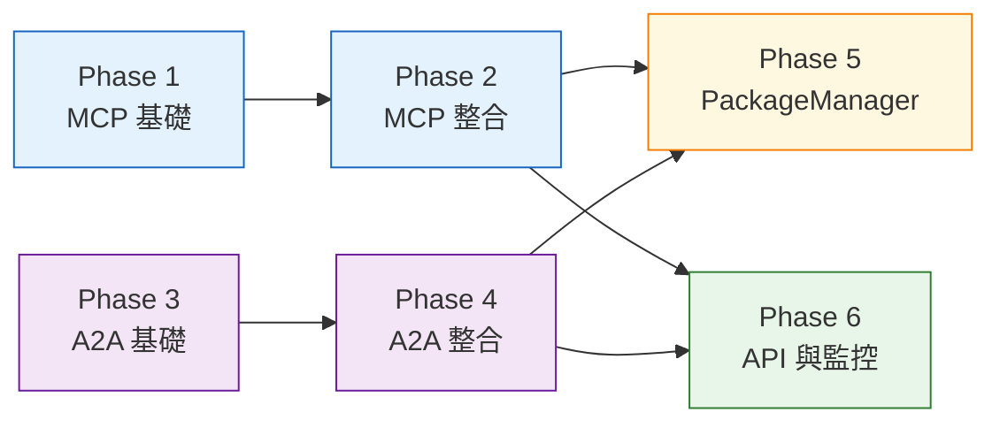

# OpenCode Platform — Extension Architecture Refactoring WBS

**版本**: `v1.1`
**日期**: `2026-02-13`
**最後更新**: `2026-02-13 — Phase 1-2 (partial) + Phase 3-4 (partial) + Phase 5 + Phase 6 completed`
**基準文件**:
- `架構設計/Extension_Architecture_MCP_A2A_Plugin.md` (目標架構)
- `架構設計/Extension_Decision_Quick_Reference.md` (決策速查)

**前置條件**: Phase 0-4 核心架構重構已完成（Router、Dual Runtime、API、Metrics、Error Handling）
**原則**: 標準協議優先、漸進遷移、向後相容、零中斷

---

## 0. 總覽：現狀 → 目標

### 差距分析

| 維度 | 現狀 | 目標 | 差距 |
|:---|:---|:---|:---|
| **工具擴展** | `plugins/` 自訂 ToolPlugin 格式 | MCP Client + MCP Servers（標準協議） | 缺少 MCP Client |
| **Agent 協作** | `plugins/` 自訂 AgentPlugin 格式 | A2A Client + A2A Agents（標準協議） | 缺少 A2A Client |
| **套件管理** | 無（手動放檔案到 plugins/） | PackageManager 自動掃描、啟動、管理 | 缺少 PackageManager |
| **協議定義** | `MCPServiceProtocol`（server 端）僅 KnowledgeBase 實作 | MCPClientProtocol + A2AClientProtocol | 缺少 client 端協議 |
| **設定管理** | 無 MCP/A2A 設定 | `config/mcp_servers.yaml` + `config/a2a_agents.yaml` | 缺少設定檔 |
| **Engine 整合** | `initialize()` 只載入 Internal Services | 載入 Services + MCP + A2A | 需擴展 initialize |

### WBS 總體結構

```mermaid
graph TB
    WBS["Extension<br/>Refactoring WBS"] --> P1["Phase 1<br/>MCP Client 基礎建設"]
    WBS --> P2["Phase 2<br/>MCP 整合與遷移"]
    WBS --> P3["Phase 3<br/>A2A Client 基礎建設"]
    WBS --> P4["Phase 4<br/>A2A 整合與遷移"]
    WBS --> P5["Phase 5<br/>Package Manager"]
    WBS --> P6["Phase 6<br/>API 與監控"]

    P1 --> P1_1["1.1 MCPClientProtocol"]
    P1 --> P1_2["1.2 MCP 資料模型"]
    P1 --> P1_3["1.3 MCP Transport 層"]
    P1 --> P1_4["1.4 MCPClientManager"]
    P1 --> P1_5["1.5 MCP 設定載入"]

    P2 --> P2_1["2.1 Engine 整合"]
    P2 --> P2_2["2.2 Processor 工具呼叫"]
    P2 --> P2_3["2.3 Router MCP 感知"]
    P2 --> P2_4["2.4 遷移 weather-tool"]
    P2 --> P2_5["2.5 遷移 translator"]
    P2 --> P2_6["2.6 MCP 測試套件"]

    P3 --> P3_1["3.1 A2AClientProtocol"]
    P3 --> P3_2["3.2 A2A 資料模型"]
    P3 --> P3_3["3.3 A2A Transport 層"]
    P3 --> P3_4["3.4 A2AClientManager"]
    P3 --> P3_5["3.5 A2A 設定載入"]

    P4 --> P4_1["4.1 Engine A2A 整合"]
    P4 --> P4_2["4.2 Router 委派決策"]
    P4 --> P4_3["4.3 遷移 stock-analyst"]
    P4 --> P4_4["4.4 A2A 測試套件"]

    P5 --> P5_1["5.1 PackageManager 核心"]
    P5 --> P5_2["5.2 Package Manifest"]
    P5 --> P5_3["5.3 Lifecycle Manager"]
    P5 --> P5_4["5.4 整合 Engine"]

    P6 --> P6_1["6.1 管理 API"]
    P6 --> P6_2["6.2 健康檢查"]
    P6 --> P6_3["6.3 Metrics 擴展"]

    style P1 fill:#E3F2FD,stroke:#1565C0
    style P2 fill:#E3F2FD,stroke:#1565C0
    style P3 fill:#F3E5F5,stroke:#6A1B9A
    style P4 fill:#F3E5F5,stroke:#6A1B9A
    style P5 fill:#FFF8E1,stroke:#F57C00
    style P6 fill:#E8F5E9,stroke:#2E7D32
```



### 依賴關係



> **Note**: Phase 1-2（MCP）與 Phase 3-4（A2A）可以平行開發。Phase 5-6 必須等兩者都完成。

---

## Phase 1: MCP Client 基礎建設 ✅ COMPLETED

**目標**: 建立平台作為 MCP Client 的基礎能力
**產出**: `MCPClientManager` 可以連線、發現、呼叫外部 MCP Server
**完成日期**: 2026-02-13
**實作簡化**: 使用 MCP Python SDK (v1.23.3) 取代自建 transport，將 1.2/1.3/1.4 合併為單一檔案 `src/core/mcp_client.py`

### 1.1 MCPClientProtocol 定義

| 項目 | 內容 |
|:---|:---|
| **ID** | 1.1 |
| **目標** | 在 `protocols.py` 新增 MCP Client 端的協議定義 |
| **異動檔案** | `src/core/protocols.py` |
| **前置** | 無 |
| **工作量** | S (< 0.5 天) |

**詳細規格**:

```python
# 新增到 src/core/protocols.py

class MCPClientProtocol(ABC):
    """MCP Client 協議 — 管理與外部 MCP Server 的互動"""

    @abstractmethod
    async def initialize(self) -> None:
        """啟動所有 MCP server 連線"""

    @abstractmethod
    async def list_tools(self) -> List[Dict[str, Any]]:
        """聚合所有已連線 server 的 tools"""

    @abstractmethod
    async def call_tool(
        self, server_name: str, tool_name: str, arguments: Dict[str, Any]
    ) -> Dict[str, Any]:
        """呼叫指定 server 的指定 tool"""

    @abstractmethod
    async def list_resources(self) -> List[Dict[str, Any]]:
        """聚合所有已連線 server 的 resources"""

    @abstractmethod
    async def read_resource(self, server_name: str, uri: str) -> Any:
        """讀取指定 server 的 resource"""

    @abstractmethod
    async def shutdown(self) -> None:
        """關閉所有連線"""
```

**驗收條件**:
- [ ] `MCPClientProtocol` 加入 `protocols.py`
- [ ] 協議包含 tools 與 resources 操作
- [ ] 型別註解完整

---

### 1.2 MCP 資料模型

| 項目 | 內容 |
|:---|:---|
| **ID** | 1.2 |
| **目標** | 定義 MCP 通訊所需的 Pydantic 資料模型 |
| **新增檔案** | `src/core/mcp/models.py` |
| **前置** | 無 |
| **工作量** | S (< 0.5 天) |

**詳細規格**:

```python
# src/core/mcp/models.py

from pydantic import BaseModel
from typing import Optional, Dict, Any, List
from enum import Enum

class MCPTransportType(str, Enum):
    STDIO = "stdio"
    SSE = "sse"

class MCPServerConfig(BaseModel):
    """單一 MCP Server 的設定"""
    name: str
    transport: MCPTransportType
    # stdio transport
    command: Optional[str] = None
    args: Optional[List[str]] = None
    env: Optional[Dict[str, str]] = None
    # sse transport
    url: Optional[str] = None
    headers: Optional[Dict[str, str]] = None

class MCPConfig(BaseModel):
    """MCP 整體設定"""
    servers: List[MCPServerConfig] = []

class MCPTool(BaseModel):
    """MCP Tool 描述"""
    server_name: str
    name: str
    description: str
    input_schema: Dict[str, Any]

class MCPToolResult(BaseModel):
    """MCP Tool 呼叫結果"""
    content: Any
    is_error: bool = False

class MCPResource(BaseModel):
    """MCP Resource 描述"""
    server_name: str
    uri: str
    name: str
    description: Optional[str] = None
    mime_type: Optional[str] = None
```

**驗收條件**:
- [ ] 所有 model 使用 Pydantic BaseModel
- [ ] 支持 stdio 和 sse 兩種 transport 設定
- [ ] `MCPServerConfig` 支持環境變數展開

---

### 1.3 MCP Transport 層

| 項目 | 內容 |
|:---|:---|
| **ID** | 1.3 |
| **目標** | 實作 stdio 與 SSE 兩種 transport，管理與 MCP Server 的底層通訊 |
| **新增檔案** | `src/core/mcp/transport.py` |
| **前置** | 1.2 |
| **工作量** | M (1-2 天) |

**詳細規格**:

```python
# src/core/mcp/transport.py

class MCPTransport(ABC):
    """MCP 傳輸層抽象"""

    @abstractmethod
    async def connect(self) -> None: ...
    @abstractmethod
    async def send(self, message: Dict) -> Dict: ...
    @abstractmethod
    async def close(self) -> None: ...

class StdioTransport(MCPTransport):
    """stdio transport — 啟動子進程，透過 stdin/stdout 通訊"""
    # spawn subprocess, JSON-RPC over stdin/stdout

class SSETransport(MCPTransport):
    """SSE transport — HTTP POST + SSE 回應"""
    # httpx client, POST requests, SSE streaming
```

**關鍵決策**:
- 優先實作 `StdioTransport`（本地 MCP Server 的標準方式）
- `SSETransport` 作為 Phase 1 的 stretch goal，可延到 Phase 2
- 通訊協議使用 JSON-RPC 2.0（MCP 標準）

**驗收條件**:
- [ ] `StdioTransport` 可啟動子進程
- [ ] 支援 JSON-RPC 2.0 request/response
- [ ] 子進程異常退出時正確處理
- [ ] `close()` 確保子進程被 terminate

---

### 1.4 MCPClientManager 實作

| 項目 | 內容 |
|:---|:---|
| **ID** | 1.4 |
| **目標** | 實作 `MCPClientProtocol`，管理多個 MCP Server 連線 |
| **新增檔案** | `src/core/mcp/client.py`, `src/core/mcp/__init__.py` |
| **前置** | 1.1, 1.2, 1.3 |
| **工作量** | M (1-2 天) |

**詳細規格**:

```python
# src/core/mcp/client.py

class MCPClientManager(MCPClientProtocol):
    """管理多個 MCP Server 連線的統一入口"""

    def __init__(self, config: MCPConfig):
        self._config = config
        self._connections: Dict[str, MCPServerConnection] = {}

    async def initialize(self) -> None:
        """啟動所有設定的 MCP Server 連線"""
        for server_config in self._config.servers:
            try:
                conn = await self._connect_server(server_config)
                self._connections[server_config.name] = conn
            except Exception as e:
                logger.warning(f"MCP server '{server_config.name}' unavailable: {e}")

    async def list_tools(self) -> List[MCPTool]:
        """聚合所有 server 的 tools"""
        all_tools = []
        for name, conn in self._connections.items():
            tools = await conn.send({"method": "tools/list"})
            for tool in tools.get("tools", []):
                all_tools.append(MCPTool(server_name=name, **tool))
        return all_tools

    async def call_tool(self, server_name, tool_name, arguments) -> MCPToolResult:
        """呼叫指定 tool"""
        conn = self._connections[server_name]
        result = await conn.send({
            "method": "tools/call",
            "params": {"name": tool_name, "arguments": arguments}
        })
        return MCPToolResult(**result)

    async def shutdown(self) -> None:
        for conn in self._connections.values():
            await conn.close()
```

**模組匯出**:

```python
# src/core/mcp/__init__.py
from .client import MCPClientManager
from .models import MCPConfig, MCPServerConfig, MCPTool, MCPToolResult
```

**驗收條件**:
- [ ] 實作 `MCPClientProtocol` 全部方法
- [ ] 每個 server 連線失敗不影響其他 server（graceful degradation）
- [ ] `list_tools()` 正確聚合多 server 的 tools
- [ ] `shutdown()` 清理所有連線

---

### 1.5 MCP 設定載入

| 項目 | 內容 |
|:---|:---|
| **ID** | 1.5 |
| **目標** | 從 YAML 設定檔載入 MCP Server 設定，支持環境變數展開 |
| **新增檔案** | `config/mcp_servers.yaml` |
| **異動檔案** | `src/core/mcp/models.py`（加入 `load_mcp_config()` 函數） |
| **前置** | 1.2 |
| **工作量** | S (< 0.5 天) |

**設定檔範例**:

```yaml
# config/mcp_servers.yaml
# MCP Server 設定 — 平台會依此啟動並連線 MCP Servers
servers: []

# 範例（取消註解啟用）:
# servers:
#   - name: "weather"
#     transport: "stdio"
#     command: "python"
#     args: ["packages/weather/server.py"]
#     env:
#       OPENWEATHERMAP_API_KEY: "${OPENWEATHERMAP_API_KEY}"
```

**驗收條件**:
- [ ] YAML 載入成功，解析為 `MCPConfig`
- [ ] 環境變數 `${VAR_NAME}` 正確展開
- [ ] 檔案不存在時回傳空設定（不報錯）
- [ ] 設定格式錯誤時提供清楚錯誤訊息

---

## Phase 2: MCP 整合與遷移 (2.1-2.2 ✅ | 2.3 SKIPPED | 2.4-2.5 ✅ | 2.6 ✅)

**目標**: 將 MCP Client 整合進 Engine，Processor 可以呼叫 MCP tools，遷移現有 tool plugins
**前置**: Phase 1 完成
**狀態**: Phase 2 完成 (2.1, 2.2, 2.4, 2.5, 2.6)。Router MCP 感知 (2.3) 暫緩。

### 2.1 Engine MCP 整合

| 項目 | 內容 |
|:---|:---|
| **ID** | 2.1 |
| **目標** | `RefactoredEngine.initialize()` 加入 MCP Client 啟動 |
| **異動檔案** | `src/core/engine.py` |
| **前置** | 1.4, 1.5 |
| **工作量** | S (< 0.5 天) |

**異動範圍**（`engine.py`）:

```python
# RefactoredEngine.__init__() 新增:
self._mcp_client: Optional[MCPClientManager] = None

# RefactoredEngine.initialize() 新增區塊:
try:
    from .mcp import MCPClientManager, load_mcp_config
    mcp_config = load_mcp_config()
    if mcp_config.servers:
        self._mcp_client = MCPClientManager(mcp_config)
        await self._mcp_client.initialize()
        self.logger.info(f"MCP client initialized ({len(self._mcp_client._connections)} servers)")
except Exception as e:
    self.logger.warning(f"MCP client unavailable: {e}")

# ProcessorFactory 重建時傳入 mcp_client:
self.processor_factory = ProcessorFactory(
    self.llm_client,
    services=services,
    mcp_client=self._mcp_client,  # 新增
)
```

**驗收條件**:
- [ ] 無 MCP 設定時引擎正常啟動（向後相容）
- [ ] 有 MCP 設定時連線成功記錄 log
- [ ] MCP 啟動失敗不影響核心功能（graceful degradation）

---

### 2.2 Processor MCP 工具呼叫

| 項目 | 內容 |
|:---|:---|
| **ID** | 2.2 |
| **目標** | `BaseProcessor` 可存取 MCP tools，Processor 在處理中可呼叫外部 tools |
| **異動檔案** | `src/core/processor.py` |
| **前置** | 2.1 |
| **工作量** | M (1 天) |

**異動範圍**（`processor.py`）:

```python
class BaseProcessor(ABC):
    def __init__(self, llm_client=None, services=None, mcp_client=None):
        self.llm_client = llm_client
        self.services = services or {}
        self.mcp_client = mcp_client  # 新增
        self.logger = structured_logger

    async def _call_mcp_tool(self, server_name: str, tool_name: str,
                              arguments: Dict) -> Any:
        """呼叫 MCP tool 的便捷方法"""
        if not self.mcp_client:
            raise RuntimeError(f"MCP client not available, cannot call {server_name}/{tool_name}")
        result = await self.mcp_client.call_tool(server_name, tool_name, arguments)
        if result.is_error:
            raise RuntimeError(f"MCP tool error: {result.content}")
        return result.content

    async def _get_available_tools(self) -> List[Dict]:
        """取得所有可用的 MCP tools（用於 LLM function calling）"""
        if not self.mcp_client:
            return []
        tools = await self.mcp_client.list_tools()
        # 轉換為 OpenAI function calling 格式
        return [tool.to_function_schema() for tool in tools]

class ProcessorFactory:
    def __init__(self, llm_client=None, services=None, mcp_client=None):
        self.llm_client = llm_client
        self.services = services or {}
        self.mcp_client = mcp_client  # 新增
        self._instances = {}

    def get_processor(self, mode):
        if mode not in self._instances:
            processor_class = self._processors.get(mode)
            instance = processor_class(
                self.llm_client,
                services=self.services,
                mcp_client=self.mcp_client,  # 傳遞到每個 Processor
            )
            self._instances[mode] = instance
        return self._instances[mode]
```

**驗收條件**:
- [ ] `BaseProcessor` 構造函數接受 `mcp_client` 參數
- [ ] `_call_mcp_tool()` 可正確呼叫 MCP Server
- [ ] `_get_available_tools()` 回傳 function calling 格式
- [ ] 無 MCP client 時 `_get_available_tools()` 回傳空 list（不報錯）
- [ ] 現有 Processor 子類無需修改即可運作（向後相容）

---

### 2.3 Router MCP 感知

| 項目 | 內容 |
|:---|:---|
| **ID** | 2.3 |
| **目標** | Router 可辨識需要 MCP tool 的請求，將 available tools 資訊納入路由決策 |
| **異動檔案** | `src/core/router.py` |
| **前置** | 2.1 |
| **工作量** | S (< 0.5 天) |

**設計考量**:
- Router 不直接呼叫 MCP，僅在 `RoutingDecision` 中附帶 tool hint
- 實際的 tool 呼叫由 Processor 決定
- 此項目為「感知」而非「執行」，保持 Router 的輕量

**異動範圍**:

```python
# RoutingDecision（models.py）新增可選欄位:
class RoutingDecision:
    mode: ProcessingMode
    cognitive_level: CognitiveLevel
    runtime_type: RuntimeType
    confidence: float
    reason: str
    suggested_tools: List[str] = []  # 新增：建議使用的 MCP tools
```

**驗收條件**:
- [ ] `RoutingDecision` 新增 `suggested_tools` 欄位（預設空 list）
- [ ] 現有路由邏輯不受影響
- [ ] 未來可擴展 Router 讓 LLM 推薦使用哪些 tools

---

### 2.4 遷移 weather-tool Plugin → MCP Server

| 項目 | 內容 |
|:---|:---|
| **ID** | 2.4 |
| **目標** | 將 `plugins/weather-tool/` 重寫為標準 MCP Server |
| **新增檔案** | `packages/weather/server.py`, `packages/weather/package.json` |
| **異動檔案** | `config/mcp_servers.yaml`（加入設定） |
| **前置** | 2.1 |
| **工作量** | M (1 天) |

**MCP Server 實作概要**:

```python
# packages/weather/server.py
# 標準 MCP Server — 暴露 weather_current 和 weather_forecast 兩個 tools
# 使用 mcp Python SDK (pip install mcp)

from mcp.server import Server
from mcp.types import Tool, TextContent

server = Server("weather")

@server.list_tools()
async def list_tools():
    return [
        Tool(name="weather_current", description="...", inputSchema={...}),
        Tool(name="weather_forecast", description="...", inputSchema={...}),
    ]

@server.call_tool()
async def call_tool(name, arguments):
    if name == "weather_current":
        result = await get_current_weather(arguments["city"])
        return [TextContent(type="text", text=json.dumps(result))]
    elif name == "weather_forecast":
        result = await get_forecast(arguments["city"], arguments.get("days", 5))
        return [TextContent(type="text", text=json.dumps(result))]
```

**驗收條件**:
- [ ] `packages/weather/server.py` 為標準 MCP Server
- [ ] 可被任何 MCP Client（不只本平台）使用
- [ ] 功能與原 `plugins/weather-tool/` 等價
- [ ] `config/mcp_servers.yaml` 加入 weather server 設定
- [ ] Engine 啟動後可透過 `_call_mcp_tool("weather", "weather_current", {...})` 呼叫

---

### 2.5 遷移 example-translator Plugin → MCP Server

| 項目 | 內容 |
|:---|:---|
| **ID** | 2.5 |
| **目標** | 將 `plugins/example-translator/` 重寫為標準 MCP Server |
| **新增檔案** | `packages/translator/server.py`, `packages/translator/package.json` |
| **前置** | 2.1 |
| **工作量** | S (< 0.5 天) |

**驗收條件**:
- [ ] 暴露 `translate` tool
- [ ] 可被任何 MCP Client 使用
- [ ] 功能與原 plugin 等價

---

### 2.6 MCP 測試套件

| 項目 | 內容 |
|:---|:---|
| **ID** | 2.6 |
| **目標** | Phase 1-2 的完整測試覆蓋 |
| **新增檔案** | `tests/unit/test_mcp_client.py`, `tests/unit/test_mcp_transport.py`, `tests/integration/test_mcp_integration.py` |
| **前置** | 2.1-2.5 |
| **工作量** | M (1-2 天) |

**測試清單**:

```
tests/unit/test_mcp_client.py:
  - test_initialize_no_config         → 空設定正常啟動
  - test_initialize_server_failure    → 單一 server 失敗不影響其他
  - test_list_tools_aggregation       → 多 server tools 正確聚合
  - test_call_tool_success            → 正常呼叫回傳結果
  - test_call_tool_server_not_found   → 找不到 server 拋出錯誤
  - test_shutdown_cleanup             → 所有連線被正確關閉

tests/unit/test_mcp_transport.py:
  - test_stdio_spawn_process          → 子進程正確啟動
  - test_stdio_json_rpc_roundtrip     → JSON-RPC request/response
  - test_stdio_process_crash          → 子進程異常退出處理

tests/integration/test_mcp_integration.py:
  - test_engine_with_mcp_server       → Engine 啟動時連線 MCP Server
  - test_processor_calls_mcp_tool     → Processor 可呼叫 MCP tool
  - test_engine_without_mcp_config    → 無設定時向後相容
```

**驗收條件**:
- [ ] 所有 unit tests 通過
- [ ] integration tests 使用 mock MCP server
- [ ] 測試覆蓋 graceful degradation 路徑

---

## Phase 3: A2A Client 基礎建設 ✅ COMPLETED

**目標**: 建立平台作為 A2A Client 的基礎能力
**產出**: `A2AClientManager` 可以發現、委派任務、接收結果
**完成日期**: 2026-02-13
**實作簡化**: 使用 httpx 直接實作 A2A Protocol (無官方 SDK)，將 3.2/3.3/3.4/3.5 合併為單一檔案 `src/core/a2a_client.py`

### 3.1 A2AClientProtocol 定義

| 項目 | 內容 |
|:---|:---|
| **ID** | 3.1 |
| **目標** | 在 `protocols.py` 新增 A2A Client 端協議 |
| **異動檔案** | `src/core/protocols.py` |
| **前置** | 無 |
| **工作量** | S (< 0.5 天) |

**詳細規格**:

```python
class A2AClientProtocol(ABC):
    """A2A Client 協議 — 管理與外部 Agent 的互動"""

    @abstractmethod
    async def initialize(self) -> None:
        """啟動並發現所有設定的 A2A Agents"""

    @abstractmethod
    async def discover_agent(self, url: str) -> Dict[str, Any]:
        """從 Agent Card URL 取得 Agent 能力描述"""

    @abstractmethod
    async def send_task(
        self, agent_name: str, message: str, metadata: Optional[Dict] = None
    ) -> Dict[str, Any]:
        """向外部 Agent 發送任務，等待完成"""

    @abstractmethod
    async def send_task_streaming(
        self, agent_name: str, message: str
    ) -> AsyncIterator[Dict[str, Any]]:
        """串流接收任務結果"""

    @abstractmethod
    async def get_task_status(self, agent_name: str, task_id: str) -> Dict[str, Any]:
        """查詢任務狀態"""

    @abstractmethod
    async def cancel_task(self, agent_name: str, task_id: str) -> bool:
        """取消進行中的任務"""

    @abstractmethod
    async def shutdown(self) -> None:
        """關閉所有連線"""
```

**驗收條件**:
- [ ] 支援同步/串流兩種任務模式
- [ ] 支援任務狀態查詢與取消
- [ ] 型別註解完整

---

### 3.2 A2A 資料模型

| 項目 | 內容 |
|:---|:---|
| **ID** | 3.2 |
| **目標** | 定義 A2A 通訊所需的 Pydantic 資料模型 |
| **新增檔案** | `src/core/a2a/models.py` |
| **前置** | 無 |
| **工作量** | S (< 0.5 天) |

**詳細規格**:

```python
# src/core/a2a/models.py

class A2ATaskState(str, Enum):
    SUBMITTED = "submitted"
    WORKING = "working"
    INPUT_REQUIRED = "input-required"
    COMPLETED = "completed"
    FAILED = "failed"
    CANCELED = "canceled"

class AgentCard(BaseModel):
    """A2A Agent Card — Agent 的自我描述"""
    name: str
    description: str
    url: str
    version: str
    capabilities: Dict[str, bool] = {}
    skills: List[AgentSkill] = []
    authentication: Optional[Dict] = None

class AgentSkill(BaseModel):
    id: str
    name: str
    description: str
    input_modes: List[str] = ["text"]
    output_modes: List[str] = ["text"]

class A2ATask(BaseModel):
    id: Optional[str] = None
    state: A2ATaskState = A2ATaskState.SUBMITTED
    message: Dict[str, Any]
    artifacts: List[Dict[str, Any]] = []
    error: Optional[str] = None

class A2AAgentConfig(BaseModel):
    """單一 A2A Agent 的設定"""
    name: str
    url: str  # Agent Card URL 或 local command
    command: Optional[str] = None  # 本地啟動指令
    args: Optional[List[str]] = None
    port: Optional[int] = None
    auth_token: Optional[str] = None

class A2AConfig(BaseModel):
    agents: List[A2AAgentConfig] = []
```

**驗收條件**:
- [ ] 符合 A2A Protocol spec 的 Task 狀態機
- [ ] AgentCard 支持能力與技能描述
- [ ] 支持本地啟動與遠端 URL 兩種模式

---

### 3.3 A2A Transport 層

| 項目 | 內容 |
|:---|:---|
| **ID** | 3.3 |
| **目標** | 實作與 A2A Server 的 HTTP/SSE 通訊 |
| **新增檔案** | `src/core/a2a/transport.py` |
| **前置** | 3.2 |
| **工作量** | M (1-2 天) |

**關鍵方法**:

```python
class A2ATransport:
    """A2A HTTP/SSE 傳輸層"""

    async def fetch_agent_card(self, base_url: str) -> AgentCard:
        """GET /.well-known/agent.json"""

    async def send_task(self, url: str, task: A2ATask) -> A2ATask:
        """POST /tasks/send — 同步任務"""

    async def send_task_streaming(self, url: str, task: A2ATask) -> AsyncIterator:
        """POST /tasks/sendSubscribe — SSE 串流任務"""

    async def get_task(self, url: str, task_id: str) -> A2ATask:
        """GET /tasks/{task_id} — 查詢任務狀態"""

    async def cancel_task(self, url: str, task_id: str) -> bool:
        """POST /tasks/{task_id}/cancel"""
```

**驗收條件**:
- [ ] 使用 `httpx.AsyncClient` 實作
- [ ] SSE 串流正確解析 `text/event-stream`
- [ ] 網路錯誤有合理的 timeout 和 retry
- [ ] 認證 token 正確附帶在 header

---

### 3.4 A2AClientManager 實作

| 項目 | 內容 |
|:---|:---|
| **ID** | 3.4 |
| **目標** | 實作 `A2AClientProtocol`，管理多個外部 A2A Agent |
| **新增檔案** | `src/core/a2a/client.py`, `src/core/a2a/__init__.py` |
| **前置** | 3.1, 3.2, 3.3 |
| **工作量** | M (1-2 天) |

**驗收條件**:
- [ ] 實作 `A2AClientProtocol` 全部方法
- [ ] Agent 連線失敗不影響其他（graceful degradation）
- [ ] 本地 Agent 可透過 subprocess 啟動
- [ ] 遠端 Agent 透過 HTTP 連線
- [ ] `shutdown()` 清理所有連線和子進程

---

### 3.5 A2A 設定載入

| 項目 | 內容 |
|:---|:---|
| **ID** | 3.5 |
| **目標** | 從 YAML 載入 A2A Agent 設定 |
| **新增檔案** | `config/a2a_agents.yaml` |
| **異動檔案** | `src/core/a2a/models.py`（加入 `load_a2a_config()`） |
| **前置** | 3.2 |
| **工作量** | S (< 0.5 天) |

**設定檔範例**:

```yaml
# config/a2a_agents.yaml
agents: []

# 範例（取消註解啟用）:
# agents:
#   - name: "stock-analyst"
#     url: "http://localhost:9001"
#     command: "python"
#     args: ["packages/stock-analyst/server.py"]
#     port: 9001
```

**驗收條件**:
- [ ] 檔案不存在時回傳空設定
- [ ] 環境變數正確展開

---

## Phase 4: A2A 整合與遷移 ✅ COMPLETED

**目標**: 將 A2A Client 整合進 Engine，Router 可決定委派任務，遷移 agent plugin
**前置**: Phase 3 完成
**狀態**: Phase 4 完成 (4.1, 4.2, 4.3, 4.4)。

### 4.1 Engine A2A 整合

| 項目 | 內容 |
|:---|:---|
| **ID** | 4.1 |
| **目標** | `RefactoredEngine.initialize()` 加入 A2A Client 啟動 |
| **異動檔案** | `src/core/engine.py` |
| **前置** | 3.4, 3.5 |
| **工作量** | S (< 0.5 天) |

**異動模式與 2.1 相同**:

```python
# RefactoredEngine.__init__() 新增:
self._a2a_client: Optional[A2AClientManager] = None

# RefactoredEngine.initialize() 新增區塊:
try:
    from .a2a import A2AClientManager, load_a2a_config
    a2a_config = load_a2a_config()
    if a2a_config.agents:
        self._a2a_client = A2AClientManager(a2a_config)
        await self._a2a_client.initialize()
except Exception as e:
    self.logger.warning(f"A2A client unavailable: {e}")
```

**驗收條件**:
- [ ] 向後相容（無設定時正常運作）
- [ ] Graceful degradation

---

### 4.2 Router 委派決策

| 項目 | 內容 |
|:---|:---|
| **ID** | 4.2 |
| **目標** | Router 可在路由階段判斷是否應委派給外部 A2A Agent |
| **異動檔案** | `src/core/router.py`, `src/core/models.py` |
| **前置** | 4.1 |
| **工作量** | M (1 天) |

**設計考量**:
- 新增 `RoutingDecision.delegate_to_agent: Optional[str]` 欄位
- 當此欄位有值時，Engine 不走 Processor，改走 `_a2a_client.send_task()`
- 初期用規則匹配（關鍵字 → agent skill），未來可讓 LLM 決定

**異動範圍**:

```python
# models.py — RoutingDecision 新增:
delegate_to_agent: Optional[str] = None  # A2A agent name

# engine.py — _execute() 新增:
if decision.delegate_to_agent and self._a2a_client:
    result = await self._a2a_client.send_task(
        decision.delegate_to_agent, context.request.query
    )
    return result.artifacts[0]["text"]  # 取第一個 artifact
```

**驗收條件**:
- [ ] `delegate_to_agent` 為 None 時不影響現有邏輯
- [ ] 委派路徑正確呼叫 A2A Client
- [ ] 委派失敗時回退到本地處理

---

### 4.3 遷移 stock-analyst Plugin → A2A Agent

| 項目 | 內容 |
|:---|:---|
| **ID** | 4.3 |
| **目標** | 將 `plugins/stock-analyst/` 重寫為標準 A2A Agent |
| **新增檔案** | `packages/stock-analyst/server.py`, `packages/stock-analyst/agent.json`, `packages/stock-analyst/package.json` |
| **前置** | 4.1 |
| **工作量** | L (2-3 天) |

**A2A Agent 需實作**:
- `GET /.well-known/agent.json` → Agent Card
- `POST /tasks/send` → 接受任務
- `POST /tasks/sendSubscribe` → SSE 串流回應
- Task 狀態管理（submitted → working → completed/failed）

**驗收條件**:
- [ ] 獨立的 HTTP server（可被任何 A2A Client 呼叫）
- [ ] Agent Card 正確描述能力
- [ ] 支援串流回應
- [ ] 功能與原 plugin 等價
- [ ] Engine 可透過 A2A Client 委派任務

---

### 4.4 A2A 測試套件

| 項目 | 內容 |
|:---|:---|
| **ID** | 4.4 |
| **目標** | Phase 3-4 的完整測試覆蓋 |
| **新增檔案** | `tests/unit/test_a2a_client.py`, `tests/unit/test_a2a_transport.py`, `tests/integration/test_a2a_integration.py` |
| **前置** | 4.1-4.3 |
| **工作量** | M (1-2 天) |

**測試清單**:

```
tests/unit/test_a2a_client.py:
  - test_discover_agent_card        → 正確解析 Agent Card
  - test_send_task_success          → 同步任務完成
  - test_send_task_streaming        → SSE 串流接收
  - test_task_input_required        → 多輪互動（Agent 反問）
  - test_cancel_task                → 取消進行中任務
  - test_agent_unavailable          → Agent 不可用的 graceful handling

tests/integration/test_a2a_integration.py:
  - test_engine_delegates_to_a2a    → Router 決策委派 → A2A 呼叫
  - test_engine_fallback_on_a2a_fail → A2A 失敗回退到本地處理
  - test_engine_without_a2a_config  → 無設定時向後相容
```

**驗收條件**:
- [ ] 所有 unit tests 通過
- [ ] integration tests 使用 mock A2A server

---

## Phase 5: Package Manager ✅ COMPLETED

**目標**: 統一管理 MCP Servers 和 A2A Agents 的安裝、啟動、生命週期
**前置**: Phase 2 + Phase 4 完成
**完成日期**: 2026-02-13
**實作簡化**: 將 5.1/5.2/5.3 合併實作。PackageManager 掃描 `packages/` 目錄讀取 `package.yaml`，透過 `add_server()`/`add_agent()` 動態註冊到 MCPClientManager/A2AClientManager。

### 5.1 PackageManager 核心

| 項目 | 內容 |
|:---|:---|
| **ID** | 5.1 |
| **目標** | 實作掃描、載入、管理 packages 的核心邏輯 |
| **新增檔案** | `src/core/package_manager.py` |
| **前置** | 2.1, 4.1 |
| **工作量** | M (1-2 天) |

**核心職責**:

```python
class PackageManager:
    """統一管理 packages/ 目錄下的 MCP Servers 和 A2A Agents"""

    async def scan_packages(self) -> List[PackageInfo]:
        """掃描 packages/ 目錄，解析所有 package.json"""

    async def validate_package(self, path: str) -> ValidationResult:
        """驗證 package.json 格式、依賴、權限"""

    async def start_package(self, package_id: str) -> None:
        """啟動指定 package（根據 type 註冊到 MCP 或 A2A）"""

    async def stop_package(self, package_id: str) -> None:
        """停止指定 package"""

    async def list_packages(self) -> List[PackageStatus]:
        """列出所有 packages 及其狀態"""

    async def get_package_health(self, package_id: str) -> HealthStatus:
        """健康檢查"""
```

**驗收條件**:
- [ ] 可掃描 `packages/` 目錄
- [ ] 根據 `type` 欄位分別註冊到 MCPClientManager 或 A2AClientManager
- [ ] `mcp-server` type → 啟動 subprocess + 註冊到 MCP
- [ ] `a2a-agent` type → 啟動 subprocess + 註冊到 A2A
- [ ] `internal` type → 註冊到 EventBus

---

### 5.2 Package Manifest 驗證

| 項目 | 內容 |
|:---|:---|
| **ID** | 5.2 |
| **目標** | 定義 `package.json` schema 並實作驗證器 |
| **新增檔案** | `src/core/package_manifest.py` |
| **前置** | 5.1 |
| **工作量** | S (< 0.5 天) |

**驗收條件**:
- [ ] Pydantic model 驗證 manifest
- [ ] `type` 欄位限制為 `mcp-server`, `a2a-agent`, `internal`
- [ ] 必填欄位缺失時提供清楚錯誤訊息

---

### 5.3 Lifecycle Manager

| 項目 | 內容 |
|:---|:---|
| **ID** | 5.3 |
| **目標** | 管理 package 子進程的啟動、停止、健康檢查、自動重啟 |
| **新增檔案** | `src/core/package_lifecycle.py` |
| **前置** | 5.1 |
| **工作量** | M (1-2 天) |

**核心功能**:
- 啟動子進程（MCP server / A2A agent）
- 監控子進程存活
- 異常退出自動重啟（configurable max_restarts）
- Graceful shutdown（SIGTERM → wait → SIGKILL）

**驗收條件**:
- [ ] 子進程正確啟動和停止
- [ ] 異常退出觸發自動重啟
- [ ] 超過 max_restarts 標記為 failed
- [ ] Engine shutdown 時所有子進程被清理

---

### 5.4 整合 Engine

| 項目 | 內容 |
|:---|:---|
| **ID** | 5.4 |
| **目標** | `Engine.initialize()` 改用 PackageManager 統一載入 |
| **異動檔案** | `src/core/engine.py` |
| **前置** | 5.1, 5.3 |
| **工作量** | S (< 0.5 天) |

**異動**:

```python
# engine.py initialize() 改為:
try:
    from .package_manager import PackageManager
    self._package_manager = PackageManager(
        mcp_client=self._mcp_client,
        a2a_client=self._a2a_client,
    )
    await self._package_manager.scan_and_start()
except Exception as e:
    self.logger.warning(f"PackageManager unavailable: {e}")
```

**驗收條件**:
- [ ] PackageManager 取代手動 MCP/A2A 設定載入
- [ ] 向後相容（無 packages/ 目錄時正常運作）
- [ ] `config/mcp_servers.yaml` 和 `config/a2a_agents.yaml` 仍被支持作為 override

---

## Phase 6: API 與監控 ✅ COMPLETED

**目標**: 暴露管理 API，擴展 Metrics 追蹤 MCP/A2A 呼叫
**前置**: Phase 2 + Phase 4 完成（Phase 5 可選）
**完成日期**: 2026-02-13
**實作內容**: 6.1 管理 API (MCP servers/tools, A2A agents, packages start/stop), 6.2 健康檢查擴展 (MCP/A2A/packages 狀態), 6.3 Metrics 擴展 (MCP tool calls, A2A task tracking)

### 6.1 管理 API Endpoints

| 項目 | 內容 |
|:---|:---|
| **ID** | 6.1 |
| **目標** | 新增 REST API 管理 MCP Servers、A2A Agents、Packages |
| **異動檔案** | `src/api/routes.py` |
| **前置** | 2.1, 4.1 |
| **工作量** | M (1 天) |

**新增 Endpoints**:

| Method | Endpoint | Description |
|:---|:---|:---|
| `GET` | `/api/v1/mcp/servers` | 列出所有 MCP server 連線狀態 |
| `GET` | `/api/v1/mcp/tools` | 列出所有可用 MCP tools |
| `GET` | `/api/v1/a2a/agents` | 列出所有 A2A agent 連線狀態 |
| `GET` | `/api/v1/packages` | 列出所有已安裝 packages |
| `POST` | `/api/v1/packages/{id}/start` | 啟動指定 package |
| `POST` | `/api/v1/packages/{id}/stop` | 停止指定 package |

**驗收條件**:
- [ ] 所有 endpoint 受 JWT 認證保護
- [ ] 回傳格式與現有 API 一致
- [ ] 無 MCP/A2A 時回傳空 list（不報錯）

---

### 6.2 健康檢查擴展

| 項目 | 內容 |
|:---|:---|
| **ID** | 6.2 |
| **目標** | `/health` 和 `/api/status` 包含 MCP/A2A 連線狀態 |
| **異動檔案** | `src/api/routes.py` |
| **前置** | 6.1 |
| **工作量** | S (< 0.5 天) |

**擴展回應格式**:

```json
{
  "status": "healthy",
  "engine": "initialized",
  "services": {
    "search": "available",
    "knowledge": "available",
    "sandbox": "unavailable"
  },
  "mcp": {
    "connected_servers": 2,
    "available_tools": 5
  },
  "a2a": {
    "connected_agents": 1,
    "available_skills": 3
  }
}
```

**驗收條件**:
- [ ] 健康檢查包含 MCP/A2A 狀態
- [ ] 向後相容（無 MCP/A2A 時不顯示相關欄位）

---

### 6.3 Metrics 擴展

| 項目 | 內容 |
|:---|:---|
| **ID** | 6.3 |
| **目標** | `CognitiveMetrics` 追蹤 MCP tool 呼叫和 A2A 任務委派 |
| **異動檔案** | `src/core/metrics.py` |
| **前置** | 2.2, 4.1 |
| **工作量** | S (< 0.5 天) |

**新增指標**:

```python
# metrics.py 新增:
mcp_tool_calls: int          # MCP tool 呼叫次數
mcp_tool_errors: int         # MCP tool 錯誤次數
mcp_avg_latency_ms: float    # MCP 平均延遲

a2a_tasks_sent: int          # A2A 任務發送次數
a2a_tasks_completed: int     # A2A 任務完成次數
a2a_tasks_failed: int        # A2A 任務失敗次數
a2a_avg_latency_ms: float    # A2A 平均延遲
```

**驗收條件**:
- [ ] `/api/v1/metrics` 回傳包含 MCP/A2A 指標
- [ ] 指標歸零不影響現有 cognitive metrics

---

## 附錄 A：檔案異動總覽

### 新增檔案

| Phase | 檔案路徑 | 說明 |
|:---|:---|:---|
| 1 | `src/core/mcp/__init__.py` | MCP 模組匯出 |
| 1 | `src/core/mcp/models.py` | MCP 資料模型 |
| 1 | `src/core/mcp/transport.py` | MCP 傳輸層 |
| 1 | `src/core/mcp/client.py` | MCPClientManager |
| 1 | `config/mcp_servers.yaml` | MCP 設定檔 |
| 2 | `packages/weather/server.py` | Weather MCP Server |
| 2 | `packages/weather/package.json` | Weather 套件描述 |
| 2 | `packages/translator/server.py` | Translator MCP Server |
| 2 | `packages/translator/package.json` | Translator 套件描述 |
| 2 | `tests/unit/test_mcp_client.py` | MCP Client 單元測試 |
| 2 | `tests/unit/test_mcp_transport.py` | MCP Transport 單元測試 |
| 2 | `tests/integration/test_mcp_integration.py` | MCP 整合測試 |
| 3 | `src/core/a2a/__init__.py` | A2A 模組匯出 |
| 3 | `src/core/a2a/models.py` | A2A 資料模型 |
| 3 | `src/core/a2a/transport.py` | A2A 傳輸層 |
| 3 | `src/core/a2a/client.py` | A2AClientManager |
| 3 | `config/a2a_agents.yaml` | A2A 設定檔 |
| 4 | `packages/stock-analyst/server.py` | Stock Analyst A2A Agent |
| 4 | `packages/stock-analyst/agent.json` | Agent Card |
| 4 | `packages/stock-analyst/package.json` | 套件描述 |
| 4 | `tests/unit/test_a2a_client.py` | A2A Client 單元測試 |
| 4 | `tests/unit/test_a2a_transport.py` | A2A Transport 單元測試 |
| 4 | `tests/integration/test_a2a_integration.py` | A2A 整合測試 |
| 5 | `src/core/package_manager.py` | PackageManager |
| 5 | `src/core/package_manifest.py` | Package Manifest 驗證 |
| 5 | `src/core/package_lifecycle.py` | Lifecycle Manager |

### 異動檔案

| Phase | 檔案路徑 | 異動範圍 |
|:---|:---|:---|
| 1 | `src/core/protocols.py` | 新增 `MCPClientProtocol` |
| 2 | `src/core/engine.py` | `initialize()` 加入 MCP Client 啟動 |
| 2 | `src/core/processor.py` | `BaseProcessor` + `ProcessorFactory` 加入 `mcp_client` |
| 2 | `src/core/router.py` | `RoutingDecision` 加入 `suggested_tools` |
| 2 | `src/core/models.py` | `RoutingDecision` model 擴展 |
| 3 | `src/core/protocols.py` | 新增 `A2AClientProtocol` |
| 4 | `src/core/engine.py` | `initialize()` 加入 A2A Client 啟動 |
| 4 | `src/core/router.py` | 委派邏輯 |
| 4 | `src/core/models.py` | `RoutingDecision` 加入 `delegate_to_agent` |
| 5 | `src/core/engine.py` | 改用 PackageManager 統一載入 |
| 6 | `src/api/routes.py` | 新增管理 endpoints |
| 6 | `src/core/metrics.py` | 新增 MCP/A2A 指標 |

---

## 附錄 B：工作量估算

| Phase | 描述 | 工作量 | 累計 |
|:---|:---|:---|:---|
| **Phase 1** | MCP Client 基礎建設 | 4-5 天 | 4-5 天 |
| **Phase 2** | MCP 整合與遷移 | 4-5 天 | 8-10 天 |
| **Phase 3** | A2A Client 基礎建設 | 4-5 天 | 12-15 天 |
| **Phase 4** | A2A 整合與遷移 | 4-5 天 | 16-20 天 |
| **Phase 5** | Package Manager | 3-4 天 | 19-24 天 |
| **Phase 6** | API 與監控 | 2-3 天 | 21-27 天 |

> Phase 1-2 與 Phase 3-4 可平行，實際可壓縮到 **15-20 天**。

---

## 附錄 C：風險與緩解

| 風險 | 影響 | 機率 | 緩解 |
|:---|:---|:---|:---|
| MCP Python SDK 不穩定 | Transport 實作受影響 | 中 | 可自行實作 JSON-RPC（協議簡單） |
| A2A Protocol 尚未穩定 | 介面可能變動 | 高 | Protocol 定義集中在 `a2a/models.py`，變更成本低 |
| 子進程管理複雜 | 殭屍進程、資源洩漏 | 中 | Lifecycle Manager 加入 watchdog 和 max_restarts |
| 向後相容性破壞 | 現有功能失效 | 低 | 所有新增都有 `if X is not None` 守衛，feature flag 控制 |
| 效能影響（MCP 進程間通訊） | 延遲增加 | 中 | 監控 latency，熱路徑保持 Internal Service |
