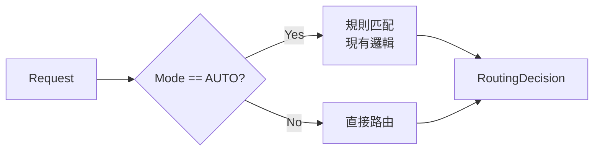
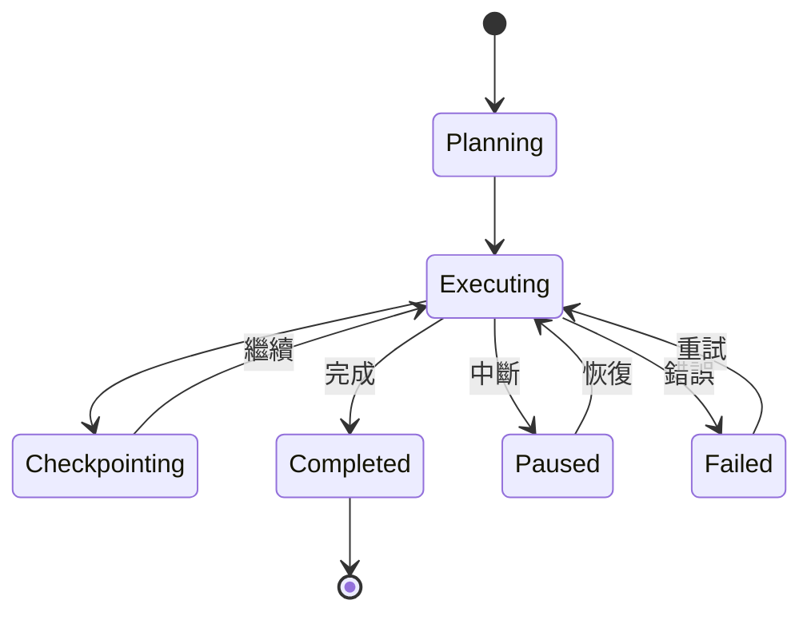
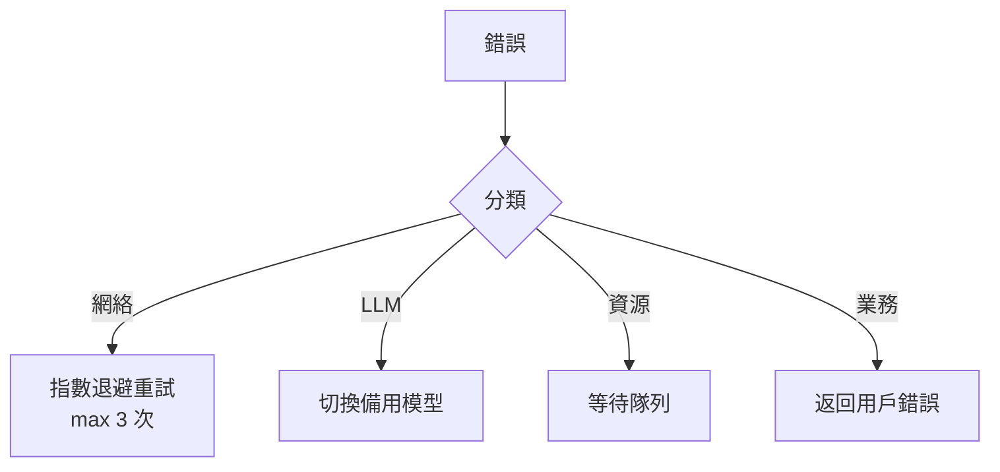
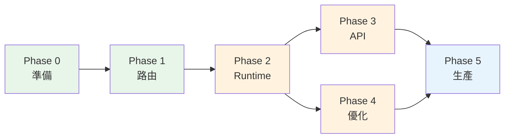

# OpenCode Platform - 重構工作分解結構 (WBS)

**版本**: `v1.0`
**日期**: `2026-02-11`
**基準文件**:
- `Architecture_Diagrams_Mermaid.md` (目標架構全貌)
- `Architecture_Diagrams_Adjusted.md` (認知增強調整版)
- `Architecture_Minimal_Adjustment.md` (最小化調整方案)

**原則**: 漸進演進、向後兼容、零中斷

---

## 0. 總覽：現狀 vs 目標

### 現狀差距分析

| 維度 | 現狀 | 目標 | 差距 |
|------|------|------|------|
| **入口** | CLI (`main.py`) + API 存根 | CLI + 完整 REST API + SSE | API 層需完整實現 |
| **路由** | `RefactoredEngine._select_mode()` 簡單規則匹配 | Router + ComplexityAnalyzer + RuntimeDispatcher | 缺少路由組件 |
| **執行** | 單一 `ProcessorFactory` + 6 個 Processor | Model Runtime + Agent Runtime 雙軌 | 缺少 Runtime 分離 |
| **狀態** | `ProcessingContext` 無狀態單次 | Model Runtime 無狀態 + Agent Runtime 有狀態持久化 | 缺少工作流狀態機 |
| **服務** | 多數服務為 mock/placeholder | 完整服務實現 + 基礎設施共享層 | 服務實現不完整 |
| **監控** | `structlog` 基礎日誌 | 認知層級監控 + 性能指標 + 告警 | 缺少指標體系 |
| **配置** | `.env` 環境變數 | 配置中心 + 特性開關 | 缺少特性開關機制 |

### WBS 總體結構

```mermaid
graph TB
    WBS[重構 WBS] --> P0[Phase 0<br/>準備與標記]
    WBS --> P1[Phase 1<br/>路由層建設]
    WBS --> P2[Phase 2<br/>Runtime 分離]
    WBS --> P3[Phase 3<br/>API 層完整實現]
    WBS --> P4[Phase 4<br/>管線優化與監控]
    WBS --> P5[Phase 5<br/>生產就緒]

    P0 --> P0_1[0.1 代碼盤點]
    P0 --> P0_2[0.2 認知標記]
    P0 --> P0_3[0.3 配置開關]
    P0 --> P0_4[0.4 測試基礎]

    P1 --> P1_1[1.1 Router 組件]
    P1 --> P1_2[1.2 ComplexityAnalyzer]
    P1 --> P1_3[1.3 RuntimeDispatcher]

    P2 --> P2_1[2.1 Runtime 抽象]
    P2 --> P2_2[2.2 ModelRuntime]
    P2 --> P2_3[2.3 AgentRuntime]
    P2 --> P2_4[2.4 引擎重構]

    P3 --> P3_1[3.1 API 路由完整化]
    P3 --> P3_2[3.2 SSE 串流]
    P3 --> P3_3[3.3 認證授權]

    P4 --> P4_1[4.1 響應緩存]
    P4 --> P4_2[4.2 認知監控]
    P4 --> P4_3[4.3 錯誤處理增強]

    P5 --> P5_1[5.1 性能優化]
    P5 --> P5_2[5.2 部署完善]
    P5 --> P5_3[5.3 文檔更新]
```



---

## Phase 0: 準備與標記（零風險）

> **目標**：不改變任何運行邏輯，只添加標記、配置骨架和測試基礎。
> **風險等級**：極低
> **預估工期**：3-5 天

### 0.1 代碼盤點與清理

| ID | 任務 | 說明 | 涉及檔案 | 依賴 |
|----|------|------|----------|------|
| 0.1.1 | 清理廢棄代碼 | 移除 `service_old.py` 等已標記棄用的檔案 | `services/knowledge/service_old.py` | 無 |
| 0.1.2 | 統一 import 路徑 | 確認所有模組使用一致的 import 方式，消除 `sys.path.insert` hack | `main.py`, 全局 | 無 |
| 0.1.3 | 盤點 Processor 清單 | 確認實際使用的 Processor（發現 `KnowledgeGraphProcessor`, `RewritingProcessor` 未在 `ProcessorFactory` 註冊） | `src/core/processor.py` | 無 |
| 0.1.4 | 盤點服務實現狀態 | 標記每個 service 的實現程度（完整 / mock / placeholder） | `src/services/*/service.py` | 無 |

**驗收標準**：
- 產出一份 `docs/CODE_AUDIT_REPORT.md`，列出所有組件的實際狀態
- 零功能變更，所有現有測試通過

### 0.2 認知層級標記

| ID | 任務 | 說明 | 涉及檔案 | 依賴 |
|----|------|------|----------|------|
| 0.2.1 | 為 `ProcessorFactory` 添加認知映射 | 在工廠類中新增 `COGNITIVE_MAPPING` 字典，將現有 mode 映射到 `system1/system2/agent` | `src/core/processor.py` | 0.1.3 |
| 0.2.2 | 為 `BaseProcessor` 添加 `_cognitive_level` 屬性 | 在基類 `__init__` 中初始化為 `None`，由工廠設置 | `src/core/processor.py` | 0.2.1 |
| 0.2.3 | 為 `ProcessingMode` 添加認知層級方法 | 在 enum 中新增 `@property cognitive_level` | `src/core/models.py` | 無 |

**映射規則**：
```
System 1 (快速響應)：CHAT, KNOWLEDGE
System 2 (深度思考)：THINKING, CODE, SEARCH
Agent   (工作流)  ：DEEP_RESEARCH
```

**驗收標準**：
- 標記為純數據屬性，不影響任何運行邏輯
- `processor._cognitive_level` 在處理器創建時自動設置

### 0.3 配置開關骨架

| ID | 任務 | 說明 | 涉及檔案 | 依賴 |
|----|------|------|----------|------|
| 0.3.1 | 創建 `config/cognitive_features.yaml` | 所有開關默認 `false`，僅定義結構 | `config/cognitive_features.yaml` (新建) | 無 |
| 0.3.2 | 創建 `src/core/feature_flags.py` | 讀取 YAML 配置的輕量級模組，提供 `is_enabled(feature_name) -> bool` | `src/core/feature_flags.py` (新建) | 0.3.1 |
| 0.3.3 | 在 `RefactoredEngine.__init__` 中載入特性開關 | 初始化時讀取配置，但不改變任何邏輯分支 | `src/core/engine.py` | 0.3.2 |

**配置結構**：
```yaml
cognitive_features:
  enabled: false
  system1:
    enable_cache: false
    cache_ttl: 300
  system2:
    enable_thinking_chain: false
    max_thinking_time: 30
  routing:
    smart_routing: false
    complexity_analysis: false
  metrics:
    cognitive_metrics: false
```

**驗收標準**：
- 所有開關 `false` 時，系統行為與重構前完全一致
- `feature_flags.py` 有完整的類型提示和默認值

### 0.4 測試基礎建設

| ID | 任務 | 說明 | 涉及檔案 | 依賴 |
|----|------|------|----------|------|
| 0.4.1 | 建立測試框架結構 | 創建 `tests/unit/`, `tests/integration/` 目錄和 `conftest.py` | `tests/` 目錄 | 無 |
| 0.4.2 | 為 `ProcessorFactory` 寫單元測試 | 測試所有 mode 的處理器獲取和認知標記 | `tests/unit/test_processor_factory.py` | 0.2.1 |
| 0.4.3 | 為 `RefactoredEngine` 寫煙霧測試 | 使用 mock LLM client 測試基本流程 | `tests/unit/test_engine.py` | 無 |
| 0.4.4 | 為特性開關寫單元測試 | 測試配置讀取、默認值、開關切換 | `tests/unit/test_feature_flags.py` | 0.3.2 |

**驗收標準**：
- `pytest tests/unit/` 全通過
- 覆蓋 `ProcessorFactory`, `RefactoredEngine`, `feature_flags` 核心邏輯

---

## Phase 1: 路由層建設（低風險）

> **目標**：將 `RefactoredEngine` 中的路由邏輯抽離為獨立的 Router 組件。
> **風險等級**：低（純重構，行為不變）
> **預估工期**：5-7 天
> **前置條件**：Phase 0 完成

### 1.1 Router 組件

| ID | 任務 | 說明 | 涉及檔案 | 依賴 |
|----|------|------|----------|------|
| 1.1.1 | 定義 `RouterProtocol` | 在 `protocols.py` 中定義 Router 的抽象接口：`route(request) -> RoutingDecision` | `src/core/protocols.py` | P0 |
| 1.1.2 | 定義 `RoutingDecision` 模型 | 包含 `mode`, `cognitive_level`, `estimated_complexity`, `selected_runtime` | `src/core/models.py` | 1.1.1 |
| 1.1.3 | 實現 `DefaultRouter` | 將 `engine._select_mode()` 的邏輯遷移至獨立類，保持行為一致 | `src/core/router.py` (新建) | 1.1.2 |
| 1.1.4 | 重構 `RefactoredEngine` 使用 Router | `engine.process()` 中使用 `router.route(request)` 替代內聯邏輯 | `src/core/engine.py` | 1.1.3 |
| 1.1.5 | Router 單元測試 | 測試所有路由場景，確保與原行為一致 | `tests/unit/test_router.py` | 1.1.3 |

**Router 決策流程**：


**驗收標準**：
- `engine._select_mode()` 已刪除，邏輯完全遷移至 `Router`
- 所有現有測試通過
- Router 可獨立測試

### 1.2 ComplexityAnalyzer（可選組件）

| ID | 任務 | 說明 | 涉及檔案 | 依賴 |
|----|------|------|----------|------|
| 1.2.1 | 定義 `ComplexityScore` 模型 | 包含 `score: float`, `factors: dict`, `recommended_level: str` | `src/core/models.py` | 1.1.2 |
| 1.2.2 | 實現 `ComplexityAnalyzer` | 基於規則的複雜度分析（查詢長度、是否多步驟、是否需要工具） | `src/core/router.py` | 1.2.1 |
| 1.2.3 | 在 Router 中集成 ComplexityAnalyzer | 受特性開關 `routing.complexity_analysis` 控制 | `src/core/router.py` | 1.2.2, 0.3.2 |
| 1.2.4 | ComplexityAnalyzer 單元測試 | 覆蓋簡單/中等/複雜查詢場景 | `tests/unit/test_complexity.py` | 1.2.2 |

**複雜度評分規則**（初版）：
```
Score < 0.3  → System 1 (快速通道)
Score 0.3-0.7 → System 2 (深度思考)
Score > 0.7  → Agent (工作流)
```

**驗收標準**：
- 特性開關關閉時，ComplexityAnalyzer 不被調用
- 開啟後，不改變最終結果，僅在 `RoutingDecision` 中附加複雜度信息

### 1.3 RuntimeDispatcher

| ID | 任務 | 說明 | 涉及檔案 | 依賴 |
|----|------|------|----------|------|
| 1.3.1 | 定義 `RuntimeType` 枚舉 | `MODEL_RUNTIME`, `AGENT_RUNTIME` | `src/core/models.py` | 1.1.2 |
| 1.3.2 | 在 `RoutingDecision` 中加入 `runtime_type` | Router 決策結果包含建議的 Runtime | `src/core/models.py` | 1.3.1 |
| 1.3.3 | 實現 RuntimeDispatcher 邏輯 | 在 Router 中根據 `cognitive_level` 決定 `RuntimeType`（Phase 2 前僅標記，不分流） | `src/core/router.py` | 1.3.2 |

**驗收標準**：
- `RoutingDecision` 包含 `runtime_type` 字段
- Phase 2 前，所有請求仍走同一處理路徑（dispatcher 僅標記不分流）

---

## Phase 2: Runtime 分離（中風險）

> **目標**：將單一的 ProcessorFactory 拆分為 ModelRuntime 和 AgentRuntime 雙軌。
> **風險等級**：中（核心架構變更，但通過特性開關控制）
> **預估工期**：10-14 天
> **前置條件**：Phase 1 完成

### 2.1 Runtime 抽象層

| ID | 任務 | 說明 | 涉及檔案 | 依賴 |
|----|------|------|----------|------|
| 2.1.1 | 定義 `RuntimeProtocol` | 抽象接口：`execute(context) -> str`, `supports(mode) -> bool` | `src/core/protocols.py` | P1 |
| 2.1.2 | 定義 `ExecutionResult` 模型 | 統一執行結果：`result`, `tokens`, `duration`, `metadata` | `src/core/models.py` | 2.1.1 |
| 2.1.3 | 創建 `src/core/runtime/` 包結構 | `__init__.py`, `base.py`, `model_runtime.py`, `agent_runtime.py` | `src/core/runtime/` (新建) | 2.1.1 |

### 2.2 ModelRuntime 實現

| ID | 任務 | 說明 | 涉及檔案 | 依賴 |
|----|------|------|----------|------|
| 2.2.1 | 實現 `ModelRuntime` 基類 | 包裝現有 `ProcessorFactory` 的 System 1 + System 2 處理器 | `src/core/runtime/model_runtime.py` | 2.1.3 |
| 2.2.2 | 遷移 System 1 處理器 | `ChatProcessor`, `KnowledgeProcessor` 歸入 ModelRuntime | `src/core/runtime/model_runtime.py` | 2.2.1 |
| 2.2.3 | 遷移 System 2 處理器 | `ThinkingProcessor`, `CodeProcessor`, `SearchProcessor` 歸入 ModelRuntime | `src/core/runtime/model_runtime.py` | 2.2.1 |
| 2.2.4 | 添加 SystemController | 管理 ModelRuntime 內的工具調用權限和資源限制 | `src/core/runtime/model_runtime.py` | 2.2.1 |
| 2.2.5 | ModelRuntime 整合測試 | 確保通過 ModelRuntime 調用的結果與直接調用 Processor 一致 | `tests/integration/test_model_runtime.py` | 2.2.3 |

**ModelRuntime 職責**：
- 無狀態執行
- 工具調用受系統控制（< 30 秒）
- 無/簡單重試策略
- 嚴格資源限制

### 2.3 AgentRuntime 實現

| ID | 任務 | 說明 | 涉及檔案 | 依賴 |
|----|------|------|----------|------|
| 2.3.1 | 定義 `WorkflowState` 模型 | 工作流狀態：`steps`, `current_step`, `checkpoints`, `status` | `src/core/models.py` | 2.1.2 |
| 2.3.2 | 實現 `AgentRuntime` 基類 | 支持有狀態執行、Checkpoint、中斷/恢復 | `src/core/runtime/agent_runtime.py` | 2.1.3, 2.3.1 |
| 2.3.3 | 實現 `WorkflowOrchestrator` | 多步驟工作流的規劃、執行、狀態管理 | `src/core/runtime/workflow.py` (新建) | 2.3.2 |
| 2.3.4 | 遷移 `DeepResearchProcessor` 到 AgentRuntime | 將其重構為 `ResearchAgent`，使用 WorkflowOrchestrator | `src/core/runtime/agent_runtime.py` | 2.3.3 |
| 2.3.5 | AgentRuntime 整合測試 | 測試工作流執行、Checkpoint、恢復 | `tests/integration/test_agent_runtime.py` | 2.3.4 |

**AgentRuntime 職責**：
- 有狀態持久化（WorkflowState）
- 工具調用由工作流決定（可超過分鐘）
- 智能重試策略
- 可中斷/恢復
- 彈性資源配額

**AgentRuntime 狀態機**：


### 2.4 引擎重構

| ID | 任務 | 說明 | 涉及檔案 | 依賴 |
|----|------|------|----------|------|
| 2.4.1 | 重構 `RefactoredEngine.process()` | 根據 `RoutingDecision.runtime_type` 分派到 ModelRuntime 或 AgentRuntime | `src/core/engine.py` | 2.2.5, 2.3.5 |
| 2.4.2 | 添加 Runtime 選擇的特性開關 | 開關關閉時走原路徑（全部 ModelRuntime），開啟後啟用雙軌 | `src/core/engine.py` | 0.3.2 |
| 2.4.3 | 保持 `ProcessorFactory` 向後兼容 | 外部直接使用 `ProcessorFactory` 的調用不受影響 | `src/core/processor.py` | 2.4.1 |
| 2.4.4 | 端到端回歸測試 | 所有 6 種 mode 的 CLI 端到端測試 | `tests/e2e/test_all_modes.py` | 2.4.1 |

**驗收標準**：
- 特性開關 `false`：行為與重構前完全一致
- 特性開關 `true`：System 1/2 走 ModelRuntime，DEEP_RESEARCH 走 AgentRuntime
- `main.py` CLI 無需修改

---

## Phase 3: API 層完整實現（中風險）

> **目標**：將 API 存根升級為完整的 RESTful API，支持 SSE 串流。
> **風險等級**：中（新增功能，不影響 CLI）
> **預估工期**：7-10 天
> **前置條件**：Phase 2 完成

### 3.1 API 路由完整化

| ID | 任務 | 說明 | 涉及檔案 | 依賴 |
|----|------|------|----------|------|
| 3.1.1 | 重構 `create_app()` | 將路由從閉包拆分為獨立的 router 模組 | `src/api/routes.py` | P2 |
| 3.1.2 | 實現 `POST /api/v1/chat` | 同步聊天端點，支持所有 ProcessingMode | `src/api/routes.py` | 3.1.1 |
| 3.1.3 | 實現 `POST /api/v1/chat/stream` | SSE 串流端點（見 3.2） | `src/api/routes.py` | 3.2.1 |
| 3.1.4 | 實現 `POST /api/v1/documents/upload` | 文檔上傳與異步索引 | `src/api/routes.py` | 3.1.1 |
| 3.1.5 | 實現 `GET /api/v1/documents/status/{task_id}` | 文檔處理狀態查詢 | `src/api/routes.py` | 3.1.4 |
| 3.1.6 | 實現 `POST /api/v1/search` | 語義搜尋端點 | `src/api/routes.py` | 3.1.1 |
| 3.1.7 | 實現 `POST /api/v1/sandbox/execute` | 代碼沙箱執行端點 | `src/api/routes.py` | 3.1.1 |
| 3.1.8 | 統一錯誤響應格式 | 實現 `error_code`, `message`, `trace_id` 格式 | `src/api/middleware.py` | 3.1.1 |
| 3.1.9 | API 整合測試 | 使用 `httpx.AsyncClient` 測試所有端點 | `tests/integration/test_api.py` | 3.1.7 |

### 3.2 SSE 串流實現

| ID | 任務 | 說明 | 涉及檔案 | 依賴 |
|----|------|------|----------|------|
| 3.2.1 | 實現 SSE 串流管道 | 使用 `sse-starlette` 實現 EventSourceResponse | `src/api/streaming.py` (新建) | 3.1.1 |
| 3.2.2 | 重構 `engine.process_stream()` | 將現有的收集-then-yield 改為真正的異步生成器 | `src/core/engine.py` | 3.2.1 |
| 3.2.3 | 定義 SSE 事件協議 | `start`, `token`, `tool_call`, `source`, `progress`, `error`, `end` | `src/core/models.py` | 3.2.1 |
| 3.2.4 | SSE 串流測試 | 模擬串流客戶端驗證事件序列 | `tests/integration/test_sse.py` | 3.2.2 |

**SSE 事件格式**：
```
data: {"type": "start", "context_id": "..."}
data: {"type": "progress", "step": "knowledge-retrieval", "status": "start"}
data: {"type": "token", "content": "..."}
data: {"type": "end", "usage": {...}, "execution_time": ...}
```

### 3.3 認證授權

| ID | 任務 | 說明 | 涉及檔案 | 依賴 |
|----|------|------|----------|------|
| 3.3.1 | 實現 JWT 認證中間件 | 使用 `python-jose` 驗證 Bearer token | `src/api/middleware.py` | 3.1.1 |
| 3.3.2 | 實現 `/api/v1/auth/token` 端點 | JWT token 發放 | `src/api/routes.py` | 3.3.1 |
| 3.3.3 | 為需要認證的端點添加 `Depends` | 除 `/health` 和 `/` 外的端點都需要認證 | `src/api/routes.py` | 3.3.1 |
| 3.3.4 | 認證測試 | 測試有效/無效/過期 token | `tests/unit/test_auth.py` | 3.3.1 |

---

## Phase 4: 管線優化與監控（低風險）

> **目標**：啟用認知增強特性，建立監控體系。
> **風險等級**：低（所有優化通過特性開關控制）
> **預估工期**：7-10 天
> **前置條件**：Phase 2 完成（Phase 3 可並行）

### 4.1 響應緩存（System 1 優化）

| ID | 任務 | 說明 | 涉及檔案 | 依賴 |
|----|------|------|----------|------|
| 4.1.1 | 實現 `ResponseCache` | 基於 query hash 的內存緩存，支持 TTL | `src/core/cache.py` (新建) | P2 |
| 4.1.2 | 在 ModelRuntime 中集成緩存 | System 1 處理器檢查緩存命中 | `src/core/runtime/model_runtime.py` | 4.1.1 |
| 4.1.3 | 配置開關集成 | 受 `system1.enable_cache` 控制 | `src/core/runtime/model_runtime.py` | 0.3.2 |
| 4.1.4 | 緩存命中率指標 | 記錄命中/未中統計 | `src/core/cache.py` | 4.1.2 |
| 4.1.5 | 緩存測試 | 測試命中、過期、清理 | `tests/unit/test_cache.py` | 4.1.1 |

**預期效果**：
- System 1 請求（約 70%）緩存命中率 40-60%
- 命中時響應時間 < 0.5 秒

### 4.2 認知監控指標

| ID | 任務 | 說明 | 涉及檔案 | 依賴 |
|----|------|------|----------|------|
| 4.2.1 | 實現 `CognitiveMetrics` 類 | 按認知層級記錄請求量、延遲、成功率 | `src/core/metrics.py` (新建) | 0.2.1 |
| 4.2.2 | 在 Engine 中集成指標收集 | 每次請求完成後記錄指標 | `src/core/engine.py` | 4.2.1 |
| 4.2.3 | 新增 `/api/v1/metrics` 端點 | 暴露 Prometheus 格式的指標（可選） | `src/api/routes.py` | 4.2.1 |
| 4.2.4 | 配置開關集成 | 受 `metrics.cognitive_metrics` 控制 | `src/core/metrics.py` | 0.3.2 |

**指標清單**：
```
opencode_requests_total{cognitive_level="system1|system2|agent", mode="..."}
opencode_request_duration_seconds{cognitive_level="...", mode="..."}
opencode_cache_hits_total
opencode_cache_misses_total
opencode_tokens_used_total{model="..."}
opencode_errors_total{cognitive_level="...", error_type="..."}
```

### 4.3 錯誤處理增強

| ID | 任務 | 說明 | 涉及檔案 | 依賴 |
|----|------|------|----------|------|
| 4.3.1 | 實現錯誤分類器 | 網絡錯誤 / LLM 錯誤 / 資源限制 / 業務錯誤 | `src/core/errors.py` (新建) | P2 |
| 4.3.2 | 實現 LLM Fallback 機制 | Primary 模型失敗時切換到備用模型 | `src/services/llm/openai_client.py` | 4.3.1 |
| 4.3.3 | 實現指數退避重試 | 網絡錯誤的 `2^n` 秒重試（最多 3 次） | `src/core/errors.py` | 4.3.1 |
| 4.3.4 | AgentRuntime 智能重試 | 工作流步驟級別的重試和恢復 | `src/core/runtime/agent_runtime.py` | 4.3.1, 2.3.2 |
| 4.3.5 | 錯誤處理測試 | 模擬各類錯誤場景 | `tests/unit/test_error_handling.py` | 4.3.3 |

**錯誤處理策略**：


---

## Phase 5: 生產就緒（低風險）

> **目標**：性能調優、部署完善、文檔更新。
> **風險等級**：低
> **預估工期**：5-7 天
> **前置條件**：Phase 3, Phase 4 完成

### 5.1 性能優化

| ID | 任務 | 說明 | 涉及檔案 | 依賴 |
|----|------|------|----------|------|
| 5.1.1 | 服務連接池化 | LLM 客戶端、Qdrant 客戶端使用連接池 | `src/services/` | P4 |
| 5.1.2 | 異步併發優化 | 搜索任務並行執行（`asyncio.gather`） | `src/core/processor.py` | P4 |
| 5.1.3 | Prompt 長度優化 | 減少不必要的 prompt 內容，降低 token 消耗 | `src/core/prompts.py` | P4 |
| 5.1.4 | 性能基準測試 | 建立各模式的延遲基準線 | `tests/performance/` | 5.1.2 |

### 5.2 部署完善

| ID | 任務 | 說明 | 涉及檔案 | 依賴 |
|----|------|------|----------|------|
| 5.2.1 | 更新 `docker-compose.yml` | 新增配置卷掛載、健康檢查、資源限制 | `docker-compose.yml` | P3 |
| 5.2.2 | 更新 Backend Dockerfile | 多階段構建、生產優化 | `docker/backend/Dockerfile` | 5.2.1 |
| 5.2.3 | 建立 CI 配置 | GitHub Actions: lint + test + build | `.github/workflows/ci.yml` (新建) | 5.2.1 |
| 5.2.4 | 環境變數文檔更新 | 更新 `.env.example` 包含所有新增的配置項 | `.env.example` | 5.2.1 |

### 5.3 文檔更新

| ID | 任務 | 說明 | 涉及檔案 | 依賴 |
|----|------|------|----------|------|
| 5.3.1 | 更新架構文檔 | 反映 Runtime 分離後的實際架構 | `Architecture_Refactoring_Toolkit/` | P5 |
| 5.3.2 | API 文檔自動生成 | 確保 FastAPI OpenAPI 文檔完整 | `src/api/routes.py` (docstring) | 3.1.9 |
| 5.3.3 | 運維手冊 | 配置說明、監控指南、故障排除 | `docs/OPERATIONS_GUIDE.md` (新建) | 5.2.3 |

---

## 依賴關係總覽



**關鍵路徑**：P0 → P1 → P2 → P3 → P5

**可並行**：
- Phase 3 (API) 和 Phase 4 (優化) 可在 Phase 2 完成後並行推進
- Phase 0 的四個工作包 (0.1-0.4) 大部分可並行

---

## 風險登記簿

| ID | 風險描述 | 影響 | 機率 | 緩解策略 |
|----|----------|------|------|----------|
| R1 | Runtime 分離破壞現有處理邏輯 | 高 | 中 | 特性開關 + 完整回歸測試 |
| R2 | API 層變更影響前端集成 | 中 | 低 | 新端點使用 `/v1/` 前綴，舊端點保留 |
| R3 | AgentRuntime 狀態管理複雜度超預期 | 中 | 中 | 先實現最小版本（僅 DeepResearch），逐步擴展 |
| R4 | 性能回退 | 中 | 低 | 每階段做性能基準測試對比 |
| R5 | 認知路由分析準確度不足 | 低 | 中 | 初期僅用於監控標記，不影響實際路由 |

---

## 里程碑檢查點

| 里程碑 | Phase | 驗收標準 | 回滾方案 |
|--------|-------|----------|----------|
| **M0: 基礎就緒** | P0 完成 | 認知標記已添加、配置骨架就位、核心單元測試通過 | 直接刪除新增檔案 |
| **M1: 路由獨立** | P1 完成 | Router 組件獨立運行、引擎使用 Router、所有 mode 行為不變 | 回退 `engine.py` 至 P0 版本 |
| **M2: 雙軌運行** | P2 完成 | ModelRuntime + AgentRuntime 通過特性開關控制、CLI 端到端通過 | 關閉特性開關回退至單軌 |
| **M3: API 完整** | P3 完成 | 所有 API 端點可用、SSE 串流正常、認證生效 | API 層獨立於核心，可單獨回退 |
| **M4: 優化上線** | P4 完成 | 緩存命中率 > 30%、認知指標可觀測、錯誤處理覆蓋所有場景 | 通過配置開關關閉所有優化特性 |
| **M5: 生產就緒** | P5 完成 | 性能基準達標、Docker 部署正常、文檔完整 | - |

---

## 附錄 A：新增檔案清單

```
src/core/
├── router.py              # Phase 1: Router + ComplexityAnalyzer
├── feature_flags.py       # Phase 0: 特性開關
├── cache.py               # Phase 4: 響應緩存
├── metrics.py             # Phase 4: 認知監控指標
├── errors.py              # Phase 4: 錯誤分類與處理
└── runtime/               # Phase 2: Runtime 層
    ├── __init__.py
    ├── base.py            # RuntimeProtocol 實現
    ├── model_runtime.py   # ModelRuntime
    ├── agent_runtime.py   # AgentRuntime
    └── workflow.py        # WorkflowOrchestrator

src/api/
└── streaming.py           # Phase 3: SSE 串流管道

config/
└── cognitive_features.yaml # Phase 0: 特性開關配置

tests/
├── unit/
│   ├── test_processor_factory.py
│   ├── test_engine.py
│   ├── test_router.py
│   ├── test_complexity.py
│   ├── test_feature_flags.py
│   ├── test_cache.py
│   ├── test_auth.py
│   └── test_error_handling.py
├── integration/
│   ├── test_model_runtime.py
│   ├── test_agent_runtime.py
│   ├── test_api.py
│   └── test_sse.py
├── e2e/
│   └── test_all_modes.py
└── performance/
    └── test_benchmarks.py
```

## 附錄 B：修改檔案清單

```
src/core/engine.py          # P1: 使用 Router; P2: Runtime 分派
src/core/processor.py       # P0: 認知標記; P2: 處理器遷移
src/core/models.py          # P0: 認知屬性; P1: RoutingDecision; P2: WorkflowState
src/core/protocols.py       # P1: RouterProtocol; P2: RuntimeProtocol
src/api/routes.py           # P3: 完整 API 實現
src/api/middleware.py        # P3: 認證中間件、錯誤格式
src/services/llm/openai_client.py  # P4: Fallback 機制
docker-compose.yml          # P5: 部署更新
.env.example                # P5: 新增配置項
```
