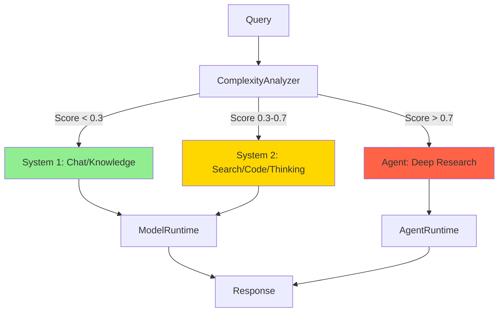
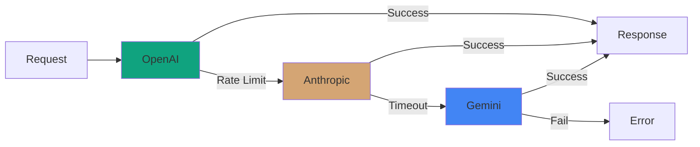

# Images Directory

This directory contains visual assets for QuitCode Platform documentation.

## 📸 Required Images

### Logo

- **logo.png** (200x200px)
  - Main project logo
  - Used in README header
  - Format: PNG with transparent background
  - Style: Clean, modern, represents AI/cognition

**Placeholder:**
```
┌─────────────────┐
│                 │
│   QuitCode      │
│   Platform      │
│                 │
│   [AI Brain]    │
│                 │
└─────────────────┘
```

---

### Screenshots

#### 1. CLI Interactive Mode (`cli-demo.png`)

**What to capture:**
- Terminal showing interactive chat
- Auto mode routing in action
- System 1 vs System 2 classification
- Response time indicators

**Recommended size:** 800x600px

**Placeholder:**
```
$ python main.py

🚀 QuitCode Platform - Interactive Mode
Mode: auto (Router will select optimal processing level)

[auto]> What is machine learning?
🔄 Analyzing complexity... → System 1 (chat)
⚡ Response from cache (12ms)
💬 Machine learning is a branch of AI...

[auto]> Compare deep learning and traditional ML
🔄 Analyzing complexity... → System 2 (thinking)
🧠 Deep analysis mode (2.3s)
📊 Deep learning:
   - Advantages: ...
   - Disadvantages: ...
```

---

#### 2. API Documentation (`api-docs.png`)

**What to capture:**
- http://localhost:8000/docs (FastAPI Swagger UI)
- Show all endpoints expanded
- Example request/response

**Recommended size:** 1200x800px

**Placeholder:**
```
┌──────────────────────────────────────┐
│ QuitCode Platform API                │
├──────────────────────────────────────┤
│ POST /api/v1/chat                    │
│ POST /api/v1/chat/stream             │
│ POST /api/v1/search                  │
│ POST /api/v1/sandbox/execute         │
│ GET  /api/v1/metrics                 │
└──────────────────────────────────────┘
```

---

#### 3. Cognitive Routing Visualization (`routing-diagram.png`)

**What to show:**
- Query flow through router
- Complexity analysis
- Runtime selection
- Visual representation of System 1/2/Agent

**Recommended size:** 1000x600px

**Placeholder (Mermaid):**


---

#### 4. Multi-Provider Fallback (`fallback-diagram.png`)

**What to show:**
- Fallback chain visualization
- Error handling flow
- Provider availability

**Recommended size:** 800x400px

**Placeholder (Mermaid):**


---

### Demo GIFs

#### 1. Quick Start Demo (`quickstart-demo.gif`)

**Content:**
1. Clone repository
2. Setup virtual environment
3. Install dependencies
4. Run CLI
5. Execute a few queries
6. Show auto routing

**Duration:** 30-60 seconds
**Size:** Max 10MB

**Tools to create:**
- [Asciinema](https://asciinema.org/) (for terminal recordings)
- [termtosvg](https://github.com/nbedos/termtosvg)
- [ttygif](https://github.com/icholy/ttygif)

---

#### 2. API Usage Demo (`api-demo.gif`)

**Content:**
1. Start API server
2. Open `/docs`
3. Try out endpoint
4. Show streaming response

**Duration:** 30 seconds
**Size:** Max 10MB

---

## 🎨 Design Guidelines

### Color Palette

- **Primary**: `#4A90E2` (Blue - Technology)
- **System 1**: `#90EE90` (Light Green - Fast)
- **System 2**: `#FFD700` (Gold - Analytical)
- **Agent**: `#FF6347` (Tomato - Autonomous)
- **Background**: `#F8F9FA` (Light Gray)
- **Text**: `#212529` (Dark Gray)

### Logo Design Ideas

1. **Brain Icon**: Representing cognition
2. **Network Nodes**: Showing connections
3. **Layered Architecture**: 3 tiers visible
4. **Lightning + Gear**: Fast + Analytical
5. **Abstract AI Symbol**: Modern, minimalist

### Typography

- **Headers**: Sans-serif, bold
- **Body**: Sans-serif, regular
- **Code**: Monospace

---

## 📝 How to Contribute Images

### 1. Create the Image

Follow the specifications above for each image type.

### 2. Optimize for Web

```bash
# PNG optimization
pngquant --quality=65-80 input.png --output output.png

# GIF optimization
gifsicle -O3 input.gif -o output.gif

# Convert to WebP (optional)
cwebp -q 80 input.png -o output.webp
```

### 3. Submit

1. Place images in this directory
2. Update README.md references
3. Create pull request

**PR Checklist:**
- [ ] Image meets size requirements
- [ ] Image is optimized for web
- [ ] Image follows design guidelines
- [ ] README.md updated with image reference

---

## 📂 Current Files

```
docs/images/
├── README.md           # This file
└── (empty - awaiting contributions)
```

**Planned:**
```
docs/images/
├── README.md
├── logo.png            # 200x200px, transparent
├── cli-demo.png        # 800x600px
├── api-docs.png        # 1200x800px
├── routing-diagram.png # 1000x600px
├── fallback-diagram.png# 800x400px
├── quickstart-demo.gif # <10MB
└── api-demo.gif        # <10MB
```

---

## 🤝 Need Help?

- 📧 Email: design@quitcode.ai
- 💬 [GitHub Discussions](https://github.com/Zenobia000/openagent_backend/discussions)
- 🎨 Design assets needed? We can provide templates!

---

**Last Updated:** 2026-02-14
